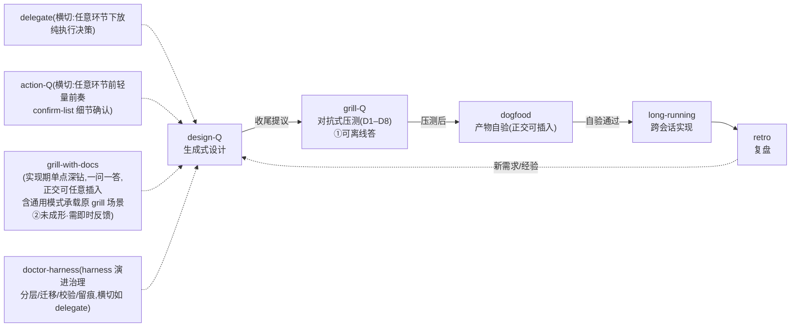

# CLAUDE.md

This file provides guidance to Claude Code (claude.ai/code) when working with code in this repository.

## 仓库定位

`info-driven-ai-se-harness-engineering` 是一套面向**个人开发者**的 **AI native 开发方法论 + 可直接运行的 Claude Code skill 执行体**。不是可构建的代码项目——**没有 build / test / lint 工具链**。仓库内容全部是 Markdown 文档 + skill 配置 + 一个 Python 脱敏脚本。

两大支柱(相乘,缺一为零,完整立论见 [methodology_v5.md](docs/methodology/methodology_v5.md)):
1. **以信息为核心** —— 信息流转;瓶颈在有效上下文的质与量 + 对抗 AI 在信息真空中的幻觉式自作主张决策。
2. **驾驭工程 = AI × 软件工程** —— AI 是加速器,工程纪律是骨架(v4 补机制层:「无护栏 → AI 产出悄悄劣化」)。

## 规范优先级

文档冲突时按此裁决(**唯一权威处**,不复制到其他文件;冲突必显式说明,不静默选择):

> **方法论主张(方法论 + 哲学文件,canonical)> ADR > CONTEXT 术语 > skill 规格(SKILL.md + DESIGN.md 同层)> 实操文件**

协调注:ADR 中的术语定义以 CONTEXT 为准——ADR 记决策(含历史措辞),CONTEXT 记活术语。

## 关键文档导航

- 方法论三块(ADR-0007):[methodology_v5.md](docs/methodology/methodology_v5.md)(怎么做,canonical)+ [philosophy_v7.md](docs/methodology/philosophy_v7.md)(为什么,canonical;v7 连续章节、历史编号兼容与双文件交叉治理)+ [practical_v1.md](docs/methodology/practical_v1.md)(怎么用,非 canonical 轻量修订);[methodology_v3/v2](docs/methodology/archive/) 与 [philosophy_v4/v5/v6](docs/methodology/archive/) 为历史母本。
- [docs/CONTEXT.md](docs/CONTEXT.md) —— 纯术语表(双支柱 / 第一支柱术语分层 / 术语治理 / **项目学科地图 + AI 黑盒(v7 第四学科视角锚点)** / Grill 家族 / skill 家族)。
- [docs/OPEN-DECISIONS.md](docs/OPEN-DECISIONS.md) —— 待决事项 + 重访触发。改"已决"事项前先查这里与 `harness/adr/`。
- [harness/adr/](harness/adr/) —— ADR-0001 source of truth / 0002 License / 0003 发布形态 / 0007 三块拆分 / 0008–0010 v4 落地 / 0011 硬编码 harness / 0012–0013 doctor-harness 分层 / **0014 学科挂接分层策略 / 0015 去黑盒第四学科视角独立锚点(v5)**。
- [harness/design/](harness/design/) 与 [harness/questionnaires/](harness/questionnaires/) —— **AI 流程产物**(设计文档套 / 归档问卷),与项目文件 docs/ 物理分离(三区模型)。
- 工具命令(两条):① 脱敏检查 `python3 scripts/desensitize.py .`(发布前 DoD 要求 0 命中;映射表本地 gitignored;push 前三道门 = 脚本 0 命中 + 语义人审 + 脱敏报告,见 [OD-1](docs/OPEN-DECISIONS.md);**不要在 .md 中复述映射表里的真实名**);② skill 双侧同步检查 `python3 scripts/skills-sync-check.py`(改任一侧 skill 后提交前跑,0 违规才提交;check-only 不选边,见铁律 8)。

## 双 License(编辑前必须知道分区)

| 区域 | License | 文件 |
|---|---|---|
| 方法论文字 | **CC-BY 4.0** | [docs/methodology/](docs/methodology/)、[docs/LICENSE](docs/LICENSE) |
| skill 配置 / 代码 | **MIT** | [skills/](skills/)、[scripts/](scripts/)、根 [LICENSE](LICENSE) |

改文章走署名转载语义;改 skill / 脚本是 MIT 自由复用。分区不要混(ADR-0002)。

## skill 家族协作

8 个 skill 构成 **5 环节闭环 + 横切**(衔接协议详见方法论 [§4.3](docs/methodology/methodology_v5.md#43-两族-grill) 与各 SKILL.md「主流程」末尾;v5 连续化前的旧编号 §5.3 已映射至 §4.3):

**落盘路径速查**(产物均落**宿主项目** `项目根/harness/`,硬编码不配置化——方案 R 已于 2026-08-07 放弃、回归硬编码,见 [ADR-0011](harness/adr/0011-abandon-plan-r-hardcode-harness.md)):

| skill | 产物落点 |
|---|---|
| action-Q | 确认结果 → 问卷归档 `harness/questionnaires/archive/`(只移不删);ADR 三条件 → `harness/adr/`;单向门/重大风险 → `docs/OPEN-DECISIONS.md`;术语冲突 → `CONTEXT.md` |
| design-Q | VISION / `harness/design/` HLD·LLD / `harness/adr/` / `docs/OPEN-DECISIONS.md` / `CONTEXT.md`;问卷 `harness/questionnaires/<stage>-w<NN>.md` → 归档 `archive/` |
| grill-Q | 发现 → `CONTEXT`/`adr`/`OPEN-DECISIONS`;**工件修订建议只进处理报告,绝不替改工件** |
| retro-Q | `docs/retro/<主题>_vN.md` + `TODO.md`;问卷 `harness/questionnaires/retro-<主题>-w<NN>.md` |
| long-running | `.claude/feature_list.json`(passes 只能端到端测试通过才 true)+ `.claude/claude-progress.txt`(写顶部) |
| delegate | `<项目根>/delegation.md`(白名单·禁区·开关)+ `delegation-log.md`(追加式,只增不改) |
| doctor-harness | 组织 harness/ 区(分层/迁移/校验/留痕)+ **治理历史载体维护**(CHANGELOG/FORK-NOTES/STATUS-LOG 布局与增量记录,ADR-0024);规则权威 `skills/doctor-harness/HARNESS-RULES.md`(第九节 = 治理历史布局);校验 `scripts/harness-check.py` |

两族分流判据锚 = **认知状态三态**(① 知道·可离线 → 批量;② 未成形·需即时反馈 → 单点;③ 不知道自己不知道 → 对抗维度逼出),详见 [CONTEXT](docs/CONTEXT.md)「Grill 家族」节(2026-08-19,复压 grill-boundary-canonical-w01 Q8)。

**引擎副本漂移(OD-8,编辑 skill 时必读)**:`QUESTIONNAIRE-FORMAT.md` / `PROCESSING-RULES.md` 在 design-Q / grill-Q / retro-Q / **action-Q** 各持一份副本(已漂移)——改一方考量**四方**,在对应 `DESIGN.md` 声明漂移关系;**禁止擅自统一 / 抽取共享文件**(已决项)。

## 编辑本仓库的铁律

这些是方法论自身反复强调、违反即产出劣化的纪律:

1. **AI 不替人决策** —— 出题 / 验证 / 落盘是 agent 的角色;选择永远是人做的。改 skill 或文档时同理,遇到决策点问人,不自行拍板。
2. **即时沉淀,不批处理** —— 处理完即刻写文件,不攒到末尾。
3. **原始信息不丢失** —— 已用问卷 `archive/`(只移不删);废弃文件归 `waste/` 不直接删除。
4. **先验证再写** —— 引用进文档 / 问卷的事实(尤其"代码 vs 文档"矛盾、外部依赖能否真正跑通)必须核实原文,不凭转述。
5. **文件版本命名** —— `_v1` / `_v2` 递增,禁 `final` / `new` / `copy`。
6. **不一致的设计文档比没有更危险** —— 实现与文档脱节时先更新文档。
7. **流程图统一用 mermaid**(2026-08-14 用户裁决)—— 全仓库流程 / 架构 / 协作关系图一律 mermaid 代码块,禁 ASCII 字符画图(Git 可 diff、渲染器直出);存量 ASCII 图随所在文件下次修订时替换,skills/ 双副本文件随同步窗口统一处理。
8. **skill 双侧同步**(2026-08-19 机制化;**2026-08-20 ADR-0024 语义升级:双侧常态性形态分工**)—— **规则本体**(SKILL.md/引擎文件/FORK-NOTES.md)双侧逐字节一致;**历史层**(CHANGELOG.md,治理历史)仅项目侧存在;**全局侧私有类**(DOGFOOD-LOG.md)仅全局侧存在。改 `skills/` 或 `~/.claude/skills/` 任一侧后,提交前跑 `python3 scripts/skills-sync-check.py`(0 违规才提交;类规则 HISTORY_LAYER/GLOBAL_ONLY + 裁决例外白名单内置脚本,新增例外须改代码注明出处);脚本 check-only 只报漂移不选边,哪侧为准是语义判断、永远由人定。全局侧无版本控制(非 git)——**删除全局侧文件前必跑 diff 前置检查**(双侧一致才可删,不一致先抢救)。布局权威 = [HARNESS-RULES.md 第九节](skills/doctor-harness/HARNESS-RULES.md)。

## 仓库状态

**当前(2026-08-20)**:方法论双 canonical(methodology_v5 + philosophy_v7)+ 8 skill 体系稳定;**governance-history-split 治理历史分离迁移执行中**([ADR-0024](harness/adr/0024-governance-history-split-dual-form.md):F039 协议 / F040 skill 域 / F041 design 域全绿,P4 全局侧重整待执行)。
**历史时间线**:内部工作状态见 [harness/STATUS-LOG.md](harness/STATUS-LOG.md);对外可感知变更见 [CHANGELOG.md](CHANGELOG.md)。
**下一步主线**:见 [TODO.md](TODO.md)。
