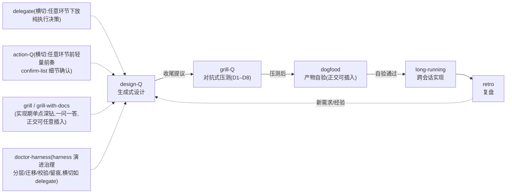

# CLAUDE.md

This file provides guidance to Claude Code (claude.ai/code) when working with code in this repository.

## 仓库定位

`info-driven-ai-se-harness-engineering` 是一套面向**个人开发者**的 **AI native 开发方法论 + 可直接运行的 Claude Code skill 执行体**。不是可构建的代码项目——**没有 build / test / lint 工具链**。仓库内容全部是 Markdown 文档 + skill 配置 + 一个 Python 脱敏脚本。

两大支柱(相乘,缺一为零,完整立论见 [methodology_v5.md](docs/methodology/methodology_v5.md)):
1. **以信息为核心** —— 信息流转;瓶颈在有效上下文的质与量 + 对抗 AI 在信息真空中的幻觉式自作主张决策。
2. **驾驭工程 = AI × 软件工程** —— AI 是加速器,工程纪律是骨架(v4 补机制层:「无护栏 → AI 产出悄悄劣化」)。

## 规范优先级

文档冲突时按此裁决(**唯一权威处**,不复制到其他文件;冲突必显式说明,不静默选择):

> **方法论主张(方法论 + 哲学文件,canonical)> ADR > CONTEXT 术语 > skill 规格(SKILL.md + DESIGN.md 同层)> 实操文件**

协调注:ADR 中的术语定义以 CONTEXT 为准——ADR 记决策(含历史措辞),CONTEXT 记活术语。

## 关键文档导航

- 方法论三块(ADR-0007):[methodology_v5.md](docs/methodology/methodology_v5.md)(怎么做,canonical)+ [philosophy_v7.md](docs/methodology/philosophy_v7.md)(为什么,canonical;v7 连续章节、历史编号兼容与双文件交叉治理)+ [practical_v1.md](docs/methodology/practical_v1.md)(怎么用,非 canonical 轻量修订);[methodology_v3/v2](docs/methodology/archive/) 与 [philosophy_v4/v5/v6](docs/methodology/archive/) 为历史母本。
- [docs/CONTEXT.md](docs/CONTEXT.md) —— 纯术语表(双支柱 / 第一支柱术语分层 / 术语治理 / **项目学科地图 + AI 黑盒(v7 第四学科视角锚点)** / Grill 家族 / skill 家族)。
- [docs/OPEN-DECISIONS.md](docs/OPEN-DECISIONS.md) —— 待决事项 + 重访触发。改"已决"事项前先查这里与 `harness/adr/`。
- [harness/adr/](harness/adr/) —— ADR-0001 source of truth / 0002 License / 0003 发布形态 / 0007 三块拆分 / 0008–0010 v4 落地 / 0011 硬编码 harness / 0012–0013 doctor-harness 分层 / **0014 学科挂接分层策略 / 0015 去黑盒第四学科视角独立锚点(v5)**。
- [harness/design/](harness/design/) 与 [harness/questionnaires/](harness/questionnaires/) —— **AI 流程产物**(设计文档套 / 归档问卷),与项目文件 docs/ 物理分离(三区模型)。
- 工具命令(两条):① 脱敏检查 `python3 scripts/desensitize.py .`(发布前 DoD 要求 0 命中;映射表本地 gitignored;push 前三道门 = 脚本 0 命中 + 语义人审 + 脱敏报告,见 [OD-1](docs/OPEN-DECISIONS.md);**不要在 .md 中复述映射表里的真实名**);② skill 双侧同步检查 `python3 scripts/skills-sync-check.py`(改任一侧 skill 后提交前跑,0 违规才提交;check-only 不选边,见铁律 8)。

## 双 License(编辑前必须知道分区)

| 区域 | License | 文件 |
|---|---|---|
| 方法论文字 | **CC-BY 4.0** | [docs/methodology/](docs/methodology/)、[docs/LICENSE](docs/LICENSE) |
| skill 配置 / 代码 | **MIT** | [skills/](skills/)、[scripts/](scripts/)、根 [LICENSE](LICENSE) |

改文章走署名转载语义;改 skill / 脚本是 MIT 自由复用。分区不要混(ADR-0002)。

## skill 家族协作

9 个 skill 构成 **5 环节闭环 + 横切**(衔接协议详见方法论 [§4.3](docs/methodology/methodology_v5.md#43-两族-grill) 与各 SKILL.md「主流程」末尾;v5 连续化前的旧编号 §5.3 已映射至 §4.3):

**落盘路径速查**(产物均落**宿主项目** `项目根/harness/`,硬编码不配置化——方案 R 已于 2026-08-07 放弃、回归硬编码,见 [ADR-0011](harness/adr/0011-abandon-plan-r-hardcode-harness.md)):

| skill | 产物落点 |
|---|---|
| action-Q | 确认结果 → 问卷归档 `harness/questionnaires/archive/`(只移不删);ADR 三条件 → `harness/adr/`;单向门/重大风险 → `docs/OPEN-DECISIONS.md`;术语冲突 → `CONTEXT.md` |
| design-Q | VISION / `harness/design/` HLD·LLD / `harness/adr/` / `docs/OPEN-DECISIONS.md` / `CONTEXT.md`;问卷 `harness/questionnaires/<stage>-w<NN>.md` → 归档 `archive/` |
| grill-Q | 发现 → `CONTEXT`/`adr`/`OPEN-DECISIONS`;**工件修订建议只进处理报告,绝不替改工件** |
| retro-Q | `docs/retro/<主题>_vN.md` + `TODO.md`;问卷 `harness/questionnaires/retro-<主题>-w<NN>.md` |
| long-running | `.claude/feature_list.json`(passes 只能端到端测试通过才 true)+ `.claude/claude-progress.txt`(写顶部) |
| delegate | `<项目根>/delegation.md`(白名单·禁区·开关)+ `delegation-log.md`(追加式,只增不改) |
| doctor-harness | 组织 harness/ 区(分层/迁移/校验/留痕);规则权威 `skills/doctor-harness/HARNESS-RULES.md`;校验 `scripts/harness-check.py` |

**引擎副本漂移(OD-8,编辑 skill 时必读)**:`QUESTIONNAIRE-FORMAT.md` / `PROCESSING-RULES.md` 在 design-Q / grill-Q / retro-Q / **action-Q** 各持一份副本(已漂移)——改一方考量**四方**,在对应 `DESIGN.md` 声明漂移关系;**禁止擅自统一 / 抽取共享文件**(已决项)。

## 编辑本仓库的铁律

这些是方法论自身反复强调、违反即产出劣化的纪律:

1. **AI 不替人决策** —— 出题 / 验证 / 落盘是 agent 的角色;选择永远是人做的。改 skill 或文档时同理,遇到决策点问人,不自行拍板。
2. **即时沉淀,不批处理** —— 处理完即刻写文件,不攒到末尾。
3. **原始信息不丢失** —— 已用问卷 `archive/`(只移不删);废弃文件归 `waste/` 不直接删除。
4. **先验证再写** —— 引用进文档 / 问卷的事实(尤其"代码 vs 文档"矛盾、外部依赖能否真正跑通)必须核实原文,不凭转述。
5. **文件版本命名** —— `_v1` / `_v2` 递增,禁 `final` / `new` / `copy`。
6. **不一致的设计文档比没有更危险** —— 实现与文档脱节时先更新文档。
7. **流程图统一用 mermaid**(2026-08-14 用户裁决)—— 全仓库流程 / 架构 / 协作关系图一律 mermaid 代码块,禁 ASCII 字符画图(Git 可 diff、渲染器直出);存量 ASCII 图随所在文件下次修订时替换,skills/ 双副本文件随同步窗口统一处理。
8. **skill 双侧同步**(2026-08-19 机制化,confirm-skills-sync-mechanism-w00 全确认)—— 改 `skills/` 或 `~/.claude/skills/` 任一侧后,提交前跑 `python3 scripts/skills-sync-check.py`(0 违规才提交);脚本 check-only 只报漂移不选边,哪侧为准是语义判断、永远由人定;裁决例外白名单内置脚本(doctor-harness/CHANGELOG.md,新增例外须改代码注明出处)。

## 仓库状态

**2026-08-05:repo 级设计完成,落地执行中**——design-Q 三阶段 + grill-Q 压测 12 项回灌(设计套 [harness/design/repo/](harness/design/repo/));方法论 + 哲学升 **v4**(受众收窄个人 / 第二支柱机制层对称化 / 哲学三学科化(人因/软工/运筹));harness 区物理分离(docs/design/ + docs/questionnaires/ 迁入);术语治理(8 术语全保留 + 新词三条件门槛)。落地执行 P1–P4 完成(P1 迁移 / P2 术语 / P3 v4 / P4 入口),**P5(P5 ADR-0008/0009/0010)与 P6(发布门 + dogfood)待执行**,见 [TODO.md](TODO.md)。

**2026-08-07:design-Q skill 规格整理(skill-spec-revamp)→ 撤销方案 R**:骨架增强(HLD/LLD 判别法则 + 反简化最小必含 + 坍缩分档,仅 design-Q)**保留并回灌**;落盘路径配置化(方案 R)**已放弃**([ADR-0011](harness/adr/0011-abandon-plan-r-hardcode-harness.md)),**回归硬编码 `项目根/harness/`**(design/ + questionnaires/ + adr/);两套 skill(skills/ 与 `~/.claude/skills/`)已重建一致(仅脱敏差),设计套 [harness/design/skill-spec-revamp/](harness/design/skill-spec-revamp/)。

**2026-08-08:doctor-for-harness 完成(第 9 个 skill)+ harness 治理落地**:分层规则权威化([HARNESS-RULES.md](skills/doctor-harness/HARNESS-RULES.md),ADR-0012/0013)+ 校验脚本 [scripts/harness-check.py](scripts/harness-check.py)(命名/ADR 编号/归档位置三检查);设计套压测 10 题全认定 + 7 项工件修订执行;格式反馈落地(单波次上限 10 / 小波阈值 3 四副本统一);**归档子目录化**(41 份按 feature/主题迁入 10 子目录 + [archive/README.md](harness/questionnaires/archive/README.md) 索引);MIGRATION-FLOW 迁移流程沉淀。

**2026-08-11:philosophy_v4 → v5 立论重构完成(安全科学第四学科视角 + 去 AI 黑盒锚点)**——经完整 write→review→implement 闭环:grill-Q philosophy-v4(W01/W02,18 处修订)→ discipline-mapping([ADR-0014](harness/adr/0014-discipline-mapping-strategy.md) 学科挂接分层)→ grill-with-docs(去黑盒 6 点结晶,落 [CONTEXT AI 黑盒节](docs/CONTEXT.md) + [OD-19](docs/OPEN-DECISIONS.md))→ design-Q philosophy-v5([VISION/HLD/LLD](harness/design/philosophy-v5/) + [ADR-0015](harness/adr/0015-deblackbox-anchor.md))→ 设计套压测(10 项修订)→ long-running 起草(P1-P5,commit 530d0f4);v4 归 archive,v5 后由 v6 接替 current canonical。新增 [OD-18](docs/OPEN-DECISIONS.md)(学科挂接回顾)/ [OD-19](docs/OPEN-DECISIONS.md)(形式化 V&V 缺口);v5 §八「去 AI 黑盒」(三层次 + 正交第一支柱 + 三风险 + 统合对策 + 弹性边界)。

**2026-08-13:philosophy_v6 升级完成(结构过渡 + 方法论治理闭环 + 学科治理路线图)**——在 v5 基础上新增全文阅读路线与章节过渡;§8.6 明确为「方法论自身的治理闭环」,加入主张状态模板与「学科 → 治理机制 → 最小产物 → 进入条件」映射;v5 归 archive,v6 随后曾为 current canonical,现由 v7 接替。治理深度仍遵守最小治理切片边界,完整 Level 1/2/3 由 [OD-20](docs/OPEN-DECISIONS.md) 管理。

**2026-08-14:philosophy_v7 升级完成(连续章节 + 双文件交叉治理)**——在 v6 基础上建立哲学独立阅读入口,将正文统一为 §一至§五并保留旧编号兼容映射;补 harness 术语边界、current 已知缺口状态、前三学科最小进入/退出模板与代理指标反思边界;哲学 + 方法论成为 canonical 对等双文件,由 [ADR-0017](harness/adr/0017-philosophy-section-compatibility.md) / [ADR-0018](harness/adr/0018-canonical-dual-challenge-governance.md) 记录治理契约。v6 归 archive,v7 为 current canonical。

**2026-08-14:methodology_v5 升级完成(章节连续化 + 契约优先 + action-Q 入族)**——grill-Q methodology-improvement W01 压测(10 题,压测对象 = 哲学 v7 + 方法论 v4 + design-Q 规格,参照 同级对标仓库 治理)产出:① 正文连续编号 §零至§九(v4 映射表在文件顶部,ADR-0017 兼容策略复用)+ 全库引用审查;② §4.3 两族表补 action-Q(修 W02 Q3 漏改)+ CLAUDE.md 协作图补节点;③ §5.3 补「时序纪律」(契约层变更先更新 canonical 设计再动工,ADR-0021 通用化);CONTEXT 补规范导航(含设计套「契约优先」裁决)与「暂定」状态词、ADR-0020 补生态位卡载体裁定、新增 OD-24(全局实验/项目 backup/DOGFOOD 实测双副本策略)。**同轮立项**:design-Q 数字层级改造(Q3-A,第 0/1/2…层动态层级)、dogfood 最优先 + 定义消歧(Q7-A,冻结新机制新增)、方法论 704 行审计优先(Q4-B)——见 [TODO.md](TODO.md)。v4 归 archive。

**2026-08-13:grill-Q philosophy-v5 成稿压测 W01 闭环 + 发布门推送**——压测 10 题(Q1 用户裁决更名「第五→第四学科视角」:全仓同步 + ADR-0015/0014 更名注记;Q2–Q10 全 C:§八 修订 9 处——嵌套黑盒 / 黑盒被制衡 / retro 抽查代理指标 / WAD 跨主体限定 / 信任劫持循环 / 装置补 retro+long-running / ADR 链接 / WAI-WAD 全称 / 致灾语境映射),全部执行并验证(脱敏 0 / harness-check 0);OD-1 三道过后推送(7853792..f93cc8b,2 commits);F026 OD-4 母本同步用户仓库外执行销项;feature_list 校正(F002/F004/F005 补 passes)。**剩 dogfood(F006 唯一剩余)**。

**2026-08-19:skill 双侧同步机制化**——2026-08-18 双侧同步(9 skill 双向合并,commit 4fece7c)暴露「项目内修、全局漏修」空隙(8/14 修订落全局漏项目、8/8 归档断链修复落项目漏全局),机制化收口:新增 [scripts/skills-sync-check.py](scripts/skills-sync-check.py)(check-only 不选边、裁决例外白名单、EXIT 码供例行)+ CLAUDE.md 铁律第 8 条 + 工具命令节扩为两条(提交前例行,暂不入发布门强制清单);问卷 [confirm-skills-sync-mechanism-w00.md](harness/questionnaires/archive/_misc/confirm-skills-sync-mechanism-w00.md)(14/14 全确认)。

历史:2026-07-29 methodology_v3 完成(ADR-0004/5/6);2026-08-01 action-Q 入库(第 8 个 skill)+ 首次推送;2026-08-04 三块拆分(ADR-0007);2026-08-05 repo 级设计 + v4 + harness 迁移;2026-08-08 doctor-harness 完成(第 9 个 skill);2026-08-11 philosophy_v5(安全科学第四视角);2026-08-13 philosophy_v6(治理进化);2026-08-14 philosophy_v7(连续章节与双文件交叉治理)。

下一步主线([TODO.md](TODO.md)):**dogfood(用户验收,F006 唯一剩余)**;三文件层级化治理(宪法→基本法→地方法,方法论 704 行臃肿审计 + 实操升版)单独立项;CONTRIBUTING + issue 模板(OD-3);git author 身份决策;术语全面审计(B 方案)。
