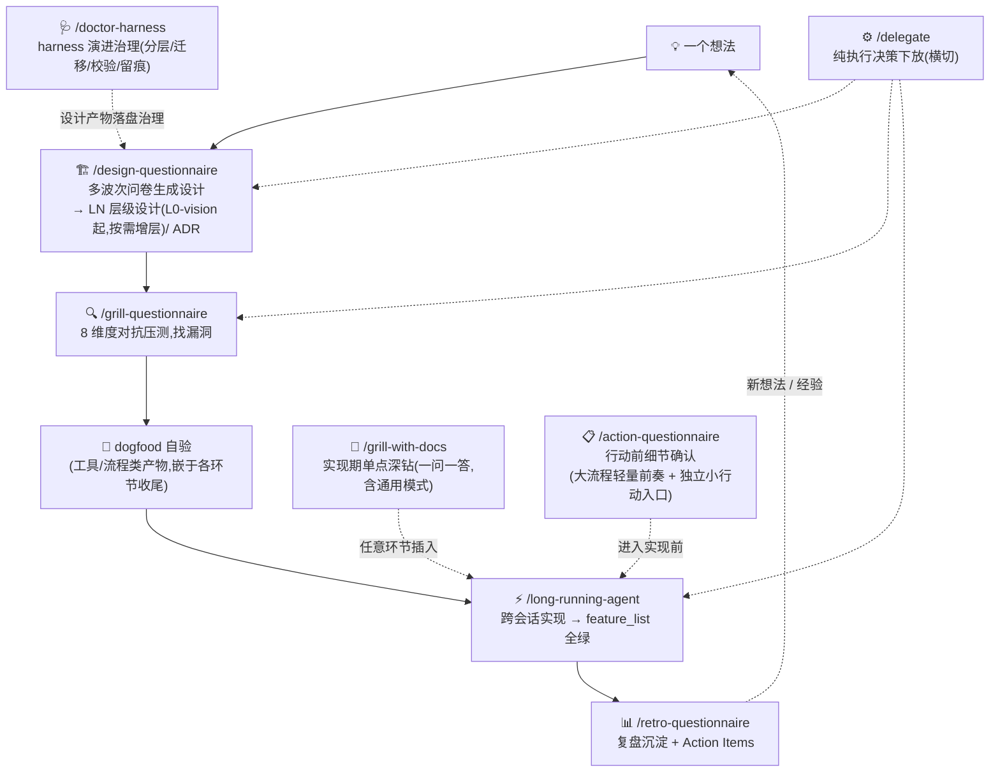

# info-driven-ai-se-harness-engineering

> **以信息为核心 × 驾驭工程(AI + 软件工程)** —— 个人 AI native 开发方法论 + 可直接运行的 skill 执行体。

> ⚠️ **experimental · 个人维护 · 不保证响应**。这是一套个人开发经验的整理分享,不是官方框架。方法论与 skill 都在迭代中。欢迎 issue,但响应不保证。

%20+%20MIT%20(skills%2Fscripts)-lightgrey)  

## 目录

- [这是什么](#这是什么)
- [为什么是这个(差异化)](#为什么是这个差异化)
- [快速上手:skill 使用流程](#快速上手skill-使用流程)
- [8 个核心 skill](#8-个核心-skill)
- [工具边界(请先读)](#工具边界请先读)
- [仓库结构(三区模型)](#仓库结构三区模型)
- [License](#license)
- [更新日志](#更新日志)
- [备注](#备注)

## 这是什么

一套面向 **个人开发者** 的 AI native 开发方法论,以及把它落地为可执行流程的 **Claude Code skill 家族**。

两大支柱(相乘,缺一为零):

1. **以信息为核心** —— 与 AI 协作的本质是信息流转;瓶颈在有效上下文的质与量,以及对抗 AI 在信息真空中的幻觉式自作主张决策。整个工作流围绕信息管理设计:精准投喂、及时沉淀、绝不丢失。
2. **驾驭工程 = AI × 软件工程** —— AI 是加速器,软件工程纪律(设计先行、TDD、Code Review、ADR、复盘)是骨架。AI 让纪律更便宜,纪律让 AI 更可靠。

## 为什么是这个(差异化)

同类内容多是「只有文章」或「只有框架」:

- **只有文章**:讲得清道理,但没有可直接运行的执行体——知其然,不知怎么跑;
- **只有框架**:跑得起来,但不告诉你为什么这样设计——能跑,但不知边界在哪。
- **外部参照**:Anthropic 最新《[AI-Native SDLC Playbook](https://claude.com/blog/the-ai-native-sdlc-playbook)》与本方法论在「人写意图、AI 跑中间、机器可验证、全程留痕」上同构(行业级双向收敛),但面向团队、串行面试式、默认多放权——本方法论面向个人、批量问卷式、默认少放权且放的可审计。

本仓库是 **方法论 + 可直接运行的 skill 执行体** 一体化——文章讲为什么,skill 让你能直接跑。(此差异化定位待市场验证,见 [OD-6](docs/OPEN-DECISIONS.md)。)

## 快速上手:skill 使用流程

安装:把 `skills/<skill-name>/` 拷入(或软链)`~/.claude/skills/`(用户级,所有项目可用)或项目内 `.claude/skills/`,即可在 Claude Code 中以 `/skill-name` 或自然语言触发:



**主路径 = 5 环节闭环**:design-Q → grill-Q → dogfood → long-running → retro-Q;grill-with-docs / delegate / action-Q / doctor-harness 为横切,可任意环节插入。

衔接协议:design-Q 收尾主动提议 grill-Q 压测;grill-Q 收尾提议 long-running 进入实现;grill-with-docs(含通用模式)与 delegate 在任意环节可插入;action-Q 为轻量前奏——design-Q 收尾的设计进入实现前、grill-Q / retro-Q 处理的行动项落地前,可先对齐动作细节。各环节产物与触发时机详见方法论文件 [§三](docs/methodology/methodology_v5.md)、实操文件 [§8.3](docs/methodology/practical_v1.md)。

**更新**:软链安装 → `git pull` 即自动跟进;拷贝安装 → 重新拷贝覆盖(本地有定制先 diff 再覆盖)。`skills/` 是否变更、何时需要重拷,看 [CHANGELOG.md](CHANGELOG.md)。

### 最小采用切片

新项目从 0 跑通第一个闭环只需 3 个文件起步——① 本 README(双支柱与主路径)② [practical_v1.md §8.3](docs/methodology/practical_v1.md)(skill 使用时机表)③ `skills/`(拷入 `~/.claude/skills/` 即用)。方法论 / 哲学 / 实操三件套按需深读,不是采用前置;本仓库的治理体系(ADR / OD / 归档问卷 / CONTEXT)是方法论的生产车间,采用者无需复制。

## 8 个核心 skill

8 个 skill 构成 5 环节闭环 + 横切(见上方协作图)。每张卡片:定位 / 触发 / 产物 / 核心维度或机制。

### /action-questionnaire —— 非正式行动前的细节确认(确认式问卷,轻量前奏)

- **触发**:「对齐一下」「确认细节」「preflight」;多文件写操作 / 涉外部依赖的行动前
- **产物**:确认结果归档 `harness/questionnaires/archive/`;满足三条件升 ADR;单向门 / 重大风险 → OPEN-DECISIONS;术语冲突 → CONTEXT
- **核心维度**:隐式骨架六要素(目标 / 输入 / 输出 / 约束 / 边界 / 依赖)+ 环境现实核实

### /design-questionnaire —— 一个念头 → 层层设计(生成式设计)

- **触发**:「帮我做设计」「初始化项目设计」「新功能设计」
- **产物**:LN 层级设计文件(L0-vision 目标层恒在,L1+ 按需增层;旧 VISION/HLD/LLD 为别名兼容)+ ADR + OPEN-DECISIONS + CONTEXT
- **核心维度**:分层骨架(L0-vision 恒在 + L1+/L2 按需)+ 环境现实验证 + 未验证假设台账

### /grill-questionnaire —— 压测已有工件,8 维度对抗找漏洞

- **触发**:「压测」「审一下」「找漏洞」;压测计划 / ADR / 设计草稿
- **产物**:发现 → 处理报告(工件修订须人授权,不替改);可沉淀的决策 / 风险 / 术语 → ADR / OPEN-DECISIONS / CONTEXT
- **核心维度**:固定压测 8 维——D1 未言明假设 / D2 单向门 / D3 替代方案 / D4 失败模式 / D5 盲点 / D6 可验证性 / D7 与现实矛盾 / D8 术语一致性

### /grill-with-docs —— 实现期单点二义性深钻(一问一答)

- **触发**:实现期单点深钻:「这个技术选型合理吗?」、绑代码库的设计评审、计划评审(逐点即时)
- **产物**:绑库模式 → CONTEXT / ADR / OPEN-DECISIONS 更新;通用模式(承载原 grill 场景)→ 零留痕纯对话
- **核心维度**:无固定骨架(纯追问);绑库模式叠加领域词汇表挑战 / 代码交叉核验,通用模式零留痕

### /retro-questionnaire —— 阶段 / 项目复盘沉淀

- **触发**:「复盘这个阶段」「做个 retro」;DoD 核验通过后主动提议
- **产物**:`docs/retro/<主题>_vN.md` 复盘文档 + TODO.md 行动项
- **核心维度**:方法论四节(进展顺利 / 出问题与原因假设 / 架构偏离 / 学到什么)+ Action Items

### /long-running-agent —— 跨会话长项目约束系统

- **触发**:多会话 / 长周期项目、跨上下文窗口的工作;design-Q 收尾衔接实现期
- **产物**:`.claude/feature_list.json`(功能跟踪)+ `.claude/claude-progress.txt`(跨会话进度)
- **核心机制**:feature_list 跟踪(端到端测试通过才 `passes:true`)+ 进度文件对抗会话失忆 + git 整洁状态

### /delegate —— 纯执行决策下放治理(试点)

- **触发**:「下放」「委托决策」;纯执行类决策密集时
- **产物**:项目根 `delegation.md`(白名单 / 禁区 / 开关)+ `delegation-log.md`(追加式留痕)
- **核心机制**:白名单 + 禁区清单 + 单条目收回条件 + 逐例留痕;判断性决策永不下放

### /doctor-harness —— harness 演进治理(分层 / 迁移 / 校验 / 留痕)

- **触发**:「这个文件放哪」、harness 布局 / 迁移 / 校验、LN 制旧档迁移
- **产物**:harness/ 区组织 + [HARNESS-RULES.md](skills/doctor-harness/HARNESS-RULES.md)(规则权威)+ [harness-check.py](scripts/harness-check.py) 校验
- **核心机制**:分层规则权威化 + 迁移工具 / 流程 + 布局合规校验 + 演进留痕

### 各 skill 提问 / 确认维度速查

维度 = 各 skill 向你提问 / 确认的角度;名称与权威定义见 CONTEXT。

> **权威 = [CONTEXT「提问维度速查」](docs/CONTEXT.md),此处为导览,漂移以 CONTEXT 为准。**

| skill | 核心维度 | 骨架出处 |
|---|---|---|
| design-questionnaire | 分层骨架(L0-vision 目标层恒在 + L1+/L2 按需)+ 环境现实验证 + 未验证假设台账 | [STAGE-SKELETONS.md](skills/design-questionnaire/STAGE-SKELETONS.md) |
| grill-questionnaire | 固定压测 8 维 D1–D8(未言明假设/单向门/替代方案/失败模式/盲点/可验证性/与现实矛盾/术语一致性) | [GRILL-SKELETON.md](skills/grill-questionnaire/GRILL-SKELETON.md) |
| action-questionnaire | 隐式骨架六要素(目标/输入/输出/约束/边界/依赖)+ 环境现实核实 | 各 SKILL.md「提取与核实」节 |
| retro-questionnaire | 方法论四节(进展顺利/出问题与原因假设/架构偏离/学到什么)+ Action Items | [RETRO-SKELETONS.md](skills/retro-questionnaire/RETRO-SKELETONS.md) |
| grill-with-docs | 无固定骨架(纯追问,单点深钻);绑库模式叠加领域词汇表挑战 / 代码交叉核验,通用模式零留痕纯对话 | [SKILL.md](skills/grill-with-docs/SKILL.md) |
| long-running / delegate / doctor-harness | 非提问类(约束系统 / 下放治理 / harness 治理) | 各 SKILL.md |

## 工具边界(请先读)

- **方法论理念**(双支柱 / 5 环节闭环 / Grill 决策法)工具无关,**可迁移**到任意 AI 编程工作流。
- **skill 直接运行依赖 Claude Code** 的三项机制:`AskUserQuestion`(批量问卷提问 / 逃生舱)、`subagent`(并行核实,仅 design-Q / grill-Q 使用,其余 skill 不需要)、`SKILL.md` 加载。迁移到其他工具(Cursor / Cline 等)需适配这三项(详见 [docs/OPEN-DECISIONS.md](docs/OPEN-DECISIONS.md) OD-2)。
- 本方法论**在 Claude Code 上实践验证**;其他工具的适配尚未实测,欢迎反馈。

## 仓库结构(三区模型)

```
docs/methodology/    方法论文章(CC-BY 4.0)——methodology_v5 + philosophy_v7 为 current
docs/CONTEXT.md      术语表 / harness/adr/ 架构决策记录 / docs/OPEN-DECISIONS.md 待决事项
harness/design/      AI 流程产物:设计文档套(按 feature/主题子目录:repo/ doctor-harness/ skill-spec-revamp/ 等)
harness/questionnaires/ 已用问卷归档区(archive/ 按 feature/主题子目录 + README 索引)
skills/              8 个核心方法论 skill(MIT)
scripts/             脱敏检查 / harness 校验等工具
CHANGELOG.md         仓库级对外变更记录(原 README「发布说明」节,2026-08-20 外移)
```

分区规则:**内容 = 项目文件(docs/);决策记录与流程产物(ADR / 设计文档 / 问卷)= harness 文件;执行体与工具(skills/ scripts/)= 根级产物**。入口文件(CLAUDE.md / AGENTS.md / README)因工具约定留在仓库根,只做路由。

## License

- `docs/`(方法论文字): **CC-BY 4.0**(署名转载,见 [docs/LICENSE](docs/LICENSE))
- `skills/` `scripts/`(配置 / 代码): **MIT**(见 [LICENSE](LICENSE))

## 更新日志

仓库级对外变更记录见 [CHANGELOG.md](CHANGELOG.md)。

## 备注

- 本仓库是这套方法论与 skill 的**唯一规范源**。作者另有早期开发副本(未脱敏),以本仓库为准(ADR-0001)。
- 方法论完整阐述拆为三块([ADR-0007](harness/adr/0007-methodology-three-way-split.md)):[methodology_v5.md](docs/methodology/methodology_v5.md)(方法论 · 怎么做,自包含)/ [philosophy_v7.md](docs/methodology/philosophy_v7.md)(哲学 · 为什么,v7 连续章节与双文件治理)/ [practical_v1.md](docs/methodology/practical_v1.md)(实操 · 怎么用,非 canonical 轻量修订);methodology_v5 + philosophy_v7 为 current,[methodology_v4](docs/methodology/archive/methodology_v4.md) / [methodology_v3](docs/methodology/archive/methodology_v3.md) / [v2](docs/methodology/archive/methodology_v2.md) / [philosophy_v4](docs/methodology/archive/philosophy_v4.md) / [philosophy_v5](docs/methodology/archive/philosophy_v5.md) / [philosophy_v6](docs/methodology/archive/philosophy_v6.md) 保留作历史版本。
