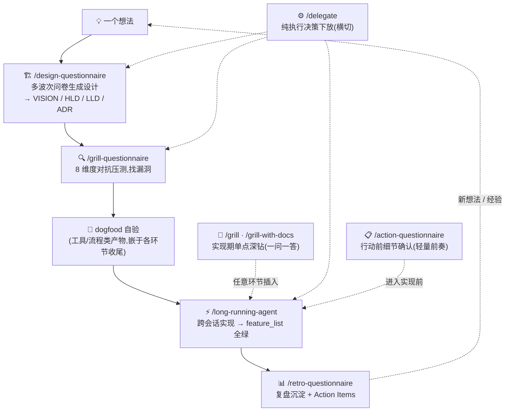

# info-driven-ai-se-harness-engineering

> **以信息为核心 × 驾驭工程(AI + 软件工程)** —— 个人 AI native 开发方法论 + 可直接运行的 skill 执行体。

> ⚠️ **experimental · 个人维护 · 不保证响应**。这是一套个人开发经验的整理分享,不是官方框架。方法论与 skill 都在迭代中。欢迎 issue,但响应不保证。

## 快速上手:skill 使用流程

安装:把 `skills/<skill-name>/` 拷入(或软链)`~/.claude/skills/`(用户级,所有项目可用)或项目内 `.claude/skills/`,即可在 Claude Code 中以 `/skill-name` 或自然语言触发:



衔接协议:design-Q 收尾主动提议 grill-Q 压测;grill-Q 收尾提议 long-running 进入实现;grill / grill-with-docs 与 delegate 在任意环节可插入;action-Q 为轻量前奏——design-Q 收尾的设计进入实现前、grill-Q / retro-Q 处理的行动项落地前,可先对齐动作细节。各环节产物与触发时机详见方法论文件 [§4](docs/methodology/methodology_v4.md)、实操文件 [§8.3](docs/methodology/practical_v1.md)。

## 这是什么

一套面向 **个人开发者** 的 AI native 开发方法论,以及把它落地为可执行流程的 **Claude Code skill 家族**。

两大支柱(相乘,缺一为零):

1. **以信息为核心** —— 与 AI 协作的本质是信息流转;瓶颈在有效上下文的质与量,以及对抗 AI 在信息真空中的幻觉式自作主张决策。整个工作流围绕信息管理设计:精准投喂、及时沉淀、绝不丢失。
2. **驾驭工程 = AI × 软件工程** —— AI 是加速器,软件工程纪律(设计先行、TDD、Code Review、ADR、复盘)是骨架。AI 让纪律更便宜,纪律让 AI 更可靠。

## 为什么是这个(差异化)

同类内容多是「只有文章」或「只有框架」。本仓库是 **方法论 + 可直接运行的 skill 执行体** 一体化——文章讲为什么,skill 让你能直接跑。

## 工具边界(请先读)

- **方法论理念**(双支柱 / 5 环节闭环 / Grill 决策法)工具无关,**可迁移**到任意 AI 编程工作流。
- **skill 直接运行依赖 Claude Code** 的三项机制:`AskUserQuestion`(批量问卷提问 / 逃生舱)、`subagent`(并行核实)、`SKILL.md` 加载。迁移到其他工具(Cursor / Cline 等)需适配这三项(详见 [docs/OPEN-DECISIONS.md](docs/OPEN-DECISIONS.md) OD-2)。
- 本方法论**在 Claude Code 上实践验证**;其他工具的适配尚未实测,欢迎反馈。

## 8 个核心 skill

| skill | 用途 |
|---|---|
| [`action-questionnaire`](skills/action-questionnaire/) | 非正式行动前的细节确认(确认式问卷,轻量前奏) |
| [`design-questionnaire`](skills/design-questionnaire/) | 一个念头 → 层层设计(vision → hld → lld) |
| [`grill-questionnaire`](skills/grill-questionnaire/) | 压测已有工件,8 维度找漏洞 |
| [`grill`](skills/grill/) / [`grill-with-docs`](skills/grill-with-docs/) | 实现期单点二义性深钻 |
| [`retro-questionnaire`](skills/retro-questionnaire/) | 阶段 / 项目复盘 |
| [`long-running-agent`](skills/long-running-agent/) | 跨会话长项目约束系统 |
| [`delegate`](skills/delegate/) | 决策下放治理(试点) |

## 仓库结构(三区模型)

```
docs/methodology/    方法论文章(CC-BY 4.0)——v4 为 current
docs/CONTEXT.md      术语表 / harness/adr/ 架构决策记录 / docs/OPEN-DECISIONS.md 待决事项
harness/design/      AI 流程产物:设计文档套(repo 级 + methodology v3 设计套)
harness/questionnaires/ 归档问卷(脱敏示例)
skills/              8 个核心方法论 skill(MIT)
scripts/             脱敏检查等工具
```

分区规则:**内容 = 项目文件(docs/);决策记录与流程产物(ADR / 设计文档 / 问卷)= harness 文件;执行体与工具(skills/ scripts/)= 根级产物**。入口文件(CLAUDE.md / AGENTS.md / README)因工具约定留在仓库根,只做路由。

## License

- `docs/`(方法论文字): **CC-BY 4.0**(署名转载,见 [docs/LICENSE](docs/LICENSE))
- `skills/` `scripts/`(配置 / 代码): **MIT**(见 [LICENSE](LICENSE))

## 发布说明

### skill 演进(2026-08-07,design-Q 规格整理)

- **落盘路径回归硬编码 `harness/`**(2026-08-07 撤销方案 R,看 [ADR-0011](harness/adr/0011-abandon-plan-r-hardcode-harness.md)):design-Q + grill-Q/retro-Q/action-Q + long-running 的问卷/ADR 落盘路径**一律硬编码 `项目根/harness/`**(design/ + questionnaires/ + adr/);CONTEXT/OPEN-DECISIONS/TODO 为项目固有文件,路径不动。
- **design-Q 骨架增强**:HLD/LLD 判别法则(phase-invariant vs incremental + 两句判别问句)+ 反简化最小必含(H1–H5/L1–L5 共 10 项,约束内容非仅结构)+ 坍缩分档。仅 design-Q 骨架,不扩散到 grill/retro/action。

### v4(2026-08-05)

- **方法论 + 哲学升 v4**:受众收窄为**个人开发者**;第二支柱补机制层立论(「无护栏 → AI 产出悄悄劣化」);哲学文件学科化(人因工程 / 软件工程 / 运筹学三视角)。
- **术语版本注**:8 术语**全保留**(未换词),新增学科参照注记 + 新词引入三条件门槛(见 [CONTEXT 术语治理节](docs/CONTEXT.md));旧版 skill 副本无需术语迁移,但落盘路径(harness/)与规范优先级以本仓库为准。
- **仓库结构**:harness/(设计文档 + 归档问卷)与 docs/(项目文件)物理分离;新增 AGENTS.md(Codex 入口路由)。
- **规范优先级**:方法论主张(canonical)> ADR > CONTEXT 术语 > skill 规格 > 实操(见 [CLAUDE.md](CLAUDE.md));v3 保留作历史母本。

## 备注

- 本仓库是这套方法论与 skill 的**唯一规范源**。作者另有早期开发副本(未脱敏),以本仓库为准(ADR-0001)。
- 方法论完整阐述拆为三块([ADR-0007](harness/adr/0007-methodology-three-way-split.md)):[methodology_v4.md](docs/methodology/methodology_v4.md)(方法论 · 怎么做,自包含)/ [philosophy_v4.md](docs/methodology/philosophy_v4.md)(哲学 · 为什么)/ [practical_v1.md](docs/methodology/practical_v1.md)(实操 · 怎么用,非 canonical 轻量修订);v4 为 current,[v3](docs/methodology/archive/methodology_v3.md) 与 [v2](docs/methodology/archive/methodology_v2.md) 保留作历史版本。
