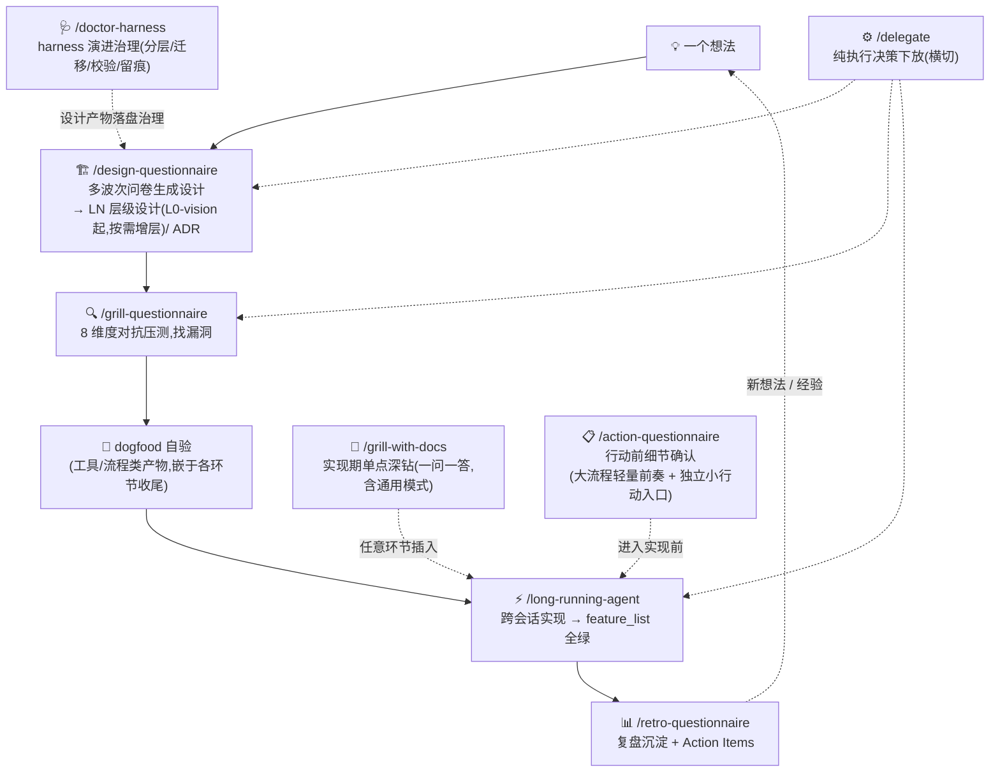

# info-driven-ai-se-harness-engineering

> **以信息为核心 × 驾驭工程(AI + 软件工程)** —— 个人 AI native 开发方法论 + 可直接运行的 skill 执行体。

> ⚠️ **experimental · 个人维护 · 不保证响应**。这是一套个人开发经验的整理分享,不是官方框架。方法论与 skill 都在迭代中。欢迎 issue,但响应不保证。

## 目录

- [快速上手:skill 使用流程](#快速上手skill-使用流程)
- [这是什么](#这是什么)
- [为什么是这个(差异化)](#为什么是这个差异化)
- [工具边界(请先读)](#工具边界请先读)
- [9 个核心 skill](#9-个核心-skill)
- [仓库结构(三区模型)](#仓库结构三区模型)
- [License](#license)
- [发布说明](#发布说明)
- [备注](#备注)

## 快速上手:skill 使用流程

安装:把 `skills/<skill-name>/` 拷入(或软链)`~/.claude/skills/`(用户级,所有项目可用)或项目内 `.claude/skills/`,即可在 Claude Code 中以 `/skill-name` 或自然语言触发:



**更新**:软链安装 → `git pull` 即自动跟进;拷贝安装 → 重新拷贝覆盖(本地有定制先 diff 再覆盖)。`skills/` 是否变更、何时需要重拷,看下方[发布说明](#发布说明)。

**canonical 主路径**:design-Q → grill-Q → dogfood → long-running → retro-Q;retro-Q 也可在任意环节作为横切复盘插入。

衔接协议:design-Q 收尾主动提议 grill-Q 压测;grill-Q 收尾提议 long-running 进入实现;grill-with-docs(含通用模式)与 delegate 在任意环节可插入;action-Q 为轻量前奏——design-Q 收尾的设计进入实现前、grill-Q / retro-Q 处理的行动项落地前,可先对齐动作细节。各环节产物与触发时机详见方法论文件 [§三](docs/methodology/methodology_v5.md)、实操文件 [§8.3](docs/methodology/practical_v1.md)。

**最小采用切片**(2026-08-18,grill-Q first-principles W01 Q5):新项目从 0 跑通第一个闭环只需 3 个文件起步——① 本 README(双支柱与主路径)② [practical_v1.md §8.3](docs/methodology/practical_v1.md)(skill 使用时机表)③ `skills/`(拷入 `~/.claude/skills/` 即用)。方法论 / 哲学 / 实操三件套按需深读,不是采用前置;本仓库的治理体系(ADR / OD / 归档问卷 / CONTEXT)是方法论的生产车间,采用者无需复制。

## 这是什么

一套面向 **个人开发者** 的 AI native 开发方法论,以及把它落地为可执行流程的 **Claude Code skill 家族**。

两大支柱(相乘,缺一为零):

1. **以信息为核心** —— 与 AI 协作的本质是信息流转;瓶颈在有效上下文的质与量,以及对抗 AI 在信息真空中的幻觉式自作主张决策。整个工作流围绕信息管理设计:精准投喂、及时沉淀、绝不丢失。
2. **驾驭工程 = AI × 软件工程** —— AI 是加速器,软件工程纪律(设计先行、TDD、Code Review、ADR、复盘)是骨架。AI 让纪律更便宜,纪律让 AI 更可靠。

## 为什么是这个(差异化)

同类内容多是「只有文章」或「只有框架」。本仓库是 **方法论 + 可直接运行的 skill 执行体** 一体化——文章讲为什么,skill 让你能直接跑。(此差异化定位待市场验证,见 [OD-6](docs/OPEN-DECISIONS.md)。)

## 工具边界(请先读)

- **方法论理念**(双支柱 / 5 环节闭环 / Grill 决策法)工具无关,**可迁移**到任意 AI 编程工作流。
- **skill 直接运行依赖 Claude Code** 的三项机制:`AskUserQuestion`(批量问卷提问 / 逃生舱)、`subagent`(并行核实,仅 design-Q / grill-Q 使用,其余 skill 不需要)、`SKILL.md` 加载。迁移到其他工具(Cursor / Cline 等)需适配这三项(详见 [docs/OPEN-DECISIONS.md](docs/OPEN-DECISIONS.md) OD-2)。
- 本方法论**在 Claude Code 上实践验证**;其他工具的适配尚未实测,欢迎反馈。

## 9 个核心 skill

| skill | 用途 |
|---|---|
| [`action-questionnaire`](skills/action-questionnaire/) | 非正式行动前的细节确认(确认式问卷,轻量前奏) |
| [`design-questionnaire`](skills/design-questionnaire/) | 一个念头 → 层层设计(L0-vision 起,按需增层;旧 VISION/HLD/LLD 为别名兼容) |
| [`grill-questionnaire`](skills/grill-questionnaire/) | 压测已有工件,8 维度找漏洞 |
| [`grill-with-docs`](skills/grill-with-docs/) | 实现期单点二义性深钻(绑库默认;含通用模式承载原 grill 场景,2026-08-19 grill 已退役) |
| [`retro-questionnaire`](skills/retro-questionnaire/) | 阶段 / 项目复盘 |
| [`long-running-agent`](skills/long-running-agent/) | 跨会话长项目约束系统 |
| [`delegate`](skills/delegate/) | 决策下放治理(试点) |
| [`doctor-harness`](skills/doctor-harness/) | harness 演进治理(分层 / 迁移 / 校验 / 留痕) |

## 仓库结构(三区模型)

```
docs/methodology/    方法论文章(CC-BY 4.0)——methodology_v5 + philosophy_v7 为 current
docs/CONTEXT.md      术语表 / harness/adr/ 架构决策记录 / docs/OPEN-DECISIONS.md 待决事项
harness/design/      AI 流程产物:设计文档套(按 feature/主题子目录:repo/ doctor-harness/ skill-spec-revamp/ 等)
harness/questionnaires/ 已用问卷归档区(archive/ 按 feature/主题子目录 + README 索引)
skills/              9 个核心方法论 skill(MIT)
scripts/             脱敏检查 / harness 校验等工具
```

分区规则:**内容 = 项目文件(docs/);决策记录与流程产物(ADR / 设计文档 / 问卷)= harness 文件;执行体与工具(skills/ scripts/)= 根级产物**。入口文件(CLAUDE.md / AGENTS.md / README)因工具约定留在仓库根,只做路由。

## License

- `docs/`(方法论文字): **CC-BY 4.0**(署名转载,见 [docs/LICENSE](docs/LICENSE))
- `skills/` `scripts/`(配置 / 代码): **MIT**(见 [LICENSE](LICENSE))

## 发布说明

> **记录规则**:本节是仓库级对外变更的唯一记录——凡**采用者可感知**的变更(skill 行为 / 产物结构 / 方法论内容)必记,纯仓库内部治理(问卷归档、链接修复等)不记。倒序排列。skill 无独立版本号,这里是感知 `skills/` 变更的唯一窗口。

### skill 演进(2026-08-19,双侧同步机制化)

- **skill 双侧同步检查上线**:新增 [scripts/skills-sync-check.py](scripts/skills-sync-check.py)——改 `skills/`(本仓库)或 `~/.claude/skills/`(用户全局)任一侧后,提交前跑检查,**0 违规才提交**;脚本 check-only 不选边,哪侧为准是语义判断、永远由人定(裁决例外白名单内置)。背景:2026-08-18 双向合并(9 skill 核对 + 8/14 修订回灌)暴露「项目内修、全局漏修」空隙,机制化收口。

### skill 演进(2026-08-16/17,design-Q 层级制 LN 改造)

- **design-Q 产物结构升 LN 制**:VISION/HLD/LLD 三件套 → **LN 分层设计**——L0-vision(目标层)恒在,L1+/L2 按需动态增层,旧三件套降为别名兼容;骨架增强(HLD/LLD 判别法则 + 反简化最小必含 + 坍缩分档)保留,见 [ADR-0022](harness/adr/0022-design-questionnaire-digital-levels.md)。
- **doctor-harness 承接层级治理**:HARNESS-RULES 新增第七节(LN 布局/导览/存量豁免)与第八节(存量结构改造流程 + 旧档迁移映射表);本仓库存量设计套(repo/ 三件)git mv 迁 LN 化演练完成。
- **全链闭环**:F027–F034 全绿(端到端测试通过);DOGFOOD 案例 1 用户实测确认;首份 retro 文档产出(retro-questionnaire 首跑)。

### methodology_v5(2026-08-14,方法论章节连续化与契约优先)

- **方法论文件升 v5**:正文连续编号 §零至§九(v4 映射表在文件顶部)+ 全库引用审查;§4.3(旧 §5.3)两族表补 action-Q 入族;§5.3(旧 §7.3)补「时序纪律」——契约层变更必须**先更新 canonical 设计、再继续不可逆动作**(ADR-0021 通用化)。
- **伴随项**:CONTEXT 补规范导航与「暂定」状态词;同轮立项 design-Q 数字层级改造、dogfood 定义消歧、方法论 704 行审计(见 [TODO.md](TODO.md))。
- **版本处置**:v4 保留在 [`docs/methodology/archive/`](docs/methodology/archive/) 作为历史母本。

### v7(2026-08-14,哲学独立文章与双文件治理)

- **哲学文件升 v7**:正文统一为连续章节 §一至§五,增加独立阅读入口,保留 v3 旧章节映射、兼容别名 / 重定向说明与历史问卷/ADR 回溯;补方法论 harness 与运行时 harness 的术语边界。
- **治理边界诚实化**:补 current 已知缺口状态、前三学科最小进入/退出模板,并将返工与去黑盒代理指标明确为反思提示而非效果验证或自动验收门。
- **版本处置**:v6 保留在 [`docs/methodology/archive/`](docs/methodology/archive/) 作为历史母本,v7 成为 current canonical;哲学与 methodology(同日升 v5)按 [ADR-0018](harness/adr/0018-canonical-dual-challenge-governance.md) 作为对等 canonical 双文件交叉治理。

### v6(2026-08-13,哲学治理进化)

- **哲学文件升 v6**:在 v5 的安全科学第四学科视角与「去 AI 黑盒」基础上,补全文阅读路线与章节过渡;§8.6 明确为「方法论自身的治理闭环」,加入统一主张状态模板与学科治理路线图。
- **治理进化路径**:将系统/需求工程、认识论与测量科学、配置管理/QMS、认知科学/HCI、知识管理/组织学习、信息安全/威胁建模、形式化方法、控制论/决策理论映射到治理机制、最小产物与进入条件;不把它们变成个人项目的强制流程。
- **版本处置**:v5 保留在 [`docs/methodology/archive/`](docs/methodology/archive/) 作为历史母本,v6 曾成为 current canonical,现由 v7 接替并一并归档。

### v5(2026-08-11,philosophy 立论重构)

- **哲学文件升 v5**:新增 **§八 安全科学视角:去 AI 黑盒**(第四学科视角;黑盒三层次定义 + 与第一支柱正交 + 三风险 + 统合已有可审计装置对策 + 弹性边界 WAI/WAD);顶部学科挂接扩为四(人因 / 软工 / 运筹 / 安全科学);元原则失败模式表加「黑盒信任劫持」。v4 归 archive。
- **学科挂接分层**([ADR-0014](harness/adr/0014-discipline-mapping-strategy.md)):哲学正文只挂「立论核心学科」,CONTEXT「项目学科地图」承载全景(系统工程 / CM / QMS / PM / KM / 认知科学 + 安全 / 可靠性 / 韧性术语三分)。
- **完整 write→review→implement 闭环**:grill-Q philosophy-v4(W01/W02,18 处修订)→ discipline-mapping → grill-with-docs(去黑盒 6 点结晶)→ design-Q(VISION/HLD/LLD + [ADR-0015](harness/adr/0015-deblackbox-anchor.md))→ 设计套压测(10 项修订)→ long-running 起草(commit 530d0f4)。

### skill 演进(2026-08-08,doctor-harness 第 9 个 skill)

- **harness 演进治理 skill 上线**:组织 harness 区(分层 / 迁移 / 校验 / 留痕),规则权威 [HARNESS-RULES.md](skills/doctor-harness/HARNESS-RULES.md)(ADR-0012/0013);校验脚本 [scripts/harness-check.py](scripts/harness-check.py)(命名正则 / ADR 编号连续 / 归档位置三检查)。
- **归档子目录化**:41 份归档问卷按 feature/主题迁入 `harness/questionnaires/archive/` 下 10 个子目录,附 [README 索引](harness/questionnaires/archive/README.md)。
- **格式反馈落地**:问卷单波次上限 10、小波(直接问答)阈值 3,四副本(design-Q / grill-Q / retro-Q / action-Q)统一;新增 [MIGRATION-FLOW](skills/doctor-harness/MIGRATION-FLOW.md) 迁移流程文档。

### skill 演进(2026-08-07,design-Q 规格整理)

- **落盘路径回归硬编码 `harness/`**(2026-08-07 撤销方案 R,看 [ADR-0011](harness/adr/0011-abandon-plan-r-hardcode-harness.md)):design-Q + grill-Q/retro-Q/action-Q + long-running 的问卷/ADR 落盘路径**一律硬编码 `项目根/harness/`**(design/ + questionnaires/ + adr/);CONTEXT/OPEN-DECISIONS/TODO 为项目固有文件,路径不动。
- **design-Q 骨架增强**:HLD/LLD 判别法则(phase-invariant vs incremental + 两句判别问句)+ 反简化最小必含(H1–H5/L1–L5 共 10 项,约束内容非仅结构)+ 坍缩分档。仅 design-Q 骨架,不扩散到 grill/retro/action。

### v4(2026-08-05)

- **方法论 + 哲学升 v4**:受众收窄为**个人开发者**;第二支柱补机制层立论(「无护栏 → AI 产出悄悄劣化」);哲学文件学科化(人因工程 / 软件工程 / 运筹学三视角)。
- **术语版本注**:8 术语**全保留**(未换词),新增学科参照注记 + 新词引入三条件门槛(见 [CONTEXT 术语治理节](docs/CONTEXT.md));旧版 skill 副本无需术语迁移,但落盘路径(harness/)与规范优先级以本仓库为准。
- **仓库结构**:harness/(设计文档 + 归档问卷)与 docs/(项目文件)物理分离;新增 AGENTS.md(Codex 入口路由)。
- **规范优先级**:方法论主张(canonical)> ADR > CONTEXT 术语 > skill 规格 > 实操(见 [CLAUDE.md](CLAUDE.md));v3 保留作历史母本。

## 备注

- 本仓库是这套方法论与 skill 的**唯一规范源**。作者另有早期开发副本(未脱敏),以本仓库为准(ADR-0001)。
- 方法论完整阐述拆为三块([ADR-0007](harness/adr/0007-methodology-three-way-split.md)):[methodology_v5.md](docs/methodology/methodology_v5.md)(方法论 · 怎么做,自包含)/ [philosophy_v7.md](docs/methodology/philosophy_v7.md)(哲学 · 为什么,v7 连续章节与双文件治理)/ [practical_v1.md](docs/methodology/practical_v1.md)(实操 · 怎么用,非 canonical 轻量修订);methodology_v5 + philosophy_v7 为 current,[methodology_v4](docs/methodology/archive/methodology_v4.md) / [methodology_v3](docs/methodology/archive/methodology_v3.md) / [v2](docs/methodology/archive/methodology_v2.md) / [philosophy_v4](docs/methodology/archive/philosophy_v4.md) / [philosophy_v5](docs/methodology/archive/philosophy_v5.md) / [philosophy_v6](docs/methodology/archive/philosophy_v6.md) 保留作历史版本。
