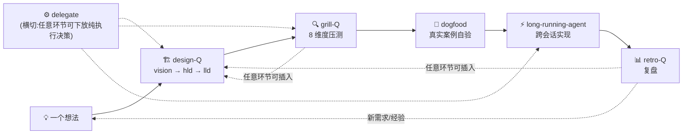
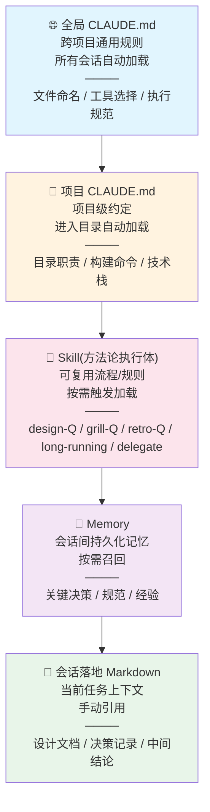

# 以信息为核心的 Claude Code AI Native 开发经验 v2

> ⚠️ **历史版本**:以 [methodology_v3](methodology_v3.md) 为 current(2026-07-29 起)。本文件保留作历史母本。
>
> **v2 相对 v1 的演进**:v1 写于 Grill 一问一答时代;v2 是经多个真实项目实践后的升级(项目背景已脱敏)——方法论已沉淀为可执行的 skill 家族(design-Q / grill-Q / retro-Q / long-running-agent / delegate),流程从线性 6 阶段升级为 5 环节闭环 + 横切,核心理念从单支柱升级为双支柱。v1 保留作历史母本(未收入本仓库),本文件自 v3 发布起转为历史版本。
>
> **本文独立成文**——方法论内核自包含,不依赖任何外部文档。skill 家族是方法论的执行体(把流程自动化),但方法论本身在本文完整阐述;读本文不需先读各 skill 的规格文档。

---

## 零、适用场景

### 谁适合读这篇文档

- **1–5 人小型团队**或**个人开发者**,每个人身兼多职(PM + 开发 + 测试 + 运维)
- 有明确目标的功能开发或产品构建,需要从念头一路走到交付
- 希望用 AI 大幅降低开发中的决策成本和时间成本,但不希望 AI 接管判断权
- 认同"先想清楚再动手"的理念,愿意在规划上投入时间

### 谁不太适合

- **大型跨职能团队**(>10 人):需要正式的 PRD、多角色评审会、跨部门对齐,本文的轻量流程不能替代这些组织级的协调机制
- **纯探索性 Spike**:目标是"试试看这个东西能不能跑通"而非交付功能,不需要完整规划流程
- **对 AI 完全不信任的场景**:本文假设 AI 是可用的执行伙伴

### 任务类型与流程适配

本文的 **5 环节闭环**(design-Q → grill-Q → dogfood → retro-Q → long-running,见第四章)针对**从零开始的功能开发**。日常开发中的其他任务类型按需裁剪:

| 任务类型 | 建议流程 |
|---------|---------|
| **功能开发** | 完整 5 环节闭环 |
| **Bug 修复** | 定位 → 写复现测试 → 修复 → 验证 → retro(跳过 design-Q) |
| **重构** | 明确重构目标 → grill-Q 压测目标架构 → 写测试保护 → 重构 → 验证测试通过 |
| **依赖升级** | 阅读 changelog → 升级 → 跑测试 → 修复 breaking changes |
| **探索性 Spike** | 写目标假设 → 快速验证 → 记录结论(无论成功失败)→ retro 决定是否转为功能开发 |

> 无论哪种任务类型,核心原则不变:想清楚再动手,验收标准明确,结论要沉淀。

### 阅读建议

本文是方法论,不是教条。读者应按自己的项目和团队规模调整。每个章节可以独立参考——即使不采用完整闭环,其中的 Grill 决策方法、需求执行规范、信息管理规范也可以单独使用。

**v2 新增**:方法论已沉淀为 skill 家族(见 §8.3),每个环节都有对应的执行体把流程自动化。你可以先读本文理解方法论内核,再按需取用对应 skill;也可以直接用 skill,在产出中反推方法论。

---

## 一、小型团队的时间损耗

在给出解法之前,先看清问题:**小型团队的时间到底花在哪了?**

写代码本身通常不是瓶颈。真正的时间黑洞有两个:

### 1.1 决策等待与反复

传统开发中,每个决策都需要等:

```
想清楚 → 找人讨论 → 对方没空 → 等到第二天
       → 讨论完了 → 发现有遗漏 → 再约时间
       → 决策变了 → 没记录 → 两周后忘了为什么这么定 → 重新讨论
```

小型团队虽然人少沟通快,但反而因为**每个人做更多决策**而更容易碰壁——PM、架构、选型、测试策略全在一个人脑子里排队等处理。决策不是并行而是串行的。

AI 可以消除"等别人"这个瓶颈。Grill 追问、Code Review、测试生成不需要排队——随时触发、即时响应。

**v2 进一步**:决策串行不仅因为"等人",还因为"每问等一轮 LLM 输出"。把一问一答的 Grill 改为**多波次批量问卷**(见 §5.2-5.3),决策本身也被并行化——一次出 10–15 题,离线作答,把串行等待压到最低。

### 1.2 信息断层导致的返工

```
需求没写清楚 → 做完发现理解错了 → 推倒重来
设计决策记在脑子里 → 两周后忘了 → 实现走偏
验收标准没定义 → 做完了不知道算不算完 → 无限打磨
```

每一次返工都是 2–3 倍的额外时间成本。**规划本身的时间成本与之相比可以忽略不计**——花一小时写清楚构想,可能省下三天的返工。

### 本章的核心论断

> **快速来自消除浪费,不是偷工减料。规划的时间成本可忽略,不规划的返工成本才是真正的时间黑洞。**

---

## 二、核心理念

v2 把核心理念从 v1 的单支柱升级为**双支柱**。两者相乘,缺一为零。

### 2.1 第一支柱:以信息为核心

**与 AI 协作的本质是信息流转**——上下文进入模型,模型产出结果,结果沉淀为新的信息。这个循环的瓶颈永远是**有效上下文的质和量**。所谓"有效上下文",是指不易产生幻觉、精准命中当前任务的信息量。上下文越多不代表越好:对于 200k 上下文模型,有效上下文经验值约 120k;对于 1m 上下文模型,约 400k。噪音会稀释模型的注意力。

因此整个开发工作流应该围绕信息管理来设计:**精准投喂、及时沉淀、绝不丢失。**

### 2.2 第二支柱:驾驭工程 = AI + 软件工程

v1 把"以信息为核心"作为唯一支柱,但实践中发现它不够——信息流转高效,但若没有工程纪律的骨架,AI 产出的代码会悄悄劣化。v2 显式提炼第二支柱:

> **驾驭工程 = AI × 软件工程。AI 是加速器,软件工程的纪律是骨架,两者相乘,缺一归零。**

"软件工程的纪律"在本方法论里具体指:设计先行(VISION/HLD/LLD)、TDD、小步提交、Code Review、ADR、需求执行规范、复盘。这些不是 AI 的对手,而是 AI 产出的质量护栏。AI 让这些纪律的执行成本大幅下降(自动生成测试、即时审查、批量问卷),但纪律本身不能省。

- **AI 让工程纪律更便宜**:过去写一份 ADR 要半天,现在 grill-Q 压测 + AI 起草几分钟出草稿;过去 TDD 写测试是负担,现在 AI 生成测试用例,人审阅。
- **工程纪律让 AI 更可靠**:没有测试护栏,AI 重构会引入隐蔽 bug;没有设计文档,AI 实现会走偏;没有复盘,AI 反复踩同一个坑。

### 2.3 两条被否决项(防走极端)

v1 §6.5 要求关键决策给出被否决项,本节以身作则:

| 被否决项 | 症状 | 为什么错 |
|---------|------|---------|
| ❌ **AI 替代工程纪律** | 盲信 AI,跳过测试/设计/审查,"AI 说没问题就合入" | AI 产出质量下降而不自知;失去护栏的 AI 是隐患放大器。v1 元原则"盲目信任 AI"失败模式 |
| ❌ **纯工程不用 AI** | 固守手工流程,写设计/测试/文档全靠自己 | 放弃加速,被 AI 时代的同行甩开;小团队失去"以一当五"的杠杆 |

**正道**:AI 加速工程纪律的**执行**,工程纪律约束 AI 的**产出**。两者是乘法关系,不是替代关系。

---

## 三、信息生命周期


每一个阶段的信息都必须有落盘位置,确保:

- 当前自己可回溯
- 未来自己可理解
- AI 在后续会话中可重新加载为上下文

**v2 新增的信息流转形态**(在上述生命周期内):
- **批量问卷**(design-Q/grill-Q/retro-Q):把"一问一答"的信息流转改为"多波次离线作答",问卷文件本身即是落盘的决策记录,归档后可回溯。
- **dogfood 回灌**:产物自验发现的缺口,即时回修规格,是"验证 → 结构化"的反馈环。
- **归档只移不删**:已处理问卷移入 archive/,文件名不变,信息永不丢失。

---

## 四、开发工作流

> 这是本文的核心章。v2 把 v1 的线性 6 阶段(念头→构想→全局设计→分阶段设计→实现→复盘)升级为 **5 环节闭环 + 横切**,每个环节都有对应的 skill 执行体,且 grill-Q / dogfood / retro / delegate 作为**正交可插入**的方法论,不锁死在固定位置。

### 4.1 整体闭环



闭环要点:
- **主路径**:想法 → design-Q(设计)→ grill-Q(压测)→ dogfood(自验)→ long-running(实现)→ retro(复盘)→ 回到想法。
- **横切**:delegate 在任意环节都可触发(纯执行类决策下放)。
- **可任意插入**:grill-Q、dogfood、retro、delegate 不是线性阶段,是正交方法论——任意环节遇到对应问题都能调用。例如实现期(long-running)中途发现某个设计盲点,可临时插入 grill-Q 压测该点;任意节点可插入 retro 复盘流程本身。

### 4.2 环节详解

#### 环节 1:design-questionnaire(设计期 · 生成式)

把"一问一答的 grill 设计"改为"多波次问卷"。从一句话想法展开为完整设计,分三个阶段:

| 阶段 | 对应 v1 概念 | 产物 | 盘问内容 |
|------|------------|------|---------|
| **vision** | 构想文档 | VISION.md | 目标、范围、核心场景、验收标准、风险约束 |
| **hld** | 全局设计 | docs/design/ HLD | 系统架构、技术选型、接口契约、ADR、部署运维 |
| **lld** | 分阶段设计 | docs/design/ LLD | 阶段目标、详细设计、接口规格、DoD、依赖、预估 |

**关键机制**:
- **preview 预答层(W00)**:每阶段先生成一份独立的决策默认值清单,一条一行(决策点 + AI 默认倾向 + 来源)。用户逐条作答:勾 = 采纳默认,留空 = 转正式题深究。把"显然的决策"批量快过,精力集中在真正有分歧的点上。
- **阶段闸门**:阶段内终止由 agent 判断(出示覆盖清单),跨阶段必须用户显式确认。
- **环境现实验证**:凡涉及外部依赖(库、工具链、路径、版本),出题前必实测编译链接,不只查"装没装"。库存在 ≠ 能用。
- **落盘**:VISION / HLD / LLD / ADR / OPEN-DECISIONS / CONTEXT,本波处理完即刻写,不批处理。

#### 环节 2:grill-questionnaire(设计后 · 对抗式压测)

把"一问一答的 grill 压测"改为"多波次问卷"。design-Q 产出设计草稿后,用 8 个固定压测维度套到设计每条关键声明上,找漏洞、盲点、单向门:

| 维度 | 压测什么 |
|------|---------|
| **D1 未言明假设** | 设计建立在哪些没说出口的假设上?成立/存疑/失效 |
| **D2 单向门/可逆性** | 哪些选择难逆转?该进 ADR 还是 OD? |
| **D3 替代方案/被否决项** | 关键决策给了被否决项吗?还是只有一个方案? |
| **D4 失败模式/爆炸半径** | 出错时怎样?能否降级?影响面多大? |
| **D5 盲点** | 该说没说的:边界、错误路径、并发、回滚、迁移 |
| **D6 可验证性** | 验收标准可检查,还是空话? |
| **D7 与现实的矛盾** | 设计说 X,但代码/CONTEXT/ADR 是 Y(压测最值钱的一项) |
| **D8 术语一致性** | 用词与 CONTEXT 定义冲突/重载/模糊? |

**铁律**:**只产出发现,不替改工件**。压测发现的漏洞进处理报告,工件修订由人发起(收尾时主动询问是否执行)。可沉淀项(满足 ADR 三条件的决策、单向门风险、术语冲突)即时落盘。

**何时用**:design-Q 收尾时主动提议一次;也可随时手动触发压测任意已有工件(ADR 草稿、架构提案、计划)。

#### 环节 3:dogfood(任意环节 · 产物自验)

v1 缺这一环。v2 把它提升为方法论级:产物是**工具 / 流程 / 模板 / skill / 配置 / 脚本**时,收尾前在真实小案例上完整走一遍闭环,缺口即时回修规格。

**为什么需要**:设计-实现-验证闭环里,"验证"通常指验证代码功能。但工具/流程类产物的"功能"是"能不能被正确使用"——这必须靠真实案例自验,不能靠想当然。

**怎么做**:
- 用产物在真实小案例上跑完整闭环(例:用新设计的 skill 走完一个真实功能的设计→压测→实现)。
- 发现的格式/流程缺口,即时回修产物规格。
- 跳过与结果都记录(跳过要标理由,不能默默跳过)。

**不强制**:纯代码功能开发可不 dogfood(测试即自验);工具/流程类产物强烈建议。

#### 环节 4:retro-questionnaire(任意环节 · 复盘)

把"写复盘文档"改为"多波次问卷"。v1 把复盘锁在阶段 6(末尾),v2 重新定位:**retro 是可任意环节插入的方法论**。

**两类复盘**:
- **项目复盘**(阶段/项目末):What went well / What went wrong / 架构偏离 / 学到什么 + Action Items。
- **方法论/流程复盘**(任意节点):复盘流程本身——这次哪些环节帮到了你,哪些是走形式。对应 v1 元原则"方法论本身也在迭代"。

**落盘**:retro 文档 + Action Items 写入 TODO.md(问题 → 行动 → 核验时机)。

#### 环节 5:long-running-agent(实现期 · 跨会话约束系统)

v1 的实现期描述薄(只有 TDD/小步提交)。v2 把 long-running-agent 作为实现期核心执行纪律,系统化对抗**跨会话失忆**——长项目第一杀手。

**核心理念**(基于 Anthropic《Effective harnesses for long-running-agents》):
- **增量工作**:一次只处理一个功能,完整实现→测试→提交→下一个。
- **清晰工件**:为下一会话留下清晰的进度记录(写进文件,不是上下文)。
- **整洁状态**:代码始终处于可合并到主分支的状态。
- **端到端验证**:只有通过完整测试才标记功能完成。

**核心文件**:

| 文件 | 用途 |
|------|------|
| `feature_list.json` | 所有功能需求及状态(passes: true/false);首会话创建,后续更新 |
| `claude-progress.txt` | 每个会话的工作记录;会话结束更新,最新在顶部 |

**从落盘文件重建上下文(关键机制)**:会话上下文会被压缩而丢失设计期决策细节。long-running 不依赖会话上下文,而是从落盘文件重建——有 design-Q 产物则读 VISION/HLD/LLD + 归档问卷反推 feature_list;无则读 progress + feature_list + git log。无论上下文是否被压缩,落盘文件都是 source of truth。

**功能标记规则**:
```
[OK] 全部端到端测试通过 → passes: true
[X]  未测就标 true —— 禁止
[X]  测试失败跳过   —— 禁止(隐藏问题)
[X]  删除功能项减负 —— 禁止(功能永久丢失)
```

#### 横切环节:delegate(任意环节 · 决策下放)

v1 §6.5 决策分层最底层"纯执行"埋了下放的种子,v2 把它系统化为 delegate。详见 §5.5。

### 4.3 方法论可任意插入

v2 与 v1 线性 6 阶段的关键区别:**grill-Q / dogfood / retro / delegate 是正交方法论,不是线性阶段**。

| 方法论 | 何时插入 | 典型场景 |
|--------|---------|---------|
| grill-Q | 任意环节,有工件要挑战时 | design-Q 收尾压测、实现中发现设计盲点、ADR 草稿审查 |
| dogfood | 任意环节,产物是工具/流程时 | skill 设计完、模板定稿、配置方案成型 |
| retro | 任意环节,要反思时 | 阶段末项目复盘、流程走偏时方法论复盘、踩坑后即时复盘 |
| delegate | 任意环节,纯执行决策密集时 | 命名/格式/版本号批量决策、问卷归档操作 |

对比 v1 把复盘锁在末尾、把 Grill 锁在构想和实现期,v2 让方法论随取随用。

### 4.4 与传统 SDLC 的映射(v1 6 阶段降级为此表)

v1 的 6 阶段仍是理解方法论的好框架,但执行已并入 5 环节闭环:

| v1 / 传统阶段 | v2 对应 | 说明 |
|--------------|---------|------|
| 念头 | 想法(design-Q vision 输入) | 一句话 + 动机 |
| 构想文档 | design-Q **vision** 波 | 问卷化,不再手写 |
| 全局设计 | design-Q **hld** 波 | 含 ADR |
| 分阶段设计 | design-Q **lld** 波 | 含 DoD |
| 实现 | **long-running-agent** | 系统化跨会话纪律 |
| 复盘 | **retro-Q** | 问卷化,可任意环节插入 |
| —(v1 无) | **grill-Q** 压测 | v2 新增:设计后对抗式压测 |
| —(v1 无) | **dogfood** 自验 | v2 新增:工具/流程类产物自验 |
| —(v1 无) | **delegate** 下放 | v2 新增:纯执行决策系统化下放 |

---

## 五、Grill 决策方法论

Grill 是本方法论的决策引擎。v2 把 v1 的"一问一答"升级为"两族 Grill"。

### 5.1 核心原则

**不替用户做决策,而是帮用户看清决策。**

人的职责是判断,AI 的职责是追问盲区、呈现选项、分析利弊。Grill 过程中,"推荐选项"只是降低决策负担的输入,不是最终决定。

### 5.2 演进说明:从一问一达到批量问卷

> **v1 假设**:Grill 必须一问一答("一次只问一个问题,等待回答后再进入下一个")。
> **v2 破除**:实践证明设计/压测/复盘类决策可以批量化。

**演进理由**:一问一答的最大成本不是"问",而是"每问等一轮 LLM 输出"的串行等待。10 个决策串行问 = 10 轮等待。改成多波次问卷:一次出 10–15 题,用户离线作答,agent 一次性解析落盘——串行等待压到最低,且**不损失决策权**(每题仍有 ★推荐 + 🤔 逃生舱 + 即时落盘,人仍是决策者)。

**保留一问一答的场景**:实现期单点二义性(一个具体模糊点深钻)、计划评审(逐点确认),这类"问题数少、依赖链深、需即时反馈"的场景仍用一问一答。

### 5.3 两族 Grill

| | 批量问卷族 | 单点深钻族 |
|------|-----------|-----------|
| **skill** | design-Q / grill-Q / retro-Q | grill / grill-with-docs |
| **交互** | 多波次问卷,离线作答 | 一问一答,逐轮等待 |
| **场景** | 生成式设计 / 对抗式压测 / 复盘 | 实现期单点二义性、计划评审 |
| **骨架** | 有(vision/hld/lld;或 D1–D8;或四节) | 无(纯追问) |
| **落盘** | 阶段文档 / ADR / OD / CONTEXT | CONTEXT / ADR / OD |
| **何时用** | 决策密集、可离线、要批量 | 决策少、依赖链深、要即时反馈 |

**选择原则**:决策多且可离线 → 批量问卷族;单点深钻、要即时反馈 → 单点深钻族。两者不互斥,同一项目可先后都用。

### 5.4 逃生舱机制与降风险协议

#### 逃生舱

每个问题都必须提供"我定不了"的出口。用户不确定时,不逼迫、不反复追问。用户无法决定的原因通常是三种之一:**知识缺口**(不了解领域)、**经验缺口**(没经历过类似场景)、**无法预判**(需要未来的信息)。在这三种情况下强迫决策,得到的只能是随机选择。

#### 降风险协议

当用户无法决定时,不强迫决策,而是**把决策变安全**:

**第一步:判断可逆性**

| 门类型 | 定义 | 处理 |
|--------|------|------|
| **双向门** | 改主意成本极低——命名、内部结构、配置项、默认值 | 直接选推荐项往前走,同时留痕(采用推荐 + 标"双向门/provisional"+ 重访触发) |
| **单向门** | 改主意成本高——数据库选型、公开 API、认证方案、部署目标 | 进入第二步 |

**第二步:推迟或缩小**——能整个推迟 → 进 Open Decisions;能先定最小可逆切片 → 定切片,不可逆部分进 OD。核心技巧:找最可逆的占位方案。

**第三步(最后手段)**:必须现在定且不可逆 → 给明确推荐 + 推理过程 + 可逆性评估,用户角色降级为"否决或接受",进 OD 并标 provisional。

### 5.5 决策分层与决策下放

#### 决策分层:按风险分配精力

决策精力是有限资源,应按风险等级分层:

| 层级 | 特征 | 处理 | 精力 |
|------|------|------|:--:|
| 🔴 高 stakes | 单向门 + 高风险(数据库选型、公开 API、认证) | 完整 grill → ADR → 确认后动工 | 高 |
| 🟡 中 stakes | 单向门 + 低风险,或双向门影响面广 | grill 快速确认 → 轻量记录 | 中 |
| 🟢 低 stakes | 双向门(变量命名、默认参数、文件组织) | 直接选推荐,不消耗精力 | 低 |
| ⚪ 纯执行 | 无判断需求(CRUD、写测试、格式化) | **可下放 AI**,人只验收 | 零 |

#### 决策下放(delegate)★ v2 新增

v1 的"纯执行交 AI"是种子,v2 把它系统化为 delegate 机制。最底层的纯执行类决策可以**系统化下放**给 AI,而非每次都问人:

**可下放(白名单治理,人逐类审查确认)**:
- 文件命名、版本号递增
- commit message 措辞
- 格式排版、TODO 条目化
- 问卷归档操作

**永不下放(安全/不可逆/价值判断)**:
- 安全关键代码与配置(认证、授权、加密、输入校验、密钥处理)
- 合并/发布签字
- VISION 修订
- 权限/Policy 变更
- 删除类操作

**机制**:
- **白名单查阅**:delegate 只处理白名单内的决策类。
- **留痕**:每次下放写入 delegation-log(决策、依据、结果),可审计。
- **整体紧急开关**:出问题时一键关闭下放,回到"全部问人"。

**边界由人逐行审**:白名单与永不下放清单是治理文件,必须人逐行审查确认,不是 AI 自定。delegate 处于试点阶段,边界随 dogfood 数据迭代。

### 5.6 文件体系:决策的落盘

Grill 过程中产生的信息必须即时沉淀,不批处理:

| 文件 | 存什么 | 创建时机 |
|------|--------|---------|
| **CONTEXT.md** | 领域术语表——概念的精确定义、别名、歧义澄清。纯术语,不放决策或实现细节 | 第一个术语确定时(懒加载) |
| **docs/adr/** | 已做出的架构决策(背景→决策→替代方案→后果) | 第一个符合条件的 ADR 出现时 |
| **docs/OPEN-DECISIONS.md** | 被推迟的决策——问题、推迟原因、当前占位方案、可逆性、**重访触发条件** | 第一个决策被推迟时 |

**ADR 的创建门槛**——必须同时满足三个条件:
1. **难逆转**——改主意的成本有实际意义
2. **缺上下文会让人困惑**——未来读者会想"为什么这么做?"
3. **经过了真实权衡**——确实有其他选项,不是唯一解

三条缺一条 → 不写 ADR。大部分决定不值得 ADR。

**Open Decisions 的强制字段**:推迟原因、当前占位方案、可逆性、**重访触发条件**(具体信号,不是"以后")。没有重访触发条件的推迟 = 伪装成决策的遗忘。

### 5.7 Grill 中的关键行为

| 行为 | 说明 |
|------|------|
| **挑战术语冲突** | "你的术语表里 X 定义为 A,但你现在似乎指 B——到底是哪个?" |
| **收敛模糊语言** | 用户说"账户"——是 Customer 还是 User?提出精确的规范术语 |
| **用具体场景测边界** | 构造边界场景测试领域关系的健壮性 |
| **与代码交叉验证** | 用户说的和代码实际做的如果不一致,立即指出 |
| **即时更新文档** | 术语确定 → 立刻写 CONTEXT.md;决策推迟 → 立刻写 OPEN-DECISIONS.md |

---

## 六、人与 AI 的分工

### 6.1 分工表

| 职责 | 人 | AI |
|------|:--:|:--:|
| 决策(选什么方案) | ✅ | ❌ |
| 确认(这是我要的吗) | ✅ | ❌ |
| 上下文管理(给什么信息) | ✅ | ❌ |
| 写构想/设计文档 | ✅ | 辅助追问 |
| 写代码 | 审阅 | ✅ |
| 写测试 | 审阅 | ✅ |
| 写文档(API 文档、README) | 审阅 | ✅ |
| 代码审查 | ✅ | ✅ 辅助 |
| Grill(追问盲区) | — | ✅ |
| 搜索与信息检索 | — | ✅ |
| 端到端验证 | ✅ | ✅ 执行 |
| **纯执行类决策(白名单内)** | 逐类审查白名单 | ✅ 可下放(v2) |

**核心原则**:AI 可以做任何事,但不能做任何决策。决策永远是人来做的,AI 提供信息和分析,供人判断。v2 唯一的放宽:纯执行类决策(白名单内、留痕、可紧急关闭)可下放,但白名单本身是人审查定的。

**绝不让 AI 自行确认的事**:需求理解是否正确?设计是否符合意图?测试是否覆盖了关键场景?这些都必须人亲自确认。

### 6.2 AI 替代的传统角色

在传统团队中,以下角色需要不同的人担任,产生沟通延迟和上下文切换成本。在小型团队 + AI 模式下,这些角色由 AI 替代或辅助,**消去等待时间**:

| 传统角色 | 传统时间成本 | AI 模式 |
|---------|------------|--------|
| **PM / 需求分析** | 需求不明确 → 等 PM 有空 → 开会 → 可能理解不一致 → 返工 | design-Q 即时追问需求盲区,VISION 沉淀结论 |
| **QA / 测试** | 开发完 → 交 QA → 排期 → 提 bug → 修 → 再测 | AI 即时生成测试、执行 E2E,开发自测闭环 |
| **Code Reviewer** | 提 PR → 等 review → 反馈 → 修改 → 再等 | AI 即时审查,人做最终确认 |
| **DevOps / 运维** | 部署脚本、CI、监控需专人维护 | AI 生成配置和脚本,人审阅后执行 |
| **技术文档撰写** | 开发后补文档,要么不写要么敷衍 | AI 根据代码和设计即时生成 API 文档、README |

**关键变化**:不是 AI 替代了人,而是 AI 消除了"等人"的时间。

---

## 七、信息管理规范

### 7.1 文档载体

所有设计文档、决策记录、复盘文档一律用 Markdown:纯文本 Git 可 diff;AI 可直接读取;跨平台永不过时。

### 7.2 文件版本管理

- 用版本号命名(`_v1`、`_v2` 递增),禁止 `final` / `new` / `copy` 等后缀
- 创建新文件前检查同目录已有版本,取 max+1
- 废弃文件归入 `waste/` 目录,记录废弃原因,不直接删除
- **绝不删除有内容价值的文件**——宁可归档也不删除

### 7.3 同步文档

在以下时刻更新相关文档:做出架构决策 → 更新 ADR;设计变更 → 更新设计文档(标注原因和日期);Open Decision 有结论 → 移到已关闭列表;阶段完成 → 更新进度文档。

**不一致的设计文档比没有设计文档更危险**,因为它提供虚假的安全感。

### 7.4 上下文管理

- 频繁用到的背景信息写入 CLAUDE.md 或 Memory
- 长对话的中间结论及时落地为 Markdown
- 每个新会话,先把相关设计文档和 ADR 喂给 AI 作为上下文

### 7.5 上下文层级体系 ★ v2 五层

v1 是四层,v2 增加 **Skill 层**(方法论沉淀为可执行工具的载体):



| 层级 | 典型位置 | 放什么 | 加载方式 |
|------|---------|--------|---------|
| **全局 CLAUDE.md** | `~/.claude/CLAUDE.md` | 跨项目通用规范 | 所有会话自动加载 |
| **项目 CLAUDE.md** | `<项目根>/CLAUDE.md` | 项目级约定 | 进入项目目录自动加载 |
| **Skill** ★ | `~/.claude/skills/`(用户级)或项目内 | 方法论执行体——可复用的流程/规则(问卷引擎、long-running 纪律、下放机制) | 按需触发(`/skill` 或自然语言) |
| **Memory** | `~/.claude/projects/<项目>/memory/` | 跨会话持久化的关键决策、经验 | 按需召回(描述匹配触发) |
| **会话落地文件** | 项目内 Markdown | 当前任务的设计文档、决策记录、中间结论 | 手动引用 |

**使用原则**:写之前先判断信息要多广的范围生效。Skill 层是 v2 的关键新增——它把方法论从"读文档照着做"升级为"触发 skill 自动执行"。skill 是跨项目全局能力(用户级),与会话级/项目级文件层级不同,故独立成层。

### 7.6 会话恢复策略

AI 编程会话不会无限延续——上下文会满、注意力会衰减、任务会被打断。

**何时主动开新会话**:上下文接近有效上限(200k 模型约 120k,1m 模型约 400k);对话主题根本性变化;AI 出现明显幻觉或遗忘早期指令。

**新会话恢复清单**(按顺序喂给 AI):
1. 项目的 CLAUDE.md(自动加载)
2. 当前阶段的设计文档(VISION / HLD / LLD)
3. 最新的会话落地文件(上次中间结论)
4. 当前 Git diff 或未完成的任务清单(feature_list.json)
5. 一句话:上次做到哪了、这次要继续做什么

**长项目优先用 long-running-agent**:跨会话恢复从"手动喂清单"升级为"从落盘文件重建"(feature_list.json + claude-progress.txt + 归档问卷),不依赖会话上下文,更抗失忆。见 §4.2 环节 5。

**中断时立即做**:把当前进度写成 3–5 行"会话快照"(做到哪、还剩什么、下一步),落地为 Markdown;未提交的变更提交或 stash 并记录。

### 7.7 多项目管理

小型团队经常同时推进 2–3 个项目。关键:项目级 CLAUDE.md 隔离;Memory 按项目隔离;**用户级 Skill 跨项目共享**(方法论执行体一次安装,多项目复用);每个项目维护一个进度文件,切换回来第一件事读它。

### 7.8 安全警示

把信息喂给 AI 时,几类信息**绝不能**出现在对话中:

| ❌ 禁止喂入 | 原因 |
|------------|------|
| API 密钥、Token、密码、证书 | 对话内容可能被用于训练或日志 |
| 用户隐私数据(真实姓名、身份证、银行卡号) | 合规风险 |
| 公司未公开商业机密 | 信息安全风险 |
| 安全关键代码的完整实现(认证、加密) | AI 生成的认证逻辑可能有隐蔽漏洞 |

**安全底线**:安全相关代码(认证、授权、加密、输入校验、密钥处理)**必须由人审查每一行**;敏感配置用占位符;不确定能不能贴,默认不贴。**安全相关决策永不下放**(见 §5.5 delegate 永不下放清单)。

---

## 八、Claude Code 实操要点

### 8.1 工具链

| 工具 | 最低版本 / 模型 | 用途 |
|------|---------------|------|
| Claude Code | >= v2.1.207 | 主开发环境 |
| Skill 家族 | — | 方法论执行体(见 §8.3) |
| 国产模型 | GLM 5.2+ / Kimi K3(更佳) | 辅助推理、长文理解 |
| Git | — | 版本控制、随时回滚 |
| Markdown | — | 所有设计/决策/记录的载体 |

> 其他工具操作规范(PDF 阅读、MCP 图片分析、Markdown 排版等)在个人开发环境中另行配置,本文聚焦方法论,不重复。详见附录 A。

### 8.2 上下文与 Token 管理

Claude Code 的上下文窗口不等于"有效工作空间"。随着对话增长,模型注意力会衰减:

| 模型上下文 | 推荐有效上限 | 超过后表现 |
|-----------|------------|----------|
| 200k(如 Sonnet) | ~120k tokens | 遗忘早期指令、忽略细节约束 |
| 1m(如 Opus) | ~400k tokens | 注意力稀释、回答变泛 |

**保持精炼**:用 `/compact` 压缩;不攒着对话(阶段结束、文档落地 → 开新会话);不把代码库全喂进去(只喂相关文件,大搜索用 Glob/Grep)。

### 8.3 Skill 使用时机 ★ v2 分类表

Skill 家族是方法论的执行体,按用途分类:

| 类别 | skill | 触发时机 | 典型场景 |
|------|-------|---------|---------|
| **生成** | design-questionnaire | 新项目/新功能设计 | "帮我做设计"、"初始化项目设计" |
| **压测** | grill-questionnaire | 压测已有工件 | "压测这份 ADR"、"审一下这个设计"、"找漏洞" |
| **复盘** | retro-questionnaire | 阶段/项目复盘 | "复盘这个阶段"、"这次哪里做得不好" |
| **长期** | long-running-agent | 跨会话长项目 | 多会话项目、跨上下文窗口的工作 |
| **下放** | delegate | 决策下放(试点) | 纯执行类决策密集时 |
| **单点** | grill / grill-with-docs | 实现期单点二义性 | "这个技术选型合理吗?"、绑代码库的设计评审 |
| **审查** | code-review 类 | 提交前/阶段性审查 | 审查当前 diff |

**外部工具**(按需调用,本文不展开操作细节):
- **Playwright MCP**:浏览器交互——UI 测试、截图验证、页面操作
- **Web Search / Web Fetch**:查最新文档、API 参考、技术调研
- **IDE 集成**:VS Code 诊断、Notebook 代码执行

**原则**:Skill 是为特定任务优化的快捷方式——能用 Skill 解决的事不需要在通用对话中从头描述。批量决策走问卷族(design-Q/grill-Q/retro-Q),单点深钻走 grill/grill-with-docs。

### 8.4 权限管理

Claude Code 执行工具调用前需要用户授权。合理配置权限减少无意义打断:

| 策略 | 说明 |
|------|------|
| **项目级 settings.json** | 常用命令(git status、npm test、ls)加 allow 规则 |
| **Bash 工具** | 只读操作放行;写操作(rm、git push、npm publish)保留确认 |
| **MCP 工具** | 频繁使用的(IDE 诊断)可放行,浏览器交互保留确认 |
| **全局 vs 项目** | 通用放行放全局,项目特定规则放项目 |

> 权限管理在安全和效率间找平衡——安全关键操作保留确认,高频低风险减少打断。下放决策(delegate)的紧急开关也走权限层。

---

## 九、需求执行规范

### 9.1 核心原则

**严格按照需求文档/设计文档执行,不得遗漏、简化或改变任何要求。**

拿到需求文档后的最大风险不是实现不了,而是**自以为实现了全部要求,实际漏了关键细节**。

### 9.2 四步执行法

**第一步:完整提取要求**——开始前完整阅读需求文档,提取所有要求(模型类型/参数/配置、函数/功能/方法、公式/算法、图片/图表、数据处理、输出格式)。

**第二步:创建检查清单**——编码前先根据提取结果创建检查清单:
```
[ ] 模型:类型 / 参数 / 训练方式
[ ] 功能:函数1 / 函数2 / 功能3
[ ] 公式:公式1 / 公式2
[ ] 输出:文件1 / 格式1
```

**第三步:严格按清单执行**——每完成一项打勾;所有要求必须实现,不得跳过;不确定处必须向用户确认,不要自行猜测。

**第四步:生成后对照检查(最重要)**——逐项对照清单;能脚本化的 DoD 都脚本化(自动验证脚本检查关键约束);逐项用 `[OK]` / `[X]` 报告:
```
[OK] 模型:RandomForestRegressor (n_estimators=1000)
[OK] 功能:data_clean(), train_model(), evaluate()
[OK] 公式:使用公式 y = ax + b
[OK] 图片:已生成 feature_importance.png
```

### 9.3 验收机制整合 ★ v2

v1 只有清单对照法,v2 整合 long-running-agent 的功能级验收,两者互补:

| 验收机制 | 适用场景 | 怎么做 |
|---------|---------|--------|
| **清单对照法** | 需求/算法/数据/文档类任务 | 完整提取 → 检查清单 → 执行 → `[OK]`/`[X]` 逐项对照 + 自动验证脚本 |
| **功能级 passes:true** | 功能开发类任务(有功能列表) | feature_list.json 每个功能跑端到端测试,全过才 `passes: true`;未测就标 true 禁止 |

**选择原则**:任务有明确的"功能列表"(一个个可独立验证的功能)→ 用 passes:true;任务是"满足一组要求"(参数、公式、输出格式)→ 用清单对照法。两者不互斥,复杂项目可同用(功能级 passes:true + 每功能内部清单对照)。

### 9.4 常见违规(绝对禁止)

- **遗漏要求**:要求 XGBoost n_estimators=1000,却用 RandomForest n_estimators=500
- **简化实现**:要求三个函数,却只写一个 main()
- **使用错误公式**:要求 R² = 1 - SS_res/SS_tot,却用相关系数公式
- **生成后不检查**:直接说"完成"而不对照需求
- **未测就标 passes:true**:long-running 禁止行为,产生不可靠的功能状态

---

## 十、与传统开发流程的对照

| 传统流程 | 本方法论 | 关键差异 |
|---------|---------|---------|
| MRD | VISION 的动机部分 | 更轻量,不要求市场数据 |
| PRD | design-Q vision 波 | 面向自己思考,问卷化产出 |
| HLD | design-Q hld 波 | 融合 ADR |
| LLD | design-Q lld 波 | 含 DoD 和验收标准 |
| 迭代计划 | design-Q lld 的阶段划分 | 每阶段自带验收条件 |
| 需求评审/设计评审 | **grill-Q 压测** | 用批量问卷替代多人会议 |
| — | **dogfood 自验** | 传统流程无工具/流程产物自验 |
| 复盘 | **retro-Q** | 问卷化,可任意环节插入 |
| 长期实现管理 | **long-running-agent** | 传统靠经验,本方法论系统化 |
| 决策下放 | **delegate** | 传统无机制,本方法论白名单治理 |
| — | Open Decisions | 传统常遗漏"尚未决定的事" |
| 领域建模(DDD) | CONTEXT.md + grill | 用术语表和结构化追问替代繁琐仪式 |
| PM + QA + Review + DevOps | AI 辅助替代 | 传统 4–5 人,本方法论 1–2 人 + AI |

---

## 十一、常见误区

1. **让 AI 做决策** — AI 提供选项和利弊,最终选择必须人来做。
2. **信息散落各处** — 聊天记录里的决策、临时笔记,必须落地到文档。
3. **设计文档写完不更新** — 实现中发现设计要调整,却不更新文档,导致文档与代码脱节。
4. **跳过设计直接写代码** — 有明确目标的功能开发,未想清楚就写代码是浪费上下文。
5. **不写验收标准** — 没有 DoD,永远不知道是否做完,陷入无限打磨。
6. **不做复盘** — 每次从零开始。retro-Q 是最好的学习材料。
7. **一次性灌入过多上下文** — 把整个代码库喂给 AI 只会让注意力稀释。
8. **把废弃文件直接删除** — 归档到 waste/,不要删除。
9. **推迟决策却不记录** — "以后再说"没有重访触发条件,等于遗忘。
10. **把双向门当单向门纠结** — 命名、内部结构改起来成本低,先判断可逆性。
11. **对每个决策花同样精力** — 决策精力有限,参考 §5.5 决策分层。
12. **不在会话结束时落地中间结论** — 不落地的结论等于忘了。
13. **新会话从零开始描述任务** — 先落地文档再开新会话,用恢复清单重建。
14. **问卷形式主义** ★ — 为问而问、preview 过载、决策树无限延伸永远不开始。预防:规划到"能回答核心不确定性"就停。
15. **dogfood 走过场** ★ — 跑了案例但 delegation-log 0 条,没真正自验。预防:dogfood 必须有可检查的产出。
16. **long-running 假绿** ★ — 未测就标 passes:true,产生虚假完成感。预防:端到端测试通过才标 true。
17. **引擎漂移** ★ — 多副本引擎(design-Q/grill-Q/retro-Q 共享问卷格式)不同步。预防:改一方时考量三方,漂移需声明。
18. **盲信 AI 替代工程纪律** ★ — 跳过测试/设计/审查。预防:AI × 软件工程,纪律是骨架(见 §2.2-2.3)。

---

## 十二、检查清单

每次开启新开发任务时,自查:

- [ ] 有 VISION 吗?验收标准明确吗?(design-Q vision 波)
- [ ] 有 HLD 吗?关键技术决策有 ADR 记录吗?(design-Q hld 波)
- [ ] 有 LLD 吗?每个阶段 DoD 清晰吗?(design-Q lld 波)
- [ ] 设计产出经 grill-Q 压测了吗?漏洞落 OD/ADR 了吗?
- [ ] 产物是工具/流程类?dogfood 自验了吗?
- [ ] 有悬而未决的 Open Decision 需要优先解决吗?
- [ ] 相关设计文档已喂给 AI 作为会话上下文了吗?
- [ ] Git 状态干净吗?当前分支正确吗?
- [ ] 测试策略明确了吗?(单元 + 集成 + E2E 各覆盖什么)
- [ ] 每个阶段的检查清单建好了吗?(需求执行规范 §9.2)
- [ ] 长项目:feature_list.json 建好了吗?long-running-agent 启动了吗?
- [ ] 纯执行决策密集:delegate 白名单查阅了吗?
- [ ] 如果是新会话,恢复清单(§7.6)准备了吗?
- [ ] 做完后打算怎么 retro?

---

## 元原则

**这套方法论本身也在迭代。** v2 就是 v1 经多个真实项目实践后的升级(项目背景已脱敏)。读者应该:

- **按项目调整**:原型项目只用 grill-Q + VISION;对外产品走完整闭环。
- **按团队调整**:双人团队可能需要更频繁同步;个人开发者减少环节。
- **按工具调整**:AI 工具快速演进,今天"必须人来做"的事,明天可能可下放。
- **反馈即更新**:每次 retro 不仅复盘项目,也复盘方法论本身——哪些环节帮到了你,哪些是走形式。

### 警惕方法论的失败模式

| 失败模式 | 症状 | 预防 |
|---------|------|------|
| **分析瘫痪** | 过度 grill,决策树无限延伸,永远不开始 | 规划到"能回答核心不确定性"就停,不是所有细节都要提前设计 |
| **文档形式主义** | 为写而写——ADR 没真正权衡、VISION 空洞、retro 全是套话 | 写之前问:这个文档一年后还有人想读吗?否,别写 |
| **盲目信任 AI** | AI 产出质量下降但不自知——跳过 Review、测试变绿就合入 | Code Review 永远不能省;AI × 软件工程,纪律是骨架 |
| **设计-实现脱节** | 精心写设计,实现走了不同的路,设计文档不更新 | 实现中发现设计要改 → 先更新设计文档,再改代码 |
| **上下文膨胀** | 靠一个大对话完成整个项目,不压缩、不落地、不新开会话 | 阶段结束主动 /compact 或开新会话;长项目用 long-running-agent |
| **问卷形式主义** ★ | 为问而问、preview 过载、问卷越拉越长 | 问卷是降低等待成本的工具,不是目的;题量每波 10–15,超量拆波 |
| **dogfood 走过场** ★ | 跑了案例但留痕为空,没真正自验 | dogfood 必须有可检查产出(delegation-log、回修记录);跳过要标理由 |
| **long-running 假绿** ★ | 未测就标 passes:true,虚假完成感 | 端到端测试通过才 passes:true;禁止跳过失败测试、删功能项减负 |
| **引擎漂移** ★ | 多副本引擎(问卷格式/处理规则)不同步,行为分裂 | 改一方考量三方(design-Q/grill-Q/retro-Q),漂移需在 DESIGN.md 声明 |

---

## 附录 A:工具操作规范(交叉引用)

本文聚焦开发流程方法论,以下工具操作规范在个人 Claude Code 配置中另有详细规则,此处仅列条目:

| 规范 | 概要 |
|------|------|
| PDF 阅读工具选择 | 文本型 PDF 用 Read 工具批量读取(每次 ≥10 页);扫描版用 OCR;禁止逐页调 MCP |
| MCP 图片分析 | 优先远程 URL,本地路径失败走 CDN;参数名 `imageSource`;PNG/JPG ≤8MB |
| Markdown 排版 | 禁半角 `~` 表示范围(防删除线误渲染),数值范围用 en dash `–`,中文文字范围用"至" |
| 文件版本命名 | 禁 `final`/`new`/`copy`,用 `_v1`/`_v2` 递增;创建前检查已有版本取 max+1 |
| 废弃目录处理 | 不搜索/参考 `waste/`、`deprecated/`、`archive/` 等目录 |

> 这些规范与本文互补——本文讲"怎么做开发",工具规范讲"怎么用工具"。

---

## 附录 B:上下文层级体系的文件路径

§7.5 描述的五个上下文层级,在文件系统中的典型位置(Claude Code 为例):

| 层级 | 典型路径 | 说明 |
|------|---------|------|
| 全局 CLAUDE.md | `~/.claude/CLAUDE.md` | 用户主目录,所有项目会话自动加载 |
| 项目 CLAUDE.md | `<项目根>/CLAUDE.md` | 每个项目根目录一份,进入项目自动加载 |
| Skill ★ | `~/.claude/skills/<skill-name>/`(用户级) | 方法论执行体,按需触发,跨项目复用 |
| Memory | `~/.claude/projects/<项目>/memory/` | 按项目隔离,frontmatter 描述匹配召回 |
| 会话落地文件 | `<项目内任意路径>/*.md` | 自由创建,手动引用 |

---

## 附录 C:术语演进表 ★ v2 新增

v1 → v2 的术语漂移梳理(v1 §1.2 论断"信息断层导致返工",术语过载即信息断层):

| v1 称法 | v2 称法 | 关系 | 说明 |
|---------|---------|------|------|
| Grill(统称一问一答) | **Grill 家族**,分两族 | 分化 | 批量问卷族(design-Q/grill-Q/retro-Q)+ 单点深钻族(grill/grill-with-docs)。见 §5.3 |
| 构想文档 | **VISION**(design-Q vision 波产物) | 更名 | design-Q 问卷化产出,不再手写 |
| 全局设计文档 | **HLD**(design-Q hld 波产物) | 更名 | 含 ADR |
| 分阶段设计文档 | **LLD**(design-Q lld 波产物) | 更名 | 含 DoD |
| 复盘(阶段 6 文档) | **retro-Q**(可任意环节插入) | 问卷化+解耦 | 不再锁在末尾 |
| 实现期(TDD+小步提交) | **long-running-agent** | 系统化 | 跨会话约束系统(feature_list/passes:true) |
| —(v1 无) | **grill-Q 压测** | 新增 | 设计后对抗式 8 维度压测 |
| —(v1 无) | **dogfood** | 新增 | 工具/流程产物自验 |
| —(v1 无) | **delegate** | 新增 | 纯执行决策系统化下放 |
| —(v1 无) | **preview 预答层(W00)** | 新增 | design-Q 每阶段决策默认值清单 |
| 上下文层级(4 层) | 上下文层级(**5 层**) | 扩展 | 加 Skill 层。见 §7.5 |

---

## 附录 D:参考来源与延伸阅读

### 本文各章节灵感来源

| 章节 | 来源 |
|------|------|
| 一、时间损耗 | 小型团队开发实践 + 软件工程返工成本研究 |
| 二、核心理念 | AI 协作实践;v2 双支柱经多个真实项目实践提炼 |
| 四、开发工作流 | v1 六阶段 + skill 家族(design-Q/grill-Q/retro-Q/long-running/delegate)实践 |
| 五、Grill 方法论 | Claude Code grill 家族 skill 的设计文档;v2 演进说明经实践破除"一问一答"假设 |
| 五.5、决策下放 | v1 §6.5 决策分层最底层 + delegate skill 试点 |
| 七.5、上下文层级 | Claude Code 上下文加载机制;v2 加 Skill 层 |
| 九、需求执行规范 | 全局 CLAUDE.md「需求文件执行规范」+ long-running-agent passes:true 机制 |

### 延伸阅读

| 概念 | 延伸 |
|------|------|
| **ADR** | Michael Nygard, "Documenting Architecture Decisions" (2011) |
| **TDD** | Kent Beck, "Test-Driven Development: By Example" |
| **SDLC** | 传统软件工程教科书 |
| **双向门/单向门** | Jeff Bezos, 2015 年致股东信 |
| **DoD** | Scrum 指南 |
| **复盘** | 敏捷开发实践 |
| **long-running harness** | Anthropic, "Effective harnesses for long-running-agents" |

> 本文不要求读者预先掌握以上概念——它们是方法论的背景知识,感兴趣可自行深入。

---

> **v2 变更摘要**:核心理念单支柱 → 双支柱(§2);开发工作流线性 6 阶段 → 5 环节闭环 + 横切(§4);Grill 一问一答 → 两族 + 演进说明(§5.2-5.3);新增决策下放(§5.5);上下文层级 4 → 5 层加 Skill(§7.5);Skill 表分类重写(§8.3);验收机制整合清单法 + passes:true(§9.3);失败模式表补 4 条(元原则);新增术语演进表(附录 C)。v1 保留作历史母本。
