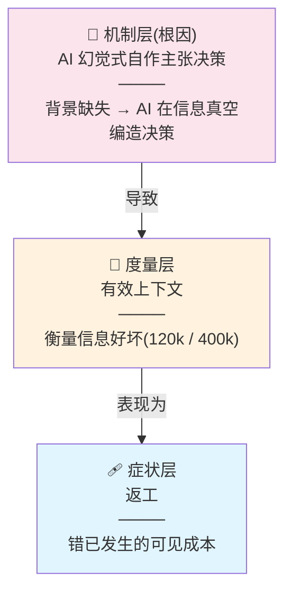
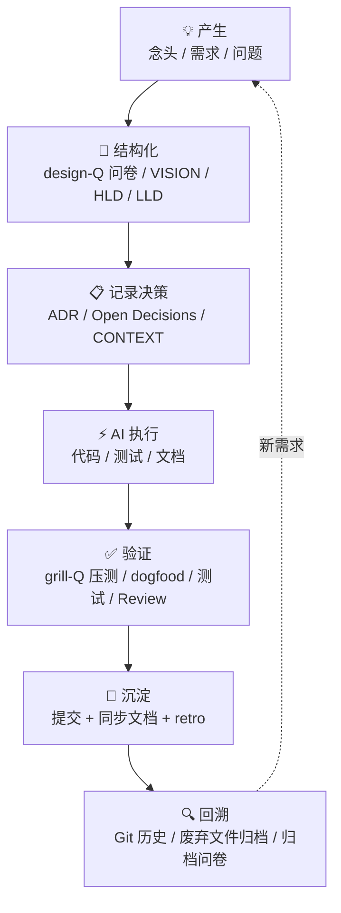
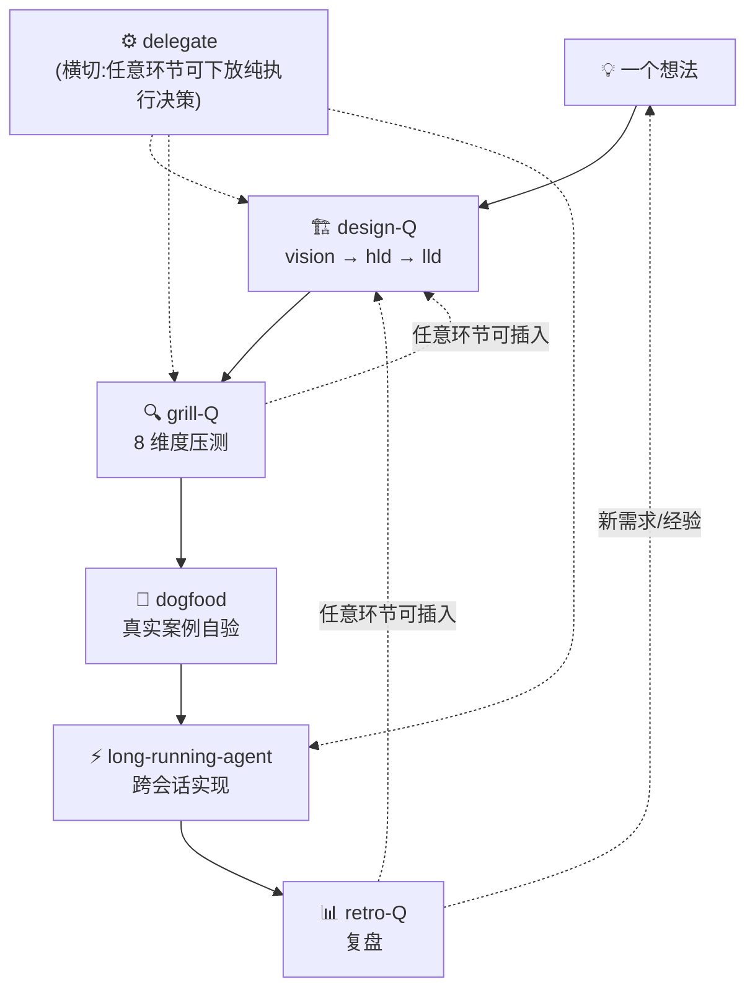

# 以信息为核心的 Claude Code AI Native 开发经验 v3

> ⚠️ **历史版本**:以 [methodology_v4.md](../methodology_v4.md) 为 current(2026-08-05 起)。本文件保留作历史母本(2026-07-29 至 2026-08-05 为 current)。

> **版本谱系**:v1 单支柱(以信息为核心)→ v2 双支柱(+ 驾驭工程 = AI × 软件工程)→ **v3 补全第一支柱机制层**(把「对抗 AI 幻觉式自作主张决策」从一句隐性修饰提升为显性立论)。
>
> **v3 演进推导链**:作者本意(vibe coding 中背景交代不全 → AI 自作主张 → 幻觉)→ v2 写作中工程化可度量措辞替换了尖锐本意 → 立论偏离(「返工」「有效上下文」两个外围框架把机制层挤到边缘)→ grill-Q 压测抓出偏离 → v3 补全机制层。v2 保留作历史母本,本文件为 current。
>
> **本文独立成文**——方法论内核自包含,不依赖任何外部文档。skill 家族是方法论的执行体(把流程自动化),但方法论本身在本文完整阐述;读本文不需先读各 skill 的规格文档。
>
> **三块拆分(2026-08-04,[ADR-0007](../../../harness/adr/0007-methodology-three-way-split.md))**:本文件为**方法论文件**——「怎么做」的完整阐述,自包含;「为什么」(失败模式 / 人机分工 / 元原则)见 [哲学文件](../philosophy_v4.md)(canonical 成员);「怎么用」(skill 使用时机 / 工具规范 / 上下文操作链)见 [实操文件](../practical_v1.md)(非 canonical,轻量修订)。

---

> **问题引子**:传统 vibe coding 中背景交代不全 → AI 自以为是、自作主张决策 → 幻觉 → 返工——本方法论的全部流程都在对抗这条因果链(§五 问答逐步对齐需求,是对抗此机制的直接手段)。完整失败模式与两类信息断层分析见 [哲学文件 §一](../philosophy_v4.md#一vibe-coding-失败模式与信息断层)。

## 零、适用场景

### 谁适合读这篇文档

- **1–5 人小型团队**或**个人开发者**,每个人身兼多职(PM + 开发 + 测试 + 运维)
- **用 AI 直接写代码(vibe coding)却频繁遭遇"AI 自作主张"返工的开发者**——这是 v3 的首要治理对象
- 有明确目标的功能开发或产品构建,需要从念头一路走到交付
- 希望用 AI 大幅降低开发中的决策成本和时间成本,但不希望 AI 接管判断权
- 认同"先想清楚再动手"的理念,愿意在规划上投入时间

### 谁不太适合

- **大型跨职能团队**(>10 人):需要正式的 PRD、多角色评审会、跨部门对齐,本文的轻量流程不能替代这些组织级的协调机制
- **纯探索性 Spike**:目标是"试试看这个东西能不能跑通"而非交付功能,不需要完整规划流程
- **对 AI 完全不信任的场景**:本文假设 AI 是可用的执行伙伴

### 任务类型与流程适配

本文的 **5 环节闭环**(design-Q → grill-Q → dogfood → retro-Q → long-running,见第四章)针对**从零开始的功能开发**。日常开发中的其他任务类型按需裁剪:


| 任务类型         | 建议流程                                                                      |
| ------------------ | ------------------------------------------------------------------------------- |
| **功能开发**     | 完整 5 环节闭环                                                               |
| **Bug 修复**     | 定位 → 写复现测试 → 修复 → 验证 → retro(跳过 design-Q)                    |
| **重构**         | 明确重构目标 → grill-Q 压测目标架构 → 写测试保护 → 重构 → 验证测试通过    |
| **依赖升级**     | 阅读 changelog → 升级 → 跑测试 → 修复 breaking changes                     |
| **探索性 Spike** | 写目标假设 → 快速验证 → 记录结论(无论成功失败)→ retro 决定是否转为功能开发 |

> 无论哪种任务类型,核心原则不变:想清楚再动手,验收标准明确,结论要沉淀。

### 阅读建议

本文是方法论,不是教条。读者应按自己的项目和团队规模调整。每个章节可以独立参考——即使不采用完整闭环,其中的 Grill 决策方法、需求执行规范、信息管理规范也可以单独使用。

方法论已沉淀为 skill 家族(见 [§8.3](../practical_v1.md#83-skill-使用时机--v2-分类表)),每个环节都有对应的执行体把流程自动化。你可以先读本文理解方法论内核,再按需取用对应 skill;也可以直接用 skill,在产出中反推方法论。

---

## 二、核心理念

v2 把核心理念从 v1 的单支柱升级为**双支柱**;v3 补全第一支柱的**机制层**。两者相乘,缺一为零。

### 2.1 第一支柱:以信息为核心

> **第一支柱 · 以信息为核心**——与 AI 协作的本质是信息流转;瓶颈不只是有效上下文的质与量,更在于对抗 AI 在信息真空中的幻觉式自作主张决策,故用问答逐步对齐需求。

与 AI 协作的本质是**信息流转**——上下文进入模型,模型产出结果,结果沉淀为新的信息。

#### 机制层:背景缺失 → AI 自作主张

当背景信息缺失时,AI 不会停下来承认"我不知道"——它会在**信息真空**中自作主张:编造它不知道的项目约定、数据格式、边界条件,而且编得滴水不漏(见 [§1.1](../philosophy_v4.md#11-vibe-coding-的失败场景)的失败场景)。这是返工的真正源头:

> **背景缺失 → AI 在信息真空中的幻觉式自作主张决策 → 返工。问答逐步对齐需求,是对抗此机制的直接手段。**

这条因果链是 v3 补全的立论核心:v2 只在"有效上下文"定义里用"不易产生幻觉"一句带过,v3 把它提升为机制层——返工框架与有效上下文框架都挂在它下面。

#### 三层立论模型(机制层 → 度量层 → 症状层)

v3 把第一支柱组织为三层。**注意:三层是因果链,不是同级分类**——机制层(根因)→ 导致 → 度量层 → 表现为 → 症状层:



旧框架不被否定:v2 的「有效上下文」与「返工」依然有效——v3 补上的是它们底下的根因层。返工是症状(错已发生的可见成本);有效上下文是度量(信息投喂得好不好);机制层回答"为什么信息缺失时几乎必然返工"——因为 AI 会在真空中自作主张。

#### 度量层:有效上下文

所谓"有效上下文",是指不易产生幻觉、精准命中当前任务的信息量。上下文越多不代表越好:对于 200k 上下文模型,有效上下文经验值约 120k;对于 1m 上下文模型,约 400k。噪音会稀释模型的注意力。

**缺失与过载是两个环节的问题,并不矛盾**:背景缺失制造信息真空(机制层问题,对策是问答对齐补背景);会话内上下文过载稀释注意力(度量层问题,对策是先用 design-Q 等 skill 把决策沉淀落盘、再 /compact 压缩,见 [§7.6](../practical_v1.md#76-会话恢复策略))。两者各有对策,不可混为一谈。

因此整个开发工作流应该围绕信息管理来设计:**精准投喂、及时沉淀、绝不丢失**——并以问答对齐对抗信息真空中的自作主张(第五章)。

### 2.2 第二支柱:驾驭工程 = AI + 软件工程

v1 把"以信息为核心"作为唯一支柱,但实践中发现它不够——信息流转高效,但若没有工程纪律的骨架,AI 产出的代码会悄悄劣化。v2 显式提炼第二支柱:

> **驾驭工程 = AI × 软件工程。AI 是加速器,软件工程的纪律是骨架,两者相乘,缺一归零。**

"软件工程的纪律"在本方法论里具体指:设计先行(VISION/HLD/LLD)、TDD、小步提交、Code Review、ADR、需求执行规范、复盘。这些不是 AI 的对手,而是 AI 产出的质量护栏。AI 让这些纪律的执行成本大幅下降(自动生成测试、即时审查、批量问卷),但纪律本身不能省。

- **AI 让工程纪律更便宜**:过去写一份 ADR 要半天,现在 grill-Q 压测 + AI 起草几分钟出草稿;过去 TDD 写测试是负担,现在 AI 生成测试用例,人审阅。
- **工程纪律让 AI 更可靠**:没有测试护栏,AI 重构会引入隐蔽 bug;没有设计文档,AI 实现会走偏;没有复盘,AI 反复踩同一个坑。

### 2.3 两条被否决项(防走极端)

v1 §6.5 要求关键决策给出被否决项,本节以身作则:


| 被否决项              | 症状                                           | 为什么错                                                                           |
| ----------------------- | ------------------------------------------------ | ------------------------------------------------------------------------------------ |
| ❌**AI 替代工程纪律** | 盲信 AI,跳过测试/设计/审查,"AI 说没问题就合入" | AI 产出质量下降而不自知;失去护栏的 AI 是隐患放大器。v1 元原则"盲目信任 AI"失败模式 |
| ❌**纯工程不用 AI**   | 固守手工流程,写设计/测试/文档全靠自己          | 放弃加速,被 AI 时代的同行甩开;小团队失去"以一当五"的杠杆                           |

**正道**:AI 加速工程纪律的**执行**,工程纪律约束 AI 的**产出**。两者是乘法关系,不是替代关系。

---

## 三、信息生命周期



每一个阶段的信息都必须有落盘位置,确保:

- 当前自己可回溯
- 未来自己可理解
- AI 在后续会话中可重新加载为上下文

**v2 新增的信息流转形态**(在上述生命周期内):

- **批量问卷**(design-Q/grill-Q/retro-Q):把"一问一答"的信息流转改为"多波次离线作答",问卷文件本身即是落盘的决策记录,归档后可回溯。
- **dogfood 回灌**:产物自验发现的缺口,即时回修规格,是"验证 → 结构化"的反馈环。
- **归档只移不删**:已处理问卷移入 archive/,文件名不变,信息永不丢失。

---

## 四、开发工作流

> 这是本文的核心章。v2 把 v1 的线性 6 阶段(念头→构想→全局设计→分阶段设计→实现→复盘)升级为 **5 环节闭环 + 横切**,每个环节都有对应的 skill 执行体,且 grill-Q / dogfood / retro / delegate 作为**正交可插入**的方法论,不锁死在固定位置。

### 4.1 整体闭环



闭环要点:

- **主路径**:想法 → design-Q(设计)→ grill-Q(压测)→ dogfood(自验)→ long-running(实现)→ retro(复盘)→ 回到想法。
- **横切**:delegate 在任意环节都可触发(纯执行类决策下放)。
- **可任意插入**:grill-Q、dogfood、retro、delegate 不是线性阶段,是正交方法论——任意环节遇到对应问题都能调用。例如实现期(long-running)中途发现某个设计盲点,可临时插入 grill-Q 压测该点;任意节点可插入 retro 复盘流程本身。

### 4.2 环节详解

#### 环节 1:design-questionnaire(设计期 · 生成式)

把"一问一答的 grill 设计"改为"多波次问卷"。从一句话想法展开为完整设计,分三个阶段:


| 阶段       | 对应 v1 概念 | 产物             | 盘问内容                                      |
| ------------ | -------------- | ------------------ | ----------------------------------------------- |
| **vision** | 构想文档     | VISION.md        | 目标、范围、核心场景、验收标准、风险约束      |
| **hld**    | 全局设计     | docs/design/ HLD | 系统架构、技术选型、接口契约、ADR、部署运维   |
| **lld**    | 分阶段设计   | docs/design/ LLD | 阶段目标、详细设计、接口规格、DoD、依赖、预估 |

**关键机制**:

- **preview 预答层(W00)**:每阶段先生成一份独立的决策默认值清单,一条一行(决策点 + AI 默认倾向 + 来源)。用户逐条作答:勾 = 采纳默认,留空 = 转正式题深究。把"显然的决策"批量快过,精力集中在真正有分歧的点上。
- **阶段闸门**:阶段内终止由 agent 判断(出示覆盖清单),跨阶段必须用户显式确认。
- **环境现实验证**:凡涉及外部依赖(库、工具链、路径、版本),出题前必实测编译链接,不只查"装没装"。库存在 ≠ 能用。
- **落盘**:VISION / HLD / LLD / ADR / OPEN-DECISIONS / CONTEXT,本波处理完即刻写,不批处理。

#### 环节 2:grill-questionnaire(设计后 · 对抗式压测)

把"一问一答的 grill 压测"改为"多波次问卷"。design-Q 产出设计草稿后,用 8 个固定压测维度套到设计每条关键声明上,找漏洞、盲点、单向门:


| 维度                     | 压测什么                                           |
| -------------------------- | ---------------------------------------------------- |
| **D1 未言明假设**        | 设计建立在哪些没说出口的假设上?成立/存疑/失效      |
| **D2 单向门/可逆性**     | 哪些选择难逆转?该进 ADR 还是 OD?                   |
| **D3 替代方案/被否决项** | 关键决策给了被否决项吗?还是只有一个方案?           |
| **D4 失败模式/爆炸半径** | 出错时怎样?能否降级?影响面多大?                    |
| **D5 盲点**              | 该说没说的:边界、错误路径、并发、回滚、迁移        |
| **D6 可验证性**          | 验收标准可检查,还是空话?                           |
| **D7 与现实的矛盾**      | 设计说 X,但代码/CONTEXT/ADR 是 Y(压测最值钱的一项) |
| **D8 术语一致性**        | 用词与 CONTEXT 定义冲突/重载/模糊?                 |

**铁律**:**只产出发现,不替改工件**。压测发现的漏洞进处理报告,工件修订由人发起(收尾时主动询问是否执行)。可沉淀项(满足 ADR 三条件的决策、单向门风险、术语冲突)即时落盘。

**何时用**:design-Q 收尾时主动提议一次;也可随时手动触发压测任意已有工件(ADR 草稿、架构提案、计划)。

**层位与交接**(80/20 判断成本原则,见 §5.2):grill-Q 是「80% 可预知基础问题」的批量处理层——D1–D8 本质是已知攻击面的知识沉淀;压测发现的 20% 关键深水区(依赖链深、需即时反馈)转 grill-with-docs 一问一答深钻,深钻结晶成工件后可再交 grill-Q 复压,构成 80% ↔ 20% 双向交接。

#### 环节 3:dogfood(任意环节 · 产物自验)

v1 缺这一环。v2 把它提升为方法论级:产物是**工具 / 流程 / 模板 / skill / 配置 / 脚本**时,收尾前在真实小案例上完整走一遍闭环,缺口即时回修规格。

**为什么需要**:设计-实现-验证闭环里,"验证"通常指验证代码功能。但工具/流程类产物的"功能"是"能不能被正确使用"——这必须靠真实案例自验,不能靠想当然。

**怎么做**:

- 用产物在真实小案例上跑完整闭环(例:用新设计的 skill 走完一个真实功能的设计→压测→实现)。
- 发现的格式/流程缺口,即时回修产物规格。
- 跳过与结果都记录(跳过要标理由,不能默默跳过)。

**不强制**:纯代码功能开发可不 dogfood(测试即自验);工具/流程类产物强烈建议。

#### 环节 4:retro-questionnaire(任意环节 · 复盘)

把"写复盘文档"改为"多波次问卷"。v1 把复盘锁在阶段 6(末尾),v2 重新定位:**retro 是可任意环节插入的方法论**。

**两类复盘**:

- **项目复盘**(阶段/项目末):What went well / What went wrong / 架构偏离 / 学到什么 + Action Items。
- **方法论/流程复盘**(任意节点):复盘流程本身——这次哪些环节帮到了你,哪些是走形式。对应 v1 元原则"方法论本身也在迭代"。

**落盘**:retro 文档 + Action Items 写入 TODO.md(问题 → 行动 → 核验时机)。

#### 环节 5:long-running-agent(实现期 · 跨会话约束系统)

v1 的实现期描述薄(只有 TDD/小步提交)。v2 把 long-running-agent 作为实现期核心执行纪律,系统化对抗**跨会话失忆**——长项目第一杀手。

**核心理念**(基于 Anthropic《Effective harnesses for long-running-agents》):

- **增量工作**:一次只处理一个功能,完整实现→测试→提交→下一个。
- **清晰工件**:为下一会话留下清晰的进度记录(写进文件,不是上下文)。
- **整洁状态**:代码始终处于可合并到主分支的状态。
- **端到端验证**:只有通过完整测试才标记功能完成。

**核心文件**:


| 文件                  | 用途                                                       |
| ----------------------- | ------------------------------------------------------------ |
| `feature_list.json`   | 所有功能需求及状态(passes: true/false);首会话创建,后续更新 |
| `claude-progress.txt` | 每个会话的工作记录;会话结束更新,最新在顶部                 |

**从落盘文件重建上下文(关键机制)**:会话上下文会被压缩而丢失设计期决策细节。long-running 不依赖会话上下文,而是从落盘文件重建——有 design-Q 产物则读 VISION/HLD/LLD + 归档问卷反推 feature_list;无则读 progress + feature_list + git log。无论上下文是否被压缩,落盘文件都是 source of truth。

**功能标记规则**:

```
[OK] 全部端到端测试通过 → passes: true
[X]  未测就标 true —— 禁止
[X]  测试失败跳过   —— 禁止(隐藏问题)
[X]  删除功能项减负 —— 禁止(功能永久丢失)
```

#### 横切环节:delegate(任意环节 · 决策下放)

v1 §6.5 决策分层最底层"纯执行"埋了下放的种子,v2 把它系统化为 delegate。详见 §5.5。

### 4.3 方法论可任意插入

v2 与 v1 线性 6 阶段的关键区别:**grill-Q / dogfood / retro / delegate 是正交方法论,不是线性阶段**。


| 方法论   | 何时插入                   | 典型场景                                             |
| ---------- | ---------------------------- | ------------------------------------------------------ |
| grill-Q  | 任意环节,有工件要挑战时    | design-Q 收尾压测、实现中发现设计盲点、ADR 草稿审查  |
| dogfood  | 任意环节,产物是工具/流程时 | skill 设计完、模板定稿、配置方案成型                 |
| retro    | 任意环节,要反思时          | 阶段末项目复盘、流程走偏时方法论复盘、踩坑后即时复盘 |
| delegate | 任意环节,纯执行决策密集时  | 命名/格式/版本号批量决策、问卷归档操作               |

对比 v1 把复盘锁在末尾、把 Grill 锁在构想和实现期,v2 让方法论随取随用。

### 4.4 与传统 SDLC 的映射(v1 6 阶段降级为此表)

v1 的 6 阶段仍是理解方法论的好框架,但执行已并入 5 环节闭环:


| v1 / 传统阶段 | v2 对应                    | 说明                         |
| --------------- | ---------------------------- | ------------------------------ |
| 念头          | 想法(design-Q vision 输入) | 一句话 + 动机                |
| 构想文档      | design-Q**vision** 波      | 问卷化,不再手写              |
| 全局设计      | design-Q**hld** 波         | 含 ADR                       |
| 分阶段设计    | design-Q**lld** 波         | 含 DoD                       |
| 实现          | **long-running-agent**     | 系统化跨会话纪律             |
| 复盘          | **retro-Q**                | 问卷化,可任意环节插入        |
| —(v1 无)     | **grill-Q** 压测           | v2 新增:设计后对抗式压测     |
| —(v1 无)     | **dogfood** 自验           | v2 新增:工具/流程类产物自验  |
| —(v1 无)     | **delegate** 下放          | v2 新增:纯执行决策系统化下放 |

---

## 五、Grill 决策方法论

Grill 是本方法论的决策引擎。v2 把 v1 的"一问一答"升级为"两族 Grill"。

### 5.1 核心原则

**不替用户做决策,而是帮用户看清决策。**

人的职责是判断,AI 的职责是追问盲区、呈现选项、分析利弊。Grill 过程中,"推荐选项"只是降低决策负担的输入,不是最终决定。

#### (a)(b) 盲区:背景缺失的两类 ★ v3

§2.1 机制层说"背景缺失 → AI 自作主张"。但"补齐背景"有一个隐藏难点:**背景缺失有两类,对策不同**:

- **(a) 知道但没写**:背景在作者脑子里,只是没交代给 AI——项目约定、历史决策、不能动的老代码。这类缺失可被**结构化提问捕获**:design-Q 的 preview 预答层和问卷题把你"知道但没写"的决策逐条问出来。
- **(b) 自己也不知道**:作者自己都没意识到的隐含假设——"我以为订单一定能部分取消,从没说过,因为我从没想过还有别的情况"。这类缺失**问不出来**,因为你不知道要交代什么;只能靠 **grill 的对抗式压测逼出来**——D1 未言明假设、D7 与现实的矛盾,专打这类盲区。

(b) 是 AI 幻觉最危险的温床:人没说、AI 就编,而且人审阅时同样意识不到这里有个假设。**grill 的不可替代性正在于逼出 (b)**——这是问答对齐区别于"文档完备主义"(以为写全文档就万事大吉)的本质。

### 5.2 演进说明:从一问一达到批量问卷

> **v1 假设**:Grill 必须一问一答("一次只问一个问题,等待回答后再进入下一个")。
> **v2 破除**:实践证明设计/压测/复盘类决策可以批量化。

**演进理由**:一问一答的最大成本不是"问",而是"每问等一轮 LLM 输出"的串行等待。10 个决策串行问 = 10 轮等待。改成多波次问卷:一次出 10–15 题,用户离线作答,agent 一次性解析落盘——串行等待压到最低,且**不损失决策权**(每题仍有 ★推荐 + 🤔 逃生舱 + 即时落盘,人仍是决策者)。

**保留一问一答的场景(80/20 判断成本原则)**:批量问卷以 20% 的时间高速处理 80% **可预知**的基础问题(问题空间已知、可批量、可离线);依赖链深、需即时反馈的 20% **关键**问题——实现期单点二义性(一个具体模糊点深钻)、计划评审(逐点确认)——保留一问一答,投入 80% 的时间。判断成本按二八分配,不在基础题上消耗。这是 grill-questionnaire 的原初设计原则(2026-07-31 作者补述;此前从未落盘,是 (a) 类盲区「知道但没写」的活例,见 §5.1)。

### 5.3 两族 Grill


|            | 批量问卷族                          | 单点深钻族                   |
| ------------ | ------------------------------------- | ------------------------------ |
| **skill**  | design-Q / grill-Q / retro-Q        | grill / grill-with-docs      |
| **交互**   | 多波次问卷,离线作答                 | 一问一答,逐轮等待            |
| **判断成本层位** | 80% 可预知的基础问题(人花 20% 时间) | 20% 关键问题(人花 80% 时间,§5.2) |
| **场景**   | 生成式设计 / 对抗式压测 / 复盘      | 实现期单点二义性、计划评审   |
| **骨架**   | 有(vision/hld/lld;或 D1–D8;或四节) | 无(纯追问)                   |
| **落盘**   | 阶段文档 / ADR / OD / CONTEXT       | grill-with-docs:CONTEXT / ADR / OD;grill:纯对话零留痕(仅用户要求才写) |
| **何时用** | 决策密集、可离线、要批量            | 依赖链深、决策未成形、要即时反馈 |

**选择原则**(二八判据):问题可预知、决策密集、可离线 → 批量问卷族(80% 基础问题);依赖链深(下一题取决于上一题)、决策未成形、要即时反馈 → 单点深钻族(20% 关键问题)。两者不互斥——是同一判断成本优化系统的两个层位:grill-Q 压测发现的深水区转 grill-with-docs 深钻(80% → 20%);with-docs 深钻结晶成工件后交 grill-Q 复压(20% → 80%)。同一项目可先后都用。

### 5.4 逃生舱机制与降风险协议

#### 逃生舱

每个问题都必须提供"我定不了"的出口。用户不确定时,不逼迫、不反复追问。用户无法决定的原因通常是三种之一:**知识缺口**(不了解领域)、**经验缺口**(没经历过类似场景)、**无法预判**(需要未来的信息)。在这三种情况下强迫决策,得到的只能是随机选择。

#### 降风险协议

当用户无法决定时,不强迫决策,而是**把决策变安全**:

**第一步:判断可逆性**


| 门类型     | 定义                                                     | 处理                                                                     |
| ------------ | ---------------------------------------------------------- | -------------------------------------------------------------------------- |
| **双向门** | 改主意成本极低——命名、内部结构、配置项、默认值         | 直接选推荐项往前走,同时留痕(采用推荐 + 标"双向门/provisional"+ 重访触发) |
| **单向门** | 改主意成本高——数据库选型、公开 API、认证方案、部署目标 | 进入第二步                                                               |

**第二步:推迟或缩小**——能整个推迟 → 进 Open Decisions;能先定最小可逆切片 → 定切片,不可逆部分进 OD。核心技巧:找最可逆的占位方案。

**第三步(最后手段)**:必须现在定且不可逆 → 给明确推荐 + 推理过程 + 可逆性评估,用户角色降级为"否决或接受",进 OD 并标 provisional。

### 5.5 决策分层与决策下放

#### 决策分层:按风险分配精力

决策精力是有限资源,应按风险等级分层:


| 层级         | 特征                                        | 处理                            | 精力 |
| -------------- | --------------------------------------------- | --------------------------------- | :----: |
| 🔴 高 stakes | 单向门 + 高风险(数据库选型、公开 API、认证) | 完整 grill → ADR → 确认后动工 |  高  |
| 🟡 中 stakes | 单向门 + 低风险,或双向门影响面广            | grill 快速确认 → 轻量记录      |  中  |
| 🟢 低 stakes | 双向门(变量命名、默认参数、文件组织)        | 直接选推荐,不消耗精力           |  低  |
| ⚪ 纯执行    | 无判断需求(CRUD、写测试、格式化)            | **可下放 AI**,人只验收          |  零  |

#### 决策下放(delegate)★ v2 新增

v1 的"纯执行交 AI"是种子,v2 把它系统化为 delegate 机制。最底层的纯执行类决策可以**系统化下放**给 AI,而非每次都问人:

**可下放(白名单治理,人逐类审查确认)**:

- 文件命名、版本号递增
- commit message 措辞
- 格式排版、TODO 条目化
- 问卷归档操作

**永不下放(安全/不可逆/价值判断)**:

- 安全关键代码与配置(认证、授权、加密、输入校验、密钥处理)
- 合并/发布签字
- VISION 修订
- 权限/Policy 变更
- 删除类操作

**机制**:

- **白名单查阅**:delegate 只处理白名单内的决策类。
- **留痕**:每次下放写入 delegation-log(决策、依据、结果),可审计。
- **整体紧急开关**:出问题时一键关闭下放,回到"全部问人"。

**边界由人逐行审**:白名单与永不下放清单是治理文件,必须人逐行审查确认,不是 AI 自定。delegate 处于试点阶段,边界随 dogfood 数据迭代。

### 5.6 文件体系:决策的落盘

Grill 过程中产生的信息必须即时沉淀,不批处理:


| 文件                       | 存什么                                                                  | 创建时机                    |
| ---------------------------- | ------------------------------------------------------------------------- | ----------------------------- |
| **CONTEXT.md**             | 领域术语表——概念的精确定义、别名、歧义澄清。纯术语,不放决策或实现细节 | 第一个术语确定时(懒加载)    |
| **harness/adr/**              | 已做出的架构决策(背景→决策→替代方案→后果)                            | 第一个符合条件的 ADR 出现时 |
| **docs/OPEN-DECISIONS.md** | 被推迟的决策——问题、推迟原因、当前占位方案、可逆性、**重访触发条件**  | 第一个决策被推迟时          |

**ADR 的创建门槛**——必须同时满足三个条件:

1. **难逆转**——改主意的成本有实际意义
2. **缺上下文会让人困惑**——未来读者会想"为什么这么做?"
3. **经过了真实权衡**——确实有其他选项,不是唯一解

三条缺一条 → 不写 ADR。大部分决定不值得 ADR。

**Open Decisions 的强制字段**:推迟原因、当前占位方案、可逆性、**重访触发条件**(具体信号,不是"以后")。没有重访触发条件的推迟 = 伪装成决策的遗忘。

### 5.7 Grill 中的关键行为


| 行为                 | 说明                                                               |
| ---------------------- | -------------------------------------------------------------------- |
| **挑战术语冲突**     | "你的术语表里 X 定义为 A,但你现在似乎指 B——到底是哪个?"          |
| **收敛模糊语言**     | 用户说"账户"——是 Customer 还是 User?提出精确的规范术语           |
| **用具体场景测边界** | 构造边界场景测试领域关系的健壮性                                   |
| **与代码交叉验证**   | 用户说的和代码实际做的如果不一致,立即指出                          |
| **即时更新文档**     | 术语确定 → 立刻写 CONTEXT.md;决策推迟 → 立刻写 OPEN-DECISIONS.md |

---

## 七、信息管理规范

> §7.4 上下文管理 / §7.5 上下文层级体系 / §7.6 会话恢复策略(操作链)已移至 [实操文件](../practical_v1.md),编号沿用 v3。

### 7.1 文档载体

所有设计文档、决策记录、复盘文档一律用 Markdown:纯文本 Git 可 diff;AI 可直接读取;跨平台永不过时。

### 7.2 文件版本管理

- 用版本号命名(`_v1`、`_v2` 递增),禁止 `final` / `new` / `copy` 等后缀
- 创建新文件前检查同目录已有版本,取 max+1
- 废弃文件归入 `waste/` 目录,记录废弃原因,不直接删除
- **绝不删除有内容价值的文件**——宁可归档也不删除

### 7.3 同步文档

在以下时刻更新相关文档:做出架构决策 → 更新 ADR;设计变更 → 更新设计文档(标注原因和日期);Open Decision 有结论 → 移到已关闭列表;阶段完成 → 更新进度文档。

**不一致的设计文档比没有设计文档更危险**,因为它提供虚假的安全感。

### 7.7 多项目管理

小型团队经常同时推进 2–3 个项目。关键:项目级 CLAUDE.md 隔离;Memory 按项目隔离;**用户级 Skill 跨项目共享**(方法论执行体一次安装,多项目复用);每个项目维护一个进度文件,切换回来第一件事读它。

### 7.8 安全警示

把信息喂给 AI 时,几类信息**绝不能**出现在对话中:


| ❌ 禁止喂入                              | 原因                            |
| ------------------------------------------ | --------------------------------- |
| API 密钥、Token、密码、证书              | 对话内容可能被用于训练或日志    |
| 用户隐私数据(真实姓名、身份证、银行卡号) | 合规风险                        |
| 公司未公开商业机密                       | 信息安全风险                    |
| 安全关键代码的完整实现(认证、加密)       | AI 生成的认证逻辑可能有隐蔽漏洞 |

**安全底线**:安全相关代码(认证、授权、加密、输入校验、密钥处理)**必须由人审查每一行**;敏感配置用占位符;不确定能不能贴,默认不贴。**安全相关决策永不下放**(见 §5.5 delegate 永不下放清单)。

---

## 九、需求执行规范

### 9.1 核心原则

**严格按照需求文档/设计文档执行,不得遗漏、简化或改变任何要求。**

拿到需求文档后的最大风险不是实现不了,而是**自以为实现了全部要求,实际漏了关键细节**。

### 9.2 四步执行法

**第一步:完整提取要求**——开始前完整阅读需求文档,提取所有要求(模型类型/参数/配置、函数/功能/方法、公式/算法、图片/图表、数据处理、输出格式)。

**第二步:创建检查清单**——编码前先根据提取结果创建检查清单:

```
[ ] 模型:类型 / 参数 / 训练方式
[ ] 功能:函数1 / 函数2 / 功能3
[ ] 公式:公式1 / 公式2
[ ] 输出:文件1 / 格式1
```

**第三步:严格按清单执行**——每完成一项打勾;所有要求必须实现,不得跳过;不确定处必须向用户确认,不要自行猜测。

**第四步:生成后对照检查(最重要)**——逐项对照清单;能脚本化的 DoD 都脚本化(自动验证脚本检查关键约束);逐项用 `[OK]` / `[X]` 报告:

```
[OK] 模型:RandomForestRegressor (n_estimators=1000)
[OK] 功能:data_clean(), train_model(), evaluate()
[OK] 公式:使用公式 y = ax + b
[OK] 图片:已生成 feature_importance.png
```

### 9.3 验收机制整合 ★ v2

v1 只有清单对照法,v2 整合 long-running-agent 的功能级验收,两者互补:


| 验收机制               | 适用场景                   | 怎么做                                                                         |
| ------------------------ | ---------------------------- | -------------------------------------------------------------------------------- |
| **清单对照法**         | 需求/算法/数据/文档类任务  | 完整提取 → 检查清单 → 执行 →`[OK]`/`[X]` 逐项对照 + 自动验证脚本            |
| **功能级 passes:true** | 功能开发类任务(有功能列表) | feature_list.json 每个功能跑端到端测试,全过才`passes: true`;未测就标 true 禁止 |

**选择原则**:任务有明确的"功能列表"(一个个可独立验证的功能)→ 用 passes:true;任务是"满足一组要求"(参数、公式、输出格式)→ 用清单对照法。两者不互斥,复杂项目可同用(功能级 passes:true + 每功能内部清单对照)。

### 9.4 常见违规(绝对禁止)

- **遗漏要求**:要求 XGBoost n_estimators=1000,却用 RandomForest n_estimators=500
- **简化实现**:要求三个函数,却只写一个 main()
- **使用错误公式**:要求 R² = 1 - SS_res/SS_tot,却用相关系数公式
- **生成后不检查**:直接说"完成"而不对照需求
- **未测就标 passes:true**:long-running 禁止行为,产生不可靠的功能状态

---

## 十、与传统开发流程的对照


| 传统流程                  | 本方法论                | 关键差异                           |
| --------------------------- | ------------------------- | ------------------------------------ |
| MRD                       | VISION 的动机部分       | 更轻量,不要求市场数据              |
| PRD                       | design-Q vision 波      | 面向自己思考,问卷化产出            |
| HLD                       | design-Q hld 波         | 融合 ADR                           |
| LLD                       | design-Q lld 波         | 含 DoD 和验收标准                  |
| 迭代计划                  | design-Q lld 的阶段划分 | 每阶段自带验收条件                 |
| 需求评审/设计评审         | **grill-Q 压测**        | 用批量问卷替代多人会议             |
| —                        | **dogfood 自验**        | 传统流程无工具/流程产物自验        |
| 复盘                      | **retro-Q**             | 问卷化,可任意环节插入              |
| 长期实现管理              | **long-running-agent**  | 传统靠经验,本方法论系统化          |
| 决策下放                  | **delegate**            | 传统无机制,本方法论白名单治理      |
| —                        | Open Decisions          | 传统常遗漏"尚未决定的事"           |
| 领域建模(DDD)             | CONTEXT.md + grill      | 用术语表和结构化追问替代繁琐仪式   |
| PM + QA + Review + DevOps | AI 辅助替代             | 传统 4–5 人,本方法论 1–2 人 + AI |

---

## 十一、常见误区

1. **让 AI 做决策** — AI 提供选项和利弊,最终选择必须人来做。
2. **信息散落各处** — 聊天记录里的决策、临时笔记,必须落地到文档。
3. **设计文档写完不更新** — 实现中发现设计要调整,却不更新文档,导致文档与代码脱节。
4. **跳过设计直接写代码** — 有明确目标的功能开发,未想清楚就写代码是浪费上下文。
5. **不写验收标准** — 没有 DoD,永远不知道是否做完,陷入无限打磨。
6. **不做复盘** — 每次从零开始。retro-Q 是最好的学习材料。
7. **一次性灌入过多上下文** — 把整个代码库喂给 AI 只会让注意力稀释。
8. **把废弃文件直接删除** — 归档到 waste/,不要删除。
9. **推迟决策却不记录** — "以后再说"没有重访触发条件,等于遗忘。
10. **把双向门当单向门纠结** — 命名、内部结构改起来成本低,先判断可逆性。
11. **对每个决策花同样精力** — 决策精力有限,参考 §5.5 决策分层。
12. **不在会话结束时落地中间结论** — 不落地的结论等于忘了。
13. **新会话从零开始描述任务** — 先落地文档再开新会话,用恢复清单重建。
14. **问卷形式主义** ★ — 为问而问、preview 过载、决策树无限延伸永远不开始。预防:规划到"能回答核心不确定性"就停。
15. **dogfood 走过场** ★ — 跑了案例但 delegation-log 0 条,没真正自验。预防:dogfood 必须有可检查的产出。
16. **long-running 假绿** ★ — 未测就标 passes:true,产生虚假完成感。预防:端到端测试通过才标 true。
17. **引擎漂移** ★ — 多副本引擎(design-Q/grill-Q/retro-Q 共享问卷格式)不同步。预防:改一方时考量三方,漂移需声明。
18. **盲信 AI 替代工程纪律** ★ — 跳过测试/设计/审查。预防:AI × 软件工程,纪律是骨架(见 §2.2-2.3)。
19. **三层误读** ★ v3 — 把机制层/度量层/症状层读成三个同级分类,丢掉"机制层是根因"的因果方向,等于重蹈 v2 覆辙(把症状当根因)。预防:§2.1 三层表显式标明因果链(机制层 → 度量层 → 症状层)。
20. **双靶子失衡** ★ v3 — 要么只讲 vibe coding 把传统 SDLC 内容全删(丢失"AI 替代角色"的价值),要么传统叙事淹没了 vibe coding 主靶子。预防:vibe coding 主叙事限 [§一](../philosophy_v4.md#一vibe-coding-失败模式与信息断层) + 立论挂接点,传统 SDLC 内容原位保留为对照。
21. **(a)(b) 混淆** ★ v3 — 把"知道没写"(a)当"自己也不知道"(b),以为写完文档/preview 就消灭了盲区;或反过来用 grill 去逼 (a),浪费对抗式压测的火力。预防:(a) 走 preview/问卷捕获,(b) 走 grill 逼出(见 §5.1)。
22. **标准句脱节** ★ v3 — 第一支柱标准措辞改了 v3 正文,却忘了同步 CONTEXT / README / CLAUDE(或反之),四处措辞漂移。预防:核心定义子串四处一致(ADR-0005),改动时四处同改。

---

## 十二、检查清单

每次开启新开发任务时,自查:

- [ ]  有 VISION 吗?验收标准明确吗?(design-Q vision 波)
- [ ]  有 HLD 吗?关键技术决策有 ADR 记录吗?(design-Q hld 波)
- [ ]  有 LLD 吗?每个阶段 DoD 清晰吗?(design-Q lld 波)
- [ ]  设计产出经 grill-Q 压测了吗?漏洞落 OD/ADR 了吗?
- [ ]  产物是工具/流程类?dogfood 自验了吗?
- [ ]  有悬而未决的 Open Decision 需要优先解决吗?
- [ ]  **背景缺失自查了吗?——(a) 知道没写的,过 preview/问卷捕获;(b) 自己也不知道的,靠 grill 逼出(§5.1)** ★ v3
- [ ]  相关设计文档已喂给 AI 作为会话上下文了吗?
- [ ]  Git 状态干净吗?当前分支正确吗?
- [ ]  测试策略明确了吗?(单元 + 集成 + E2E 各覆盖什么)
- [ ]  每个阶段的检查清单建好了吗?(需求执行规范 §9.2)
- [ ]  长项目:feature_list.json 建好了吗?long-running-agent 启动了吗?
- [ ]  纯执行决策密集:delegate 白名单查阅了吗?
- [ ]  如果是新会话,恢复清单([§7.6](../practical_v1.md#76-会话恢复策略))准备了吗?
- [ ]  做完后打算怎么 retro?

---

## 附录 C:术语演进表 ★ v2 新增,v3 续表

v1 → v2 的术语漂移梳理(v1 §1.2 论断"信息断层导致返工",术语过载即信息断层):


| v1 称法              | v2 称法                            | 关系        | 说明                                                                              |
| ---------------------- | ------------------------------------ | ------------- | ----------------------------------------------------------------------------------- |
| Grill(统称一问一答)  | **Grill 家族**,分两族              | 分化        | 批量问卷族(design-Q/grill-Q/retro-Q)+ 单点深钻族(grill/grill-with-docs)。见 §5.3 |
| 构想文档             | **VISION**(design-Q vision 波产物) | 更名        | design-Q 问卷化产出,不再手写                                                      |
| 全局设计文档         | **HLD**(design-Q hld 波产物)       | 更名        | 含 ADR                                                                            |
| 分阶段设计文档       | **LLD**(design-Q lld 波产物)       | 更名        | 含 DoD                                                                            |
| 复盘(阶段 6 文档)    | **retro-Q**(可任意环节插入)        | 问卷化+解耦 | 不再锁在末尾                                                                      |
| 实现期(TDD+小步提交) | **long-running-agent**             | 系统化      | 跨会话约束系统(feature_list/passes:true)                                          |
| —(v1 无)            | **grill-Q 压测**                   | 新增        | 设计后对抗式 8 维度压测                                                           |
| —(v1 无)            | **dogfood**                        | 新增        | 工具/流程产物自验                                                                 |
| —(v1 无)            | **delegate**                       | 新增        | 纯执行决策系统化下放                                                              |
| —(v1 无)            | **preview 预答层(W00)**            | 新增        | design-Q 每阶段决策默认值清单                                                     |
| 上下文层级(4 层)     | 上下文层级(**5 层**)               | 扩展        | 加 Skill 层。见 [§7.5](../practical_v1.md#75-上下文层级体系--v2-五层)                                                             |

v2 → v3 的术语演进(v3 补全第一支柱机制层):


| v2 称法                        | v3 称法                            | 关系         | 说明                                                                                   |
| -------------------------------- | ------------------------------------ | -------------- | ---------------------------------------------------------------------------------------- |
| 返工([§1.2](../philosophy_v4.md#12-两类信息断层)作根因层叙述)       | 返工 =**症状层**                   | 重定位       | 不再是立论根因,是机制层后果的可见症状。见 §2.1 三层模型                               |
| 有效上下文(§2.1 唯一瓶颈)     | 有效上下文 =**度量层**             | 重定位       | 衡量信息投喂好坏,挂机制层下;120k/400k 经验值不变                                       |
| —(v2 无,仅"不易产生幻觉"一句) | **机制层 = AI 幻觉式自作主张决策** | 新增(显性化) | 背景缺失 → 信息真空 → 自作主张。见 §2.1                                             |
| —(v2 无)                      | **vibe coding**                    | 新增         | 不交代背景、AI 自由发挥的编程方式;v3 首要治理对象。见 §1.1                            |
| —(v2 无)                      | **(a)(b) 盲区**                    | 新增         | 背景缺失两类:(a) 知道没写 → preview/问卷捕获;(b) 自己也不知道 → grill 逼出。见 §5.1 |
| —(v2 无)                      | **信息真空**                       | 新增(别名)   | 背景缺失的形象说法:AI 在其中自作主张的真空地带。见 §2.1                               |
| 信息断层(单一叙述)             | **两类信息断层**                   | 细化         | 人与人断层 → AI 替代角色(见 [§6.2](../philosophy_v4.md#62-ai-替代的传统角色));人与 AI 断层 → 问答对齐(§5)。见 [§1.2](../philosophy_v4.md#12-两类信息断层)               |
| —(v3 无,仅隐性设计意图)     | **80/20 判断成本原则**             | 新增(显性化) | 批量问卷以 20% 时间处理 80% 可预知基础问题;20% 关键问题保留一问一答,投 80% 时间。grill-Q 原初设计原则,2026-07-31 作者补述((a) 类盲区活例)。见 §5.2/§5.3 |

---

## 附录 D:参考来源与延伸阅读

### 本文各章节灵感来源


| 章节                               | 来源                                                                                                              |
| ------------------------------------ | ------------------------------------------------------------------------------------------------------------------- |
| 一、vibe coding 失败模式与信息断层 | 作者 vibe coding 实践本意 + 小型团队开发实践 + 软件工程返工成本研究;v3 两类断层区分经 grill-Q 压测细化            |
| 二、核心理念                       | AI 协作实践;v2 双支柱经多个真实项目实践提炼;v3 机制层(三层立论模型)经 grill-Q 压测补全                            |
| 四、开发工作流                     | v1 六阶段 + skill 家族(design-Q/grill-Q/retro-Q/long-running/delegate)实践                                        |
| 五、Grill 方法论                   | Claude Code grill 家族 skill 的设计文档;v2 演进说明经实践破除"一问一答"假设;v3 (a)(b) 盲区区分经 grill-Q 压测细化 |
| 五.5、决策下放                     | v1 §6.5 决策分层最底层 + delegate skill 试点                                                                     |
| 七.5、上下文层级                   | Claude Code 上下文加载机制;v2 加 Skill 层                                                                         |
| 九、需求执行规范                   | 全局 CLAUDE.md「需求文件执行规范」+ long-running-agent passes:true 机制                                           |

### 延伸阅读


| 概念                     | 延伸                                                        |
| -------------------------- | ------------------------------------------------------------- |
| **ADR**                  | Michael Nygard, "Documenting Architecture Decisions" (2011) |
| **TDD**                  | Kent Beck, "Test-Driven Development: By Example"            |
| **SDLC**                 | 传统软件工程教科书                                          |
| **双向门/单向门**        | Jeff Bezos, 2015 年致股东信                                 |
| **DoD**                  | Scrum 指南                                                  |
| **复盘**                 | 敏捷开发实践                                                |
| **long-running harness** | Anthropic, "Effective harnesses for long-running-agents"    |

> 本文不要求读者预先掌握以上概念——它们是方法论的背景知识,感兴趣可自行深入。

---

> **v3 变更摘要**:§一 重定位为「vibe coding 失败模式与信息断层」(vibe coding 失败场景作开篇引子;两类信息断层区分——人与人断层挂 AI 替代角色、人与 AI 断层挂问答对齐;传统 SDLC 决策等待降为对照);§2.1 机制层重组(DoD-1 因果句 + 三层立论模型表[含因果方向] + 有效上下文降为度量层 + 过载对策链引用);§5.1 新增 (a)(b) 盲区小节;§6.2 挂接人与人断层;§7.6 新增过载对策链(先沉淀落盘 → 再 /compact);§十一 新增 4 条失败模式(三层误读/双靶子失衡/(a)(b) 混淆/标准句脱节);§十二 新增背景缺失自查项;附录 C 续 v2→v3 术语演进;附录 D 来源表同步。其余章节沿用 v2。完整谱系:v1 单支柱 → v2 双支柱 → v3 补机制层。v2 保留作历史母本。
