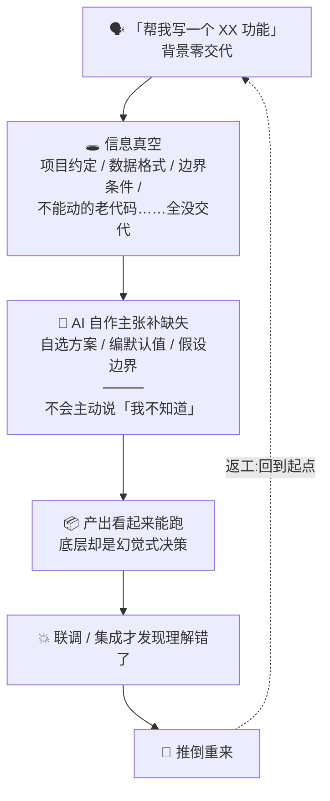
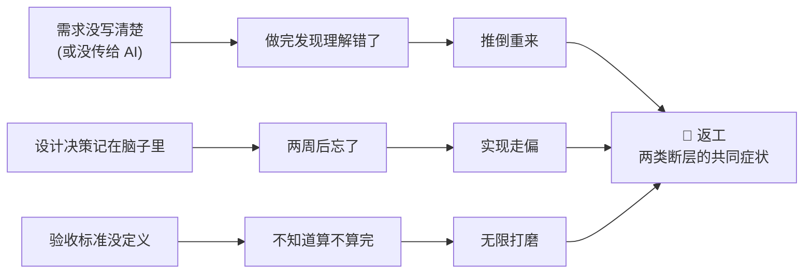
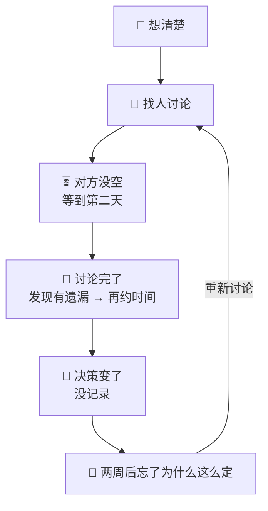

# 哲学 · 以信息为核心的 AI Native 开发(为什么)

> 方法论三块拆分([ADR-0007](../../harness/adr/0007-methodology-three-way-split.md))产物之一:**哲学文件**——「为什么」的阐述(失败模式与信息断层 / 人机分工 / 元原则)。v1 起线(2026-08-04)→ **v4 学科化**(2026-08-05:人因工程 / 软件工程 / 运筹学三学科视角重构)。
> **canonical 成员**(属「方法论主张」,修订需 canonical 审查 + OD-4 母本同步)。
> 三块关系:方法论 = [methodology_v4.md](methodology_v4.md)(怎么做,自包含);哲学 = 本文件(为什么);实操 = [practical_v1.md](practical_v1.md)(怎么用)。
> 章节编号沿用 v3(§一/§六/§七 新增/元原则),正文中的「方法论 §x」引用见 [methodology_v4.md](methodology_v4.md)。
> **学科视角**(v4):§一 挂人因工程、§六 挂软件工程、§七(新增)挂运筹学——哲学主张骨架用成熟学科语言,方法论文件保留操作语言。

## 一、vibe coding 失败模式与信息断层

> **人因工程视角**(v4):本章从人因工程(human factors)视角看 AI 编程的失败模式——背景缺失对应**情境意识**(situation awareness)的丧失,返工对应信息加工缺陷的累积成本。人因工程的洞见:人在信息不完整时倾向于用"最合理"的猜测补全,AI 继承并放大了这一倾向,且不标注哪些是猜测——这正是「AI 在信息真空中自作主张」的学科注脚。

在给出解法之前,先看清问题:**AI 编程的时间到底浪费在哪了?**

写代码本身通常不是瓶颈——AI 写代码飞快。真正的时间黑洞是**返工**,而返工有两个来源。

### 1.1 vibe coding 的失败场景

vibe coding——不交代背景、不设约束,直接把需求丢给 AI 自由发挥——是 AI 编程最自然的起步方式,也是返工最集中的来源:

注意这个链条的关键环节:**AI 不会主动说"我不知道"**。背景缺失的地方,它就用最"合理"的猜测填满——这些猜测就是幻觉式自作主张决策。它不会标出哪些是事实、哪些是编造,一切看起来都滴水不漏。

### 1.2 两类信息断层

返工的根子是**信息断层**——但断层并非只有一种,v3 区分两类:

- **人与 AI 之间的断层**(vibe coding 失败场景的抽象):你知道的背景没传给 AI,AI 在信息真空中自作主张。**解法:问答对齐**——用结构化追问(Grill 家族,见[方法论文件第五章](methodology_v4.md#五grill-决策方法论))把背景逐步对齐给 AI,这是[方法论文件 §2.1](methodology_v4.md#21-第一支柱以信息为核心)机制层的直接对策。
- **人与人之间的断层**(传统多人开发的痼疾):需求在 PM、开发、测试之间传递失真,"等 PM 有空 → 开会 → 理解不一致 → 返工"。**解法:AI 替代角色**——AI 即时承担 PM/QA/Reviewer 等角色,消去"等人"与传递失真(见 §6.2)。

两类断层共享同一个可见症状:**返工**。

每一次返工都是 2–3 倍的额外时间成本。**规划本身的时间成本与之相比可以忽略不计**——花一小时写清楚构想、交代清楚背景,可能省下三天的返工。

### 1.3 决策等待与反复(传统 SDLC 对照)

传统开发中,每个决策都需要等:

小型团队虽然人少沟通快,但反而因为**每个人做更多决策**而更容易碰壁——PM、架构、选型、测试策略全在一个人脑子里排队等处理。决策不是并行而是串行的。

AI 可以消除"等别人"这个瓶颈。Grill 追问、Code Review、测试生成不需要排队——随时触发、即时响应。

决策串行不仅因为"等人",还因为"每问等一轮 LLM 输出"。把一问一答的 Grill 改为**多波次批量问卷**(见[方法论文件 §5.2-5.3](methodology_v4.md#52-演进说明从一问一达到批量问卷)),决策本身也被并行化——一次出 10–15 题,离线作答,把串行等待压到最低。

### 本章的核心论断

> **快速来自消除浪费,不是偷工减料。规划与背景交代的时间成本可忽略,AI 自作主张后的返工成本才是真正的时间黑洞。**

---

## 六、人与 AI 的分工

> **软件工程视角**(v4):本章从软件工程视角看分工——工程纪律(设计先行 / TDD / 测试 / ADR / 复盘)是 AI 产出的**护栏**(方法论文件 [§2.2](methodology_v4.md#22-第二支柱驾驭工程--ai--软件工程)机制层);分工表的本质是「决策权在人、执行权在 AI」,工程纪律让这种分工可审计、可回退。

### 6.1 分工表

| 职责                       |       人       |      AI      |
| ---------------------------- | :--------------: | :-------------: |
| 决策(选什么方案)           |       ✅       |      ❌      |
| 确认(这是我要的吗)         |       ✅       |      ❌      |
| 上下文管理(给什么信息)     |       ✅       |      ❌      |
| 写构想/设计文档            |       ✅       |   辅助追问   |
| 写代码                     |      审阅      |      ✅      |
| 写测试                     |      审阅      |      ✅      |
| 写文档(API 文档、README)   |      审阅      |      ✅      |
| 代码审查                   |       ✅       |    ✅ 辅助    |
| Grill(追问盲区)            |       —       |      ✅      |
| 搜索与信息检索             |       —       |      ✅      |
| 端到端验证                 |       ✅       |    ✅ 执行    |
| **纯执行类决策(白名单内)** | 逐类审查白名单 | ✅ 可下放(v2) |

**核心原则**:AI 可以做任何事,但不能做任何决策。决策永远是人来做的,AI 提供信息和分析,供人判断。v2 唯一的放宽:纯执行类决策(白名单内、留痕、可紧急关闭)可下放,但白名单本身是人审查定的。

**绝不让 AI 自行确认的事**:需求理解是否正确?设计是否符合意图?测试是否覆盖了关键场景?这些都必须人亲自确认。

### 6.2 AI 替代的传统角色

§1.2 的**人与人之间断层**(需求传递失真、等 PM/QA)在这一节落地为解法:AI 替代传统角色,消去"等人"与传递失真。

在传统团队中,以下角色需要不同的人担任,产生沟通延迟和上下文切换成本。在小型团队 + AI 模式下,这些角色由 AI 替代或辅助,**消去等待时间**:

| 传统角色          | 传统时间成本                                               | AI 模式                                    |
| ------------------- | ------------------------------------------------------------ | -------------------------------------------- |
| **PM / 需求分析** | 需求不明确 → 等 PM 有空 → 开会 → 可能理解不一致 → 返工 | design-Q 即时追问需求盲区,VISION 沉淀结论  |
| **QA / 测试**     | 开发完 → 交 QA → 排期 → 提 bug → 修 → 再测            | AI 即时生成测试、执行 E2E,开发自测闭环     |
| **Code Reviewer** | 提 PR → 等 review → 反馈 → 修改 → 再等                 | AI 即时审查,人做最终确认                   |
| **DevOps / 运维** | 部署脚本、CI、监控需专人维护                               | AI 生成配置和脚本,人审阅后执行             |
| **技术文档撰写**  | 开发后补文档,要么不写要么敷衍                              | AI 根据代码和设计即时生成 API 文档、README |

**关键变化**:不是 AI 替代了人,而是 AI 消除了"等人"的时间。

---

## 七、运筹学视角:决策成本与双轨对照

> **运筹学视角**(v4 新增):运筹学(operations research)研究「有限资源下的最优决策」——本章用决策成本与对照实验的视角,审视方法论自身的设计选择。

### 7.1 决策成本模型

方法论把「人的判断精力」当作有限资源来配置——这是 80/20 判断成本原则的运筹学注脚:

- **批量问卷族**(design-Q / grill-Q / retro-Q / action-Q)= 80% 可预知的基础问题层:人以 20% 的时间高速批量处理(preview 预答 / confirm-list 速答)。
- **单点深钻族**(grill / grill-with-docs)= 20% 关键问题层(依赖链深 / 决策未成形 / 需即时反馈):人投 80% 的时间深钻。

两族是同一判断成本优化系统的两个层位,经「深水区转单点深钻 / 结晶成工件复压」双向交接(见[方法论文件 §5.2](methodology_v4.md#52-演进说明从一问一达到批量问卷))。

### 7.2 双轨对照(影子模式)

运筹学/系统工程的标准对照方法:**shadow mode + champion-challenger**——同一决策节点跑双轨(AI 全权影子 vs 人主导基线),比对效果与差异,复盘后择优。方法论将其用于「AI 全权自治」的渐进验证:影子 = 自动 dogfood 常态化;真实执行按数据升级;「错了」不由 AI 自评(见 [OD-13](../OPEN-DECISIONS.md))。

---

## 元原则

**这套方法论本身也在迭代。** v2 是 v1 经多个真实项目实践后的升级,v3 是 v2 经 grill-Q 压测后的立论补全(项目背景已脱敏)。读者应该:

- **按项目调整**:原型项目只用 grill-Q + VISION;对外产品走完整闭环。
- **按场景调整**:个人开发者按需减少环节;若有协作,双人团队可能需要更频繁同步。
- **按工具调整**:AI 工具快速演进,今天"必须人来做"的事,明天可能可下放。
- **反馈即更新**:每次 retro 不仅复盘项目,也复盘方法论本身——哪些环节帮到了你,哪些是走形式。

### 警惕方法论的失败模式

| 失败模式                 | 症状                                                    | 预防                                                             |
| -------------------------- | --------------------------------------------------------- | ------------------------------------------------------------------ |
| **分析瘫痪**             | 过度 grill,决策树无限延伸,永远不开始                    | 规划到"能回答核心不确定性"就停,不是所有细节都要提前设计          |
| **文档形式主义**         | 为写而写——ADR 没真正权衡、VISION 空洞、retro 全是套话 | 写之前问:这个文档一年后还有人想读吗?否,别写                      |
| **盲目信任 AI**          | AI 产出质量下降但不自知——跳过 Review、测试变绿就合入  | Code Review 永远不能省;AI × 软件工程,纪律是骨架                 |
| **设计-实现脱节**        | 精心写设计,实现走了不同的路,设计文档不更新              | 实现中发现设计要改 → 先更新设计文档,再改代码                    |
| **上下文膨胀**           | 靠一个大对话完成整个项目,不压缩、不落地、不新开会话     | 阶段结束主动 /compact 或开新会话;长项目用 long-running-agent     |
| **问卷形式主义** ★      | 为问而问、preview 过载、问卷越拉越长                    | 问卷是降低等待成本的工具,不是目的;题量每波 10–15,超量拆波       |
| **dogfood 走过场** ★    | 跑了案例但留痕为空,没真正自验                           | dogfood 必须有可检查产出(delegation-log、回修记录);跳过要标理由  |
| **long-running 假绿** ★ | 未测就标 passes:true,虚假完成感                         | 端到端测试通过才 passes:true;禁止跳过失败测试、删功能项减负      |
| **引擎漂移** ★          | 多副本引擎(问卷格式/处理规则)不同步,行为分裂            | 改一方考量三方(design-Q/grill-Q/retro-Q),漂移需在 DESIGN.md 声明 |

---
