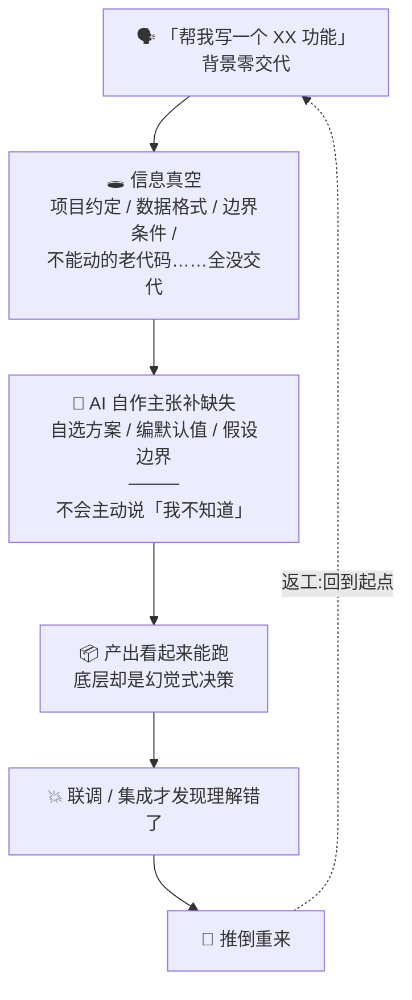
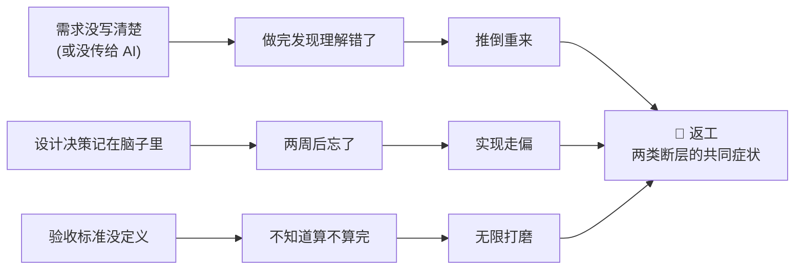
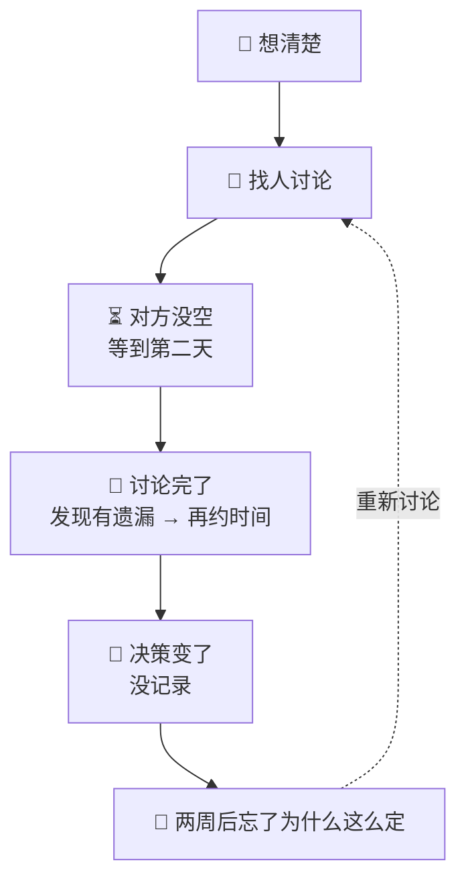

# 哲学 · 以信息为核心的 AI Native 开发(为什么)

> 方法论三块拆分([ADR-0007](../../harness/adr/0007-methodology-three-way-split.md))产物之一:**哲学文件**——「为什么」的阐述(失败模式与信息断层 / 人机分工 / 元原则)。v1 起线(2026-08-04)→ v4 学科化(2026-08-05)→ v5 加安全科学第四学科视角(2026-08-10:去 AI 黑盒立论锚点)→ v6 加方法论自身的治理闭环与学科映射(2026-08-13)→ **v7 连续章节与双文件交叉治理**(2026-08-14:独立阅读入口、历史编号兼容、current 状态注记)。
> **canonical 成员**(属「方法论主张」,修订需 canonical 审查 + OD-4 母本同步)。
> **修订记录**(仅记录已提交或已发布版本,一行一级;工作树中的执行记录见 TODO / 问卷处理摘要):2026-08-14 v7 在 v6 基础上完成连续章节、独立阅读入口、历史编号兼容与双文件交叉治理契约。
> 三块关系:方法论 = [methodology_v4.md](methodology_v4.md)(怎么做,自包含);哲学 = 本文件 v7(为什么);实操 = [practical_v1.md](practical_v1.md)(怎么用,非 canonical 轻量修订)。
> **章节编号(v7)**:哲学正文使用独立连续编号「§一至§五」;旧 v3 编号映射为「旧 §一→新 §一、旧 §六→新 §二、旧 §七→新 §三、旧 §八→新 §四、元原则→新 §五」。历史文档保持原编号,兼容策略见 [ADR-0017](../../harness/adr/0017-philosophy-section-compatibility.md)。正文中的「方法论 §x」引用仍指 [methodology_v4.md](methodology_v4.md)。
> **学科视角**(v7):§一挂人因工程、§二挂软件工程、§三挂运筹学、§四挂安全科学;本版继承 v6 的治理进化路线,但不把所有映射学科升级为正文立论学科。哲学主张骨架用成熟学科语言,方法论文件保留操作语言。**诚实标注**:学科挂接是阐述性借用(用学科语言为主张做结构化解释),非经学科方法(人因实验 / 运筹建模 / 软工实证 / 安全分析)验证——方法论核心主张的验证靠 dogfood 与 retro 自评,不靠学科权威。

> **阅读路线**:先看 §一 理解信息断层如何制造返工;再看 §二 理解判断权与执行权如何分工;接着看 §三 如何配置有限的判断资源;然后看 §四 如何让 AI 执行可审计、可验证、可恢复;最后看 §五 理解方法论自身如何持续修订。全文主线是:信息断层 → 返工 → 分工 → 判断资源配置 → 黑盒治理 → 方法论治理。
>
> **独立阅读入口(v7)**:原 `methodology_v3` 的 §二至§五属于「怎么做」的机制与流程,按 ADR-0007 保留在方法论文件;哲学不复制这些正文,而用本入口说明「为什么」章节如何承接它们。v7 的连续编号是哲学的显示层,历史引用仍按 ADR-0017 的映射回溯。

## 一、vibe coding 失败模式与信息断层

> **人因工程视角**(v4):本章从人因工程(human factors)视角看 AI 编程的失败模式——背景缺失对应**情境意识**(situation awareness,Endsley 三层模型的**感知层**)的丧失;而 AI「用最合理的猜测补全」对应**心智模型 / schema 驱动补全**(Norman,top-down filling-in)——两者不同机制:前者是信息没进来,后者是信息没进来后用既有 schema 填空。返工对应信息加工缺陷的累积成本。人因工程的洞见:人在信息不完整时倾向于用"最合理"的猜测补全,AI 继承并放大了这一倾向,且不标注哪些是猜测——这正是「AI 在信息真空中自作主张」的学科注脚。

在给出解法之前,先看清问题:**AI 编程的时间到底浪费在哪了?**

写代码本身通常不是瓶颈——AI 写代码飞快。真正的时间黑洞是**返工**,而返工有两个来源。

### 1.1 vibe coding 的失败场景

vibe coding——不交代背景、不设约束,直接把需求丢给 AI 自由发挥——是 AI 编程最自然的起步方式,也是返工最集中的来源:

注意这个链条的关键环节:**AI 不会主动说"我不知道"**。背景缺失的地方,它就用最"合理"的猜测填满——这些猜测就是幻觉式自作主张决策。它不会标出哪些是事实、哪些是编造,一切看起来都滴水不漏。

### 1.2 两类信息断层

返工的根子(本方法论的靶子)是**信息断层**——但返工并非只有这一个归因(AI 能力边界、需求漂移、集成意外也会导致返工,另有对策,不在本框架内);且断层并非只有一种,v3 区分两类:

- **人与 AI 之间的断层**(vibe coding 失败场景的抽象):你知道的背景没传给 AI,AI 在信息真空中自作主张。**解法:问答对齐**——用结构化追问(Grill 家族,见[方法论文件第五章](methodology_v4.md#五grill-决策方法论))把背景逐步对齐给 AI,这是[方法论文件 §2.1](methodology_v4.md#21-第一支柱以信息为核心)机制层的直接对策。
- **人与人之间的断层**(传统多人开发的痼疾):需求在 PM、开发、测试之间传递失真,"等 PM 有空 → 开会 → 理解不一致 → 返工"。**解法:AI 替代角色**——AI 即时承担 PM/QA/Reviewer 等角色,消去"等人"与传递失真(见 §2.2)。

两类断层共享同一个可见症状:**返工**。

每一次返工的额外时间成本可能达到原任务成本的数倍——这是**作者经验性示例,不是项目测量结论**。**规划本身的时间成本与之相比通常较小**——「花一小时写清楚构想、交代清楚背景,可能省下三天返工」同样是直觉性示例,不是项目测量结论。

### 1.3 决策等待与反复(传统 SDLC 对照)

传统开发中,每个决策都需要等:

小型团队虽然人少沟通快,但反而因为**每个人做更多决策**而更容易碰壁——PM、架构、选型、测试策略全在一个人脑子里排队等处理。决策不是并行而是串行的。

AI 可以消除"等别人"这个瓶颈。Grill 追问、Code Review、测试生成不需要排队——随时触发、即时响应。

决策串行不仅因为"等人",还因为"每问等一轮 LLM 输出"。把一问一答的 Grill 改为**多波次批量问卷**(见[方法论文件 §5.2-5.3](methodology_v4.md#52-演进说明从一问一答到批量问卷)),**减少 LLM 串行往返**——一次出题(每波上限 10)、离线作答,把等待成本压到最低。注意:判断本身仍逐题串行,并行的是「出题与作答准备」而非「决策」本身。

### 本章的核心论断

> **快速来自消除浪费,不是偷工减料。规划与背景交代的时间成本相对返工通常较小——但随规划深度边际递增,越过阈值即产生分析瘫痪 / 形式主义(见元原则失败模式表);AI 自作主张后的返工成本才是真正的时间黑洞。**

**可检查的代理指标**(只作反思提示,别让「快速 / 浪费」沦为空话):采用本方法论后,retro 时可收集「返工率 / 返工工时占比」,帮助采用项目反思是否出现改善——它们不是对上述经验数字的直接测量,也不是本仓库的效果验证或自动证伪门。观察窗口、基线与解释由采用项目自行决定;本文件不把无阈值代理指标升级为测量契约。

### 1.4 信息流转框架的边界:AI 能力天花板

第一支柱(信息流转 + 问答对齐)能治理**背景缺失**导致的返工,但治不了另一类:**背景已全给,AI 仍做不对**——复杂算法、并发正确性、性能调优、领域深水区。这是 AI 的**能力边界**,不是信息真空。这类返工的对策不在本方法论的信息流转框架内,而是:降级任务(拆小到 AI 能力圈内)/ 换工具 / 人接手。元原则「按工具调整」已有此意——今天 AI 做不对的,明天可能能做对。

**过渡到分工**:信息对齐只能减少「不知道背景」造成的错误,不能消除 AI 的能力边界。因此,下一步不是把更多判断交给 AI,而是明确哪些判断必须由人承担、哪些执行可以在约束内交给 AI。

---

## 二、人与 AI 的分工

> **软件工程视角**(v4):本章从软件工程视角看分工——工程纪律(设计先行 / TDD / 测试 / ADR / 复盘)是 AI 产出的**护栏**(方法论文件 [§2.2](methodology_v4.md#22-第二支柱驾驭工程--ai--软件工程)机制层);分工表的本质是「决策权在人、执行权在 AI」,工程纪律让这种分工可审计、可回退。

### 2.1 分工表

| 职责                       |       人       |      AI      |
| ---------------------------- | :--------------: | :-------------: |
| 决策(选什么方案)           |       ✅       |      ❌      |
| 确认(这是我要的吗)         |       ✅       |      ❌      |
| 上下文管理(决定给什么)     |     ✅ 决策     |   ✅ 执行(检索/压缩)   |
| 写构想/设计文档            |       ✅       |   辅助追问   |
| 写代码                     |      审阅      |      ✅      |
| 写测试                     |      审阅      |      ✅      |
| 写文档(API 文档、README)   |      审阅      |      ✅      |
| 代码审查                   |     ✅ 签字权     |    ✅ 辅助发现问题    |
| Grill(追问盲区)            |       —       |      ✅      |
| 搜索与信息检索             |       —       |      ✅      |
| 端到端验证                 |       ✅       |    ✅ 执行(测试若 AI 自写 = 嵌套黑盒,人审/试玩兜底,见 §4.1 L3)    |
| **纯执行类决策(白名单内)** | 逐类审查白名单 | ✅ 可下放(v2) |

> **图例**:**✅=主导**(承担结果责任);**辅助=发现问题但不拍板**;**执行=按既定规格做,不做新决策**;**审阅=看并有权要求改**;**签字权=最终 approve / reject 决策**(代码审查的签字权在人,与 pr-review「AI 永不 approve」一致)。上下文管理拆「**决定**给人✅(不可下放)/ **执行**(检索·压缩·加载)给 AI✅」——决策权在人,执行可下放。
>
> **白名单下放的单向门风险**:白名单误纳入单向门类(删除 / 发布 / 付费 / 对外传播)是已知失败模式;禁区清单 + 整体紧急开关是人审查的防线(见 delegate / [OD-13](../../docs/OPEN-DECISIONS.md))。

**核心原则**:AI 可以执行任何经批准且受约束的事务,但不能自主做**判断性决策**。判断性决策永远由人来做,AI 提供信息和分析供人判断。v2 唯一的放宽:在白名单、留痕和可紧急关闭的约束下,**纯执行类决策**可下放;白名单本身仍由人审查确定。

**绝不让 AI 自行确认的事**:需求理解是否正确?设计是否符合意图?测试是否覆盖了关键场景?这些都必须人亲自确认。

### 2.2 AI 替代的传统角色

§1.2 的**人与人之间断层**(需求传递失真、等 PM/QA)在这一节落地为解法:AI 替代传统角色,消去"等人"与传递失真。

在传统团队中,以下角色需要不同的人担任,产生沟通延迟和上下文切换成本。在小型团队 + AI 模式下,这些角色由 AI 替代或辅助,**消去等待时间**:

| 传统角色          | 传统时间成本                                               | AI 模式                                    |
| ------------------- | ------------------------------------------------------------ | -------------------------------------------- |
| **PM / 需求分析** | 需求不明确 → 等 PM 有空 → 开会 → 可能理解不一致 → 返工 | design-Q 即时追问需求盲区,VISION 沉淀结论  |
| **QA / 测试**     | 开发完 → 交 QA → 排期 → 提 bug → 修 → 再测            | AI 即时生成测试、执行 E2E,开发自测闭环     |
| **Code Reviewer** | 提 PR → 等 review → 反馈 → 修改 → 再等                 | AI 即时审查,人做最终确认                   |
| **DevOps / 运维** | 部署脚本、CI、监控需专人维护                               | AI 生成配置和脚本,人审阅后执行(部署执行属单向门类,防线见 §2.1 白名单脚注)             |
| **技术文档撰写**  | 开发后补文档,要么不写要么敷衍                              | AI 根据代码和设计即时生成 API 文档、README |

**关键变化**:不是 AI 替代了人,而是 AI 消除了"等人"的时间。

> **被否决项**:保留人工角色(质量更高、但慢且贵)/ 部分替代(关键判断仍人,AI 只做执行层)——选 AI 替代以消除等待,代价见下。
>
> **红利来源的精确化**:AI 替代多角色**执行**,但单人开发者仍受「一次只能等一个 AI 输出」的串行约束;并行红利主要来自**消除角色间的人际等待与传递失真**,而非单人多任务。
>
> **代价**:传统 4–5 人分担的判断密度全压单人 → 认知负荷过载风险;这正是分析瘫痪 / 问卷形式主义的人因根因,对策是 80/20 判断成本分层(§三)+ delegate 下放纯执行。

**过渡到资源配置**:分工并没有消除判断,只是把大量执行等待压缩掉,同时把最终判断责任集中到人身上。判断责任越集中,越需要用有限的注意力处理真正改变目标、风险或验收结果的决策,这引出 §三 的成本分层。

---

## 三、运筹学视角:决策成本与双轨对照

> **运筹学视角**(v4 新增):运筹学(operations research)研究「有限资源下的最优决策」——本章用决策成本与对照实验的视角,审视方法论自身的设计选择。

### 3.1 决策成本模型

方法论把「人的判断精力」当作有限资源来配置——这是 **80/20 判断成本原则**的注脚(经验启发式,类 Pareto;**非定理、无量化模型**;原初设计 2026-07-31 作者补述、此前未落盘,属 (a) 类盲区「知道但没写」的活例):

- **批量问卷族**(design-Q / grill-Q / retro-Q / action-Q)= 80% 可预知的基础问题层:人以 20% 的时间高速批量处理(preview 预答 / confirm-list 速答)。
- **单点深钻族**(grill / grill-with-docs)= 20% 关键问题层(依赖链深 / 决策未成形 / 需即时反馈):人投 80% 的时间深钻。

两族是同一判断成本优化系统的两个层位,经「深水区转单点深钻 / 结晶成工件复压」双向交接(见[方法论文件 §5.2](methodology_v4.md#52-演进说明从一问一答到批量问卷))。

### 3.2 双轨对照(影子模式)

运筹学/系统工程的标准对照方法:**shadow mode + champion-challenger**——同一决策节点跑双轨(AI 全权影子 vs 人主导基线),比对效果与差异,复盘后择优。方法论将其用于「AI 全权自治」的渐进验证:影子 = 自动 dogfood 常态化;真实执行按数据升级;「错了」不由 AI 自评(见 [OD-13](../OPEN-DECISIONS.md))。

> **状态注(2026-08-10)**:双轨对照目前处于 **pilot 阶段**(暂未入 skill 家族),首轮 dogfood 实证「AI 自评通过 ≠ 人类实际可玩」、价值定位从「产出可用产物」下调为「模板 / demo + 快速试错」,升级条件化为人试玩通过。本节作为运筹学视角的**方法论设想**呈现,非已验证方法——详见 [OD-13](../OPEN-DECISIONS.md)。

**过渡到安全治理**:判断资源优化回答了「把人的注意力放在哪里」,却没有回答「执行过程是否可追溯、产出是否能被独立验收」。如果效率提升依赖不可见的 AI 自评,节省的等待时间可能转化为潜伏风险,因此还需要 §四 的黑盒治理边界。

---

## 四、安全科学视角:去 AI 黑盒

> **安全科学视角**(v5 新增):本章从安全科学(safety science)视角看 AI 的不透明——AI 黑盒是与「AI 决策错」(第一支柱)正交的独立风险维度。安全科学作统称,含**可靠性工程**(Reason 潜伏条件 / HRO 失败预念)+ **韧性工程**(Hollnagel Safety-II,WAI/WAD)的交叉,三分详见 [CONTEXT 学科地图](../CONTEXT.md)。立锚决策与被否决项(第一支柱子集 / 第三支柱 / 因果前提)见 [ADR-0015](../../harness/adr/0015-deblackbox-anchor.md),学科挂接分层判据见 [ADR-0014](../../harness/adr/0014-discipline-mapping-strategy.md)。

### 4.1 什么是 AI 黑盒

AI 黑盒 = AI 不透明的**三层次合一**:

- **L1 决策过程不透明**:你看到 AI 的输出,但不知道它**怎么推到的**(推理链不可见)。
- **L2 决策依据不可追溯**:AI 选了 X 不选 Y,但**事后无留痕可查**(为什么这么决策查不到)。
- **L3 产出正确性不可独立验证**:功能正确性有客观裁决源(oracle:编译 / 测试 / E2E),但裁决源常由 AI 自写——AI 写测试测 AI 代码,独立验证的独立性打折(**嵌套黑盒**,[OD-13](../OPEN-DECISIONS.md) 实证「自证清白」);判断类产出(设计好坏 / 需求符合)无 oracle,只能人审。

### 4.2 与第一支柱正交(独立性论证)

黑盒是与第一支柱(AI 幻觉式自作主张)**正交的独立维度**,不是它的子集:

- **第一支柱**治「AI 决策**错**」(信息维度,对策 = 给信息 / 问答对齐);
- **去黑盒**治「AI 决策**过程不可见**」(审计维度,对策 = 留痕 / 可追溯)。

两者正交——**信息给够仍可能黑盒**(过程不可见),**过程留痕仍可能决策错**(信息缺失)。正交意味着去黑盒够格作独立的第四学科视角锚点,而非第一支柱的附庸。

### 4.3 黑盒的三坏后果

黑盒不治理,会导致三类坏后果(分别对应可靠性 / 安全 / 人因):

- **潜伏沉积**(可靠性工程,Reason 潜伏条件):黑盒决策无留痕 → 潜伏条件沉积 → 出事前无法识别补救。表现为「不知道 AI 当初为什么这么定,出事时查不到、改不动」。
- **失控放大**(安全科学,STAMP):黑盒 = 安全控制过程模型不可见 → 人(控制器)无法判断 AI 是否偏离控制约束 → 局部正确决策在系统层交互失控致灾(本方法论语境的「灾」= 单向门事故:误删 / 误发布 / 付费 / 外泄)。
- **信任劫持**(人因工程):黑盒 → 人只能信 AI 自评 → 认知惰性逐渐放弃审查 → 退化为「AI 说对就对」的盲信。注意循环依赖:人审是唯一兜底,而信任劫持侵蚀的正是人审——缓解不在新增装置,而在压低审查成本(80/20 分层)+ 单向门强制留痕(WAI 底线)+ retro 周期性复核留痕质量;底线 creep(破例成惯例)靠 retro 识别。

### 4.4 对策:统合项目已定义/可用的审计装置

去黑盒的对策**不是新增机制**,而是把项目已定义/可用的可审计装置统合为「对抗黑盒」的立论。这里的「已定义/可用」不等于已经启用或完成验证:每项装置的启用状态与 dogfood 验证状态需要分别核实。

- **delegation-log**(delegate 决策留痕)+ **ADR / CONTEXT / OPEN-DECISIONS**(决策记录)+ **归档问卷只移不删**(过程可追溯)+ **Code Review 人审**(pr-review「AI 永不 approve」;具体工具或 skill 由实操层接入,本仓库当前没有同名 active skill)+ **dogfood 留痕**(过程记录)+ **脱敏门 / harness-check**(发布前校验)+ **retro 复盘**(事后组织学习)+ **long-running 留痕**(claude-progress 跨会话记录 + feature_list「passes 只能 E2E 通过才 true」)。

这套装置让 AI 决策的**依据与结果**「可审计、可追溯、可回退」——但 §4.1 的 L1(推理链)依旧不透明:留痕记的是 AI **自陈**的理由,不等于实际推理过程。**黑盒被制衡,未被完全打开。**

> **形式化 V&V 缺口**:去黑盒三层次中,「结果可独立验证」缺系统化对策(项目靠人审 + dogfood 手工 V&V,缺形式化方法如覆盖矩阵 / model checking)。嵌套黑盒(oracle 由 AI 自写)的既有对策 = **人审测试本身 + 人试玩验收**([OD-13](../OPEN-DECISIONS.md) 升级仲裁「人类实际试玩通过才升级」)。这是已知缺口,显式承认,留 [OD-19](../OPEN-DECISIONS.md)——不假装完备。

**L3 最小分层原则**:凡 AI 自写 oracle、用户可玩产物或单向门操作,必须有人的独立审查、试玩或确认;纯执行且可逆的事项可以抽样复核。具体采样频率、风险阈值与项目 DoD 放在实操层定义,本节只规定最低边界。

### 4.5 弹性边界:WAI 定底线,WAD 留空间

去黑盒的度是**弹性边界**,避免过头退化为文档形式主义(元原则失败模式):

- **WAI(Work-As-Imagined,设想中的工作)定底线**:关键 / 单向门 / 安全类决策**强制留痕可查**(ADR / delegation-log / 脱敏门);
- **WAD(Work-As-Done,实际执行的工作)留空间**:纯执行 / 可逆决策的**执行细节可以灵活调整**,但已发生的自主决策仍须立即留痕;批量或事后记录只适用于非自主决策,或预先明确的抽样记录。

这条边界借鉴 Safety-II 对 WAI–WAD 缝隙的观察,但不把其关于**人类情境适应能力**的结论直接推广给 AI,也不把 Safety-II 当作本项目机制的因果证明。本项目只借用「不要让检查清单退化为压垮执行的形式主义」这一边界启发;此处 WAD 的 AI 执行者只能在已批准规格内调整执行细节,并承受 §一 所述的幻觉补全风险。可逆性和即时留痕共同限制潜伏窗口,retro 抽查负责收口。

**可检查的代理指标**(只作反思提示,与 §一 同级):retro 时可抽查「最近一次 AI 决策出问题,能否从 ADR / delegation-log / 归档问卷重建当初决策依据」,把可重建性作为治理线索——可重建不等于效果证明,不可重建则是装置失效信号。**若本周期无 AI 决策故障,可随机抽一例近期 AI 决策做重建抽查**——潜伏沉积是静默的(§4.3),但本文件不设统一阈值或自动验收门。

### 4.6 方法论自身的治理闭环:从主张到证据

前五节讨论如何治理 AI 执行中的不透明;本节进一步讨论如何治理**方法论自身的漂移、误读与伪验证**。同级对标仓库的治理经验对本项目最有价值的部分,不是复制完整的运行时架构分层,而是把「规范写了什么」「实际如何执行」「什么证据能证明」分开。**本项目只吸收最小治理切片**:哲学规定方法级原则与边界,具体状态、接口、测试矩阵和执行记录继续由 skill、实操文件与 `harness/` 产物承载。

> **术语边界**:本节所说的「方法论 harness」是方法论文档、skill 与决策/过程留痕组成的流程执行体,不是负责协调 Agent、Context、Model、Capability、Result、持久化与恢复的运行时 harness。本项目只提供前者,两者不能互相借用实现或证据结论;术语定义见 [CONTEXT](../CONTEXT.md#harness-术语边界)。

这四条合同把散文主张连接到可验收的过程,也给方法论自身设置与 §4.5 一致的弹性边界:

1. **唯一权威**:每条核心方法主张都应有稳定标识、适用范围、唯一权威文件、违反症状和例外边界。规范优先级只能回答文件冲突时听谁的,不能替代「这条规则由谁负责维护」的唯一权威。
2. **主张 → 不变量 → 验证卡**:主张先压缩为可检查的方法不变量,再配验证卡。验证卡至少说明反例、代理指标、独立证据和阈值或重访条件;卡片与实测记录放在实操或 `harness/` 区,哲学不膨胀成规格书。
3. **失败状态与恢复边界**:发现文档、执行与现实冲突,或发现审查缺口时,依次执行「标记影响范围 → 暂停不可逆动作 → 保留事实与副作用 → 选择性恢复或回滚 → 复盘并更新规范」。各 skill 可定义具体状态和动作,但不能用覆盖文件或静默重试掩盖失败。
4. **规范、实现、证据分离**:「应该遵守」不等于「已经执行」,架构或 skill 存在不等于「已经实现」,本仓库的过程检查也不等于下游效率、质量或因果效果的证据。状态应明确区分规范要求、启发式、试点、已验证、未验证和已知缺口;证据范围与状态定义见 [CONTEXT](../CONTEXT.md)。

#### 4.6.1 统一的主张状态模板

核心主张和审计装置统一按以下顺序描述:

> **主张 → 适用范围 → 当前状态 → 最小证据 → 失效信号 → 重访条件**

这不是要求每条正文都增加一张表,而是要求读者能沿同一条路径判断「这句话是什么、在哪儿成立、现在凭什么相信、什么时候需要重新检查」。其中「当前状态」使用 [CONTEXT](../CONTEXT.md) 已定义的规范要求、启发式、试点、已验证、未验证、已知缺口等状态词;「最小证据」区分本仓库的过程一致性证据与采用项目的下游效果证据。

#### 4.6.2 治理进化的学科映射

学科知识只有被转译成治理动作才有用。完整字段与当前映射见 [CONTEXT 项目学科地图](../CONTEXT.md#v7-治理进化映射);正文用以下摘要说明引入逻辑。后续引入遵循「学科 → 治理机制 → 最小产物 → 最小证据 → 触发条件」:

| 学科知识 | 治理机制 | 最小产物 | 最小证据 | 触发条件 |
|---|---|---|---|---|
| **系统工程 / 需求工程** | 需求追踪、不变量、验证与确认、变更影响分析 | 方法不变量、验证卡、受影响引用清单 | 每条不变量能指向唯一权威与一条最小验证记录 | 核心主张跨文件或跨 skill 传播时 |
| **认识论 / 测量科学** | 区分主张、代理指标、独立证据与因果结论;保留可证伪边界 | 主张状态、指标定义、证据范围 | 指标实际测量对象与主张边界一致 | 出现「有效」「快速」「质量提升」等效果性表述时 |
| **配置管理 / 质量管理** | 基线、唯一权威、不符合项、纠正与预防措施(CAPA)、受控变更 | 版本记录、冲突记录、恢复动作、复盘项 | 变更前后引用、状态与恢复路径可重建 | canonical 文件或不可逆治理边界变化时 |
| **认知科学 / HCI** | 对抗自动化偏差、默认效应与决策疲劳,校准人对 AI 的信任 | 人审分层、默认取消率、疲劳或返工信号 | 人的确认记录与后续返工/误判信号可对照 | 预勾选、delegate、AI 自评等人机界面机制变化时 |
| **知识管理 / 组织学习** | 把隐性判断显性化,让复盘进入下一轮规范,区分单环与双环学习 | ADR、CONTEXT、Lessons Learned、重访条件 | 同类问题能从复盘记录追踪到规范修订或明确不修 | 复盘发现规则失效或同类问题重复出现时 |
| **信息安全 / 威胁建模** | 信任边界、最小权限、滥用场景、数据外泄与提示注入防线 | 威胁模型、禁区清单、脱敏与权限检查 | 每个高风险能力有禁区、确认点和可审计记录 | AI 接触外部系统、秘密、付费、发布或删除能力时 |
| **形式化方法 / Assurance Case** | 用不变量、反例、属性测试或证据论证图提高独立验证强度 | 反例集、覆盖矩阵、论证图 | 反例覆盖或论证链能独立于 AI 自评复核 | AI 生码比例、风险等级或事故信号超过 OD-19 触发条件时 |
| **控制论 / 决策理论** | 可观测性、反馈回路、可逆性、信息价值与升级阈值 | 监测指标、升级门、影子对照记录 | 多轮记录能显示指标变化与升级决定的依据 | 多次 dogfood 已产生可比较数据,且升级成本可接受时 |

**前三行最小进入/退出模板(v7)**:进入条件是触发条件真实命中,且能为本次治理动作确定唯一权威、最小产物与最小证据;退出条件是最小证据已记录、失效信号与回退/重访条件已写明,首轮复盘没有发现未承认的边界冲突。任一条件不满足,保持「路线图 / 未验证」状态或暂停不可逆动作,不升级为强制流程。

> **当前状态注(v7)**:本文件允许存在已知缺口,但不把规范文字当作实施或效果证据。方法不变量与验证卡目前是治理目标,尚未形成全量验证集;本节代理指标仅是反思提示,不是下游效果证明;前三行最小进入/退出模板尚未被 dogfood 充分验证。完整 Level 1/2/3 实现仍是 [OD-20](../OPEN-DECISIONS.md) 的开放问题。

这张表是治理路线图,不是新增八个必做流程。个人项目先执行前三行的最小切片;其余学科按风险、数据和维护能力渐进引入。它也解释了为何哲学正文不需要继续堆叠学科名称:正文保留立论骨架,学科地图负责完整字段,验证卡和实操产物负责执行。

因此,本项目借鉴的是同级对标仓库的**合同化、状态化和可验收化**,而不是把哲学改造成运行时系统的 Level 1/2/3 实现规范。治理的目标是降低漂移和「规格即证据」的误读,同时保留个人开发者可承受的维护成本与方法论的可调整性。

---

## 五、元原则

**这套方法论本身也在迭代。** v2 是 v1 经多个真实项目实践后的升级,v3 是 v2 经 grill-Q 压测后的立论补全,v5 加入安全科学视角,v6 把方法论自身的治理闭环显式化,v7 把哲学独立文章的编号与双文件交叉治理显式化(项目背景已脱敏)。读者应该:

- **按项目调整**:原型项目可精简为——手写 VISION + grill-Q 压测(跳过 design-Q 三阶段);对外产品走完整闭环。
- **按场景调整**:个人开发者按需减少环节;若有协作,双人团队可能需要更频繁同步。
- **按工具调整**:AI 工具快速演进,今天"必须人来做"的事,明天可能可下放。
- **反馈即更新**:每次 retro 不仅复盘项目,也复盘方法论本身——哪些环节帮到了你,哪些是走形式。

### 警惕方法论的失败模式

| 失败模式                 | 症状                                                    | 预防                                                             |
| -------------------------- | --------------------------------------------------------- | ------------------------------------------------------------------ |
| **分析瘫痪**             | 过度 grill,决策树无限延伸,永远不开始                    | 规划到"能回答核心不确定性"就停,不是所有细节都要提前设计          |
| **文档形式主义**         | 为写而写——ADR 没真正权衡、VISION 空洞、retro 全是套话 | 写之前问:这个文档一年后还有人想读吗?否,别写                      |
| **盲目信任 AI / 黑盒信任劫持** | AI 产出质量下降但不自知——跳过 Review、测试变绿就合入;黑盒场景尤其需留痕可审计 | Code Review 永远不能省;黑盒场景强制留痕(见 §四);AI × 软件工程,纪律是骨架 |
| **设计-实现脱节**        | 精心写设计,实现走了不同的路,设计文档不更新              | 实现中发现设计要改 → 先更新设计文档,再改代码                    |
| **上下文膨胀**           | 靠一个大对话完成整个项目,不压缩、不落地、不新开会话     | 阶段结束主动 /compact 或开新会话;长项目用 long-running-agent     |
| **问卷形式主义** ★      | 为问而问、preview 过载、问卷越拉越长                    | 问卷是降低等待成本的工具,不是目的;题量每波上限 10,超量拆波       |
| **dogfood 走过场** ★    | 跑了案例但留痕为空,没真正自验                           | dogfood 必须有可检查产出(delegation-log、回修记录);跳过要标理由  |
| **long-running 假绿** ★ | 未测就标 passes:true,虚假完成感                         | 端到端测试通过才 passes:true;禁止跳过失败测试、删功能项减负      |
| **引擎漂移** ★          | 多副本引擎(问卷格式/处理规则)不同步,行为分裂            | 改一方考量四方(design-Q/grill-Q/retro-Q/action-Q),漂移需在 DESIGN.md 声明 |

---
