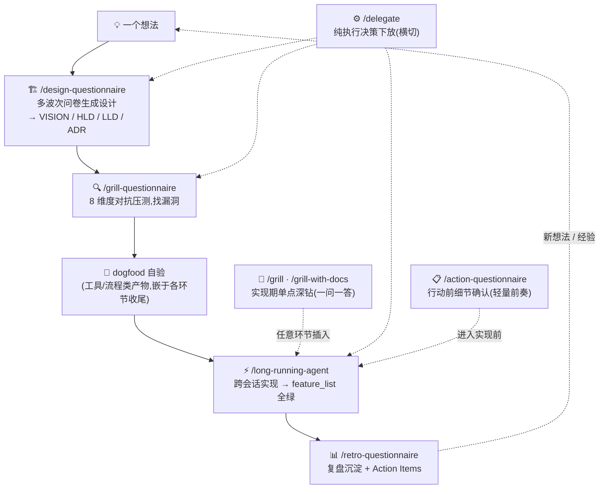
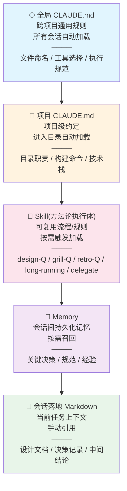

# 实操 · Claude Code AI Native 开发操作指南(怎么用)

> 方法论三块拆分([ADR-0007](../../harness/adr/0007-methodology-three-way-split.md))产物之一:**实操文件**——「怎么用」的操作指南(skill 使用时机 / 工具规范 / 上下文操作链)。v1 起线(2026-08-04)。
> **非 canonical**:修订走轻量流程(小步 commit,免 OD-4 母本同步、免四处锁定检查)。
> 三块关系:方法论 = [methodology_v5.md](methodology_v5.md)(怎么做);哲学 = [philosophy_v7.md](philosophy_v7.md)(为什么);实操 = 本文件(怎么用)。
> 章节编号沿用 v3(快速上手 / §7.4-7.6 / §八 / 附录 A·B)。

## 快速上手:skill 使用流程一图

本文阐述方法论内核;8 个 Claude Code skill 是它的执行体。单个功能从念头到交付的典型用法:

- **触发方式**:Claude Code 中用斜杠命令(如 `/design-questionnaire`)或自然语言(如「帮我做设计」「压测这份设计」)。
- **衔接协议**:design-Q 收尾主动提议 grill-Q;grill-Q 收尾提议 long-running——也可随时手动触发任意 skill(正交可插入,见[方法论文件 §4.3](methodology_v5.md#33-方法论可任意插入));action-Q 为轻量前奏——design-Q 收尾的设计进入实现前、grill-Q / retro-Q 处理的行动项落地前,可先对齐动作细节。
- **dogfood 不是独立 skill**,是嵌在各环节收尾的产物自验动作(见[方法论文件 §4.2](methodology_v5.md#32-环节详解)环节 3)。
- 不必走完整闭环——每个 skill 都可单独取用,按任务类型裁剪见[方法论文件 §零](methodology_v5.md#零适用场景)「任务类型与流程适配」。

---

### 7.4 上下文管理

- 频繁用到的背景信息写入 CLAUDE.md 或 Memory
- 长对话的中间结论及时落地为 Markdown
- 每个新会话,先把相关设计文档和 ADR 喂给 AI 作为上下文

### 7.5 上下文层级体系 ★ v2 五层

v1 是四层,v2 增加 **Skill 层**(方法论沉淀为可执行工具的载体):

| 层级               | 典型位置                            | 放什么                                                                   | 加载方式                      |
| -------------------- | ------------------------------------- | -------------------------------------------------------------------------- | ------------------------------- |
| **全局 CLAUDE.md** | `~/.claude/CLAUDE.md`               | 跨项目通用规范                                                           | 所有会话自动加载              |
| **项目 CLAUDE.md** | `<项目根>/CLAUDE.md`                | 项目级约定                                                               | 进入项目目录自动加载          |
| **Skill** ★       | `~/.claude/skills/`(用户级)或项目内 | 方法论执行体——可复用的流程/规则(问卷引擎、long-running 纪律、下放机制) | 按需触发(`/skill` 或自然语言) |
| **Memory**         | `~/.claude/projects/<项目>/memory/` | 跨会话持久化的关键决策、经验                                             | 按需召回(描述匹配触发)        |
| **会话落地文件**   | 项目内 Markdown                     | 当前任务的设计文档、决策记录、中间结论                                   | 手动引用                      |

**使用原则**:写之前先判断信息要多广的范围生效。Skill 层是 v2 的关键新增——它把方法论从"读文档照着做"升级为"触发 skill 自动执行"。skill 是跨项目全局能力(用户级),与会话级/项目级文件层级不同,故独立成层。

### 7.6 会话恢复策略

AI 编程会话不会无限延续——上下文会满、注意力会衰减、任务会被打断。

**何时主动开新会话**:上下文接近有效上限(200k 模型约 120k,1m 模型约 400k);对话主题根本性变化;AI 出现明显幻觉或遗忘早期指令。

**过载对策链:先沉淀,再压缩** ★ v3——/compact 压缩的是会话上下文,压缩可能丢失设计期决策细节。所以正确顺序是:**先用 design-Q 等 skill 把决策沉淀落盘(VISION / ADR / CONTEXT / 归档问卷),再 /compact**。沉淀之后,压缩丢的只是过程,不是决策——新会话从落盘文件重建即可(见下文恢复清单)。注意这与[方法论文件 §2.1](methodology_v5.md#11-第一支柱以信息为核心)的"背景缺失"是两个环节:缺失的对策是问答对齐(补),过载的对策是沉淀 + 压缩(存了再压),二者不矛盾。

**新会话恢复清单**(按顺序喂给 AI):

1. 项目的 CLAUDE.md(自动加载)
2. 当前阶段的设计文档(VISION / HLD / LLD)
3. 最新的会话落地文件(上次中间结论)
4. 当前 Git diff 或未完成的任务清单(feature_list.json)
5. 一句话:上次做到哪了、这次要继续做什么

**长项目优先用 long-running-agent**:跨会话恢复从"手动喂清单"升级为"从落盘文件重建"(feature_list.json + claude-progress.txt + 归档问卷),不依赖会话上下文,更抗失忆。见[方法论文件 §4.2](methodology_v5.md#32-环节详解)环节 5。

**中断时立即做**:把当前进度写成 3–5 行"会话快照"(做到哪、还剩什么、下一步),落地为 Markdown;未提交的变更提交或 stash 并记录。

---

## 八、Claude Code 实操要点

### 8.1 工具链

| 工具        | 最低版本 / 模型          | 用途                     |
| ------------- | -------------------------- | -------------------------- |
| Claude Code | >= v2.1.207              | 主开发环境               |
| Skill 家族  | —                       | 方法论执行体(见 §8.3)   |
| 国产模型    | GLM 5.2+ / Kimi K3(更佳) | 辅助推理、长文理解       |
| Git         | —                       | 版本控制、随时回滚       |
| Markdown    | —                       | 所有设计/决策/记录的载体 |

> 其他工具操作规范(PDF 阅读、MCP 图片分析、Markdown 排版等)在个人开发环境中另行配置,本文聚焦方法论,不重复。详见附录 A。

### 8.2 上下文与 Token 管理

Claude Code 的上下文窗口不等于"有效工作空间"。随着对话增长,模型注意力会衰减:

| 模型上下文      | 推荐有效上限   | 超过后表现                 |
| ----------------- | ---------------- | ---------------------------- |
| 200k(如 Sonnet) | 约 120k tokens | 遗忘早期指令、忽略细节约束 |
| 1m(如 Opus)     | 约 400k tokens | 注意力稀释、回答变泛       |

**保持精炼**:用 `/compact` 压缩;不攒着对话(阶段结束、文档落地 → 开新会话);不把代码库全喂进去(只喂相关文件,大搜索用 Glob/Grep)。

### 8.3 Skill 使用时机 ★ v2 分类表

Skill 家族是方法论的执行体,按用途分类:

| 类别     | skill                   | 触发时机          | 典型场景                                   |
| ---------- | ------------------------- | ------------------- | -------------------------------------------- |
| **确认** | action-questionnaire    | 非正式行动前细节确认 | "对齐一下"、"确认细节"、"preflight"、开始多文件写操作前 |
| **生成** | design-questionnaire    | 新项目/新功能设计 | "帮我做设计"、"初始化项目设计"             |
| **压测** | grill-questionnaire     | 压测已有工件      | "压测这份 ADR"、"审一下这个设计"、"找漏洞"、计划评审(可离线批量) |
| **复盘** | retro-questionnaire     | 阶段/项目复盘     | "复盘这个阶段"、"这次哪里做得不好"         |
| **长期** | long-running-agent      | 跨会话长项目      | 多会话项目、跨上下文窗口的工作             |
| **下放** | delegate                | 决策下放(试点)    | 纯执行类决策密集时                         |
| **单点** | grill / grill-with-docs | 实现期单点二义性  | "这个技术选型合理吗?"、绑代码库的设计评审、计划评审(逐点即时深钻) |
| **审查** | code-review 类          | 提交前/阶段性审查 | 审查当前 diff                              |

**action-Q 机制说明**(2026-08-04 补):action-questionnaire 是**确认式问卷(confirm-list)**——非正式行动(多文件写操作 / 涉外部依赖)开始前,AI 把对行动细节的理解写成清单,人核对(勾 = 理解正确、留空 = 纠正)后执行,对齐信息以规避 AI 在信息真空中的幻觉式自作主张决策(方法论文件 [§2.1](methodology_v5.md#11-第一支柱以信息为核心)机制层的直接对策,(a) 类盲区捕获器)。它是轻量前奏,不进设计期流程;feature 级行动升级转 design-Q / grill-Q / long-running。

**外部工具**(按需调用,本文不展开操作细节):

- **Playwright MCP**:浏览器交互——UI 测试、截图验证、页面操作
- **Web Search / Web Fetch**:查最新文档、API 参考、技术调研
- **IDE 集成**:VS Code 诊断、Notebook 代码执行

**原则**:Skill 是为特定任务优化的快捷方式——能用 Skill 解决的事不需要在通用对话中从头描述。批量决策走问卷族(design-Q/grill-Q/retro-Q),单点深钻走 grill/grill-with-docs。计划评审双头归属按二八判据分流:可离线批量 → grill-Q;依赖链深、逐点即时 → grill-with-docs(见[方法论文件 §5.2/§5.3](methodology_v5.md#42-演进说明从一问一答到批量问卷))。

#### L3 独立验证最低分流

哲学 §4.1 / §4.4 的 L3 原则落到操作层时,按以下最低边界执行;具体采样频率、风险阈值与项目 DoD 可再收紧:

| 情形 | 最低独立验证 |
| --- | --- |
| AI 自写 oracle / 测试 | 人审测试本身,确认测试没有把同一错误当成正确答案 |
| 用户可玩产物 | 人类实际试玩或验收,不能只接受 AI 自评「可用」 |
| 单向门操作(删除 / 发布 / 付费 / 对外传播) | 人审并确认后执行,再核对实际结果 |
| 普通代码且有独立 oracle | 运行客观测试,并按风险做人审;oracle 若由 AI 自写,升级到第一行 |
| 纯执行且可逆事项 | 可抽样复核;抽样规则应在行动前或对应 DoD 中声明 |

这张表是最低分流,不替代具体项目的测试策略、dogfood 验收或 long-running DoD。

### 8.4 权限管理

Claude Code 执行工具调用前需要用户授权。合理配置权限减少无意义打断:

| 策略                     | 说明                                                   |
| -------------------------- | -------------------------------------------------------- |
| **项目级 settings.json** | 常用命令(git status、npm test、ls)加 allow 规则        |
| **Bash 工具**            | 只读操作放行;写操作(rm、git push、npm publish)保留确认 |
| **MCP 工具**             | 频繁使用的(IDE 诊断)可放行,浏览器交互保留确认          |
| **全局 vs 项目**         | 通用放行放全局,项目特定规则放项目                      |

> 权限管理在安全和效率间找平衡——安全关键操作保留确认,高频低风险减少打断。下放决策(delegate)的紧急开关也走权限层。

---

## 附录 A:工具操作规范(交叉引用)

本文聚焦开发流程方法论,以下工具操作规范在个人 Claude Code 配置中另有详细规则,此处仅列条目:

| 规范             | 概要                                                                          |
| ------------------ | ------------------------------------------------------------------------------- |
| PDF 阅读工具选择 | 文本型 PDF 用 Read 工具批量读取(每次 ≥10 页);扫描版用 OCR;禁止逐页调 MCP     |
| MCP 图片分析     | 优先远程 URL,本地路径失败走 CDN;参数名`imageSource`;PNG/JPG ≤8MB             |
| Markdown 排版    | 禁半角`~` 表示范围(防删除线误渲染),数值范围用 en dash `–`,中文文字范围用"至" |
| 文件版本命名     | 禁`final`/`new`/`copy`,用 `_v1`/`_v2` 递增;创建前检查已有版本取 max+1         |
| 废弃目录处理     | 不搜索/参考`waste/`、`deprecated/`、`archive/` 等目录                         |

> 这些规范与本文互补——本文讲"怎么做开发",工具规范讲"怎么用工具"。

---

## 附录 B:上下文层级体系的文件路径

§7.5 描述的五个上下文层级,在文件系统中的典型位置(Claude Code 为例):

| 层级           | 典型路径                                 | 说明                                |
| ---------------- | ------------------------------------------ | ------------------------------------- |
| 全局 CLAUDE.md | `~/.claude/CLAUDE.md`                    | 用户主目录,所有项目会话自动加载     |
| 项目 CLAUDE.md | `<项目根>/CLAUDE.md`                     | 每个项目根目录一份,进入项目自动加载 |
| Skill ★       | `~/.claude/skills/<skill-name>/`(用户级) | 方法论执行体,按需触发,跨项目复用    |
| Memory         | `~/.claude/projects/<项目>/memory/`      | 按项目隔离,frontmatter 描述匹配召回 |
| 会话落地文件   | `<项目内任意路径>/*.md`                  | 自由创建,手动引用                   |

---
