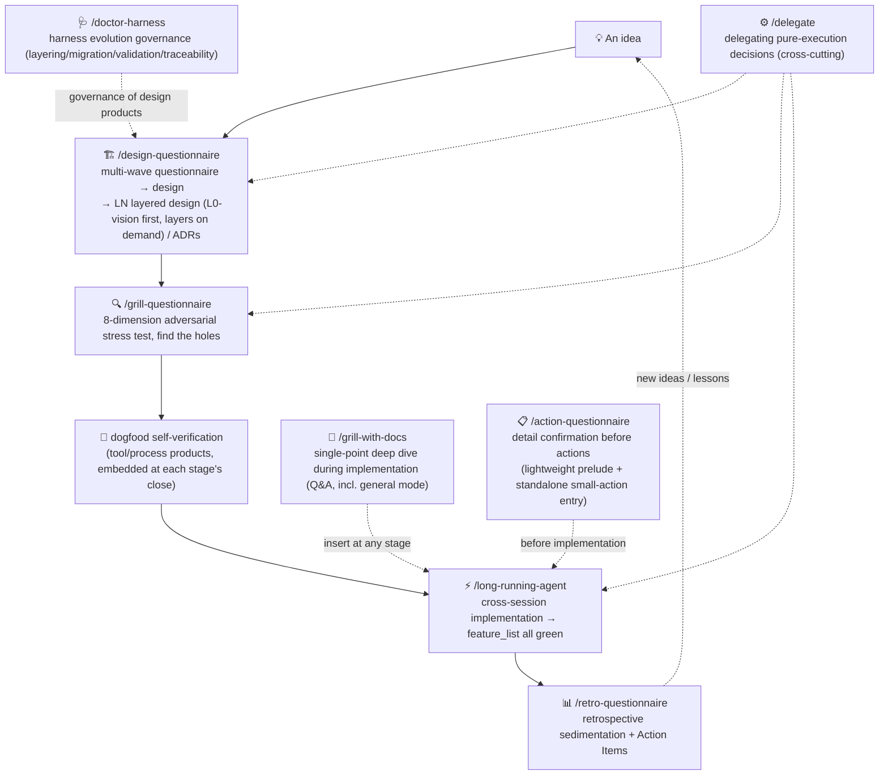

[中文](../README.md) · **English**

> **Translation notice** — This is a translation of the Chinese repository. The Chinese text is canonical; in case of conflict, the Chinese version governs. 译本说明:本文件为译本,中文原文为权威,冲突以中文为准([ADR-0025](../harness/adr/0025-english-mirror-drift-governance-integration.md))。

# info-driven-ai-se-harness-engineering

> **Information as the Core × Engineering Mastery (AI + Software Engineering)** — a personal, AI-native development methodology plus ready-to-run skill executables.

> ⚠️ **experimental · maintained by one person · no guarantee of response**. This is one developer's experience written up and shared, not an official framework. Both the methodology and the skills are still evolving. Issues are welcome, but responses are not guaranteed.

%20+%20MIT%20(skills%2Fscripts)-lightgrey)  

## Table of contents

- [What this is](#what-this-is)
- [Why this one (differentiation)](#why-this-one-differentiation)
- [Quick start: the skill workflow](#quick-start-the-skill-workflow)
- [The 8 core skills](#the-8-core-skills)
- [Tool boundaries (read this first)](#tool-boundaries-read-this-first)
- [Repository structure (three-zone model)](#repository-structure-three-zone-model)
- [License](#license)
- [Changelog](#changelog)
- [Notes](#notes)
- [English mirror tree](#english-mirror-tree)

## What this is

An AI-native development methodology for **individual developers**, plus a **family of Claude Code skills** that turns it into an executable process.

Two pillars (multiplied together — either one at zero makes the product zero):

1. **Information as the Core** — working with AI is, in essence, information flow. The bottlenecks are the quality and quantity of effective context, and the fight against AI's hallucinated self-directed decisions in an information vacuum. The whole workflow is designed around information management: precise feeding, timely sedimentation, zero loss.
2. **Engineering Mastery = AI × Software Engineering** — AI is the accelerator; software engineering discipline (design-first, TDD, code review, ADRs, retrospectives) is the skeleton. AI makes discipline cheaper; discipline makes AI more reliable.

## Why this one (differentiation)

Most comparable work is either "articles only" or "framework only":

- **Articles only**: the reasoning is well explained, but there is no runnable executable — you know the *why*, not how to run it.
- **Framework only**: it runs, but it doesn't tell you why it is designed this way — it works, but you don't know where its boundaries are.
- **External reference**: Anthropic's recent "[AI-Native SDLC Playbook](https://claude.com/blog/the-ai-native-sdlc-playbook)" is structurally aligned with this methodology on "humans write intent, AI runs the middle, machine-verifiable outputs, traceability throughout" (industry-level convergent evolution) — but it targets teams, uses serial interview-style interaction, and defaults to broad delegation. This methodology targets individuals, uses batch questionnaires, and defaults to narrow, auditable delegation.

This repository is **methodology + ready-to-run skill executables** in one — the articles explain why, the skills let you actually run it. (This positioning awaits market validation; see [OD-6](../docs/OPEN-DECISIONS.md).)

## Quick start: the skill workflow

Install: copy (or symlink) `skills/<skill-name>/` into `~/.claude/skills/` (user-level, available in all projects) or a project's `.claude/skills/`, then trigger in Claude Code via `/skill-name` or natural language:



**Main path = five-stage loop**: design-Q → grill-Q → dogfood → long-running → retro-Q; grill-with-docs / delegate / action-Q / doctor-harness are cross-cutting and can be inserted at any stage.

Handoff protocol: design-Q proactively proposes a grill-Q stress test at its close; grill-Q proposes entering long-running for implementation at its close; grill-with-docs (including general mode) and delegate can be inserted at any stage; action-Q is a lightweight prelude — before a design produced by design-Q enters implementation, and before action items from grill-Q / retro-Q land, you can first align on action details. Products and trigger timing of each stage: methodology file [§3](../docs/methodology/methodology_v5.md), practice file [§8.3](../docs/methodology/practical_v1.md).

**Updating**: symlink install → `git pull` follows automatically; copy install → re-copy and overwrite (diff first if you have local customizations). To see whether `skills/` changed and when to re-copy, check [CHANGELOG.md](../CHANGELOG.md).

### Minimal adoption slice

To run your first loop on a new project from zero, you only need 3 things — ① this README (two pillars and the main path) ② [practical_v1.md §8.3](../docs/methodology/practical_v1.md) (skill timing table) ③ `skills/` (copy into `~/.claude/skills/` and go). The methodology / philosophy / practice trio is for deeper reading on demand, not a prerequisite for adoption; this repository's governance system (ADRs / ODs / archived questionnaires / CONTEXT) is the production workshop of the methodology — adopters do not need to replicate it.

## The 8 core skills

The 8 skills form a five-stage loop plus cross-cutting members (see the diagram above). Each card: positioning / triggers / products / core dimensions or mechanisms.

### /action-questionnaire — detail confirmation before informal actions (confirmation list, lightweight prelude)

- **Triggers**: "align on this", "confirm the details", "preflight"; before multi-file write operations / actions involving external dependencies
- **Products**: confirmation results archived to `harness/questionnaires/archive/`; meets three conditions → promoted to ADR; one-way doors / major risks → OPEN-DECISIONS; term conflicts → CONTEXT
- **Core dimensions**: implicit six-element skeleton (goal / input / output / constraints / boundaries / dependencies) + real-environment verification

### /design-questionnaire — one idea → layered design (generative design)

- **Triggers**: "help me design this", "initialize the project design", "new feature design"
- **Products**: LN layered design files (L0-vision goal layer always present, L1+ added on demand; legacy VISION/HLD/LLD accepted as aliases) + ADRs + OPEN-DECISIONS + CONTEXT
- **Core dimensions**: layered skeletons (L0-vision always + L1+/L2 on demand) + real-environment verification + unverified-assumption ledger

### /grill-questionnaire — stress-test existing artifacts, 8 adversarial dimensions to find holes

- **Triggers**: "stress-test", "review this", "find the holes"; stress-testing plans / ADRs / design drafts
- **Products**: findings → processing report (artifact revisions require human authorization — never edits artifacts directly); decisions / risks / terms worth sedimenting → ADR / OPEN-DECISIONS / CONTEXT
- **Core dimensions**: fixed 8 stress dimensions — D1 unstated assumptions / D2 one-way doors / D3 alternatives / D4 failure modes / D5 blind spots / D6 verifiability / D7 contradictions with reality / D8 terminology consistency

### /grill-with-docs — deep-dive on single ambiguities during implementation (one question at a time)

- **Triggers**: single-point deep dives during implementation: "is this technical choice sound?"; codebase-bound design review, plan review (point-by-point, immediate)
- **Products**: codebase-bound mode → CONTEXT / ADR / OPEN-DECISIONS updates; general mode (carries the retired grill's scenarios) → pure dialogue, zero persistence
- **Core dimensions**: no fixed skeleton (pure follow-up questioning); codebase-bound mode adds domain-vocabulary challenge / code cross-verification; general mode leaves no trace

### /retro-questionnaire — retrospective sedimentation for stages / projects

- **Triggers**: "retro this stage", "do a retrospective"; proactively proposed after a stage's DoD verification passes
- **Products**: `docs/retro/<topic>_vN.md` retrospective docs + TODO.md action items
- **Core dimensions**: methodology's four sections (what went well / what went wrong and hypothesized causes / architectural drift / what was learned) + Action Items

### /long-running-agent — constraint system for long, multi-session projects

- **Triggers**: multi-session / long-horizon projects, work spanning context windows; design-Q hands off into implementation
- **Products**: `.claude/feature_list.json` (feature tracking) + `.claude/claude-progress.txt` (cross-session progress)
- **Core mechanism**: feature_list tracking (`passes:true` only after end-to-end tests pass) + progress file against session amnesia + clean git state

### /delegate — governance for delegating pure-execution decisions (pilot)

- **Triggers**: "delegate", "hand over decisions"; when pure-execution decisions are frequent
- **Products**: project-root `delegation.md` (whitelist / forbidden zones / switch) + `delegation-log.md` (append-only log)
- **Core mechanism**: whitelist + forbidden-zone list + per-item revocation conditions + per-case logging; judgment-type decisions are never delegated

### /doctor-harness — harness evolution governance (layering / migration / validation / traceability)

- **Triggers**: "where does this file go"; harness layout / migration / validation; legacy LN migration
- **Products**: harness/ zone organization + [HARNESS-RULES.md](../skills/doctor-harness/HARNESS-RULES.md) (rules authority) + [harness-check.py](../scripts/harness-check.py) validation
- **Core mechanism**: layering rules as the authority + migration tools / flows + layout compliance validation + evolution traceability

### Skill question / confirmation dimensions at a glance

Dimensions = the angles at which each skill questions or confirms with you; names and authoritative definitions live in CONTEXT.

> **Authority = [CONTEXT "提问维度速查"](../docs/CONTEXT.md); this table is an overview — on drift, CONTEXT governs.**


| skill                                    | core dimensions                                                                                                                                                                              | skeleton source                                                         |
| ------------------------------------------ | ---------------------------------------------------------------------------------------------------------------------------------------------------------------------------------------------- | ------------------------------------------------------------------------- |
| design-questionnaire                     | layered skeletons (L0-vision always + L1+/L2 on demand) + real-environment verification + unverified-assumption ledger                                                                       | [STAGE-SKELETONS.md](../skills/design-questionnaire/STAGE-SKELETONS.md) |
| grill-questionnaire                      | fixed 8 stress dimensions D1–D8 (unstated assumptions / one-way doors / alternatives / failure modes / blind spots / verifiability / contradictions with reality / terminology consistency) | [GRILL-SKELETON.md](../skills/grill-questionnaire/GRILL-SKELETON.md)    |
| action-questionnaire                     | implicit six-element skeleton (goal / input / output / constraints / boundaries / dependencies) + real-environment verification                                                              | each SKILL.md, "提取与核实" section                                     |
| retro-questionnaire                      | methodology's four sections (what went well / what went wrong and hypothesized causes / architectural drift / what was learned) + Action Items                                               | [RETRO-SKELETONS.md](../skills/retro-questionnaire/RETRO-SKELETONS.md)  |
| grill-with-docs                          | no fixed skeleton (pure follow-up questioning, single-point deep dive); codebase-bound mode adds domain-vocabulary challenge / code cross-verification; general mode is pure dialogue        | [SKILL.md](../skills/grill-with-docs/SKILL.md)                          |
| long-running / delegate / doctor-harness | non-questioning (constraint system / delegation governance / harness governance)                                                                                                             | each SKILL.md                                                           |

## Tool boundaries (read this first)

- The **methodology's ideas** (two pillars / five-stage loop / the Grill decision method) are tool-agnostic and **portable** to any AI programming workflow.
- The **skills' direct execution depends on three Claude Code mechanisms**: `AskUserQuestion` (batch questionnaire questions / escape hatches), `subagent` (parallel verification — used only by design-Q / grill-Q, not needed by the others), and `SKILL.md` loading. Porting to other tools (Cursor / Cline, etc.) requires adapting these three (see [OD-2](../docs/OPEN-DECISIONS.md)).
- This methodology is **practically verified on Claude Code**; adaptation to other tools is untested — feedback welcome.

## Repository structure (three-zone model)

```
docs/methodology/    methodology articles (CC-BY 4.0) — methodology_v5 + philosophy_v7 are current
docs/CONTEXT.md      glossary / harness/adr/ architecture decision records / docs/OPEN-DECISIONS.md open decisions
harness/design/      AI-process products: design doc suites (per feature/topic subdirectories: repo/ doctor-harness/ skill-spec-revamp/ etc.)
harness/questionnaires/ used-questionnaire archive (archive/ per feature/topic subdirectories + README index)
skills/              the 8 core methodology skills (MIT)
scripts/             desensitization check / harness validation and other tools
CHANGELOG.md         repository-level external change log (moved out of the README "release notes" section, 2026-08-20)
```

Zoning rule: **content = project files (docs/); decision records and process products (ADRs / design docs / questionnaires) = harness files; executables and tools (skills/ scripts/) = root-level products**. Entry files (CLAUDE.md / AGENTS.md / README) stay at the repository root by tool convention and serve only as routing.

## License

- `docs/` (methodology text): **CC-BY 4.0** (attribution; see [docs/LICENSE](../docs/LICENSE)). English files under `en/docs/` are translations of the Chinese originals under the same CC-BY 4.0 terms, with attribution to this repository and a note of translation changes.
- `skills/` and `scripts/` (configuration / code): **MIT** (see [LICENSE](../LICENSE)). Translated files under `en/skills/` carry the same MIT terms.

## Changelog

Repository-level external changes: see [CHANGELOG.md](../CHANGELOG.md) (Chinese).

## Notes

- This repository is the **single source of truth** for this methodology and its skills. The author has earlier development copies (not desensitized); this repository governs ([ADR-0001](../harness/adr/0001-source-of-truth.md)).
- The full methodology is split into three parts ([ADR-0007](../harness/adr/0007-methodology-three-way-split.md)): [methodology_v5.md](../docs/methodology/methodology_v5.md) (methodology · how, self-contained) / [philosophy_v7.md](../docs/methodology/philosophy_v7.md) (philosophy · why, v7 continuous sections and dual-file governance) / [practical_v1.md](../docs/methodology/practical_v1.md) (practice · how to use, non-canonical lightweight revisions); methodology_v5 + philosophy_v7 are current; [methodology_v4](../docs/methodology/archive/methodology_v4.md) / [methodology_v3](../docs/methodology/archive/methodology_v3.md) / [v2](../docs/methodology/archive/methodology_v2.md) / [philosophy_v4](../docs/methodology/archive/philosophy_v4.md) / [philosophy_v5](../docs/methodology/archive/philosophy_v5.md) / [philosophy_v6](../docs/methodology/archive/philosophy_v6.md) are retained as historical versions.

## English mirror tree

English translations live under `en/`, mirroring the Chinese paths one-to-one (`en/<path>` ↔ `<path>`). The Chinese originals are canonical; each mirror file records the source fingerprint (`zh-hash`) checked by [scripts/i18n-check.py](../scripts/i18n-check.py). Current coverage (expanding per phase, [ADR-0025](../harness/adr/0025-english-mirror-drift-governance-integration.md)):

- ✅ `en/README.md` — this file
- ⏳ `en/CHANGELOG.md`, `en/docs/CONTEXT.md`, `en/docs/OPEN-DECISIONS.md`, `en/docs/methodology/` (three current files), `en/skills/*/SKILL.md` — in progress
