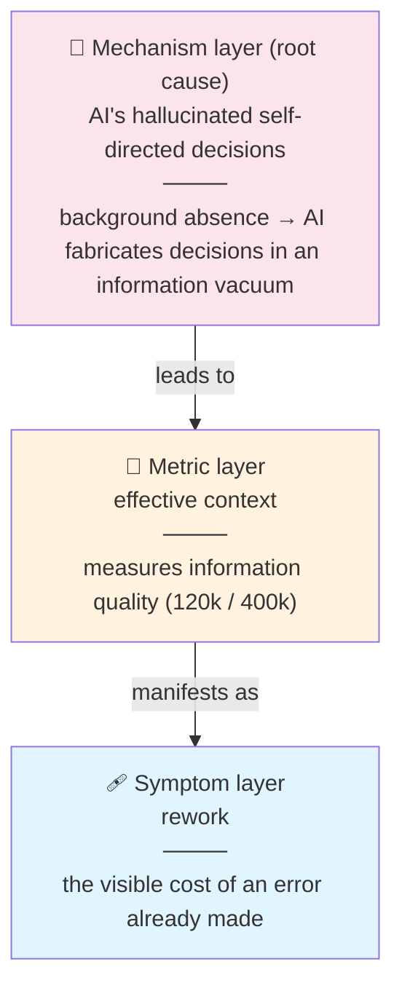
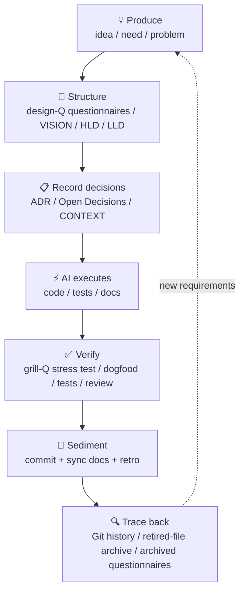
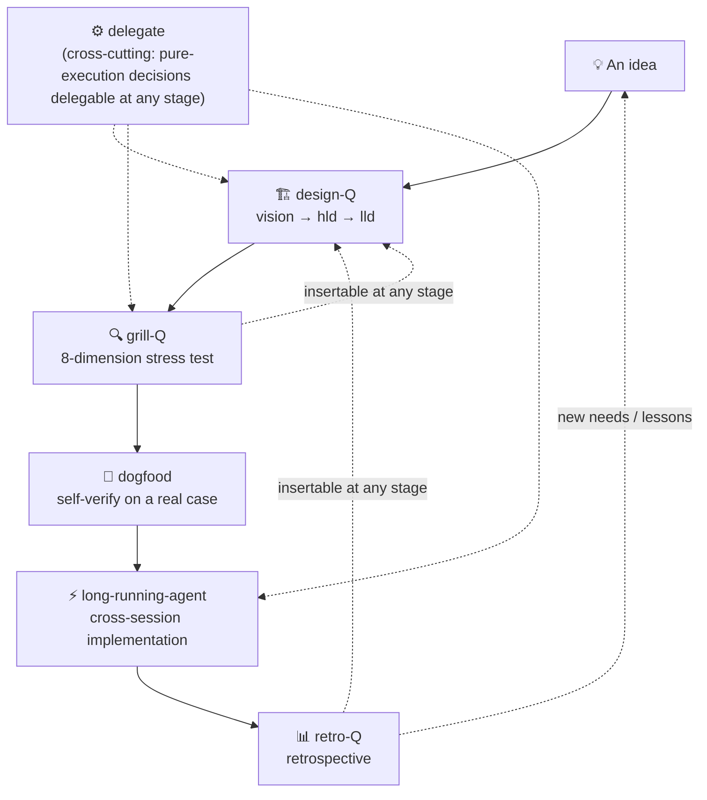

[中文](../../../docs/methodology/methodology_v5.md) · **English**

> **Translation notice** — This is a translation of the Chinese original. The Chinese text is canonical; in case of conflict, the Chinese version governs ([ADR-0025](../../../harness/adr/0025-english-mirror-drift-governance-integration.md)). Terms follow the English Glossary in [CONTEXT](../CONTEXT.md).

# Information as the Core: Claude Code AI-Native Development Experience v5

> **Version lineage**: v1 single pillar (Information as the Core) → v2 dual pillars (+ Engineering Mastery = AI × Software Engineering) → v3 completed the first pillar's mechanism layer (elevating "countering AI's hallucinated self-directed decisions" from an implicit aside to an explicit thesis) → v4 narrowed the audience + symmetrized the second pillar's mechanism layer + terminology governance (referencing human factors engineering / software engineering / operations research perspectives) → **v5 continuous section numbering + contract-first adjudication + action-Q joins the family** (2026-08-14, grill-Q methodology-improvement W01; following philosophy v7's ADR-0017 compatibility strategy and the peer-benchmark repo's inter-layer adjudication).
>
> **Revision log** (committed or released versions only, one line per level; added 2026-08-19, aligned with philosophy v7's traceability pattern): **2026-08-19 in-version revision: §4.1 cognitive-state wiring sentence + §4.3 criterion-conflict priority sentence + §3.3.1 criterion-anchor pointer note + §8 failure mode #25 (grill boundary deep dive + grill-boundary-canonical-w01 re-stress; content revision, not structural change — per the canonical version-bump criteria, no version bump)**.
>
> **Section numbering (v5)**: the body uses continuous numbering "§0–§9 + Appendix C/D". Mapping from old v4 numbers: §二→§一, §三→§二, §四→§三, §五→§四, §七→§五, §九→§六, §十→§七, §十一→§八, §十二→§九 (subsections follow: e.g. §4.3.1→§3.3.1, §5.3→§4.3, §7.3→§5.3; §7.4–7.6 belong to the practice file, numbering unchanged). Missing numbers §一/§六/§八 (v4 and earlier) moved into the philosophy file (§一/§六 → philosophy §1/§2) and the practice file (§8) respectively. Historical documents and archived questionnaires keep their original numbering; compatibility strategy follows [ADR-0017](../../../harness/adr/0017-philosophy-section-compatibility.md).
>
> **v4 evolution derivation chain**: using the methodology on itself exposed — audience positioning too broad (writing for both 1–5-person teams and individuals), terminology inflation (too many coined words), second pillar underweighted (under "balanced dual pillars" phrasing, "Engineering Mastery" lacked a mechanism-layer thesis) → v4 narrowed the audience to **individual developers**, gave the second pillar its mechanism layer (guardrail mechanisms made explicit, symmetric with the first pillar), audited terminology (all 8 terms retained + three-condition gate for new words; discipline-reference annotations in the [CONTEXT terminology governance section](../CONTEXT.md)). v4 is retained as a historical parent (archive/); this file, v5, is current.
>
> **This document is self-contained** — the methodology's core is complete here and depends on no external document. The skill family is the methodology's execution body (it automates the process), but the methodology itself is fully expounded in this document; reading it does not require reading the skill specs first.
>
> **Three-way split** (2026-08-04, [ADR-0007](../../../harness/adr/0007-methodology-three-way-split.md)): this file is the **methodology file** — the complete exposition of "how", self-contained; "why" (failure modes / human-machine division of labor / meta-principles) is in the [philosophy file](philosophy_v7.md) (canonical member); "how to use" (skill timing / tool conventions / context operation chains) is in the [practice file](practical_v1.md) (non-canonical, lightweight revisions).

---

> **Problem teaser**: in traditional vibe coding, incomplete background briefing → AI presumes and makes self-directed decisions → hallucination → rework — the entire methodology of this document fights this causal chain (§4's questionnaire-driven, stepwise requirement alignment is the direct countermeasure). The full failure-mode and two-type information-gap analysis is in [philosophy §1](philosophy_v7.md).

## §0 Applicable scenarios

### Who should read this document

- **Individual developers** — independent development / side projects / personal projects, one person acting as PM + dev + test + ops (audience narrowed to individuals since v4; 1–5-person teams may adapt, multi-role collaboration details need supplementing per team situation)
- **Developers who write code directly with AI (vibe coding) but keep hitting "AI acted on its own" rework** — this is the document's primary governance target
- Feature development or product building with clear goals, needing to go from an idea all the way to delivery
- Developers who want AI to slash decision cost and time cost, but do not want AI to take over judgment
- Anyone who agrees with "think it through before acting" and is willing to invest time in planning

### Who it does not fit

- **Large cross-functional teams** (>10 people): they need formal PRDs, multi-role review meetings, cross-department alignment; this document's lightweight process cannot replace those organizational coordination mechanisms
- **Pure exploratory spikes**: when the goal is "see whether this can even run" rather than delivering a feature, no full planning process is needed
- **Scenarios of zero trust in AI**: this document assumes AI is a usable execution partner

### Task types and process fit

This document's **five-stage loop** (design-Q → grill-Q → dogfood → long-running → retro-Q, see §3) targets **greenfield feature development**. Other everyday task types are tailored as needed:

| Task type | Suggested process |
| --- | --- |
| **Feature development** | full five-stage loop |
| **Bug fix** | locate → write reproduction test → fix → verify → retro (skip design-Q) |
| **Small changes / config tweaks** (copy edits, style adjustments, parameter tuning) | action-Q confirmation (when external dependencies are involved) → execute → verify → commit (skip design-Q / grill-Q) |
| **Refactoring** | clarify refactor goal → grill-Q stress-test the target architecture → write protective tests → refactor → verify tests pass |
| **Dependency upgrade** | read changelog → upgrade → run tests → fix breaking changes |
| **Exploratory spike** | write a goal hypothesis → verify quickly → record the conclusion (success or failure) → retro decides whether to convert into feature development |

> Whatever the task type, the core principles hold: think before acting, acceptance criteria are explicit, conclusions get sedimented. **Task types not listed** (e.g. urgent hotfixes, throwaway scripts) default to a **minimum-common-sense process** (think it through → change → verify → sediment); action-Q optional, one-way doors always pause (2026-08-18, grill-Q first-principles W02 T3).

### Reading advice

This is a methodology, not dogma. Readers should adapt it to their own projects. Each section can be consulted independently — even without adopting the full loop, the Grill decision method, requirements execution discipline, and information management discipline can be used standalone.

The methodology has been sedimented into a skill family (see [§8.3 of the practice file](practical_v1.md)); every stage has a corresponding execution body that automates the process. You can read this document first to understand the methodology's core, then take the skills you need; or start with the skills and reconstruct the methodology from their outputs.

---

## §1 Core ideas

v2 upgraded the core ideas from v1's single pillar to **dual pillars**; v3 completed the first pillar's **mechanism layer**. The two multiply; either at zero makes the product zero.

### 1.1 Pillar one: Information as the Core

> **Pillar one · Information as the Core** — the essence of collaborating with AI is information flow; the bottleneck is not only the quality and quantity of effective context, but also countering AI's hallucinated self-directed decisions in an information vacuum — hence stepwise requirement alignment through questionnaires.

The essence of collaborating with AI is **information flow** — context enters the model, the model produces results, and results sediment into new information.

#### Mechanism layer: background absence → AI acts on its own

When background information is missing, the AI does not stop and admit "I don't know" — it acts on its own in an **information vacuum**: it fabricates project conventions, data formats, and boundary conditions it never knew, and fabricates them flawlessly (see the failure scenarios in [philosophy §1.1](philosophy_v7.md)). This is the true source of rework:

> **Background absence → AI's hallucinated self-directed decisions in an information vacuum → rework. Stepwise questionnaire alignment of requirements is the direct countermeasure against this mechanism.**

This causal chain is the core thesis v3 completed: v2 only mentioned it in passing inside the "effective context" definition ("less prone to hallucination"); v3 promoted it to the mechanism layer — both the rework framework and the effective-context framework hang beneath it.

#### Three-layer thesis model (mechanism layer → metric layer → symptom layer)

v3 organizes the first pillar into three layers. **Note: the three layers are a causal chain, not peer categories** — mechanism layer (root cause) → leads to → metric layer → manifests as → symptom layer:



The old frameworks are not negated: v2's "effective context" and "rework" remain valid — what v3 added is the root-cause layer beneath them. Rework is the symptom (the visible cost of an error already made); effective context is the metric (how well information was fed); the mechanism layer answers "why missing information almost necessarily means rework" — because the AI will act on its own in a vacuum.

#### Metric layer: effective context

"Effective context" means the amount of information that is hard to hallucinate from and precisely hits the current task. More context is not better: for a 200k-context model, the empirical effective-context value is about 120k; for a 1m-context model, about 400k. Noise dilutes the model's attention. **Source grading** (2026-08-18, grill-Q first-principles W02 T1): 120k/400k are the **author's empirical values** (subjective feel, no systematic measurement; roughly 60% and 40% of the window), drifting across model generations with no fixed re-verification cycle — update trigger = re-estimate when an adopter subjectively notices output-quality degradation. **Note: the 120k/400k here is a token scale for the model's context window (measuring the dilution of model attention), while human-factors engineering's "cognitive load" (measuring human decision fatigue) is a separate, non-convertible scale — related only by analogy; see the [CONTEXT glossary](../CONTEXT.md).**

**Absence and overload are problems at two different links, not contradictions**: background absence creates the information vacuum (a mechanism-layer problem; the countermeasure is questionnaire alignment to supply background); in-session context overload dilutes attention (a metric-layer problem; the countermeasure is to first sediment decisions to disk via design-Q and similar skills, then /compact — see [§7.6 of the practice file](practical_v1.md)). Each has its own countermeasure; do not conflate them.

Therefore the whole development workflow should be designed around information management: **precise feeding, timely sedimentation, zero loss** — with questionnaire alignment countering self-directed decisions in the information vacuum (§4).

### 1.2 Pillar two: Engineering Mastery = AI + Software Engineering

v1 took "Information as the Core" as the only pillar, but practice showed it was not enough — information flows efficiently, but without the skeleton of engineering discipline, AI-produced code quietly degrades. v2 explicitly distilled the second pillar:

> **Engineering Mastery = AI × Software Engineering. AI is the accelerator; software engineering discipline is the skeleton. The two multiply; either at zero brings the product to zero.**

#### Mechanism layer: no guardrails → AI output quietly degrades

The second pillar's mechanism layer is symmetric with the first ([§1.1](#11-pillar-one-information-as-the-core)): the first is "background absence → AI hallucinated self-direction"; the second is "no engineering guardrails → AI output quietly degrades" —

> **No guardrails → AI output quietly degrades → rework. Engineering discipline (design-first / TDD / testing / ADRs / retrospectives) is the guardrail: it makes degradation visible and interceptable.**

> **(v5/v6/v7 safety-science note)** The deep foundation of guardrails is safety science — safety = system-level control (STAMP, Leveson); engineering discipline making degradation "visible and interceptable" is precisely **control visibility**, an instrument against the AI black box (invisible process). See [philosophy §4](philosophy_v7.md).

After v3 completed the first pillar's mechanism layer, v4 added the second pillar's symmetric thesis. What is symmetric is the "depth of thesis", not the "number of layers": the second pillar builds only the mechanism layer, not metric/symptom layers — degradation's metrics and symptoms are shared with the first pillar (effective-context dilution / rework); the two pillars are two faces of one system.

"Software engineering discipline" in this methodology concretely means: design-first (VISION/HLD/LLD), TDD, small commits, code review, ADRs, requirements execution discipline, retrospectives. These are not AI's opponents but quality guardrails for AI output. AI slashes the cost of executing these disciplines (auto-generating tests, instant review, batch questionnaires), but the disciplines themselves cannot be skipped.

- **AI makes engineering discipline cheaper**: an ADR used to take half a day; now grill-Q stress-testing + AI drafting produces a draft in minutes. TDD test-writing used to be a burden; now AI generates test cases and humans review.
- **Engineering discipline makes AI more reliable**: without test guardrails, AI refactoring introduces hidden bugs; without design docs, AI implementations drift; without retrospectives, AI falls into the same pit repeatedly.

### 1.3 Two rejected alternatives (guarding against extremes)

v1 §6.5 required key decisions to state rejected alternatives; this section practices what it preaches:

| Rejected alternative | Symptom | Why it's wrong |
| --- | --- | --- |
| ❌ **AI replaces engineering discipline** | Blind trust in AI; skipping tests/design/review; "AI says it's fine, merge it" | AI output quality declines without notice; an AI without guardrails is a hazard amplifier. v1 meta-principle "blind trust in AI" failure mode |
| ❌ **Pure engineering without AI** | Rigidly sticking to manual processes; writing designs/tests/docs all by yourself | Giving up the acceleration, left behind by AI-era peers; the individual developer loses the "one-person-five-roles" leverage |

**The right way**: AI accelerates the **execution** of engineering discipline; engineering discipline constrains AI **output**. The two are a multiplication relationship, not a substitution relationship.

---

## §2 Information lifecycle



Every stage's information must have a place on disk, ensuring:

- the current you can trace back
- the future you can understand
- AI can reload it as context in later sessions

**Information-flow forms added in v2** (within the lifecycle above):

- **Batch questionnaires** (design-Q/grill-Q/retro-Q): changing the "one question, one answer" flow into "multi-wave offline answering"; the questionnaire file itself is the sedimented decision record, traceable after archiving.
- **Dogfood feedback**: gaps found by self-verifying the product are immediately fed back into the spec — a "verify → structure" feedback loop.
- **Archive by moving, never delete**: processed questionnaires move into archive/ with unchanged filenames; information is never lost.

---

## §3 Development workflow

> This is the document's core chapter. v2 upgraded v1's linear 6 stages (idea → vision → global design → staged design → implementation → retro) into a **five-stage loop + cross-cutting members**; every stage has a corresponding skill execution body, and grill-Q / dogfood / retro / delegate are **orthogonally insertable** methodologies, not locked into fixed positions.

### 3.1 The overall loop



Loop essentials:

- **Main path**: idea → design-Q (design) → grill-Q (stress test) → dogfood (self-verify) → long-running (implementation) → retro (retrospective) → back to idea.
- **Cross-cutting**: delegate can be triggered at any stage (delegating pure-execution decisions).
- **Freely insertable**: grill-Q, dogfood, retro, and delegate are not linear stages but orthogonal methodologies — whenever the matching problem appears at any stage, they can be invoked. For example, mid-implementation (long-running) a design blind spot surfaces: grill-Q can be temporarily inserted to stress-test that point; a retro on the process itself can be inserted at any node.

### 3.2 Stage details

#### Stage 1: design-questionnaire (design phase · generative)

Changes "one-question-one-answer grill design" into "multi-wave questionnaires". Starting from a one-sentence idea, expand into a complete design using **dynamic LN layering** (2026-08-17 digital-levels revamp, [ADR-0022](../../../harness/adr/0022-design-questionnaire-digital-levels.md)): L0-vision (goal layer) is always present and cannot collapse; L1+/L2 layers are added on demand (layer responsibilities self-declared, single-responsibility preferred — by default each layer owns one function; merge only when content is clearly thin; single-layer delivery is legal for small projects). Old stage names in the table below are alias-compatible:

| Layer (alias) | v1 concept | Artifact | What gets grilled |
| --- | --- | --- | --- |
| **L0-vision** (vision) | vision document | harness/design/ L0-vision-*.md (VISION as alias) | goals, scope, core scenarios, acceptance criteria, risks and constraints |
| **L1-contract** (hld) | global design | harness/design/ L1-contract-*.md (HLD as alias) | system architecture, technology choices, interface contracts, ADRs, deployment and operations |
| **L2-build** (lld) | staged design | harness/design/ L2-build-*.md (LLD as alias) | stage goals, detailed design, interface specs, DoD, dependencies, estimates |

**Key mechanisms**:

- **Preview pre-answer layer (W00)**: before each layer's formal wave, an independent decision-defaults list is generated, one item per line (decision point + AI default lean + source). The user answers item by item: check = adopt the default; leave blank = escalate to a formal question for deep interrogation. The "obvious decisions" pass quickly in batch; effort concentrates on points of real disagreement.
- **Layer gate** (formerly stage gate): within-layer termination is the agent's judgment (showing a coverage checklist); crossing layers requires explicit user confirmation.
- **Real-environment verification**: wherever external dependencies are involved (libraries, toolchains, paths, versions), compile-and-link tests must actually run before questions are posed — not just "is it installed". A library existing ≠ usable.
- **Sedimentation**: L0-vision / L1+ layer files / ADRs / OPEN-DECISIONS / CONTEXT — written the moment each wave is processed, never batched up.

#### Stage 2: grill-questionnaire (after design · adversarial stress test)

Changes "one-question-one-answer grill stress-testing" into "multi-wave questionnaires". After design-Q produces a design draft, eight fixed stress dimensions are applied to every key claim, hunting for holes, blind spots, and one-way doors:

| Dimension | What it stress-tests |
| --- | --- |
| **D1 unstated assumptions** | What unspoken assumptions does the design rest on? Valid / doubtful / broken |
| **D2 one-way doors / reversibility** | Which choices are hard to reverse? ADR or OD? |
| **D3 alternatives / rejected options** | Do key decisions state rejected alternatives, or is there only one plan? |
| **D4 failure modes / blast radius** | What happens on error? Can it degrade? How wide is the impact? |
| **D5 blind spots** | The unsaid: boundaries, error paths, concurrency, rollback, migration |
| **D6 verifiability** | Are acceptance criteria checkable, or empty words? |
| **D7 contradictions with reality** | The design says X, but the code/CONTEXT/ADR says Y (the most valuable check) |
| **D8 terminology consistency** | Do word choices conflict with CONTEXT definitions / overload / blur? |

**Iron rule**: **only produce findings; never edit the artifact**. Holes found go into a processing report; artifact revision is initiated by the human (actively asked about at close). Sedimentable items (decisions meeting the ADR three conditions, one-way-door risks, terminology conflicts) are written to disk immediately.

**When to use**: proactively proposed once at design-Q close; can also be manually triggered anytime to stress-test any existing artifact (ADR draft, architecture proposal, plan).

**Layer position and handoff** (80/20 judgment-cost principle, see §4.2): grill-Q is the batch layer for "the 80% of foreseeable basic questions" — D1–D8 are essentially distilled knowledge of a known attack surface; the 20% critical deep-water points found under stress (deep dependency chains, needing immediate feedback) transfer to grill-with-docs for one-question-one-answer deep diving; once a dive's crystallization becomes an artifact, grill-Q can re-stress it — a bidirectional 80% ↔ 20% handoff.

#### Stage 3: dogfood (any stage · product self-verification)

v1 lacked this stage. v2 promoted it to methodology level: when the product is a **tool / process / template / skill / config / script**, walk a complete loop on a real small case before closing, feeding gaps straight back into the spec.

**Why it's needed**: in the design-implement-verify loop, "verify" usually means verifying code behavior. But a tool/process product's "function" is "can it be used correctly" — that can only be self-verified on a real case, not assumed.

**How**:

- Run a complete loop with the product on a real small case (e.g. use a newly designed skill to walk one real feature through design → stress test → implementation).
- Gaps in format/process found are immediately fed back into the product spec.
- Skipping and results are both recorded (skipping must state a reason; no silent skips).

**Not mandatory**: pure code features can skip dogfood (tests are the self-verification); strongly recommended for tool/process products.

#### Stage 4: retro-questionnaire (any stage · retrospective)

Changes "write a retrospective document" into "multi-wave questionnaires". v1 locked retrospectives into stage 6 (the end); v2 repositioned: **retro is a methodology insertable at any stage**.

**Two kinds of retrospective**:

- **Project retrospective** (stage/project end): What went well / What went wrong / architectural drift / What was learned + Action Items.
- **Methodology/process retrospective** (any node): retrospect on the process itself — which stages helped you this time, which were ritual. Corresponds to v1's meta-principle "the methodology itself also iterates".

**Sedimentation**: retro docs + Action Items written into TODO.md (problem → action → verification timing).

#### Stage 5: long-running-agent (implementation phase · cross-session constraint system)

v1's implementation-phase description was thin (only TDD/small commits). v2 makes long-running-agent the core implementation-phase execution discipline, systematically countering **cross-session amnesia** — the number-one killer of long projects.

**Core ideas** (based on Anthropic's "Effective harnesses for long-running-agents"):

- **Incremental work**: one feature at a time — fully implement → test → commit → next.
- **Clear artifacts**: leave clear progress records for the next session (written to files, not context).
- **Clean state**: the code is always in a mergeable-to-main state.
- **End-to-end verification**: a feature is marked done only after passing the full tests.

**Core files**:

| File | Purpose |
| --- | --- |
| `feature_list.json` | all feature requirements and status (passes: true/false); created in the first session, updated afterwards |
| `claude-progress.txt` | per-session work record; updated at session end, newest on top |

**Dual mode** (v2 extension, 2026-08-17, landed by [ADR-0022](../../../harness/adr/0022-design-questionnaire-digital-levels.md)): by default a single agent working one feature at a time; large / parallel needs can enable **preparation mode** (planning parallel threads + task packages, human-reviewed) and **execution mode** (multiple worktrees in parallel, agents inside worktrees communicating via SendMessage); mode switches are confirmed by the human.

**Rebuilding context from files on disk (key mechanism)**: session context gets compacted and loses design-phase decision detail. long-running does not depend on session context — it rebuilds from files on disk: with design-Q artifacts, read VISION/HLD/LLD + archived questionnaires and derive the feature list; otherwise read progress + feature_list + git log. Whether or not context has been compacted, the files on disk are the source of truth.

**Feature marking rules**:

```
[OK] all end-to-end tests pass → passes: true
[X]  marking true without testing — forbidden
[X]  skipping failing tests      — forbidden (hides problems)
[X]  deleting feature items to cut workload — forbidden (features lost forever)
```

#### Cross-cutting stage: delegate (any stage · decision delegation)

v1 §6.5's decision tiering planted the seed at its bottom "pure execution" layer; v2 systematized it into delegate. See §4.5.

### 3.3 The methodology is freely insertable

The key difference between v2 and v1's linear 6 stages: **grill-Q / dogfood / retro / delegate are orthogonal methodologies, not linear stages**.

> **Stage vs. orthogonal, disambiguated** (v5 note, 2026-08-18 grill-Q first-principles W01 Q8): **stage = the main path's default time slot** (the default order for newcomers); **orthogonal = insertable at any stage** (freedom for the practiced). dogfood / retro / grill-Q / delegate are both — the main path is only their default insertion point; the dual identity is a design feature, not a contradiction.

| Methodology | When to insert | Typical scenarios |
| --- | --- | --- |
| grill-Q | any stage, when an artifact needs challenging | stress test at design-Q close; design blind spot found mid-implementation; ADR draft review |
| dogfood | any stage, when the product is a tool/process | skill designed; template finalized; config scheme settled |
| retro | any stage, when reflection is due | project retro at stage end; methodology retro when the process drifts; instant retro after falling into a pit |
| delegate | any stage, when pure-execution decisions pile up | naming/format/version-number batch decisions; questionnaire archiving operations |

Where v1 locked retrospectives to the end and Grill to the vision and implementation phases, v2 makes the methodologies available on demand.

#### 3.3.1 Skill niche routing and the minimal cross-skill contract (v7 W02)

The eight skills stay independent; no umbrella-control skill for now. The single authoritative routing table follows; it answers "when to enter, what is produced, who holds decision power, where the hard boundaries are, when to hand off". Every time a real case reveals repeated mis-triggering or handoff ambiguity, update the routing evidence first — do not rush to merge entry points or rename things. (2026-08-19: grill retired and merged into grill-with-docs general mode; the family shrank from 9 to 8, see [OD-12](../OPEN-DECISIONS.md))

| Entry | Trigger / input | Minimal output | Decision power | Must not overstep | Handoff condition |
|---|---|---|---|---|---|
| `design-questionnaire` | new feature / new scheme; idea, requirements, environment facts | VISION / HLD / LLD, ADR / OD candidates | the user confirms goals, scope, risks and stage gates | never finish the design, stress test, or implement on the user's behalf | design artifact exists → `grill-questionnaire` |
| `grill-questionnaire` | an existing plan, ADR, design, or methodology claim; batch-answerable offline | processing report, immediate ADR / OD / TODO sediment | the user adjudicates item by item; artifact revision needs separate authorization | only produces findings; never silently edits the stress-tested artifact | deep dependency, needs instant feedback → `grill-with-docs`; conclusions stabilized → back to artifact for re-stress |
| `grill-with-docs` | a single deep-water question (deep chain / unformed / needs instant feedback); codebase-bound (default) or general (unbound; the original grill niche, merged in when grill retired 2026-08-19) | bound: codebase verification, CONTEXT / ADR / OD updates; general: one-question-one-answer judgment support (zero persistence) | the user; AI only presents evidence and options | never substitute for batch stress-testing, or generalize without facts; general mode persists nothing automatically | crystallized into an artifact → `grill-questionnaire` re-stress or back to `design-questionnaire` |
| `retro-questionnaire` | a finished stage, a failure, a deviation, or methodology usage records | retro doc, TODO Action Items, feedback candidates | the user decides to keep, revise, or drop | never auto-treat retro conclusions as new norms | rule failure → `design-questionnaire` / `grill-questionnaire` |
| `long-running-agent` | cross-session implementation; approved design and feature list | progress, feature_list, tests and commit state | the human confirms feature completion; the AI executes and verifies | never silently change goals, risks, or interfaces during implementation | design-level deviation → pause and return to the canonical design; done → `retro-questionnaire` |
| `delegate` | explicitly enabled whitelist of pure-execution decisions | delegation-log, revocable execution results | the human reviews whitelist, forbidden zones, revocation conditions | never make judgment-type decisions, one-way doors, or self-classify | anomaly → global off / per-class revoke → `retro-questionnaire` |
| `action-questionnaire` | an informal action about to run; action details unconfirmed | confirm-list, user confirmation record | the user confirms action details and one-way doors | never replace architecture design, risk trade-offs, or authorization | confirmed → execute; design change found → back to `design-questionnaire` / `grill-questionnaire` |
| `doctor-harness` | harness layout, migration, archiving, or compliance validation | rules, migration records, validation results | rules and canonical authority confirmed by the human | never replace methodology-claim judgment or business design | content conflict found → the corresponding canonical / ADR; layout done → return to the invoking skill |

> Note (2026-08-19, re-stress grill-boundary-canonical-w01 Q1): the criterion anchor for routing between the two families = the **three cognitive states**; see [§4.3](#43-two-grill-families) and [philosophy §3.1](philosophy_v7.md). This table is the contract layer and does not duplicate criterion content.

All entries share a five-field minimal contract: **input/output, evidence status, deviation records, verification strength, handoff trigger**. When fields are missing, artifacts may only be marked "unverified / provisional placeholder" — "the skill ran" must not be written as "the governance capability holds". The full coverage matrix, verification cards, and cross-review records are in [`harness/design/methodology-governance/LLD.md`](../../../harness/design/methodology-governance/LLD.md).

#### 3.3.2 Risk-triggered evidence-first, deviation feedback, and failure-mode handoff

**Evidence-first**: any claim involving tool behavior, code behavior, external dependencies, or irreversible actions must carry the original source or a reproducible command and output before execution. When verification is impossible, explicitly mark "unverified"; low-risk reversible actions may continue with status, but high-risk or one-way-door actions must pause and request human confirmation.

**Design–implementation deviation taxonomy**:

| Deviation type | Criterion | Handling |
|---|---|---|
| Local implementation optimization | does not change goals, constraints, risks, interfaces, or acceptance criteria | record in implementation notes / retro; if reusable, promote into methodology or skill revision |
| Governance-level deviation | changes goals, constraints, risks, interfaces, or acceptance criteria | pause related irreversible actions, preserve facts and side effects, update the canonical design, re-run cross-challenge, then continue |
| Unclassifiable | impact scope or risk boundary unclear | treat as a judgment-type decision; confirm with the human; never silently file as "optimization" |

Code is evidence of reality, not an automatic authority; after adjudication, code and design must be re-aligned — never overwrite the design or mask the deviation by silently retrying.

**Minimal failure-mode handoff set**:

| Stage | Must cover | Fed back as |
|---|---|---|
| Design | key boundaries, blast radius, rollback, irreversible actions | acceptance conditions and a minimal failure-mode set |
| Stress test | counterexamples, unstated assumptions, reality contradictions, terminology conflicts | into the processing report, ADR / OD, or design revision |
| dogfood / tests | representative scenarios, oracle independence, user playability | test scope, play / confirmation records, and gaps |
| retro | omissions, mis-triggering, failure recovery, whether rules went ritual | fed back as rules, verification cards, skill contracts, or explicit reasons-not-to-fix |

Uncovered boundaries must be explicitly marked; "no problems found this round" does not mean "boundaries covered".

### 3.4 Mapping to the traditional SDLC (v1's 6 stages demoted to this table)

v1's 6 stages remain a good frame for understanding the methodology, but execution has merged into the five-stage loop:

| v1 / traditional stage | v2 counterpart | Note |
| --- | --- | --- |
| Idea | the idea (design-Q L0-vision input) | one sentence + motivation |
| Vision document | design-Q **L0-vision** layer waves (formerly vision) | questionnaire-driven, no longer hand-written |
| Global design | design-Q **L1-contract** layer waves (formerly hld) | includes ADRs |
| Staged design | design-Q **L2-build** layer waves (formerly lld) | includes DoD |
| Implementation | **long-running-agent** | systematized cross-session discipline |
| Retrospective | **retro-Q** | questionnaire-driven, insertable at any stage |
| — (absent in v1) | **grill-Q** stress test | new in v2: adversarial stress test after design |
| — (absent in v1) | **dogfood** self-verification | new in v2: self-verification for tool/process products |
| — (absent in v1) | **delegate** | new in v2: systematized delegation of pure-execution decisions |

---

## §4 The Grill decision methodology

Grill is this methodology's decision engine. v2 upgraded v1's "one question one answer" into "two Grill families".

### 4.1 Core principle

**Never decide for the user — help the user see the decision clearly.**

The human's job is judgment; the AI's job is to probe blind spots, present options, and analyze trade-offs. In a Grill process, the "recommended option" is only an input that lowers decision burden — never the final decision.

#### The (a)(b) blind spots: two types of background absence ★ v3

§1.1's mechanism layer says "background absence → AI acts on its own". But "fill in the background" hides a difficulty: **background absence comes in two types with different countermeasures**:

- **(a) Known but unwritten**: the background is in the author's head, just never briefed to the AI — project conventions, historical decisions, legacy code that must not be touched. This type can be **captured by structured questioning**: design-Q's preview pre-answer layer and questionnaire questions surface the decisions you "know but haven't written", one by one.
- **(b) Not even known to yourself**: implicit assumptions the author never noticed — "I assumed orders could always be partially cancelled; I never said so, because I never imagined otherwise". This type **cannot be asked out** — you don't know what to brief; only **grill's adversarial stress-testing can force it out** — D1 unstated assumptions and D7 contradictions with reality specifically attack this blind spot.

(b) is the most dangerous breeding ground for AI hallucination: the human didn't say it, so the AI makes it up — and when the human reviews, they likewise don't notice an assumption is hiding there. **Grill's irreplaceability lies precisely in forcing out (b)** — this is what distinguishes questionnaire alignment from "documentary completeness-ism" (believing that writing exhaustive documents settles everything).

**Cognitive-state wiring (2026-08-19, grill boundary deep dive; re-stressed in grill-boundary-canonical-w01)**: the (a)(b) taxonomy is simultaneously the cognitive-layer routing criterion for the two families in §4.3 — the essence of "foreseeable, offline-answerable" = state ① (the answer material is already in the human's head); the essence of "deep dependency chain, decision unformed" = state ② (the answer must be generated through round-by-round reasoning); type (b) = state ③, forced out by adversarial dimensions. Human introspection about their own cognitive state is not fully reliable — **when in doubt, go heavy** (heuristic): if batch-vs-single is doubtful, treat it as single-point (deep diving carries its own instant correction). Boundary: when a human enlists AI precisely because they **lack the task knowledge themselves** (learning / exploration scenarios), the cognitive-state criterion does not apply — the answer material exists on neither side; follow the task-level processes in the §0 task table (exploratory spikes etc.), not the two-family routing. Full definitions of the three states are in [CONTEXT, "Grill family · three cognitive states"](../CONTEXT.md).

### 4.2 Evolution note: from one-question-one-answer to batch questionnaires

> **v1 assumption**: Grill must be one question at a time ("ask only one question, wait for the answer, then move to the next").
> **v2 refutation**: practice proved that design / stress-test / retro decisions can be batched.

**Reason for the evolution**: the biggest cost of one-question-one-answer is not the asking, but the serial waiting of "one LLM round-trip per question". Ten decisions asked serially = ten rounds of waiting. Change to multi-wave questionnaires: pose questions once (max 10 per wave), the user answers offline, the agent parses and writes to disk in one pass — serial waiting minimized, and **decision power is not lost** (every question still has ★recommendation + 🤔 escape hatch + immediate sedimentation; the human remains the decider).

**Scenarios that keep one-question-one-answer (80/20 judgment-cost principle)**: batch questionnaires handle the basic questions that are foreseeable, with a known problem space, answerable offline; questions with deep dependency chains that need instant feedback — implementation-phase single-point ambiguity, plan review, or unformed risk boundaries — keep one-question-one-answer. The 80/20 here is a **routing heuristic, not a time quota, statistical law, or acceptance target**; the actual split is judged by dependency-chain depth, instant-feedback need, reversibility / risk, and offline-answerability, see §3.3.1. This principle originates from grill-questionnaire's original design (author's note, 2026-07-31) and is a living example of the (a)-type blind spot "known but unwritten", see §4.1.

### 4.3 Two Grill families

| | Batch questionnaire family | Single-point deep-dive family |
| --- | --- | --- |
| **skill** | design-Q / grill-Q / retro-Q / action-Q (confirm-list confirm-style fork, aligned with the [CONTEXT Grill family section](../CONTEXT.md)) | grill-with-docs (codebase-bound + general dual mode; the original grill retired 2026-08-19 and merged into general mode) |
| **Interaction** | multi-wave questionnaires, answered offline | one question one answer, waiting each round |
| **Judgment-cost layer** | the 80% foreseeable basic questions (20% of human time) | the 20% critical questions (80% of human time, §4.2) |
| **Scenarios** | generative design / adversarial stress test / retro | implementation-phase single-point ambiguity, plan review |
| **Skeleton** | yes (vision/hld/lld; or D1–D8; or four sections) | no (pure follow-up questioning) |
| **Sedimentation** | stage docs / ADR / OD / CONTEXT | grill-with-docs bound mode: CONTEXT / ADR / OD; general mode: pure dialogue, zero persistence (AI proposes sedimentation when a decision crystallizes; the human decides) |
| **When to use** | decision-dense, offline, batchable | deep dependency chains, decisions unformed, need instant feedback |

**Selection principle** (routing criteria): foreseeable questions, decision-dense, offline → batch questionnaire family; deep chains (the next question depends on the previous), decisions unformed, need instant feedback → single-point deep-dive family. Layer on reversibility / risk: one-way doors or conflicts with reality take priority into codebase-bound deep diving and evidence verification. Priority when criteria conflict (2026-08-19, re-stressed in grill-boundary-canonical-w01): **gate type / risk > question shape; cognitive state > foreseeability** — foreseeable questions touching one-way doors still go to deep-dive verification; when the AI's "foreseeable" judgment is doubtful, re-check by cognitive state (is the answer material truly in the human's head); when in doubt, go heavy and treat as single-point. **Cognitive state is proposed by the AI and confirmed by the human; the AI never determines it alone.** Inter-family switching protocols live in the skill specs (grill-Q inter-family self-check + blocking escape-hatch triage; grill-with-docs mid-course phase change). The two are not mutually exclusive — they are two layers of one judgment-cost-optimization system: deep-water points found by grill-Q stress transfer to grill-with-docs; with-docs dive crystallizations return to grill-Q for re-stress. The same project may use both in turn.

### 4.4 Escape hatch and the de-risking protocol

#### Escape hatch

Every question must offer an "I can't decide" exit. When the user is uncertain, no pressure, no re-asking in a different guise. The reasons a user cannot decide are usually one of three: **knowledge gap** (unfamiliar with the domain), **experience gap** (hasn't lived through a similar scenario), **unpredictability** (needs future information). Forcing a decision in these three cases yields only a random choice.

#### De-risking protocol

When the user cannot decide, don't force the decision — **make the decision safe**:

**Step 1: judge reversibility**

| Gate type | Definition | Handling |
| --- | --- | --- |
| **Two-way door** | changing one's mind is nearly free — naming, internal structure, config items, defaults | take the recommendation and move on, leaving a trace (adopted recommendation + "two-way door/provisional" tag + revisit trigger) |
| **One-way door** | changing one's mind is expensive — database choice, public API, auth scheme, deployment target | go to step 2 |

**Step 2: defer or shrink** — if it can be wholly deferred → into Open Decisions; if a minimal reversible slice can be decided first → decide the slice, and the irreversible remainder goes to OD. Core trick: find the most reversible placeholder.

**Step 3 (last resort)**: must be decided now and irreversible → give an explicit recommendation + reasoning + reversibility assessment; the user's role degrades to "veto or accept"; record in OD as provisional.

### 4.5 Decision tiering and delegation

#### Decision tiering: allocate effort by risk

Decision-making energy is a limited resource and should be tiered by risk level:

| Tier | Traits | Handling | Effort |
| --- | --- | --- | :---: |
| 🔴 High stakes | one-way door + high risk (database choice, public API, auth) | full grill → ADR → start only after confirmation | high |
| 🟡 Medium stakes | one-way door + low risk, or wide-impact two-way door | quick grill confirmation → lightweight record | medium |
| 🟢 Low stakes | two-way door (variable naming, default parameters, file organization) | take the recommendation directly; spend no effort | low |
| ⚪ Pure execution | no judgment needed (CRUD, writing tests, formatting) | **delegable to AI**; human only accepts | zero |

#### Decision delegation (delegate) ★ new in v2

v1's "pure execution goes to AI" was the seed; v2 systematized it into the delegate mechanism. The bottom-tier pure-execution decisions can be **systematically delegated** to the AI rather than asked of the human every time:

**Delegable (whitelist governance, human reviews class by class)**:

- file naming, version-number increments
- commit message wording
- formatting, TODO itemization
- questionnaire archiving operations

**Never delegated (safety / irreversibility / value judgment)**:

- security-critical code and config (authn, authz, crypto, input validation, secret handling)
- merge / release sign-off
- VISION revisions
- permission / policy changes
- deletion-type operations

**Mechanisms**:

- **Whitelist lookup**: delegate handles only whitelisted decision classes.
- **Traceability**: every delegation is appended to delegation-log (decision, rationale, result) — auditable.
- **Global kill switch**: on trouble, one switch turns delegation off and returns to "ask the human for everything".
- **Default off, explicit opt-in**: a project must explicitly enable delegate; otherwise all decisions return to the manual path.
- **Per-class revocation**: every whitelisted class must have revocation conditions and can be withdrawn individually besides the global switch.
- **Failure drill**: before any formal expansion, complete at least one failure-injection / revocation drill proving that log appending, revocation, and global shutdown actually work.

**Boundaries are human-reviewed line by line**: the whitelist and never-delegate lists are governance documents and must be reviewed and confirmed line by line by a human — never self-defined by the AI. delegate stays opt-in; pilot with 1–2 low-risk, reversible, countable execution-decision classes first; use usage rate, revocation count, human corrections, and log completeness to distinguish "low-frequency but valuable" from "mechanism ineffective"; no scope expansion before the pilot and retro complete.

### 4.6 The file system: decisions on disk

Information produced during a Grill process must sediment immediately, never batched:

| File | What it holds | Created when |
| --- | --- | --- |
| **CONTEXT.md** | domain glossary — precise definitions, aliases, disambiguation. Terms only; no decisions or implementation detail | when the first term is settled (lazy) |
| **harness/adr/** | architecture decisions made (background → decision → alternatives → consequences) | when the first qualifying ADR appears |
| **docs/OPEN-DECISIONS.md** | deferred decisions — problem, deferral reason, current placeholder, reversibility, **revisit trigger** | when the first decision is deferred |

**ADR creation bar** — all three conditions must hold:

1. **Hard to reverse** — changing one's mind has real cost
2. **Missing context would confuse** — future readers will ask "why this way?"
3. **A real trade-off happened** — other options genuinely existed; not a unique solution

Missing any one → no ADR. Most decisions don't deserve an ADR.

**Mandatory fields for Open Decisions**: deferral reason, current placeholder, reversibility, **revisit trigger** (a concrete signal, not "later"). A deferral without a revisit trigger = forgetting disguised as a decision.

### 4.7 Key behaviors in a Grill

| Behavior | Description |
| --- | --- |
| **Challenge terminology conflicts** | "Your glossary defines X as A, but you now seem to mean B — which is it?" |
| **Converge fuzzy language** | The user says "account" — Customer or User? Propose precise canonical terms |
| **Test boundaries with concrete scenarios** | Construct boundary scenarios to test the robustness of domain relationships |
| **Cross-verify against code** | If what the user says diverges from what the code does, point it out immediately |
| **Update documents immediately** | term settled → write CONTEXT.md at once; decision deferred → write OPEN-DECISIONS.md at once |

---

## §5 Information management discipline

> Old §7.4 context management / §7.5 context layer system / §7.6 session recovery strategy (operation chains) have moved to the [practice file](practical_v1.md); numbering follows v3 (from v5 the body of this file is continuously numbered; practice section numbers unchanged).

### 5.1 Document carriers

All design documents, decision records, and retro documents use Markdown: plain text diffs in Git; directly readable by AI; cross-platform, never obsolete.

### 5.2 File version management

- Name with version numbers (`_v1`, `_v2`, incrementing); suffixes like `final` / `new` / `copy` are forbidden
- Before creating a new file, check existing versions in the same directory; take max+1
- Retired files go into the `waste/` directory with the reason recorded; never delete outright
- **Never delete a file with content value** — archive rather than delete

### 5.3 Document synchronization

Update related documents at these moments: an architecture decision is made → update ADR; the design changes → update the design doc (noting reason and date); an Open Decision concludes → move it to the closed list; a stage completes → update the progress doc. When implementation deviates from design, first triage into "local implementation optimization / governance-level deviation / unclassifiable"; a governance-level deviation must update the canonical design and re-run cross-challenge before any irreversible action — see [ADR-0021](../../../harness/adr/0021-design-implementation-deviation-governance.md).

**Sequencing discipline (v5)**: when a design change touches contract-layer content (interface contracts / global technology choices / module boundaries), **the canonical design must be updated first, before continuing the corresponding irreversible action** — "update the contract before starting work" is the universal sequencing of governance-level deviations (ADR-0021), the flip side of "code is evidence of reality, not an automatic authority"; for intra-suite layer adjudication (upper-layer contracts take precedence over lower-layer detail) see the [CONTEXT normative navigation](../CONTEXT.md).

**An inconsistent design document is more dangerous than no design document**, because it provides false security.

**Evidence-first**: facts involving tool behavior, code behavior, external dependencies, or irreversible actions must retain their original source or a reproducible command and output. Unverified facts are marked "unverified"; low-risk reversible actions may continue with status; high-risk actions must pause and be confirmed.

### 5.4 Multi-project management

Individual developers often run 2–3 projects in parallel. Keys: project-level CLAUDE.md isolation; Memory isolated per project; **user-level skills shared across projects** (install the methodology's execution bodies once, reuse across projects); each project keeps one progress file, and the first thing on switching back is to read it.

### 5.5 Security warnings

When feeding information to an AI, several classes of information must **never** appear in the conversation:

| ❌ Never feed | Reason |
| --- | --- |
| API keys, tokens, passwords, certificates | conversation content may be used for training or logging |
| User private data (real names, ID numbers, bank card numbers) | compliance risk |
| Undisclosed company secrets | information-security risk |
| Complete implementations of security-critical code (auth, crypto) | AI-generated auth logic may harbor subtle flaws |

**Security bottom line**: security-related code (authn, authz, crypto, input validation, secret handling) **must be human-reviewed line by line**; sensitive configs use placeholders; if unsure whether to paste, default to not pasting. **Security-related decisions are never delegated** (see §4.5's never-delegate list).

---

## §6 Requirements execution discipline

### 6.1 Core principle

**Execute strictly per the requirements/design document — omit, simplify, or alter nothing.**

The greatest risk after receiving a requirements document is not failing to implement it, but **believing you implemented everything while actually missing key details**.

### 6.2 Four-step execution method

**Step 1: extract requirements completely** — before starting, read the requirements document in full and extract every requirement (model types/parameters/config, functions/features/methods, formulas/algorithms, images/charts, data processing, output formats).

**Step 2: create a checklist** — before coding, build the checklist from the extraction:

```
[ ] Model: type / parameters / training method
[ ] Features: func1 / func2 / feature3
[ ] Formulas: formula1 / formula2
[ ] Output: file1 / format1
```

**Step 3: execute strictly per the checklist** — tick each item on completion; every requirement must be implemented; nothing skipped; anything uncertain must be confirmed with the user — never guess.

**Step 4: cross-check after generation (most important)** — compare item by item against the checklist; script every scriptable DoD (auto-verification scripts check key constraints); report item by item with `[OK]` / `[X]`:

```
[OK] Model: RandomForestRegressor (n_estimators=1000)
[OK] Features: data_clean(), train_model(), evaluate()
[OK] Formula: used y = ax + b
[OK] Charts: feature_importance.png generated
```

### 6.3 Integrated acceptance mechanism ★ v2

v1 had only the checklist method; v2 integrates long-running-agent's feature-level acceptance. The two complement:

| Acceptance mechanism | Applicable scenarios | How |
| --- | --- | --- |
| **Checklist cross-check** | requirements / algorithm / data / documentation tasks | full extraction → checklist → execute → item-by-item `[OK]`/`[X]` + auto-verification scripts |
| **Feature-level passes:true** | feature-development tasks (with a feature list) | run end-to-end tests per feature in feature_list.json; `passes: true` only when all pass; marking true untested is forbidden |

**Selection principle**: if the task has a clear "feature list" (independently verifiable features one by one) → passes:true; if the task is "satisfy a set of requirements" (parameters, formulas, output formats) → checklist method. Not mutually exclusive; complex projects can use both (feature-level passes:true + per-feature internal checklists).

#### 6.3.1 Risk-tiered minimum assurance

Passing tests only proves the assertions within the tests' scope; it cannot automatically yield overall conclusions. Minimum assurance is tiered by risk:

| Artifact / action | Minimum assurance | Conclusions it cannot yield | Escalation signals |
|---|---|---|---|
| Ordinary, reversible code | objective tests + explicit test scope and uncovered boundaries | cannot conclude correctness for all scenarios, production, or causal effects | counterexamples, boundary failures, risk growth |
| AI-written oracle | human review of the oracle's assertions, scope, and blind spots | cannot treat AI self-assessment as independent proof | oracle inconsistent with requirements, or circular self-verification |
| User-playable artifact | human play-through / confirmed actually usable by a human | cannot infer intent-fit from "it runs" | play-through failure, misleading experience, acceptance disputes |
| One-way-door or high-risk action | human confirmation, traceable records; coverage matrix / assurance case when needed | cannot infer safety authorization from green low-risk tests | incidents, repeated corrections, AI-code ratio or risk exceeding [OD-19](../OPEN-DECISIONS.md) triggers |

When the corresponding assurance is not reached, the status stays "unverified / known gap" — test results are not expanded into conclusions.

### 6.4 Common violations (absolutely forbidden)

- **Omitting requirements**: asked for XGBoost n_estimators=1000, delivered RandomForest n_estimators=500
- **Simplified implementation**: three functions required, only one main() written
- **Wrong formula**: asked for R² = 1 - SS_res/SS_tot, used the correlation coefficient formula
- **No post-generation check**: saying "done" without comparing against the requirements
- **Marking passes:true untested**: forbidden by long-running; produces unreliable feature status

---

## §7 Comparison with traditional development processes

| Traditional process | This methodology | Key difference |
| --- | --- | --- |
| MRD | the motivation part of VISION | lighter; no market data demanded |
| PRD | the design-Q vision wave | thinking for yourself; questionnaire-driven output |
| HLD | the design-Q hld wave | integrates ADRs |
| LLD | the design-Q lld wave | includes DoD and acceptance criteria |
| Iteration plan | the design-Q lld's stage split | each stage carries its own acceptance conditions |
| Requirement review / design review | **grill-Q stress test** | batch questionnaires replace multi-person meetings |
| — | **dogfood self-verification** | absent in traditional processes |
| Retrospective | **retro-Q** | questionnaire-driven, insertable at any stage |
| Long-horizon implementation management | **long-running-agent** | traditionally experience-based; here systematized |
| Decision delegation | **delegate** | traditionally absent; here whitelist governance |
| — | Open Decisions | tradition often omits "the undecided things" |
| Domain modeling (DDD) | CONTEXT.md + grill | a glossary plus structured questioning replaces heavy ceremony |
| PM + QA + Review + DevOps | AI-assisted replacement | traditionally 4–5 people; here one individual developer + AI (collaboration scenarios in §0) |

---

## §8 Common misconceptions

> **Checklist evidence grading** (2026-08-18, grill-Q first-principles W02 T2): this list mixes three kinds of entries — **evidenced entries** (with case anchors, e.g. engine drift → OD-8 diff evidence; assurance-strength overreach → OD-13), **preventive entries** (anti-misreading rules produced by stress tests, no incident yet), **experience entries** (from general engineering experience, no case in this repository). Evidence strength decreases across the three; all are preventive in purpose, not incident reports — they must not be read as "the corresponding incident has occurred in this repository".

1. **Letting AI make decisions** — AI provides options and trade-offs; the final choice is always the human's.
2. **Information scattered everywhere** — decisions in chat logs and scratch notes must land in documents.
3. **Design documents written but never updated** — the design needs adjusting mid-implementation, but the document isn't updated, so document and code drift apart. Triage the deviation first; deviations that change goals, constraints, risks, interfaces, or acceptance must pause irreversible actions and update the canonical design.
4. **Skipping design and writing code directly** — for feature work with clear goals, coding before thinking wastes context.
5. **No acceptance criteria** — without a DoD you never know when it's done and fall into infinite polishing.
6. **No retrospectives** — starting from zero every time. retro-Q is the best learning material.
7. **Pouring in too much context at once** — feeding the whole codebase to the AI only dilutes attention.
8. **Deleting retired files outright** — archive to waste/; do not delete.
9. **Deferring decisions without recording them** — "later" without a revisit trigger equals forgetting.
10. **Agonizing over two-way doors as if one-way** — naming and internal structure are cheap to change; judge reversibility first.
11. **Spending equal effort on every decision** — decision energy is limited; see §4.5 decision tiering.
12. **Not landing intermediate conclusions at session end** — an unlanded conclusion is a forgotten one.
13. **Describing the task from scratch in a new session** — land documents first, then open a new session; rebuild with the recovery checklist.
14. **Questionnaire ritualism** ★ — asking for asking's sake, preview overload, decision trees extending forever and never starting. Prevention: plan until "the core uncertainty is answerable", then stop.
15. **Dogfood as ritual** ★ — ran a case but delegation-log has 0 entries; no real self-verification. Prevention: dogfood must have checkable outputs.
16. **long-running fake green** ★ — marking passes:true untested, producing false completion. Prevention: mark true only after end-to-end tests pass.
17. **Engine drift** ★ — multiple engine copies (design-Q/grill-Q/retro-Q share the questionnaire format) out of sync. Prevention: when editing one, consider all; drift must be declared.
18. **Blind trust in AI replacing engineering discipline / black-box trust hijacking** ★ — skipping tests/design/review; black-box scenarios (invisible process) breed blind trust especially easily. Prevention: AI × software engineering, discipline as the skeleton (see §1.2 and §1.3); mandatory traceability in black-box scenarios (see [philosophy §4](philosophy_v7.md)).
19. **Three-layer misreading** ★ v3 — reading mechanism/metric/symptom layers as three peer categories, losing the causal direction "the mechanism layer is the root cause" — repeating v2's mistake (treating symptoms as root causes). Prevention: §1.1's three-layer table explicitly marks the causal chain (mechanism → metric → symptom).
20. **Dual-target imbalance** ★ v3 — either talking only vibe coding and deleting all traditional SDLC content (losing the "AI replaces roles" value), or letting traditional narrative drown the vibe coding target. Prevention: the vibe-coding main narrative is confined to [philosophy §1](philosophy_v7.md) + the thesis anchor points; traditional SDLC content stays in place as contrast.
21. **(a)(b) confusion** ★ v3 — treating "known but unwritten" (a) as "not even known to yourself" (b), believing exhaustive documents/previews eliminate blind spots; or conversely using grill to force out (a), wasting adversarial fire. Prevention: (a) goes through preview/questionnaire capture, (b) through grill (see §4.1).
22. **Canonical-sentence disconnect** ★ v3 — the first pillar's canonical wording changed in the v3 body but CONTEXT / README / CLAUDE were forgotten (or vice versa); four-way wording drift. Prevention: the core definition substring stays identical in all four places (ADR-0005); change all four together.
23. **Assurance-strength overreach** ★ v7 — green tests, existing documents, or passing AI self-assessment misread as overall conclusions holding. Prevention: use risk-tiered minimum assurance; make scope, uncovered boundaries, and escalation signals explicit.
24. **Skill handoff ambiguity** ★ v7 — entry names look alike, artifacts drift between skills, one decision gets dual authorities. Prevention: hand off via the §3.3.1 routing table and the five-field shared contract; record gaps from real cases.
25. **Mechanical three-state classification** ★ — treating the three cognitive states as a mandatory per-question classification ritual. Prevention: the three states are a post-mis-routing lookup anchor and the adjudication anchor when criteria conflict — not a per-question classifier (see §4.1's cognitive-state wiring; 2026-08-19, re-stressed grill-boundary-canonical-w01 Q4).

---

## §9 Checklist

When starting each new development task, self-check:

- [ ] Is there a VISION? Are acceptance criteria explicit? (design-Q vision wave)
- [ ] Is there an HLD? Are key technical decisions recorded as ADRs? (design-Q hld wave)
- [ ] Is there an LLD? Is every stage's DoD clear? (design-Q lld wave)
- [ ] Has the design output been grill-Q stress-tested? Have holes gone to OD/ADR?
- [ ] Does the entry match the §3.3.1 skill routing table? Are input, output, decision power, hard boundaries, and handoff conditions written clearly?
- [ ] Is the product a tool/process? Has dogfood self-verification run?
- [ ] Any open Open Decision that should be resolved first?
- [ ] **Self-checked for background absence? — (a) known-but-unwritten captured via preview/questionnaire; (b) not-even-known-to-you forced out by grill (§4.1)** ★ v3
- [ ] Have related design documents been fed to the AI as session context?
- [ ] Is the Git state clean? Is the current branch correct?
- [ ] Is the test strategy explicit? (what unit + integration + E2E each cover)
- [ ] Has risk-triggered evidence-first been done? Are unverified facts, high-risk pause gates, and minimum assurance explicit?
- [ ] Has the implementation deviated from the design? If so, has it been classified and the canonical design updated via the governance-deviation path?
- [ ] Is the per-stage checklist built? (requirements execution discipline §6.2)
- [ ] Long project: is feature_list.json built? Is long-running-agent started?
- [ ] Pure-execution decisions piling up: has the delegate whitelist been consulted?
- [ ] If this is a new session, is the recovery checklist ready ([§7.6 of the practice file](practical_v1.md))?
- [ ] How will you retro when done?

---

## Appendix C: Terminology evolution tables ★ added in v2, continued in v3

Sorting out v1 → v2 terminology drift (v1 §1.2 asserted "information gaps cause rework"; terminology overload is an information gap):

| v1 term | v2 term | Relation | Note |
| --- | --- | --- | --- |
| Grill (one-question-one-answer, generic) | **Grill family**, two branches | forked | batch questionnaire family (design-Q/grill-Q/retro-Q) + single-point deep-dive family (grill/grill-with-docs). See §4.3 |
| Vision document | **VISION** (design-Q vision wave artifact) | renamed | questionnaire-driven output, no longer hand-written |
| Global design document | **HLD** (design-Q hld wave artifact) | renamed | includes ADRs |
| Staged design document | **LLD** (design-Q lld wave artifact) | renamed | includes DoD |
| Retrospective (stage-6 document) | **retro-Q** (insertable at any stage) | questionnaire-ized + decoupled | no longer locked at the end |
| Implementation phase (TDD + small commits) | **long-running-agent** | systematized | cross-session constraint system (feature_list/passes:true) |
| — (absent in v1) | **grill-Q stress test** | added | post-design adversarial 8-dimension stress test |
| — (absent in v1) | **dogfood** | added | tool/process product self-verification |
| — (absent in v1) | **delegate** | added | systematized delegation of pure-execution decisions |
| — (absent in v1) | **preview pre-answer layer (W00)** | added | design-Q's per-layer decision-defaults list |
| Context layers (4) | Context layers (**5**) | extended | adds the Skill layer. See [§7.5 of the practice file](practical_v1.md) |

v2 → v3 terminology evolution (v3 completes the first pillar's mechanism layer):

| v2 term | v3 term | Relation | Note |
| --- | --- | --- | --- |
| Rework (narrated as the root-cause layer in [philosophy §1.2](philosophy_v7.md)) | rework = **symptom layer** | repositioned | no longer the thesis root cause, but the visible symptom of mechanism-layer consequences. See §1.1's three-layer model |
| Effective context (the sole bottleneck in §1.1) | effective context = **metric layer** | repositioned | measures information-feeding quality, hanging under the mechanism layer; 120k/400k empirical values unchanged |
| — (absent in v2; only the phrase "less prone to hallucination") | **mechanism layer = AI's hallucinated self-directed decisions** | added (made explicit) | background absence → information vacuum → self-directed action. See §1.1 |
| — (absent in v2) | **vibe coding** | added | coding without briefing background, AI improvising; v3's primary governance target. See §1.1 |
| — (absent in v2) | **(a)(b) blind spots** | added | two types of background absence: (a) known-but-unwritten → preview/questionnaire capture; (b) not-even-known-to-you → grill forces out. See §4.1 |
| — (absent in v2) | **information vacuum** | added (alias) | the vivid name for background absence: the vacuum zone where the AI acts on its own. See §1.1 |
| Information gap (single narrative) | **two types of information gaps** | refined | human-human gap → AI-replacing roles (see [philosophy §2.2](philosophy_v7.md)); human-AI gap → questionnaire alignment (§4). See [philosophy §1.2](philosophy_v7.md) |

v3 → v4 terminology evolution (v4 audience narrowing + second-pillar mechanism symmetrization + terminology governance):

| v3 term | v4 term | Relation | Note |
| --- | --- | --- | --- |
| Audience "1–5-person teams or individual developers" | **individual developers** | narrowed | v4 audience narrowing (§0); team scenarios demoted to a passing sentence |
| Second pillar ("balanced" dual pillars) | **second pillar + mechanism-layer thesis** | symmetrized | adds the "no guardrails → AI output quietly degrades" mechanism layer (§1.2), symmetric with the first pillar's; no metric/symptom layers built |
| 8 terms (mostly coined) | all 8 retained + **discipline-reference annotations** | audited | terminology governance (2026-08-05): word-by-word verdict, all retained; discipline references + three-condition gate for new words, see the [CONTEXT terminology governance section](../CONTEXT.md) |
| Design-artifact path docs/design/ | **harness/design/** | migrated | repo-level design: AI-process artifacts (design docs/questionnaires) physically separated from project files (docs/) (§3.2 table synced) |
| — (absent in v3; implicit design intent only) | **80/20 judgment-cost principle** | added (made explicit) | batch questionnaires handle the 80% foreseeable basics with 20% of the time; the 20% critical questions keep one-question-one-answer at 80% of the time. grill-Q's original design principle, author's note 2026-07-31 (a living (a)-type example). See §4.2/§4.3 |

v4 → v5 terminology evolution (v5 continuous section numbering + contract-first, grill-Q methodology-improvement W01):

| v4 term | v5 term | Relation | Note |
| --- | --- | --- | --- |
| Broken section numbers (§零/二/三/四/五/七/九/十/十一/十二) | **continuous numbering §0–§9** | made continuous | reuses philosophy's ADR-0017 compatibility strategy; the top mapping table keeps old-number traceability (2026-08-14 W01 Q6-A) |
| Batch questionnaire family (design-Q/grill-Q/retro-Q) | **+ action-Q (four members)** | gap fixed | fixes the W02 Q3 omission; aligned with CONTEXT / philosophy §3.1's four-member wording (confirm-list note synced) (W01 Q5-A) |
| Design-document updates (no sequencing enforced) | **contract-first + sequencing discipline** | upgraded | upper-layer contracts take precedence over lower-layer detail within a design suite (conflicts go through ADR-0021); contract-layer changes update the canonical design before work continues (§4.6 / W01 Q1-C, Q10④) |

---

## Appendix D: Sources and further reading

### Inspiration sources per section

| Section (v5 numbering) | Source |
| --- | --- |
| (moved to philosophy §1) vibe coding failure modes | the author's vibe-coding practice + small-team development practice + software-engineering rework-cost research; v3's two-gap distinction refined via grill-Q stress testing |
| §1 core ideas | AI-collaboration practice; v2's dual pillars distilled across multiple real projects; v3's mechanism layer (three-layer thesis model) completed via grill-Q stress testing |
| §3 development workflow | v1's six stages + the skill family (design-Q/grill-Q/retro-Q/long-running/delegate) in practice |
| §4 Grill decision methodology | the Claude Code grill-family skill design docs; v2's evolution note refuted the "one-question-one-answer" assumption in practice; v3's (a)(b) distinction refined via grill-Q stress testing |
| §4.5 decision delegation | v1 §6.5's decision-tiering bottom layer + the delegate skill pilot |
| Context layers (practice §7.5) | Claude Code's context-loading mechanism; v2 adds the Skill layer |
| §6 requirements execution discipline | the global CLAUDE.md "requirements execution discipline" + long-running-agent's passes:true mechanism |

### Further reading

| Concept | Extension |
| --- | --- |
| **ADR** | Michael Nygard, "Documenting Architecture Decisions" (2011) |
| **TDD** | Kent Beck, "Test-Driven Development: By Example" |
| **SDLC** | traditional software-engineering textbooks |
| **Two-way door / one-way door** | Jeff Bezos, 2015 shareholder letter |
| **DoD** | the Scrum Guide |
| **Retrospective** | agile development practice |
| **long-running harness** | Anthropic, "Effective harnesses for long-running-agents" |

> This document does not require readers to know these concepts beforehand — they are background; pursue them if interested.

---

> **v3 change summary**: §1 repositioned as "vibe coding failure modes and information gaps" (vibe-coding failure scenarios as the opening teaser; two-type gap distinction — the human-human gap tied to AI-replacing roles, the human-AI gap tied to questionnaire alignment; traditional SDLC decision-waiting demoted to contrast); §1.1 mechanism layer reorganized (OD-1 causal sentence + three-layer thesis table [with causal direction] + effective context demoted to metric layer + overload-countermeasure chain reference); §4.1 new (a)(b) blind-spot subsection; §6.2 tied to the human-human gap; §7.6 new overload countermeasure chain (sediment to disk first → then /compact); §8 four new failure modes (three-layer misreading / dual-target imbalance / (a)(b) confusion / canonical-sentence disconnect); §9 new background-absence self-check item; Appendix C continues v2→v3 terminology evolution; Appendix D source table synced. Other sections follow v2. Full lineage: v1 single pillar → v2 dual pillars → v3 completes the mechanism layer. v2 retained as historical parent.

> **v4 change summary**: §0 audience narrowed to individual developers (team scenarios one passing sentence; mechanism content retained, restated from the individual × AI perspective); §1.2 adds the second pillar's mechanism-layer thesis ("no guardrails → AI output quietly degrades", symmetric with the first pillar's, building only the mechanism layer); Appendix C continues v3→v4 terminology evolution; §3.2 design-artifact path updated (harness/design/); terminology governance audit (all 8 terms retained + three-condition gate for new words, see [CONTEXT](../CONTEXT.md)). The philosophy file simultaneously bumped to v4 (§1 human-factors perspective, §6 software-engineering perspective, new operations-research section). Full lineage: v1 single pillar → v2 dual pillars → v3 mechanism layer → v4 audience narrowing + second-pillar symmetrization + terminology governance. v3 retained as historical parent.

> **v5 change summary** (2026-08-14, grill-Q methodology-improvement W01 Q5-A/Q6-A/Q10④, user authorized "execute all immediately"): ① continuous section numbering (§0–§9 + appendices, mapping at top; subsections follow; practice §7.4–7.6 numbering unchanged) + repository-wide citation review (living-file anchors/text synced; ADRs and archived questionnaires keep historical originals); ② §4.3 (old §5.3) two-family table's batch family adds action-Q (aligning with CONTEXT / philosophy §3.1's four-member wording; fixes the philosophy-v5 W02 Q3 omission); ③ §5.3 (old §7.3) adds "sequencing discipline" — contract-layer changes must update the canonical design before continuing irreversible actions (ADR-0021 generalized; design-suite tier adjudication = contract-first, see the [CONTEXT normative navigation](../CONTEXT.md)). Full lineage continues: v4 → v5 continuous numbering + contract-first + action-Q joins. v4 retained as historical parent (archive/).
