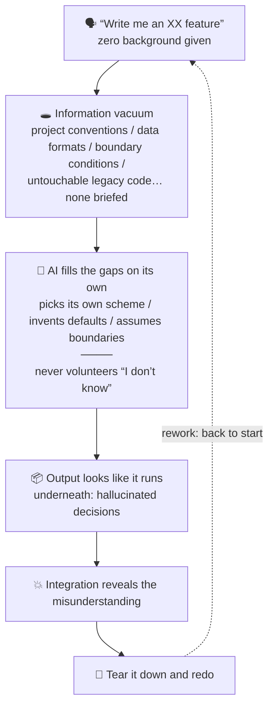
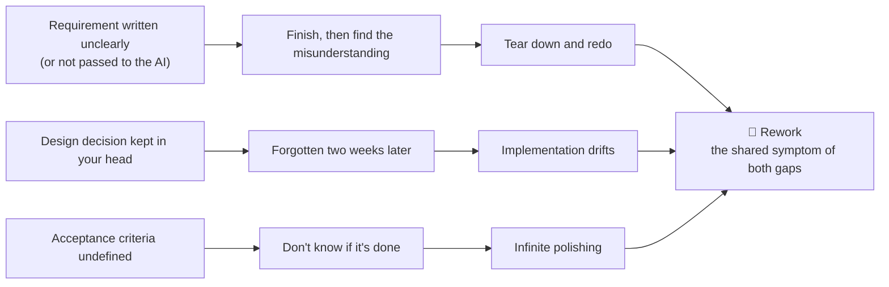
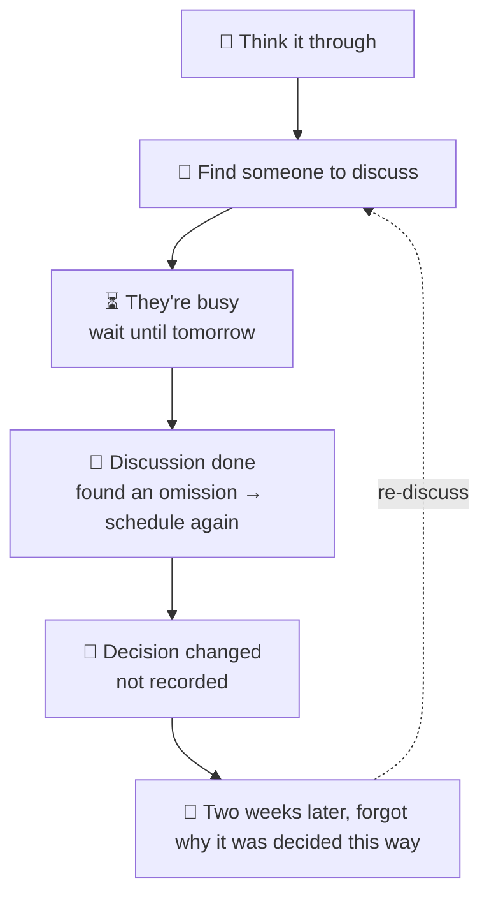

[中文](../../../docs/methodology/philosophy_v7.md) · **English**

> **Translation notice** — This is a translation of the Chinese original. The Chinese text is canonical; in case of conflict, the Chinese version governs ([ADR-0025](../../../harness/adr/0025-english-mirror-drift-governance-integration.md)). Terms follow the English Glossary in [CONTEXT](../CONTEXT.md).

# Philosophy · Information-as-the-Core AI-Native Development (the why)

> One of the products of the methodology's three-way split ([ADR-0007](../../../harness/adr/0007-methodology-three-way-split.md)): the **philosophy file** — the exposition of "why" (failure modes and information gaps / human-machine division of labor / meta-principles). v1 line start (2026-08-04) → v4 disciplinization (2026-08-05) → v5 adds the safety-science fourth discipline perspective (2026-08-10: the de-blackboxing thesis anchor) → v6 adds the methodology's own governance loop and discipline mapping (2026-08-13) → **v7 continuous sections and dual-file cross-governance** (2026-08-14: standalone reading entry, historical-number compatibility, current-status annotations).
> **Canonical member** (belongs to "methodology claims"; revisions require canonical review + OD-4 master-copy sync).
> **Revision log** (committed or released versions only, one line per level; in-worktree execution records are in TODO / questionnaire processing summaries): 2026-08-14 v7 built on v6 with continuous sections, a standalone reading entry, historical-number compatibility, and the dual-file cross-governance contract; **2026-08-19 in-version revision: grill skill retired (to waste/), family shrunk from 9 to 8, §3.1 single-point deep-dive family and §5 "nine skills" updated in sync (content revision, not structural — per the canonical version-bump criteria, no bump)**; **2026-08-19 in-version revision: §3.1 minimal routing table gains a "cognitive states" row (grill boundary deep dive + grill-boundary-canonical-w01 re-stress; content revision, not structural; no bump)**.
> Three-way relationship: methodology = [methodology_v5.md](methodology_v5.md) (the how, self-contained); philosophy = this file, v7 (the why); practice = [practical_v1.md](practical_v1.md) (the how-to-use; non-canonical, lightweight revisions).
> **Section numbering (v7)**: the philosophy body uses its own continuous numbering "§1–§5"; old v3 numbers map as "old §一→new §1, old §六→new §2, old §七→new §3, old §八→new §4, meta-principles→new §5". Historical documents keep their original numbering; the compatibility strategy is in [ADR-0017](../../../harness/adr/0017-philosophy-section-compatibility.md). References to "methodology §x" in the body still point to [methodology_v5.md](methodology_v5.md).
> **Discipline perspectives** (v7): §1 anchors human factors engineering, §2 software engineering, §3 operations research, §4 safety science; this version inherits v6's governance-evolution roadmap without promoting every mapped discipline into a body thesis discipline. The philosophy's claim skeleton uses mature discipline language; the methodology file keeps operational language. **Honest labeling**: discipline anchoring is expository borrowing (using discipline language to give the claims structured explanation), not validation by discipline methods (human-factors experiments / OR modeling / SE empiricism / safety analysis) — evidence for the methodology's core claims must come from verification cards, dogfood, independent human review, and retro together, never from discipline authority or AI self-assessment (**independent human review = a second person outside the system; currently unsatisfiable at N=1 single-subject — external issues / PRs / adoption feedback serve as the proxy evidence source**, see the [CONTEXT evidence-status section](../CONTEXT.md)).

> **Reading route**: first read §1 to understand how information gaps create rework; then §2 to understand how judgment and execution are divided; then §3 on allocating limited judgment resources; then §4 on making AI execution auditable, verifiable, recoverable; finally §5 on how the methodology itself keeps revising. The through-line: information gaps → rework → division of labor → judgment-resource allocation → black-box governance → methodology governance.
>
> **Standalone reading entry (v7)**: §2–§5 of the original `methodology_v3` belong to the mechanisms and processes of "how" and stay in the methodology file per ADR-0007; the philosophy does not copy that content but uses this entry to explain how the "why" chapters pick it up. v7's continuous numbering is the philosophy's display layer; historical references still trace back via ADR-0017's mapping.

## §1 Vibe-coding failure modes and information gaps

> **Human-factors engineering perspective** (v4): this chapter views AI-coding failure modes through human factors — background absence corresponds to losing **situation awareness** (Endsley's three-level model, the **perception layer**); and the AI's "filling in with the most plausible guess" corresponds to **mental-model / schema-driven completion** (Norman, top-down filling-in) — two different mechanisms: the former is information not entering; the latter is information not entering and existing schemas filling the blanks. Rework corresponds to the cumulative cost of information-processing defects. The human-factors insight: humans tend to complete missing information with the "most plausible" guess; AI inherits and amplifies this tendency and does not label which parts are guesses — precisely the discipline footnote for "AI acting on its own in an information vacuum".

Before offering solutions, see the problem clearly: **where does AI-coding time actually get wasted?**

Writing the code itself is usually not the bottleneck — AI writes code fast. The real time sink is **rework**, and rework has two sources.

### 1.1 The vibe-coding failure scenario

Vibe coding — briefing no background, setting no constraints, tossing requirements at the AI to improvise — is the most natural way to start AI coding and the most concentrated source of rework:

Note the chain's key link: **the AI never volunteers "I don't know"**. Where background is missing, it fills everything with the most "plausible" guess — those guesses are hallucinated self-directed decisions. It does not mark what is fact and what is fabricated; everything looks watertight.

### 1.2 Two types of information gaps

The root of rework (this methodology's target) is the **information gap** — though rework has more than this one cause (AI capability limits, requirement drift, and integration surprises also cause rework; they have other countermeasures outside this framework); and the gap is not of one kind — v3 distinguishes two:

- **The human–AI gap** (the abstraction of the vibe-coding failure scenario): the background you know was never passed to the AI, and the AI acts on its own in an information vacuum. **Solution: questionnaire alignment** — use structured follow-up questioning (the Grill family, see [methodology §4](methodology_v5.md)) to align background to the AI step by step; the direct countermeasure at [methodology §1.1](methodology_v5.md)'s mechanism layer.
- **The human–human gap** (the chronic disease of traditional multi-person development): requirements distort as they pass among PM, dev, and test — "wait until the PM is free → meeting → inconsistent understanding → rework". **Solution: AI-replacing roles** — AI instantly takes on PM/QA/Reviewer roles, eliminating "waiting for people" and transmission distortion (see §2.2).

Both gaps share one visible symptom: **rework**.

Each rework's extra time cost can reach multiples of the original task's cost — this is an **author's experiential illustration, not a project measurement**. **The time cost of planning itself is usually small by comparison** — "spend an hour writing the vision and briefing the background clearly, possibly saving three days of rework" is likewise an intuitive illustration, not a measurement.

### 1.3 Decision waiting and churn (contrast with the traditional SDLC)

In traditional development, every decision waits:

Small teams have fewer people and communicate faster, yet hit walls more easily precisely because **each person makes more decisions** — PM, architecture, technology choices, test strategy all queue in one head waiting for processing. Decisions are serial, not parallel.

AI removes the "waiting for others" bottleneck. Grill questioning, code review, and test generation need no queue — trigger anytime, instant response.

Decisions are serial not only because of "waiting for people" but because "each question waits one LLM round". Changing one-question-one-answer Grill into **multi-wave batch questionnaires** (see [methodology §4.2–4.3](methodology_v5.md)) **reduces serial LLM round-trips** — questions posed once (max 10 per wave), answered offline, waiting cost minimized. Note: the judgments themselves are still item-by-item serial; what parallelizes is "posing and answering preparation", not the decisions.

### This chapter's core assertion

> **Speed comes from eliminating waste, not cutting corners. Planning and background-briefing time is usually small relative to rework — but grows marginally with planning depth, past a threshold producing analysis paralysis / ritualism (see the meta-principle failure-mode table); rework after AI self-direction is the real time sink.**

**Checkable proxy indicators** (reflection prompts only — don't let "fast / waste" become empty words): after adopting this methodology, retros can collect "rework rate / rework hours share" to help the adopting project reflect on improvement — they are not direct measurements of the empirical figures above, nor this repository's effect verification or automatic falsification gate. Observation windows, baselines, and interpretation belong to the adopting project; this file does not promote threshold-less proxy indicators into measurement contracts.

**Minimal verification card `MC-01`**: this section's claim is "information gaps raise the risk of AI self-direction and rework"; scope is tasks with incomplete requirement, design, tool, or external-dependency information; current status is **target governance capability / unverified**. Minimal evidence: keep original facts or reproducible commands / outputs, distinguish facts, assumptions, and unverified items, and in the adopting project's retro compare against rework definitions, baselines, and observation windows. Possible counterexamples: rework dominated by requirement drift, AI capability limits, or integration surprises; if counterexamples recur or the proxy indicators disagree with the claim boundary, revisit. **Model-behavior assumption** (2026-08-18, first-principles W01 Q2): the claim depends on "AI, facing missing background, does not volunteer uncertainty and completes with the most plausible guess" — a behavior observation of the current model generation, not a structural truth; if models default to outputting confidence / saying "I don't know", this card's premise fails and must be revisited. Full card fields in [the methodology-governance minimal slice](../../../harness/design/methodology-governance/LLD.md).

### 1.4 The information-flow framework's boundary: the AI capability ceiling

Pillar one (information flow + questionnaire alignment) governs rework from **background absence**, but not the other class: **background fully given, AI still gets it wrong** — complex algorithms, concurrency correctness, performance tuning, domain deep water. This is an AI **capability boundary**, not an information vacuum. Countermeasures for this class lie outside this methodology's information-flow framework: downgrade the task (split small enough to fall inside the AI's competence) / change tools / a human takes over. The meta-principle "adjust per tool" already implies this — what AI cannot do right today, it may do right tomorrow.

**Transition to division of labor**: information alignment only reduces errors from "not knowing the background"; it cannot remove the AI's capability boundary. So the next step is not handing more judgment to AI, but clarifying which judgments must be borne by the human and which execution can be handed to AI within constraints.

---

## §2 The human–AI division of labor

> **Software-engineering perspective** (v4): this chapter views the division of labor through software engineering — engineering discipline (design-first / TDD / testing / ADRs / retrospectives) is the **guardrail** of AI output (methodology file [§1.2](methodology_v5.md) mechanism layer); the division table's essence is "decision power with the human, execution with the AI", and engineering discipline makes that division auditable and reversible.

### 2.1 The division table

| Responsibility | Human | AI |
| --- | :---: | :---: |
| Deciding (which option to choose) | ✅ | ❌ |
| Confirming (is this what I wanted?) | ✅ | ❌ |
| Context management (deciding what to give) | ✅ decides | ✅ executes (retrieval / compaction) |
| Writing vision / design docs | ✅ | assists by questioning |
| Writing code | reviews | ✅ |
| Writing tests | reviews | ✅ |
| Writing docs (API docs, README) | reviews | ✅ |
| Code review | ✅ sign-off power | ✅ assists in finding problems |
| Grill (probing blind spots) | — | ✅ |
| Search and information retrieval | — | ✅ |
| End-to-end verification | ✅ | ✅ executes (tests written by the AI itself = a nested black box; human review / play-through as backstop, see §4.1 L3) |
| **Pure-execution decisions (within the whitelist)** | reviews the whitelist class by class | ✅ delegable (v2) |

> **Legend**: **✅ = leads** (bears responsibility for the outcome); **assists = finds problems but doesn't decide**; **executes = works to an existing spec, making no new decisions**; **reviews = looks and has the right to demand changes**; **sign-off power = the final approve / reject decision** (code-review sign-off rests with the human, consistent with pr-review's "AI never approves"). Context management splits into "**deciding** for the human ✅ (non-delegable) / **executing** (retrieval · compaction · loading) for the AI ✅" — decision power with the human, execution delegable.
>
> **One-way-door risk of whitelist delegation**: a whitelist mistakenly admitting one-way-door classes (deletion / release / payment / external publishing) is a known failure mode; the forbidden-zone list + global kill switch are the human-reviewed defenses (see delegate / [OD-13](../OPEN-DECISIONS.md)).

**Core principle**: the AI may execute any approved, constrained transaction, but may not autonomously make **judgment-type decisions**. Judgment-type decisions are always the human's; the AI provides information and analysis for the human's judgment. v2's sole relaxation: under whitelist, traceability, and emergency-off constraints, **pure-execution decisions** may be delegated; the whitelist itself is still human-reviewed.

**Never let the AI self-confirm**: whether the requirements are understood correctly; whether the design matches intent; whether the tests cover the key scenarios — all must be personally confirmed by the human.

### 2.2 Traditional roles replaced by AI

§1.2's **human–human gap** (requirement transmission distortion, waiting for PM/QA) lands here as the solution: AI replaces the **structured execution and waiting chains** within traditional roles, reducing "waiting for people" and transmission distortion.

In a traditional team these roles need different people, generating communication delay and context-switching cost. In the small-team + AI mode, the structured tasks within these roles are replaced or assisted by AI, **compressing waiting time**; goals, risks, acceptance, responsibility, and sign-off are never replaced:

| Traditional role | Traditional time cost | AI mode (execution / waiting chain only) |
| --- | --- | --- |
| **PM / requirements analysis** | unclear requirements → wait for the PM → meeting → possibly inconsistent understanding → rework | design-Q instantly probes requirement blind spots; VISION sediments conclusions |
| **QA / testing** | dev done → hand to QA → scheduling → bugs filed → fixes → retest | AI instantly generates tests, runs E2E; the dev self-tests in a closed loop |
| **Code Reviewer** | PR raised → wait for review → feedback → changes → wait again | AI reviews instantly; the human makes the final call |
| **DevOps / operations** | deploy scripts, CI, monitoring need dedicated maintenance | AI generates configs and scripts; human reviews then executes (deploy execution is one-way-door class; defense in §2.1's whitelist footnote) |
| **Technical writing** | docs written after dev — or never, or perfunctory | AI instantly generates API docs, README from code and design |

**The key change**: not that AI took over role responsibility, but that AI eliminated the "waiting for people" time that could be structurally executed. A role's name does not imply responsibility replacement; any judgment involving goals, risks, acceptance, interfaces, or irreversible states is still chosen and confirmed by the human.

> **Rejected alternatives**: keep human roles (higher quality, but slower and costlier) / partial replacement (key judgments human, AI execution only) — AI replacement chosen to eliminate waiting; the cost below.
>
> **Precising the dividend source**: AI replaces multi-role **execution**, but the solo developer is still bound by the serial constraint of "one AI output awaited at a time"; the parallel dividend comes mainly from **eliminating interpersonal waiting and transmission distortion between roles**, not from one person multitasking.
>
> **The cost**: the judgment density shared by 4–5 people now concentrates on one person → cognitive-overload risk; this is precisely the human-factors root of analysis paralysis / questionnaire ritualism; the countermeasures are the 80/20 judgment-cost tiering (§3) + delegating pure execution.

**Transition to resource allocation**: the division of labor did not eliminate judgment — it compressed execution waiting and concentrated final judgment responsibility on the human. The more concentrated judgment responsibility, the more the limited attention must handle decisions that truly change goals, risks, or acceptance outcomes — which leads to §3's cost tiering.

---

## §3 The operations-research perspective: decision cost and the dual-track comparison

> **Operations-research perspective** (added v4): operations research studies "optimal decisions under limited resources" — this chapter uses the lens of decision cost and controlled comparison to examine the methodology's own design choices.

### 3.1 The decision-cost model

The methodology configures "human judgment energy" as a limited resource — a footnote to the **80/20 judgment-cost principle** (an empirical heuristic, Pareto-like; **not a theorem, no quantitative model, and not a time quota**; original design 2026-07-31, author's retrospective note, previously unwritten — a living example of the (a)-type blind spot "known but unwritten"):

- **Batch questionnaire family** (design-Q / grill-Q / retro-Q / action-Q) = the layer of basic questions that are foreseeable, with a known problem space, answerable offline.
- **Single-point deep-dive family** (grill-with-docs, codebase-bound + general dual mode — the original grill retired 2026-08-19 and merged into general mode, see [OD-12](../OPEN-DECISIONS.md)) = the layer of critical questions with deep dependency chains, unformed decisions, needing instant feedback or bound to real-world evidence.

The two families are two layers of one judgment-cost optimization system, routed by dependency-chain depth, instant-feedback need, reversibility / risk, and offline-answerability, with bidirectional handoff via "deep-water points to single-point dive / crystallizations re-stressed as artifacts" (see [methodology §3.3.1](methodology_v5.md) and [§4.2](methodology_v5.md)).

**Minimal routing table**:

| Criterion | Batch questionnaire family | Single-point deep-dive family |
|---|---|---|
| Cognitive state (where the answer material is; 2026-08-19, re-stressed grill-boundary-canonical-w01) | ① Know · offline-answerable — the answer material is already in the human's head, just unwritten ((a)-type) | ② Know the direction · decision unformed — answers must be generated round by round through the dependency chain, needing instant feedback; ③ Don't know what you don't know ((b)-type implicit assumptions) — co-managed by both families: the batch family's adversarial dimensions (D1/D5/D7) force them out; the dive family tests boundaries with concrete scenarios |
| Question shape | foreseeable, decomposable into multiple items, offline | the next step depends on the previous answer, or the question is not yet formed |
| Reality binding | no instant reading of code / external systems needed | must cross-verify against code, docs, tools, or external dependencies |
| Risk and gate type | ordinary, reversible, controllable impact | one-way doors, high risk, unclear impact scope |
| Feedback requirement | batch-parseable, then processed | needs instant feedback to avoid wrong branches |
| Handoff | deep-water points to `grill-with-docs`; stable conclusions back to the artifact | crystallized into an artifact, back to `grill-questionnaire` for re-stress |

This table is a routing heuristic, not a new stage or time budget; mis-triggering and handoff failures in real cases are the only grounds for renaming or adding governance entries.

### 3.2 The dual-track comparison (shadow mode)

The standard comparison method of operations research / systems engineering: **shadow mode + champion-challenger** — run both tracks at the same decision node (AI-full-autonomy shadow vs human-led baseline), compare effects and differences, retrospect, and pick the winner. The methodology applies this to the gradual validation of "full AI autonomy": shadow = automated dogfood made routine; real execution upgrades by data; "it went wrong" is never adjudicated by AI self-assessment (see [OD-13](../OPEN-DECISIONS.md)).

> **Status note (2026-08-10)**: the dual-track comparison is currently in a **pilot stage** (not yet in the skill family); the first dogfood round evidenced "AI self-assessment passing ≠ actually playable by humans", and the value positioning was downgraded from "produces usable artifacts" to "templates / demos + fast trial-and-error", with the upgrade condition set to human play-through passing. This section is presented as the OR perspective's **methodological proposal**, not a verified method — see [OD-13](../OPEN-DECISIONS.md).

**Transition to safety governance**: judgment-resource optimization answered "where to put human attention" but not "is the execution process traceable, can the output be independently accepted". If the efficiency gain depends on invisible AI self-assessment, the saved waiting time may convert into latent risk — hence §4's black-box governance boundary.

---

## §4 The safety-science perspective: de-blackboxing AI

> **Safety-science perspective** (added v5): this chapter views AI opacity through safety science — the AI black box is a risk dimension orthogonal to (and independent of) "AI decides wrong" (pillar one). Safety science is the umbrella term, covering the crossing of **reliability engineering** (Reason's latent conditions / HRO failure anticipation) + **resilience engineering** (Hollnagel Safety-II, WAI/WAD); the three-way distinction is in the [CONTEXT discipline map](../CONTEXT.md). The anchor decision and rejected alternatives (pillar-one subset / third pillar / causal premise) are in [ADR-0015](../../../harness/adr/0015-deblackbox-anchor.md); the discipline-anchoring tiering criteria are in [ADR-0014](../../../harness/adr/0014-discipline-mapping-strategy.md).

### 4.1 What the AI black box is

The AI black box = **three mutually independent, stackable dimensions** of AI opacity; they are not same-level paraphrases of one another, and evidence for one dimension cannot substitute for the other two:

- **L1 Opaque decision process**: you see the AI's output but not **how it got there** (the reasoning chain is invisible).
- **L2 Untraceable decision basis**: the AI chose X over Y, but **no trace remains to inspect afterwards** (why this decision — nowhere to look).
- **L3 Output correctness not independently verifiable**: functional correctness has an objective oracle (compile / tests / E2E), but the oracle is usually written by the AI itself — AI-written tests testing AI code discounts the independence of independent verification (**nested black box**; [OD-13](../OPEN-DECISIONS.md) evidenced "self-certification"); judgment-type outputs (is the design good / does it match requirements) have no oracle and can only be human-reviewed. L3's minimum assurance must match evidence strength to risk; a light green test must not be stretched into an overall conclusion.

### 4.2 Orthogonal to pillar one (the independence argument)

The black box is an **independent dimension orthogonal** to pillar one (AI hallucinated self-direction), not a subset:

- **Pillar one** governs "AI decides **wrong**" (information dimension; countermeasures = supply information / questionnaire alignment);
- **De-blackboxing** governs "the AI's decision **process is invisible**" (audit dimension; countermeasures = traceability / auditability).

The two are orthogonal — **enough information can still leave a black box** (process invisible), and **full traceability can still leave wrong decisions** (information missing). Orthogonality is what qualifies de-blackboxing as an independent fourth-discipline anchor rather than pillar one's appendage.

### 4.3 The black box's three bad outcomes

Ungoverned, the black box leads to three classes of bad outcomes (mapping to reliability / safety / human factors respectively):

- **Latent accumulation** (reliability engineering, Reason's latent conditions): black-box decisions leave no trace → latent conditions accumulate → no identification or remedy before the incident. Symptom: "no one knows why the AI decided this back then; when it blows up, nothing to check, nothing to change".
- **Loss-of-control amplification** (safety science, STAMP): black box = the safety-control process model is invisible → the human (controller) cannot tell whether the AI has departed the control constraints → locally correct decisions interact catastrophically at the system level (in this methodology's context, "catastrophe" = one-way-door incidents: wrongful deletion / wrongful release / payment / leakage).
- **Trust hijacking** (human factors engineering): black box → the human can only trust AI self-assessment → cognitive laziness gradually abandons review → degrades into "if the AI says it's right, it's right". Note the circular dependency: human review is the only backstop, and trust hijacking erodes exactly that — the mitigation is not new instruments but lowering review cost (80/20 tiering) + mandatory traceability at one-way doors (the WAI floor) + retro periodically re-checking trace quality; floor creep (exceptions becoming routine) is caught by retro.

### 4.4 Countermeasure: consolidate the project's defined / callable audit instruments

The de-blackboxing countermeasure is **not new mechanisms** but consolidating the project's defined / callable auditable instruments into the "against the black box" thesis. "Defined / callable" here does not mean already enabled or verified: each instrument's enablement and dogfood-verification status must be checked separately.

**Audit-instrument status and minimal-evidence entry points**:

| Instrument | Defined in spec | Callable by execution body | Actually tested in this repository | Adopting projects must wire / supplement |
|---|---|---|---|---|
| ADR / CONTEXT / OPEN-DECISIONS | defined for records, terms, pending-decision boundaries | Git + Markdown callable | W01/W02 processing has produced ADR / OD / TODO evidence | maintain the single authority and revisit conditions per project |
| Archived questionnaires | defined: move-only archiving + processing records | `harness/questionnaires/` callable | v7 W01/W02 archived and passing layout validation | adopters keep the answer / processing / revision-authorization chain |
| `harness-check` / desensitization gate | defined: pre-release layout and desensitization gates | `scripts/` callable | this round: 0 hits / 0 violations | adopters actually run the release gates and keep outputs |
| Code-review human sign-off | defined: final sign-off with the human | wired via host tool / process | not evidenced in this repo via an active `pr-review` skill | adopters wire human-review records; AI approve is not a substitute |
| dogfood / retro / delegation-log / long-running | defined: target processes and record forms | the corresponding skills callable | no complete project-level pilot loop in this repo yet | adopters wire per risk and supplement real execution evidence |

This table proves status layering, not downstream effect. Minimal evidence must trace back to original sources, reproducible commands / outputs, human-review / play-through records, or processing reports; units without evidence stay "unverified".

- **delegation-log** (delegate decision traces) + **ADR / CONTEXT / OPEN-DECISIONS** (decision records) + **archived questionnaires, move-only** (process traceability) + **code review by humans** (pr-review's "AI never approves"; the concrete tool or skill is wired at the practice layer — this repo currently has no same-named active skill) + **dogfood traces** (process records) + **desensitization gate / harness-check** (pre-release validation) + **retro** (post-hoc organizational learning) + **long-running traces** (claude-progress cross-session records + feature_list's "passes true only after E2E passes").

This instrument set makes the **basis and results** of AI decisions "auditable, traceable, recoverable" — but §4.1's L1 (the reasoning chain) remains opaque: what traces record is the AI's **self-reported** reasons, not its actual reasoning process. **The black box is checked, not fully opened.**

> **The formal-V&V gap**: among the three layers, "results independently verifiable" lacks a systematic countermeasure (the project relies on human review + dogfood manual V&V; formal methods like coverage matrices / model checking are missing). The existing countermeasure for the nested black box (oracle written by the AI) = **humans reviewing the tests themselves + human play-through acceptance** ([OD-13](../OPEN-DECISIONS.md)'s upgraded arbitration, "upgrade only after a human actually plays through"). This is a known gap, explicitly acknowledged, left to [OD-19](../OPEN-DECISIONS.md) — no pretending to completeness.

**L3 risk-tiering principle**: wherever the AI writes its own oracle, the artifact is user-playable, or the operation is a one-way door, there must be independent human review, play-through, or confirmation; ordinary reversible code may use objective tests with scope stated; on high risk or counterexample signals, escalate to coverage matrices, assurance cases, or stronger independent verification. Concrete sampling frequencies, risk thresholds, and project DoDs are defined at the practice layer; this section sets only the minimum boundary. Passing tests proves the assertions within their scope, not an overall conclusion.

### 4.5 The elastic boundary: WAI sets the floor, WAD leaves room

The degree of de-blackboxing is an **elastic boundary**, guarding against overreach degrading into documentation ritualism (a meta-principle failure mode):

- **WAI (Work-As-Imagined) sets the floor**: critical / one-way-door / safety-class decisions carry **mandatory inspectable traces** (ADR / delegation-log / desensitization gate);
- **WAD (Work-As-Done) leaves room**: the **execution details** of pure-execution / reversible decisions may flex — but autonomous decisions already made must still be traced immediately; batch or after-the-fact recording applies only to non-autonomous decisions or pre-declared sampling.

This boundary borrows Safety-II's observation of the WAI–WAD gap, without extending its conclusions about **human situational adaptation** to AI, and without treating Safety-II as causal proof of this project's mechanisms. This project borrows only the boundary insight "don't let checklists degrade into formalism that crushes execution"; the WAD executor here (an AI) can only adjust execution details within approved specs and remains subject to §1's hallucinated-completion risk. Reversibility and immediate tracing together bound the latent window; retro spot-checks close it.

**Checkable proxy indicators** (reflection prompts only, same level as §1): in retro, spot-check "for the most recent AI decision that went wrong, can the original decision basis be reconstructed from ADR / delegation-log / archived questionnaires" — reconstructability as a governance clue; reconstructable ≠ proof of effect, unreconstructable = an instrument-failure signal. **If no AI-decision failure occurred this cycle, randomly pick one recent AI decision for a reconstruction spot-check** — latent accumulation is silent (§4.3); this file sets no uniform threshold or automatic acceptance gate.

### 4.6 The methodology's own governance loop: from claims to evidence

The previous sections govern opacity in AI execution; this section governs the methodology's **own drift, misreading, and pseudo-verification**. The most valuable part of the peer-benchmark repo's governance experience is not copying its full runtime architecture layering, but separating "what the spec says" / "how it actually executes" / "what evidence can prove". **This project absorbs only the minimal governance slice**: the philosophy sets method-level principles and boundaries; concrete states, interfaces, test matrices, and execution records remain carried by skills, the practice file, and `harness/` artifacts.

> **Terminology boundary**: the "methodology harness" in this section means the process-execution body composed of methodology documents, skills, and decision/process traces — not a runtime harness coordinating Agent, Context, Model, Capability, Result, persistence, and recovery. This project provides only the former; the two cannot borrow each other's implementations or evidence conclusions; definitions in [CONTEXT](../CONTEXT.md).

**The non-negotiable governance core**

"Adjust per project, scenario, and tool" does not permit silently canceling the minimum safety boundary. The following four items cannot be cut; other processes, record granularity, and tool choices are tailored by risk (see [ADR-0019](../../../harness/adr/0019-methodology-nonnegotiable-guardrails.md)):

1. Judgment-type decisions and final confirmation are borne by the human; the AI never decides goals, risk trade-offs, acceptance, or sign-off for the human.
2. One-way doors pause with a trace first; deletion, release, payment, external publication, leakage, and equivalent irreversible risks must be confirmed first.
3. L3 must have independent verification; AI self-assessment alone cannot prove tests, play-throughs, or one-way-door operations passed.
4. Conflicts are never silently overwritten; facts and side effects are preserved, impact marked, and the matter enters a recovery or revisit path.

These four contracts connect the prose claims to acceptable processes, and give the methodology itself an elastic boundary consistent with §4.5:

1. **Single authority**: every core method claim should have a stable identifier, applicability, a single authoritative file, violation symptoms, and exception boundaries. The normative priority answers only "who wins when files conflict"; it cannot replace "who maintains this rule" — a single authority; cross-skill propagation must also name the responsible skill.
2. **Claim → invariant → verification card**: claims are first compressed into checkable method invariants, each with a verification card. A card states at minimum counterexamples, proxy indicators, independent evidence, and thresholds or revisit conditions; the first batch is in [the methodology-governance minimal slice](../../../harness/design/methodology-governance/LLD.md) — the philosophy does not bloat into a spec book.
3. **Failure states and recovery boundaries**: on finding document / execution / reality conflicts or review gaps, execute in order "mark impact scope → pause irreversible actions → preserve facts and side effects → selectively recover or roll back → retrospect and update the norms". Design–implementation deviations are classified first; each skill may define concrete states and actions, but may never mask failure by overwriting files or silently retrying.
4. **Separation of norm, implementation, evidence**: "should be followed" ≠ "was executed"; an architecture or skill existing ≠ "implemented"; this repository's process checks ≠ evidence of downstream efficiency, quality, or causal effect. Wherever tools, code, external dependencies, or irreversible actions are involved, evidence comes first; states should explicitly distinguish normative requirement, heuristic, pilot, verified, unverified, and known gap; evidence scope and state definitions are in [CONTEXT](../CONTEXT.md).

#### 4.6.1 The unified claim-status template

Core claims and audit instruments are uniformly described in this order:

> **Claim → applicability → current status → minimal evidence → failure signal → revisit condition**

This does not demand a table per claim; it demands the reader can follow one path to judge "what this sentence is, where it holds, why believe it now, when to re-examine". "Current status" uses the status words already defined in [CONTEXT](../CONTEXT.md) (normative requirement, heuristic, pilot, verified, unverified, known gap); "minimal evidence" distinguishes this repository's process-consistency evidence from adopting projects' downstream-effect evidence.

#### 4.6.2 The discipline mapping of governance evolution

Discipline knowledge is useful only when translated into governance actions. Full fields and current mapping are in the [CONTEXT project discipline map](../CONTEXT.md); the body uses the following summary to explain the introduction logic. Future introductions follow "discipline → governance mechanism → minimal artifact → minimal evidence → trigger condition":

| Discipline knowledge | Governance mechanism | Minimal artifact | Minimal evidence | Trigger |
|---|---|---|---|---|
| **Systems engineering / requirements engineering** | requirements tracing, invariants, V&V, change-impact analysis | method invariants, verification cards, affected-reference lists | each invariant points to a single authority and one minimal verification record | when core claims propagate across files or skills |
| **Epistemology / measurement science** | distinguish claims, proxy indicators, independent evidence, and causal conclusions; keep falsifiable boundaries | claim status, indicator definitions, evidence scope | what the indicator actually measures matches the claim boundary | when effect-wording like "effective / fast / quality improved" appears |
| **Configuration management / quality management** | baselines, single authority, non-conformances, CAPA, controlled change | version records, conflict records, recovery actions, retro items | pre/post-change references, states, and recovery paths reconstructable | when canonical files or irreversible governance boundaries change |
| **Cognitive science / HCI** | counter automation bias, default effects, decision fatigue; calibrate human trust in AI | human-review tiering, default-cancel rate, fatigue / rework signals | human confirmations comparable with later rework / misjudgment signals | when human-machine interface mechanisms change (pre-ticking, delegate, AI self-assessment…) |
| **Knowledge management / organizational learning** | make tacit judgment explicit; let retros enter the next round of norms; distinguish single- and double-loop learning | ADRs, CONTEXT, lessons learned, revisit conditions | recurring problems traceable from retro records to norm revisions or explicit non-fixes | when retros find rules failing or the same problem recurring |
| **Information security / threat modeling** | trust boundaries, least privilege, abuse scenarios, exfiltration and prompt-injection defenses | threat model, forbidden-zone list, desensitization and permission checks | every high-risk capability has forbidden zones, confirmation points, auditable records | when AI touches external systems, secrets, payment, release, or deletion capabilities |
| **Formal methods / assurance cases** | raise independent-verification strength via invariants, counterexamples, property tests, or evidence-argument graphs | counterexample sets, coverage matrices, argument graphs | counterexample coverage or argument chains reviewable independent of AI self-assessment | when AI-code ratio, risk level, or incident signals exceed OD-19 triggers |
| **Cybernetics / decision theory** | observability, feedback loops, reversibility, information value, escalation thresholds | monitoring indicators, escalation gates, shadow-comparison records | multi-round records show the basis of indicator change and escalation decisions | when multiple dogfoods have produced comparable data and upgrade cost is acceptable |

#### 4.6.3 Governance boundaries of cross-skill collaboration

The eight skills' shared contract constrains exactly five things: input / output, evidence status, deviation records, verification strength, handoff trigger. They solve niche visibility and responsibility traceability — not a ninth overarching authority. The authoritative routing table and coverage matrix are carried by [methodology §3.3.1](methodology_v5.md) and [the governance minimal slice](../../../harness/design/methodology-governance/LLD.md). (2026-08-19: grill retired, family shrunk from 9 to 8; "no new overarching authority" reworded from "a tenth" to "a ninth")

Cross-skill handoff must also obey two boundaries:

- **Implementation may not silently rewrite design**: optimizations that are local and change no goal / constraint / risk / interface / acceptance may feed back via implementation records or retro; a deviation changing any of those must first pause irreversible actions, update the canonical design, and re-run cross-challenge.
- **Failure may not be back-filled only at the end**: design lists key boundaries and rollbacks; stress-testing challenges counterexamples; implementation verifies representative scenarios with dogfood / tests; retro feeds omissions back as rules or verification cards; uncovered boundaries must be explicitly acknowledged.

This lets the methodology absorb the peer-benchmark repo's contractual strengths without rebuilding this personal project into a full runtime state machine, Level 1/2/3 implementation, or mandatory full tracing system.

**Minimal entry/exit template for the first three rows (v7)**: entry = the trigger genuinely hit, and a single authority, minimal artifact, and minimal evidence assignable for this governance action; exit = minimal evidence recorded, failure signals and rollback / revisit conditions written, and the first retro found no unacknowledged boundary conflict. If any condition fails, stay "roadmap / unverified" or pause irreversible actions — do not promote to mandatory process.

> **Current status note (v7)**: this file tolerates known gaps but never treats spec text as implementation or effect evidence. The first 4 method invariants / verification cards are on disk, but a full verification set has not formed, nor has it been sufficiently dogfooded by real cases; this section's proxy indicators are reflection prompts only, not downstream-effect proof; the minimal entry/exit template still awaits dogfood. The full Level 1/2/3 implementation remains the open question of [OD-20](../OPEN-DECISIONS.md).

This table is a governance roadmap, not eight new mandatory processes. A personal project executes the minimal slice of the first three rows first; the other disciplines enter gradually by risk, data, and maintenance capacity. It also explains why the philosophy body need not keep stacking discipline names: the body keeps the thesis skeleton, the discipline map carries the full fields, and verification cards and practice artifacts carry execution.

Thus what this project borrows from the peer-benchmark repo is **contractualization, statusing, and acceptability** — not rebuilding the philosophy into a Level 1/2/3 runtime-system implementation spec. Governance's goal is to lower drift and the "spec-as-evidence" misreading while keeping maintenance cost bearable for an individual developer and the methodology adjustable.

---

## §5 Meta-principles

**This methodology itself iterates.** v2 was v1 upgraded through practice on multiple real projects; v3 completed the thesis via grill-Q stress-testing; v5 added the safety-science perspective; v6 made the methodology's own governance loop explicit; v7 made the philosophy's standalone numbering and dual-file cross-governance explicit (project background desensitized). Readers should:

- **Adjust per project**: prototype projects may slim down to — hand-written VISION + grill-Q stress test (skipping design-Q's phases); external products run the full loop.
- **Adjust per scenario**: individual developers drop stages as needed; with collaboration, a two-person team may need more frequent sync.
- **Adjust per tool**: AI tools evolve fast; what "must be done by a human" today may be delegable tomorrow.
- **Update on feedback**: every retro retrospects not just the project but the methodology itself — which stages helped you, which were ritual.

### Beware the methodology's failure modes

> **Checklist evidence grading** (2026-08-18, grill-Q first-principles W02 T2): this table mixes **evidenced entries** (with case anchors, e.g. engine drift → OD-8), **preventive entries** (★, anti-misreading rules from stress tests, no incident yet), and **experience entries** (general engineering experience, no case in this repo) — evidence strength decreasing across the three; all preventive in purpose, not incident reports.

| Failure mode | Symptoms | Prevention |
| --- | --- | --- |
| **Analysis paralysis** | over-grilling; decision trees extend forever; never starting | stop planning once "the core uncertainty is answerable"; not every detail needs designing upfront |
| **Documentation ritualism** | writing for writing's sake — ADRs without real trade-offs, hollow VISIONs, all-boilerplate retros | before writing ask: will anyone want to read this in a year? If not, don't write it |
| **Blind trust in AI / black-box trust hijacking** | AI output quality declining unnoticed — skipping review, merging on green tests; black-box scenarios especially need auditable traces | code review never skipped; mandatory traces in black-box scenarios (see §4); AI × software engineering, discipline as the skeleton |
| **Design–implementation disconnect** | a carefully written design, an implementation on a different road, the design doc never updated | classify the deviation first; deviations changing goals / constraints / risks / interfaces / acceptance pause irreversible actions, update the canonical design, cross-challenge |
| **Context bloat** | one giant conversation for the whole project — no compaction, no landing, no new sessions | /compact or open a new session at stage ends; long projects use long-running-agent |
| **Questionnaire ritualism** ★ | asking for asking's sake; preview overload; ever-lengthening questionnaires | questionnaires are a waiting-cost tool, not the goal; max 10 per wave; split beyond |
| **dogfood as ritual** ★ | ran a case but traces are empty; no real self-verification | dogfood must have checkable outputs (delegation-log, spec-repair records); skips must state reasons |
| **long-running fake green** ★ | passes:true marked untested; false completion | passes:true only after end-to-end tests; skipping failing tests or deleting feature items forbidden |
| **Engine drift** ★ | multiple engine copies (questionnaire format / processing rules) out of sync; behavior splits | editing one side, weigh all four (design-Q/grill-Q/retro-Q/action-Q); drift declared in DESIGN.md |
| **Assurance-strength overreach** ★ | green tests, existing docs, or AI self-assessment stretched into overall conclusions | risk-tiered assurance; state scope, uncovered boundaries, escalation signals |
| **Skill handoff ambiguity** ★ | similar entries mis-triggered; responsibility and artifacts drift between skills | use the single routing table and the five-field shared contract; record handoff gaps from real cases |

---
