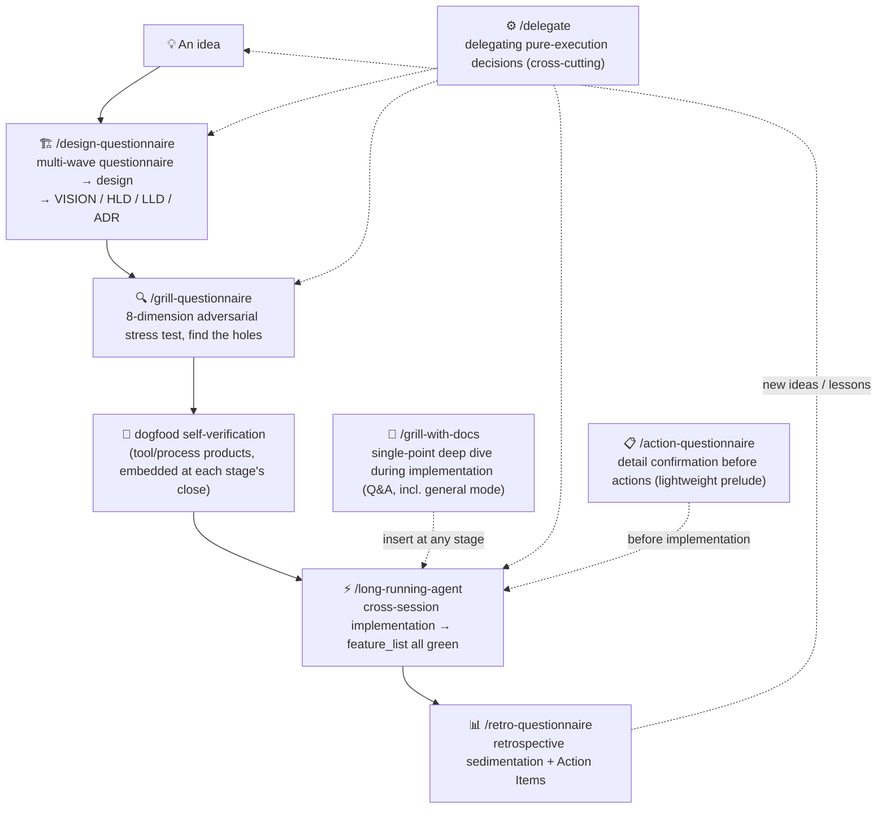
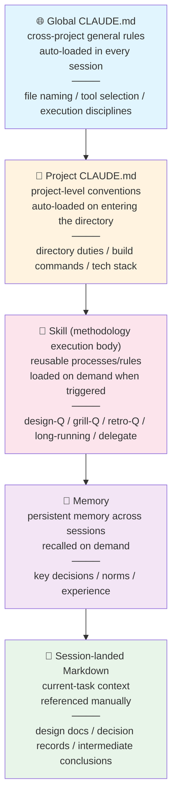

[中文](../../../docs/methodology/practical_v1.md) · **English**

> **Translation notice** — This is a translation of the Chinese original. The Chinese text is canonical; in case of conflict, the Chinese version governs ([ADR-0025](../../../harness/adr/0025-english-mirror-drift-governance-integration.md)). Terms follow the English Glossary in [CONTEXT](../CONTEXT.md).

# Practice · Claude Code AI-Native development operating guide (how to use)

> One of the products of the methodology's three-way split ([ADR-0007](../../../harness/adr/0007-methodology-three-way-split.md)): the **practice file** — the "how to use" operating guide (skill timing / tool conventions / context operation chains). v1 line start (2026-08-04).
> **Non-canonical**: revisions take the lightweight process (small commits; exempt from OD-4 master-copy sync and the four-way lock checks).
> Three-way relationship: methodology = [methodology_v5.md](methodology_v5.md) (the how); philosophy = [philosophy_v7.md](philosophy_v7.md) (the why); practice = this file (the how-to-use).
> Section numbering follows v3 (quick start / §7.4–7.6 / §8 / appendices A·B).

## Quick start: the skill workflow in one diagram

This document expounds the methodology's core; the 8 Claude Code skills are its execution bodies. The typical path of a single feature from idea to delivery:

- **Triggering**: in Claude Code via slash commands (e.g. `/design-questionnaire`) or natural language (e.g. "help me design this", "stress-test this design").
- **Handoff protocol**: design-Q proactively proposes grill-Q at its close; grill-Q proposes long-running at its close — any skill can also be manually triggered anytime (orthogonally insertable, see [methodology §3.3](methodology_v5.md)); action-Q is a lightweight prelude — before a design-Q-produced design enters implementation, and before action items from grill-Q / retro-Q land, you can first align on action details.
- **dogfood is not a standalone skill** — it is the product self-verification action embedded at each stage's close (see [methodology §3.2](methodology_v5.md), stage 3).
- The full loop is not mandatory — every skill can be taken standalone; tailor by task type per [methodology §0](methodology_v5.md), "Task types and process fit".

---

### 7.4 Context management

- Frequently used background information goes into CLAUDE.md or Memory
- Intermediate conclusions of long conversations land as Markdown promptly
- In every new session, feed the related design documents and ADRs to the AI as context first

### 7.5 The context layer system ★ v2, five layers

v1 had four layers; v2 adds the **Skill layer** (the carrier that sediments the methodology into executable tools):

| Layer | Typical location | What goes there | Loading |
| --- | --- | --- | --- |
| **Global CLAUDE.md** | `~/.claude/CLAUDE.md` | cross-project general norms | auto-loaded in every session |
| **Project CLAUDE.md** | `<project root>/CLAUDE.md` | project-level conventions | auto-loaded on entering the project directory |
| **Skill** ★ | `~/.claude/skills/` (user-level) or in-project | the methodology's execution bodies — reusable processes/rules (questionnaire engines, long-running discipline, delegation mechanism) | on-demand trigger (`/skill` or natural language) |
| **Memory** | `~/.claude/projects/<project>/memory/` | key decisions and experience persisted across sessions | recalled on demand (description-match triggered) |
| **Session-landed files** | in-project Markdown | the current task's design docs, decision records, intermediate conclusions | manual reference |

**Usage principle**: before writing, judge how broad a scope the information must be effective in. The Skill layer is v2's key addition — it upgrades the methodology from "read the docs and follow along" to "trigger a skill and it executes automatically". Skills are cross-project global capabilities (user-level), different in kind from session-level / project-level file layers — hence their own layer.

### 7.6 Session recovery strategy

AI coding sessions do not run forever — context fills up, attention decays, tasks get interrupted.

**When to proactively open a new session**: context nears the effective ceiling (≈ 120k for 200k models, ≈ 400k for 1m models); the conversation's topic fundamentally changes; the AI shows clear hallucination or forgets early instructions.

**The overload countermeasure chain: sediment first, then compact** ★ v3 — /compact compresses session context, and compression may lose design-phase decision detail. So the correct order is: **first use design-Q and similar skills to sediment decisions to disk (VISION / ADR / CONTEXT / archived questionnaires), then /compact**. After sedimentation, compression loses only the process, not the decisions — a new session rebuilds from the files on disk (see the recovery checklist below). Note this and [methodology §1.1](methodology_v5.md)'s "background absence" are two different links: absence's countermeasure is questionnaire alignment (supply); overload's countermeasure is sediment + compress (store, then compact) — the two do not conflict.

**New-session recovery checklist** (fed to the AI in order):

1. The project's CLAUDE.md (auto-loaded)
2. The current stage's design documents (VISION / HLD / LLD)
3. The latest session-landed files (last intermediate conclusions)
4. The current Git diff or the unfinished task list (feature_list.json)
5. One sentence: where we got to last time, what to continue this time

**Prefer long-running-agent for long projects**: cross-session recovery upgrades from "manually feeding the checklist" to "rebuilding from files on disk" (feature_list.json + claude-progress.txt + archived questionnaires) — independent of session context, more amnesia-resistant. See [methodology §3.2](methodology_v5.md), stage 5.

**On interruption, immediately**: write the current progress as a 3–5 line "session snapshot" (where we got to, what remains, next step), landed as Markdown; commit or stash uncommitted changes and record them.

---

## §8 Claude Code practice essentials

### 8.1 Toolchain

| Tool | Minimum version / model | Purpose |
| --- | --- | --- |
| Claude Code | >= v2.1.207 | the main development environment |
| Skill family | — | the methodology's execution bodies (see §8.3) |
| Domestic models | GLM 5.2+ / Kimi K3 (better) | auxiliary reasoning, long-document understanding |
| Git | — | version control, rollback anytime |
| Markdown | — | the carrier of all designs/decisions/records |

> Operating conventions for other tools (PDF reading, MCP image analysis, Markdown typesetting, etc.) are configured separately in the personal development environment; this document focuses on the methodology and does not repeat them. See appendix A.

### 8.2 Context and token management

Claude Code's context window is not the same as the "effective working space". As the conversation grows, the model's attention decays:

| Model context | Recommended effective ceiling | Behavior beyond |
| --- | --- | --- |
| 200k (e.g. Sonnet) | ≈ 120k tokens | forgetting early instructions, ignoring detail constraints |
| 1m (e.g. Opus) | ≈ 400k tokens | attention dilution, answers going vague |

**Stay lean**: compact with `/compact`; don't hoard conversations (stage ends, documents landed → open a new session); don't feed the whole codebase in (only related files; use Glob/Grep for broad searches).

### 8.3 Skill timing ★ v2 classification table

The skill family is the methodology's execution bodies, classified by use:

| Class | skill | Trigger timing | Typical scenarios |
| --- | --- | --- | --- |
| **Confirm** | action-questionnaire | detail confirmation before informal actions | "align on this", "confirm the details", "preflight"; before multi-file write operations |
| **Generate** | design-questionnaire | new project / new feature design | "help me design this", "initialize the project design" |
| **Stress-test** | grill-questionnaire | stress-testing existing artifacts | "stress-test this ADR", "review this design", "find the holes"; plan review (offline, batchable) |
| **Retrospect** | retro-questionnaire | stage / project retrospective | "retro this stage", "what went wrong this time" |
| **Long-horizon** | long-running-agent | cross-session long projects | multi-session projects, work spanning context windows |
| **Delegate** | delegate | decision delegation (pilot) | when pure-execution decisions pile up |
| **Single-point** | grill-with-docs | implementation-phase single-point ambiguity (codebase-bound dive default; general mode carries the original grill scenarios) | "is this technical choice sound?"; codebase-bound design review; plan review (point-by-point, instant) |
| **Govern** | doctor-harness | harness layout / migration / validation | "where does this file go"; harness organization chaos needing governance |
| **Review** | code-review class | pre-commit / stage review | reviewing the current diff |

**action-Q mechanism note** (added 2026-08-04): action-questionnaire is a **confirmation-list questionnaire (confirm-list)** — before an informal action (multi-file write / external dependencies involved) starts, the AI writes its understanding of the action's details into a list; the human checks it (tick = understood correctly, blank = correct me) before execution — aligning information to prevent AI's hallucinated self-directed decisions in an information vacuum (the direct countermeasure at the methodology file's [§1.1](methodology_v5.md) mechanism layer; an (a)-type blind-spot catcher). It is a lightweight prelude, not part of the design-phase flow; feature-level actions escalate to design-Q / grill-Q / long-running.

**External tools** (invoked on demand; this document does not expand their operation):

- **Playwright MCP**: browser interaction — UI testing, screenshot verification, page operations
- **Web Search / Web Fetch**: latest docs, API references, technical research
- **IDE integration**: VS Code diagnostics, notebook code execution

**Principle**: skills are shortcuts optimized for specific tasks — anything a skill can do need not be re-described from scratch in a general conversation. Batch decisions go to the questionnaire family (design-Q/grill-Q/retro-Q); single-point dives go to grill-with-docs (codebase-bound default + general mode). Plan review's dual ownership routes by the 80/20 criterion: offline-batchable → grill-Q; deep dependency chains, point-by-point instant → grill-with-docs (see [methodology §4.2/§4.3](methodology_v5.md)).

#### L3 minimal independent-verification triage

When philosophy §4.1 / §4.4's L3 principle reaches the operating layer, execute by the following minimum boundaries; concrete sampling frequencies, risk thresholds, and project DoDs may tighten further:

| Situation | Minimum independent verification |
| --- | --- |
| AI-written oracle / tests | the human reviews the tests themselves, confirming they don't enshrine the same error as correct |
| User-playable artifact | a human actually plays through or accepts; do not accept only the AI's self-assessed "usable" |
| One-way-door operations (deletion / release / payment / external publication) | human review and confirmation before execution, then check the actual result |
| Ordinary code with an independent oracle | run objective tests, plus human review by risk; if the oracle is AI-written, escalate to the first row |
| Pure-execution, reversible items | sampling re-check is allowed; the sampling rule should be declared beforehand or in the corresponding DoD |

This table is the minimum triage; it does not replace a concrete project's test strategy, dogfood acceptance, or long-running DoD.

### 8.4 Permission management

Claude Code needs user authorization before executing tool calls. Sensible permission configuration reduces meaningless interruptions:

| Policy | Description |
| --- | --- |
| **Project-level settings.json** | allow rules for common commands (git status, npm test, ls) |
| **Bash tool** | read-only operations allowed; write operations (rm, git push, npm publish) keep confirmation |
| **MCP tools** | frequently used ones (IDE diagnostics) may be allowed; browser interaction keeps confirmation |
| **Global vs project** | general allows go global; project-specific rules go project |

> Permission management balances security and efficiency — security-critical operations keep confirmation; high-frequency low-risk ones reduce interruptions. delegate's emergency switch also works through the permission layer.

---

## Appendix A: Tool operating conventions (cross-references)

This document focuses on the development-process methodology; the following tool operating conventions have detailed rules in the personal Claude Code configuration — entries only:

| Convention | Summary |
| --- | --- |
| PDF reading tool selection | text-layer PDFs via the Read tool in batches (≥ 10 pages each); scanned PDFs via OCR; no page-by-page MCP calls |
| MCP image analysis | prefer remote URLs; on local-path failure go CDN; parameter name `imageSource`; PNG/JPG ≤ 8MB |
| Markdown typesetting | no half-width `~` for ranges (prevents strikethrough mis-rendering); numeric ranges use the en dash `–`; Chinese text ranges use "至" (to) |
| File version naming | no `final`/`new`/`copy`; use `_v1`/`_v2` increments; check existing versions before creating (take max+1) |
| Retired-directory handling | do not search / reference `waste/`, `deprecated/`, `archive/` and similar directories |

> These conventions complement this document — this one covers "how to develop"; the tool conventions cover "how to use the tools".

---

## Appendix B: File paths of the context layer system

The five context layers described in §7.5, at their typical filesystem locations (Claude Code as the example):

| Layer | Typical path | Note |
| --- | --- | --- |
| Global CLAUDE.md | `~/.claude/CLAUDE.md` | user home; auto-loaded in all project sessions |
| Project CLAUDE.md | `<project root>/CLAUDE.md` | one per project root; auto-loaded on entering |
| Skill ★ | `~/.claude/skills/<skill-name>/` (user-level) | methodology execution bodies, triggered on demand, reused across projects |
| Memory | `~/.claude/projects/<project>/memory/` | isolated per project; frontmatter description-match recall |
| Session-landed files | `<any in-project path>/*.md` | freely created, manually referenced |

---
