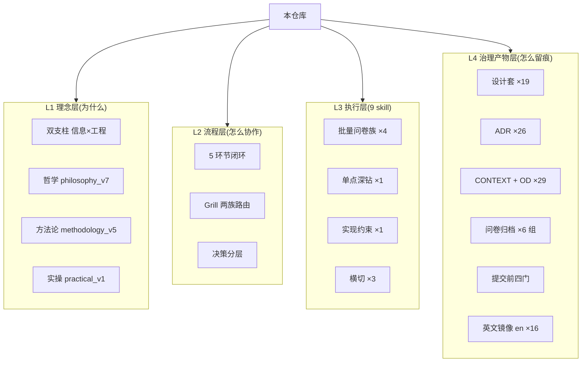
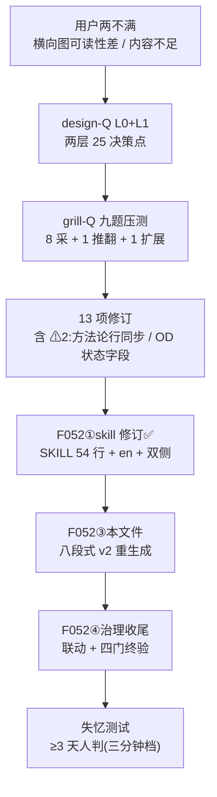
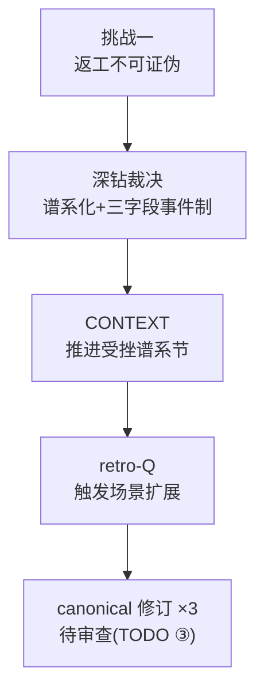
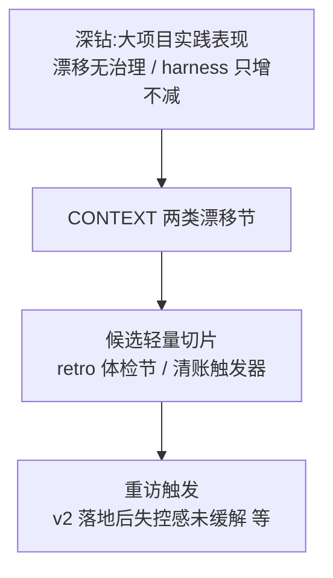
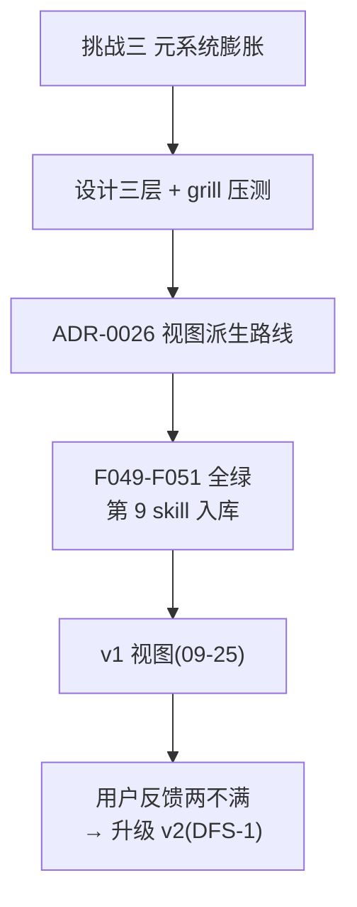

# PROJECT-OVERVIEW · 人读派生视图(认读第一入口)

> ⏱ **生成时间**:2026-09-26 · 📌 **以源文件为准,本文件为派生视图;认读第一入口——人重载上下文从此开始**(只读派生,不新增权威源;发布/删除/花钱/脱敏等单向门决策前必回源文件核对)。
>
> **信息源清单**(按段分列,分级读取):
> - 结构类·全读:[README.md](../README.md) / [CLAUDE.md](../CLAUDE.md) / 目录树(ls 实测)
> - 治理类·全量条目读:[harness/adr/](adr/) 26 份(标题+决策节首句)/ [docs/OPEN-DECISIONS.md](../docs/OPEN-DECISIONS.md) 29 条(标题+状态字段)
> - 治理类·头读:[docs/CONTEXT.md](../docs/CONTEXT.md) 节标题 / [harness/design/](design/) 索引 / [HARNESS-RULES](../skills/doctor-harness/HARNESS-RULES.md)
> - 状态类·头读:[TODO.md](../TODO.md) 头部(快照唯一权威源,2026-09-26 更新)/ [harness/STATUS-LOG.md](STATUS-LOG.md) 顶部 / [CHANGELOG.md](../CHANGELOG.md) 近 5 条 / git log 近 6
> - 关键选读:[proj-overview-v2 设计套](design/proj-overview-v2/)(本次主线)/ [ADR-0026](adr/0026-proj-overview-derived-view-route.md)

## ① 项目定位

面向个人开发者的 AI native 开发方法论 + 可直接运行的 Claude Code skill 执行体(9 skill);双支柱 = **以信息为核心 × 驾驭工程(AI × 软件工程)**,相乘缺一为零。本仓库为唯一规范源(ADR-0001),双 License 分区(方法论文字 CC-BY 4.0 / skill 与脚本 MIT,ADR-0002)。

**三入口各有侧重、允许重叠**:CLAUDE.md 偏 AI 会话上下文重建 / README 偏对外介绍与采用起步 / **本文件偏人的全面掌握**(人重载上下文的第一入口)。

## ② 导读(三档读法)

- **3 分钟恢复**:§1 定位 → §6 状态快照 → §5 决策脉络——回答「当前主线 / 关键决策所在 / 下一步」。
- **15 分钟框架**:前四段(§1–§4)+ §4 summary 表浏览——新人建立完整项目框架。
- **检索**:§8 索引表(按问题找)/ §7 深链(功能怎么运转)/ 各段图旁索引表。

## ③ 结构全景

分层依据注记:按「理念(为什么)→ 流程(怎么协作)→ 执行(跑什么)→ 治理产物(怎么留痕)」四级功能层级分解——每层承载同类职责,层间为支撑关系。

| 层 | 模块 | 权威文件(入口) |
|---|---|---|
| L1 | 方法论/哲学/实操 | [methodology_v5](../docs/methodology/methodology_v5.md) · [philosophy_v7](../docs/methodology/philosophy_v7.md) · [practical_v1](../docs/methodology/practical_v1.md) |
| L2 | 流程与路由 | 方法论 §三(闭环)· §4.3(两族)· [CONTEXT](../docs/CONTEXT.md) |
| L3 | 9 skill | [skills/](../skills/) 各 SKILL.md · [CONTEXT「skill 家族」](../docs/CONTEXT.md) |
| L4 | 治理体系 | [adr/](adr/) · [OPEN-DECISIONS](../docs/OPEN-DECISIONS.md) · [HARNESS-RULES](../skills/doctor-harness/HARNESS-RULES.md) · [CHANGELOG](../CHANGELOG.md) |

## ④ 治理文件 summary

> ⚠ **以源文件为准,禁止按过期 summary 做单向门决策**;每条附源链接,点击核对。

### ADR 全量(26 条;摘要取材 = 各 ADR「决策」节首句)

| ADR | 标题 | 一句话决策 |
|---|---|---|
| [0001](adr/0001-source-of-truth.md) | 唯一 source of truth | 本仓库为「方法论文章 + skill 家族」的唯一 canonical 源 |
| [0002](adr/0002-license-choice.md) | License 混合协议 | 方法论文字 CC-BY 4.0 / skill 配置与脚本 MIT 分区 |
| [0003](adr/0003-release-form.md) | 发布形态 | 独立完整仓库:文章 + skill + 脱敏归档示例 |
| [0004](adr/0004-methodology-v3-hallucination-thesis.md) | methodology 升 v3 | 「对抗 AI 幻觉式决策」升为第一支柱显式机制层 |
| [0005](adr/0005-pillar-standard-wording.md) | 第一支柱标准措辞 | 对外锁定措辞四处同步,定义版/完整版拆分 |
| [0006](adr/0006-v3-chapter-restructure.md) | v3 章节重排 | 按新立论彻底重排(推翻保编号方案) |
| [0007](adr/0007-methodology-three-way-split.md) | 方法论三块拆分 | 方法论/哲学/实操三独立文件,结构拆分非立论演进 |
| [0008](adr/0008-methodology-v4-thesis-revision.md) | 方法论 v4 立论重构 | 受众收窄个人开发者 + 第二支柱机制层对称化 |
| [0009](adr/0009-repo-entry-and-spec-priority.md) | 三区模型与规范优先级 | docs/harness/skills 三区物理分离;优先级唯一权威处 |
| [0010](adr/0010-term-governance-strategy.md) | 术语治理策略 | 折中审计 8 术语全保留 + 新词三条件门槛 |
| [0011](adr/0011-abandon-plan-r-hardcode-harness.md) | 放弃方案 R | 落盘根配置化撤销,回归硬编码 harness/ |
| [0012](adr/0012-harness-layering-rule.md) | harness 分层规则 | design/questionnaires/adr 按 feature 聚合分层 |
| [0013](adr/0013-harness-layering-migration.md) | 分层迁移执行 | 迁移范围两档(设计套子目录 + 问卷归档子目录化) |
| [0014](adr/0014-discipline-mapping-strategy.md) | 学科挂接分层策略 | 哲学挂立论核心学科,全景落 CONTEXT 地图 |
| [0015](adr/0015-deblackbox-anchor.md) | 去黑盒第四学科视角 | 安全科学视角独立锚点,与第一支柱正交 |
| [0016](adr/0016-method-claim-assurance-contract.md) | 方法主张验证合同 | 不变量 + 验证卡 + 变更记录最小治理切片 |
| [0017](adr/0017-philosophy-section-compatibility.md) | 哲学章节连续化 | v7 起连续编号 + 旧编号历史兼容映射 |
| [0018](adr/0018-canonical-dual-challenge-governance.md) | 双文件交叉挑战治理 | 哲学/方法论 canonical 对等,各自演进互相审查 |
| [0019](adr/0019-methodology-nonnegotiable-guardrails.md) | 不可裁剪治理核心 | 人担判断/单向门先停/L3 独立验证/冲突不静默覆盖 |
| [0020](adr/0020-cross-skill-minimum-governance-contract.md) | 跨 skill 治理契约 | 五字段最小契约,不新增总控 skill |
| [0021](adr/0021-design-implementation-deviation-governance.md) | 偏差治理 | 局部优化留痕 vs 治理性偏差停不可逆动作改 canonical |
| [0022](adr/0022-design-questionnaire-digital-levels.md) | design-Q 数字层级制 | LN 层级制(L0 恒在按需增层)+ 层闸门协议 |
| [0023](adr/0023-skill-md-layered-slimming.md) | SKILL.md 精简分层 | 规则本体/历史层分层 + 教训 ≥2 次升格机制 |
| [0024](adr/0024-governance-history-split-dual-form.md) | 治理历史分离 | 双侧形态分工:全局=分发洁净/项目=车间完整 |
| [0025](adr/0025-english-mirror-drift-governance-integration.md) | 英文镜像接轨 | 顶级 en/ 单向派生第三轴 + i18n 漂移检查 |
| [0026](adr/0026-proj-overview-derived-view-route.md) | proj-overview 视图派生路线 | 不删文件加派生视图层;v2 升级认读第一入口(09-26 修订注记) |

### OD 全量(29 条;状态直读 [OPEN-DECISIONS](../docs/OPEN-DECISIONS.md) 状态字段)

| OD | 主题 | 状态 |
|---|---|---|
| [OD-1](../docs/OPEN-DECISIONS.md) | 脱敏发布门槛(单向门) | open |
| [OD-2](../docs/OPEN-DECISIONS.md) | 可迁移到通用工具系未验证假设 | open |
| [OD-3](../docs/OPEN-DECISIONS.md) | 维护承诺对冲(单向门) | open |
| [OD-4](../docs/OPEN-DECISIONS.md) | 方法论文章母本同步 | open |
| [OD-5](../docs/OPEN-DECISIONS.md) | ADR / OD 落地 | 已收口 |
| [OD-6](../docs/OPEN-DECISIONS.md) | 差异化主张待市场验证 | open |
| [OD-7](../docs/OPEN-DECISIONS.md) | 早期未脱敏副本暴露面 | open |
| [OD-8](../docs/OPEN-DECISIONS.md) | skill 引擎副本开源呈现 | 已收口 |
| [OD-9](../docs/OPEN-DECISIONS.md) | 仓库名 | 已收口 |
| [OD-10](../docs/OPEN-DECISIONS.md) | 分发洁净 vs dogfood 期保留 | 观察中 |
| [OD-11](../docs/OPEN-DECISIONS.md) | 第 4 份问卷引擎副本分叉治理 | 已收口 |
| [OD-12](../docs/OPEN-DECISIONS.md) | grill(通用零留痕)处置 | 已收口 |
| [OD-13](../docs/OPEN-DECISIONS.md) | AI 双轨对照 pilot(影子+挑战者) | 已收口 |
| [OD-14](../docs/OPEN-DECISIONS.md) | design-Q 默认勾选试点 | 已收口 |
| [OD-15](../docs/OPEN-DECISIONS.md) | doctor-for-harness skill | 已收口 |
| [OD-16](../docs/OPEN-DECISIONS.md) | harness 分层可选档重访触发 | 观察中 |
| [OD-17](../docs/OPEN-DECISIONS.md) | doctor-harness 使用率验证 | 观察中 |
| [OD-18](../docs/OPEN-DECISIONS.md) | 学科挂接完整性回顾触发 | 观察中 |
| [OD-19](../docs/OPEN-DECISIONS.md) | 形式化 V&V 缺口 | open |
| [OD-20](../docs/OPEN-DECISIONS.md) | 核心文档分层深度(完整 vs 最小切片) | 观察中 |
| [OD-21](../docs/OPEN-DECISIONS.md) | 双文件治理焦点(实操退出与否) | 已收口 |
| [OD-22](../docs/OPEN-DECISIONS.md) | skill 生态位与命名路由表 | 观察中 |
| [OD-23](../docs/OPEN-DECISIONS.md) | delegate pilot 可控性验证 | 观察中 |
| [OD-24](../docs/OPEN-DECISIONS.md) | skill 双副本实验策略 | 已收口 |
| [OD-25](../docs/OPEN-DECISIONS.md) | 本仓布局 vs HARNESS-RULES §六 | 观察中 |
| [OD-26](../docs/OPEN-DECISIONS.md) | grill-Q 质量数据管道形态 | 观察中 |
| [OD-27](../docs/OPEN-DECISIONS.md) | design-Q 粒度 vs §4.5 决策分层 | 观察中 |
| [OD-28](../docs/OPEN-DECISIONS.md) | design-Q 修订自检清单(观察项) | 观察中 |
| [OD-29](../docs/OPEN-DECISIONS.md) | 信息生命周期单向只增缺口 | open |

### TODO / STATUS-LOG / CHANGELOG 头部转述

- **TODO**([头部](../TODO.md),2026-09-26):主线 = ① proj-overview v2 实现(F052)② 失忆测试以 v2 为准(≥3 天)③ 哲学挑战一修复包 canonical 修订候选;块级:哲学挑战一修复包 🟡 / human-project-view+v2 🟢 / i18n 扩面 ⏭ / skill 家族形态修订 🟡(轻量 dogfood 待验)/ grill 边界治理 ✅ / 术语审计 B ⏳ 等。
- **STATUS-LOG**([顶部](STATUS-LOG.md)):09-25 proj-overview 入库与 F049–F051 收官 / 09-23 human-project-view 设计三层全链 / 08-26 i18n 首期收官。
- **CHANGELOG**([近 5 条](../CHANGELOG.md)):第 9 个 skill 入库(09-25)/ i18n 首期完成(08-26)/ i18n 立项(08-23)/ 治理历史分离(08-20)/ README 重构(08-20)。

## ⑤ 决策脉络(关键决策时间线)

| 时间 | 决策 | 载体 |
|---|---|---|
| 07-28 | 建仓:双支柱定名 + 7 skill + 脱敏发布 | ADR-0001/0002/0003 |
| 08-03→04 | v4 立论重构;方法论三块拆分 | ADR-0008/0007 |
| 08-05 | repo 级落地:三区模型 + 术语审计 | 设计套 repo/ + ADR-0009/0010 |
| 08-07 | 放弃配置化,落盘根硬编码 harness/ | ADR-0011 |
| 08-08 | doctor-harness 入库 | ADR-0012/0013 |
| 08-10 | 学科挂接分层 + 去黑盒第四学科视角 | ADR-0014/0015 |
| 08-14 | v5/v7 升版(章节连续化 + 双文件交叉治理 + 不可裁剪核心) | ADR-0017/0018/0019 |
| 08-19 | grill 退役(并入 with-docs 通用模式);认知状态三态接线 | OD-12 + CONTEXT |
| 08-20 | 治理历史分离:双侧形态分工 | ADR-0024 |
| 08-22→26 | i18n 英文镜像首期(en 16 件 + 第四道门) | ADR-0025 |
| 09-09 | 哲学挑战报告(8 条)+ 挑战一深钻:推进受挫谱系 | CONTEXT 谱系节 |
| 09-23→25 | human-project-view:设计三层 + 压测 + ADR-0026 + 第 9 skill 入库 | 设计套 + F049–F051 |
| 09-26 | proj-overview v2:认读第一入口 + summary 职责 + OD 状态字段制 | 设计套 v2 + 本文件 |

## ⑥ 当前状态快照

数据源:[TODO.md](../TODO.md) 头部(2026-09-26 更新,唯一权威源转述):

- **当前状态**:方法论双 canonical(v5/v7)+ 9 skill(proj-overview v2 规格升级中);governance-history-split 收口;i18n 英文镜像首期完成(en 16 件)。
- **下一步主线**:① proj-overview v2 实现(F052:skill 修订 ✅ → 产物重生成(本文件)→ 治理收尾);② 失忆测试以 v2 为准(窗口自 v2 生成日 ≥3 天);③ 哲学挑战一修复包 canonical 修订候选待审查;其余:CONTRIBUTING / git author / 术语审计 B 方案 / OD-29 信息衰减轻量切片。
- 近期提交:38e276b(P0 入库)→ 10bc9a7(P1 首生成)→ 5629fbc(P2 全仓联动收官)→ v2 会话(设计+压测+F052)。

## ⑦ DFS 深链视图(关键功能逻辑链)

### DFS-1 主线:proj-overview v2(本视图的来源)

链路说明:动机(用户实践反馈)→ 设计([设计套 v2](design/proj-overview-v2/),压测闭环)→ 实现([skills/proj-overview/SKILL.md](../skills/proj-overview/SKILL.md) v2 规格 54 行)→ 本文件 → 终验 = 失忆测试(≥09-29 可测,三问走 §2 三分钟档)。

### DFS-2 挂账:哲学挑战一修复包(推进受挫谱系,canonical 待审)

### DFS-3 挂账:OD-29 信息生命周期缺口(2026-09-25 新立)

### DFS-4 收口:human-project-view v1 全链(09-23→25)

## ⑧ 检索索引(我想找 X → 去 Y)

| 我想知道… | 去哪 |
|---|---|
| 这个项目是什么 | §1;[README](../README.md) |
| 当前在做什么 / 下一步 | §6(§2 三分钟档) |
| 某个架构决策的内容与理由 | §4 ADR 表 → 点击编号 |
| 某个悬置事项定了没有 | §4 OD 表 → 状态列 |
| 某个术语的定义 | [CONTEXT](../docs/CONTEXT.md)(术语表 + 英文对照) |
| 某功能/机制怎么运转 | §7 DFS 深链;各 [SKILL.md](../skills/) |
| 文件该放哪 / 命名规范 | [HARNESS-RULES](../skills/doctor-harness/HARNESS-RULES.md) |
| 历史某天做了什么 | [STATUS-LOG](STATUS-LOG.md)(内部)/ [CHANGELOG](../CHANGELOG.md)(对外) |
| 怎么采用这套方法论 | [README「最小采用切片」](../README.md) |
| 规范冲突怎么裁决 | [CLAUDE.md「规范优先级」](../CLAUDE.md)(唯一权威处) |

---

*视图过期自判:对照文件头生成时间与 git log;本视图不进校验脚本,无强制同步义务。分型自检留痕:事实段(§4/§5/§6)已逐段溯源(见信息源清单);结构段(§1/§2/§8)按八段规格核对;ADR 摘要抽 3 条人快审记录见 [skills/proj-overview/DESIGN.md](../skills/proj-overview/DESIGN.md)。*
