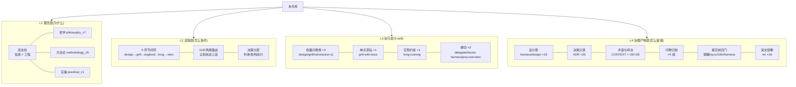

# PROJECT-OVERVIEW · 人读派生视图

> ⏱ **生成时间**:2026-09-25 · 📌 **以源文件为准,本文件为派生视图**(只读派生,不新增权威源;发布/删除/花钱/脱敏等单向门决策前必回源文件核对) · 生成者:proj-overview skill(F050 首次 dogfood)
>
> **信息源清单**(分级读取):
> - 结构类·全读:[README.md](../README.md)(172 行,三区模型+skill 卡片) / [CLAUDE.md](../CLAUDE.md)(89 行,规范优先级+铁律) / 目录树(ls 实测)
> - 治理类·头读:[docs/CONTEXT.md](../docs/CONTEXT.md)(术语表,节标题) / [docs/OPEN-DECISIONS.md](../docs/OPEN-DECISIONS.md)(OD-1–28 条目头) / [harness/adr/](../harness/adr/)(ADR-0001–0026 标题) / [harness/design/](../harness/design/)(18 项索引) / [harness/STATUS-LOG.md](harness/STATUS-LOG.md)(顶部 5 条)
> - 关键选读:[TODO.md](../TODO.md)(头部+human-project-view 块) / `.claude/feature_list.json`(F001–F051 状态) / git log 近 5 / [human-project-view 设计套](design/human-project-view/)(L0/L1/L2 全文,本次主线)

## ① 项目定位

面向个人开发者的 AI native 开发方法论 + 可直接运行的 Claude Code skill 执行体(9 skill);双支柱 = **以信息为核心 × 驾驭工程(AI × 软件工程)**,相乘缺一为零;本仓库为唯一规范源(ADR-0001),双 License 分区(方法论文字 CC-BY 4.0 / skill 与脚本 MIT,ADR-0002)。

## ② 结构全景

分层依据注记:按「理念(为什么)→ 流程(怎么协作)→ 执行(跑什么)→ 治理产物(怎么留痕)」四级功能层级分解——每层承载同类职责,层间为支撑关系(上层定义目标,下层落实执行与追溯)。

| 层 | 模块 | 权威文件(入口) |
|---|---|---|
| L1 | 方法论/哲学/实操 | [methodology_v5](../docs/methodology/methodology_v5.md) · [philosophy_v7](../docs/methodology/philosophy_v7.md) · [practical_v1](../docs/methodology/practical_v1.md) |
| L2 | 流程与路由 | 方法论 §三(闭环) · §4.3(两族) · [CONTEXT「Grill 家族」](../docs/CONTEXT.md) |
| L3 | 9 skill | [skills/](../skills/) 各 SKILL.md · [CONTEXT「skill 家族」](../docs/CONTEXT.md) |
| L4 | 治理体系 | [harness/adr/](../harness/adr/) · [OPEN-DECISIONS](../docs/OPEN-DECISIONS.md) · [HARNESS-RULES](../skills/doctor-harness/HARNESS-RULES.md) · [CHANGELOG](../CHANGELOG.md) |

## ③ 决策脉络(关键决策时间线)

| 时间 | 决策 | 载体 |
|---|---|---|
| 07-28 | 建仓:双支柱定名 + 7 skill + 脱敏发布 | ADR-0001/0002/0003 |
| 08-03→04 | v4 立论重构;方法论三块拆分 | ADR-0008/0007 |
| 08-05 | repo 级落地:三区模型 + 术语审计 | 设计套 repo/ + ADR-0009/0010 |
| 08-07 | 放弃配置化,落盘根硬编码 harness/ | ADR-0011 |
| 08-08 | doctor-harness 入库(第 9→后 8 个) | ADR-0012/0013 |
| 08-14 | v5/v7 升版(章节连续化+双文件交叉治理) | ADR-0017/0018 |
| 08-19 | grill 退役(生态位并入 with-docs 通用模式);认知状态三态接线 | OD-12 + CONTEXT |
| 08-20 | 治理历史分离:双侧形态分工(全局=分发洁净/项目=车间完整) | ADR-0024 |
| 08-22→26 | i18n 英文镜像首期(en 16 件 + 四门含 i18n) | ADR-0025 |
| 09-09 | 哲学挑战报告(8 条)+ 挑战一深钻:推进受挫谱系 | CONTEXT 谱系节 |
| 09-23→25 | human-project-view:设计三层 + 压测 + ADR-0026 + P0 入库(第 9 skill) | 设计套 + 本视图 |

## ④ 当前状态快照

数据源:[TODO.md](../TODO.md) 头部(2026-09-25 更新,唯一权威源转述):

- **当前状态**:方法论双 canonical(v5/v7)+ 9 skill(proj-overview 本期入库,P0 绿);governance-history-split 全链收口(F039–F043);i18n 英文镜像首期完成(en 16 件)。
- **下一步主线**:① human-project-view 实现(F050 首生成 dogfood 进行中 → F051 十处联动 + 四门终验);② 哲学挑战一修复包 canonical 修订候选待审查;③ 失忆测试预约(≥3 天);其余:CONTRIBUTING + issue 模板 / git author 身份决策 / 术语全面审计(B 方案)。
- 近期提交:3344345(设计期闭环)→ d024d3c(基线修复)→ 38e276b(P0 入库)→ en 首译。

## ⑤ DFS 深链视图(关键功能逻辑链)

全链选取判据:承载当前主线/高风险(TODO 主线 + 验收锚点反推);其余功能见段尾短链索引。

### DFS-1 当前主线:human-project-view(proj-overview 第 9 skill)

链路说明:动机(挑战报告三)→ 设计([设计套](design/human-project-view/L0-vision-human-project-view.md),53 要点)→ 压测修订与 [ADR-0026](adr/0026-proj-overview-derived-view-route.md) → 实现([skills/proj-overview/SKILL.md](../skills/proj-overview/SKILL.md),F049 绿)→ 本文件(F050)→ 剩余:F051 十处联动(README/CLAUDE/CONTEXT/方法论 §3.3.1/HARNESS-RULES §六/STATUS-LOG 等)→ 终验 = 失忆测试(≤15 分钟答三问,人判)。

### DFS-2 治理历史分离(governance-history-split,刚收口)

链路说明:[ADR-0024](adr/0024-governance-history-split-dual-form.md) → [设计套](design/governance-history-split/L0-vision-scope-acceptance.md) → 五阶段实现(F039–F043 全绿,28fba38 收口)→ 常态:规则本体双侧逐字节一致,历史层(CHANGELOG/DESIGN)仅项目侧,提交前 skills-sync-check 0 违规。

### DFS-3 哲学挑战一修复(推进受挫谱系,canonical 待审)

链路说明:挑战报告一(致命度曾为认识论级)→ 2026-09-09 深钻四问裁决(谱系化+锚定子类+三字段+死亡快照)→ 落 [CONTEXT「推进受挫谱系」](../docs/CONTEXT.md) → 残留 = 3 条 canonical 修订候选([TODO 挑战一修复包](../TODO.md),哲学 L83/L85/三层模型注记,待 canonical 审查)。

### 其余功能短链索引

| 功能 | 一行链 | 状态 |
|---|---|---|
| i18n 扩面 | 首期收官 → TRANSLATABLE 扩容(retro/OD/archive)待发起 | 悬置(用户发起时另立) |
| 挑战报告二/四–八 | 游离报告 7 条未深钻 → 反馈记录区待裁决 | 待用户思考反馈 |
| delegate pilot | OD-23 → 项目级 delegation.md 未实例 → 重访窗口待 | 观察中 |
| 形式化 V&V 缺口 | OD-19 → 人审+dogfood 兜底 → 升级触发未命中 | 已知缺口显式承认 |
| 术语全面审计(B 方案) | TODO → 元词汇扩围已裁 → 审计未执行 | 排队 |

---

*视图过期自判:对照文件头生成时间与 git log;本视图不进校验脚本,无强制同步义务。*
