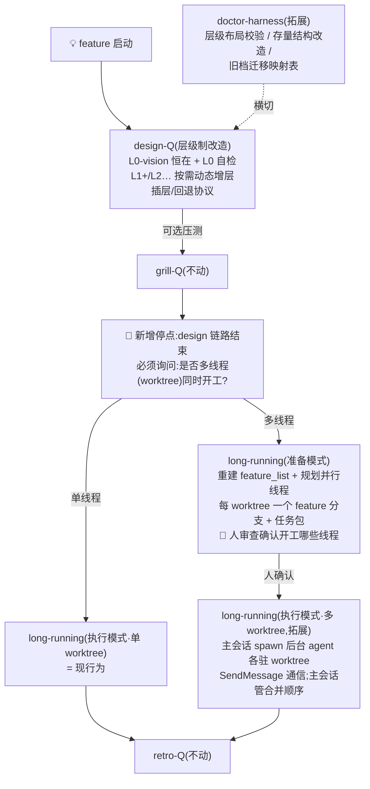

# HLD · design-Q 数字层级改造(feature-designq-digital-levels)

> **导览块**(设计原则 4,本文件以身作则)
> - 本层位置:hld(全局架构骨架,phase-invariant);上游 [VISION](VISION.md)(目标/范围/验收已定案);下游 LLD(构建路径,待 hld 闸门后)
> - 覆盖:三 skill 改造的架构(design-Q 层级制 / doctor-harness 拓展 / long-running 双模式)、接口契约、边缘场景、部署回灌
> - 上下游依赖:VISION 机制要点 19 条(17 + 补充声明 2)+ 设计原则 4 条全部为本层硬约束
> - 契约项声明(下层 LLD 与实施不得偏离):§2 命名规范、§3 协议集五件、§4 停点与双模式、§6 部署回灌流程
>
> 注:本设计套自身保留 VISION/HLD/LLD 旧命名——新 LN 命名制是本 feature 的**产出**,不自举;实施后的首个 dogfood 案例可作为本套的迁移演示(由 doctor-harness 旧档迁移映射表执行)。

## 1. 系统架构(H1)

三 skill 改造 + 一个流程停点,整体交互:

**模块职责**:

| 模块 | 改造内容 | 不变 |
|---|---|---|
| design-Q | STAGE-SKELETONS 四部分重构;SKILL.md 定模(层数判定)/闸门(L0 自检 + 层闸门)/收尾停点 | 引擎副本、问卷流程、铁律 |
| doctor-harness | HARNESS-RULES 增补节(层级布局 + 存量改造 + 迁移映射);SKILL.md 触发词;harness-check.py LN 校验 | 校验脚本既有三检查 |
| long-running-agent | 准备/执行双模式;多 worktree 并行;任务包机制 | feature_list/passes:true 纪律、进度文件、铁律 |

## 2. 命名与模板(H1,契约)

- **层文件命名**:`L<N>-<功能1>-<功能2>….md`——尾缀覆盖该层**所有主要功能**(hld W00 补充声明);示例:`L0-vision-scope-acceptance.md`(若 L0 聚焦三功能)、`L1-contract-interface.md`、`L2-build-dod.md`;L0 固定以 `vision` 起头。
- **层文件头导览块**(四行,契约 schema):本层位置与职责 / 覆盖范围 / 上下游层依赖 / **契约项声明**(本层哪些项是下层硬约束)。
- **单文件多节形态**:文件头做全层导览,节标题 `## L0-vision-…` 式;节间裁决与文件间同规。
- **最小必含总览**:单表(层 × 最小必含 × 反简化锚点)置 STAGE-SKELETONS 顶部——一处瞰全层。
- **引擎副本随层级制修订**(压测 Q1-C,推翻 W00 #2):QUESTIONNAIRE-FORMAT 的 stage 枚举改「层名」语义(design-Q 取 L0/L1/…;grill-Q/retro-Q 各自 stage 词汇不变)+ 问卷命名规则补 LN 制(`<层名>-w<NN>.md`);**OD-8 四副本联动同步**(四份 FORMAT/PROCESSING 各改此两处)。
- **W00 归属按形态分派**(压测 Q5-B):多文件形态 = 每层独立 W00(已定);单文件多节形态 = **整文件一个 W00**(全层决策默认值合一,按层分节列出)——防小项目 W00 碎片化(设计原则 1)。

## 3. 协议集(H3,契约,五件)

**总则**(压测 Q5-B):层是**产物组织维度**,层内波次循环(W00/W01+、覆盖清单、层闸门)沿用旧制机制——骨架必答项按层取,阶段词汇统一映射为层;层制替换的是产物结构与闸门对象,不是问卷流程本身。

1. **层间判别**(三问):随实现会变→向下;边界契约 vs 内部细节→契约层;目标/验收 vs 手段→L0。判别结果随层文件落盘(一条决策一个家),跨层引用「见 L1-contract#锚点」。
2. **层间裁决**:上层契约优先于下层细节;下层改上层契约必须走 ADR-0021 治理性偏差路径。双落点:STAGE-SKELETONS 总则 + 各层导览块契约项声明。
3. **插层协议**:触发(实现受阻/契约需细化/新子系统)→ 位置(默认底层追加;中间层须继承上层契约并重过闸门)→ 新层独立 W00 → 处理报告留痕(触发原因/影响面/受影响下层)。
4. **阶段回退协议**:上游失效 → 暂停下游 → 失效项二分(作废/仍有效)→ 回上游补波 → 只重过受影响层闸门;归档问卷不动。
5. **L0 自检**(信号清单,任一命中→建议增层,**增层决策由人在 L0 闸门拍板**;全不中→单层交付合法):① 多模块/多子系统;② 外部依赖 ≥ 2 类;③ 跨会话实现(需 feature_list);④ 验收含性能/安全门槛;⑤ AI 判定构造细节不足以直接实现(**建议信号,压测 Q9-A**:命中时必须附「哪些构造细节缺失」的具体理由,AI 判定只作触发建议,与哲学 L3「AI 自评不能单独证明」对齐——①–④ 客观可数,⑤ 需人闸门确认)。

## 4. 停点与双模式(H3,契约)

- **design 收尾停点**:design 链路(含可选 grill-Q)结束后**必须停下**,AskUserQuestion 询问「是否多线程(worktree)同时开工?」——单线程 → 执行模式(单 worktree,现行为);多线程 → 准备模式。
- **单/多 agent 定位**(lld W00 补充声明,2026-08-15):**long-running 默认 = 单 agent**(现行为,一次一个功能);多 worktree 多 agent = **拓展能力**(可选启用,非并列主路径)。执行模式(拓展)的实现**优先利用 Claude Code 原生多 agent 相互通信能力**——主会话作协调者:spawn 多个后台 agent(各自 worktree)→ SendMessage 派发任务包与线程间通信 → task-notification 收完成信号 → 主会话管合并顺序;人开多个独立会话仍是合法 fallback。
- **准备模式**(不动代码):从设计产物重建 feature_list → 规划并行线程(每 worktree 一个 feature 分支 + **任务包**)→ 停,人审查确认开工哪些线程。任务包 schema(每包含):线程名/分支、范围(L0 验收锚点)、DoD、依赖与其他线程的边界、禁止越界项。
- **feature 反推规则**(压测 Q4-A):features 从「最低**构建语义层**」(L2-build 模板或自声明的构建/阶段内容)反推;无构建层(单层交付)→ 从 L0 验收标准逐条反推;L0 模板配一条写法约束「验收标准按可独立验证的条目写」。
- **执行模式**(多 worktree,拓展能力):人确认后并行实现——主会话 spawn 后台 agent 各驻一个 worktree,按任务包干活,SendMessage 通信;主会话只做进度汇总与**合并顺序**管理(依赖链决定先后);passes:true 纪律逐 worktree 不变。**模式切换由人确认,AI 不自行开工。**
- **禁令调和(压测 Q3,provisional)**:long-running 现行「任何时候都不一次处理多个功能」三处禁令改限定式——「**单 worktree 会话内**一次只处理一个功能;多 worktree 并行仅在执行模式 + 人确认的任务包边界内」。双向门/provisional,重访触发 = 多 worktree 首次真实使用时复核措辞是否守住反半成品护栏。

## 5. 边缘场景表(H5 + 设计原则 2)

| 边缘场景 | 处理规则 |
|---|---|
| 单层交付后需要插层 | L0 自检节承担触发;插层走协议 3,从 L0 补出 L1 |
| 单文件形态下裁决锚点引用 | 节锚点(`#l1-contract-xxx` 式)与文件间同规 |
| 插中间层时契约继承 | 新层导览块「上下游依赖」显式继承上层契约项;重过闸门 |
| 跨 feature 复用层文件 | **禁止复制**;引用走 ADR/OD 记录,文件属 feature |
| 多 worktree 线程间契约冲突 | 两线程任务包边界预先声明;冲突浮现 → 暂停双方相关线程,按裁决规则(上层契约优先)由人裁定,更新任务包后恢复 |
| 多 worktree **代码级合并冲突**(压测 Q8-B,三层防线) | ① 准备模式任务包尽量按模块边界切线程(源头减少同文件交叉);② 合并顺序按依赖链串行(上游线程先并);③ 真冲突(git merge 冲突)停在该线程,人裁定后继续——不预设文件所有权,不承诺零冲突 |
| 一个 worktree 失败需回退 | 单 worktree 回滚不影响其他线程;其任务包标「失败/回退」进处理报告,feature_list 对应项回 false |

## 6. 部署与回灌(H4,契约,压测 Q2-C/Q7-A 修订)

1. **双向同步先行(压测 Q2-C)**:三 skill 实测双向漂移(long-running 项目版领先;doctor HARNESS-RULES 全局版领先 3 处 2026-08-14 增补;design-Q FORMAT 全局版领先 1 处)——改造前先做一次「全局⇄项目双向同步」达成**一致起点**:全局版增补(superseded 处置/活跃区子目录/布局合规)回灌项目版,项目版领先句(long-running 的 HARNESS-RULES 引用)推全局版;同步后 diff -rq 复验两侧一致。
2. **backup**:同步后的全局版三 skill 目录 diff 存档至本 feature `global-backup/`(改造前,补充声明 3)。
3. **装载**:改造文件替换全局版;变更清单记录。
4. **回灌**:DOGFOOD 通过 → 用户确认 → 全局版合并回项目版(施加脱敏差)→ OD-24 该轮关闭 → harness-check + 脱敏门验证。
5. **脚本边界(压测 Q7-A)**:harness-check.py 扩展列入 doctor 改造包,实验期在**项目 scripts/ 实现并自测**(工具脚本非 skill 行为面,不属冻结本意);合入即带「豁免清单:存量 VISION/HLD/LLD 命名合法至迁移完成」。
6. **本项目 skills/ 实验期冻结**(backup 语义);例外:确凿修正类(脱敏/锚点 bug)可修,须记录。
7. **过程信号保存(压测补充声明)**:实验期/DOGFOOD 全过程的发现(漂移证据、bug 与修复、案例数据)即时留痕(处理报告/TODO),改造收尾必须 retro-Q。

## 7. ADR 识别(H5)

- **1 份 feature ADR**(编号实施时取下一空号):design-Q 层级制改造(混合制职责模型 + 最小 1 层含自检 + 契约优先裁决);三条件命中(难逆转:产物结构全变 / 会困惑:旧术语兼容 / 真权衡:固定 vs 浮动已辩)。long-running 双模式与 doctor 拓展作为同 feature 关联决策写入该 ADR 的关联节,不另立。

## 8. 被否决项(H2,防再提议)

| 被否决 | 理由 |
|---|---|
| 固定语义层级制(L0=目标/L1=契约/L2=构建强制) | 与「不严格限定、可只有 L0」裁决冲突;小项目被迫套模板(形式主义) |
| 最小 2 层底线 | 同上;单层交付合法 + L0 自检兜底 |
| 全浮动制(连 L0 也不固定) | 削弱「L0 恒在=目标/范围/验收」基线,验收可能无处安放 |
| 生态位/路由实体卡 | ADR-0020 已裁定表行即卡(W01 Q9-B) |
| AI 自动开工多线程 | 违反铁律 1;模式切换必须人确认 |
| 层文件跨 feature 共享 | 复制 = 漂移温床;引用不复制 |
| **引擎副本不动**(原 W00 #2) | **压测 Q1-C 推翻**:stage 枚举与 LN 问卷命名矛盾不可调和;接受 OD-8 四副本联动成本,枚举改层名语义 + 命名 LN 制 |
| 单向「全局=实验/项目=backup」假设 | 压测 Q2-C 修正:双向漂移实证;改双向同步基线 |
